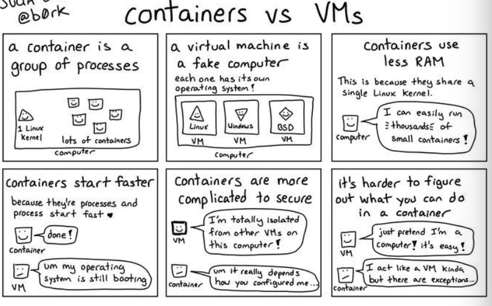
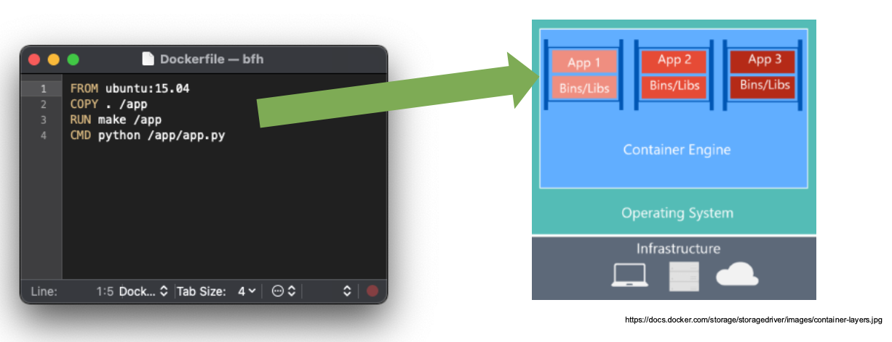
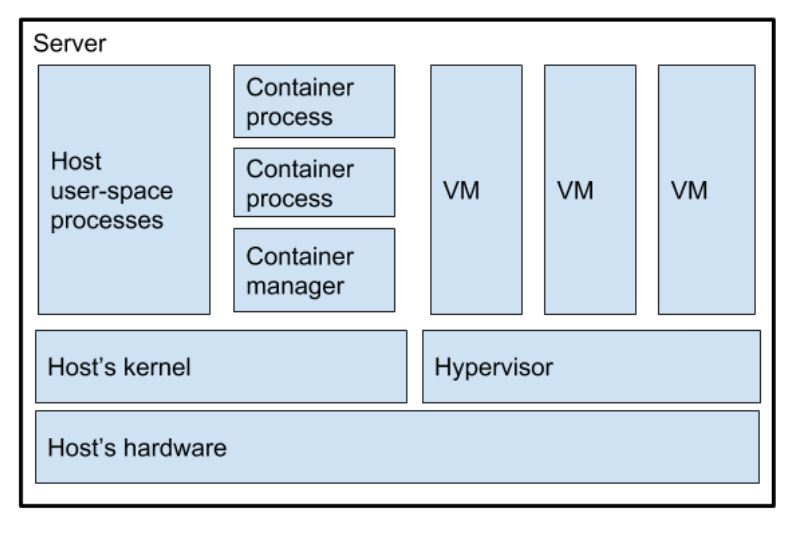
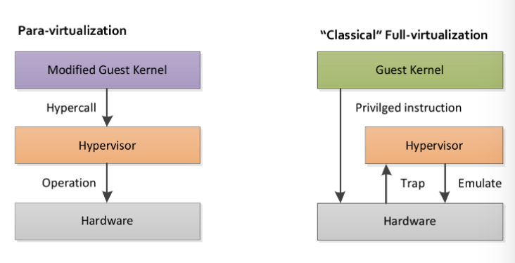
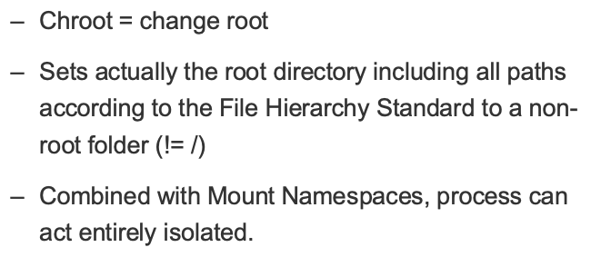
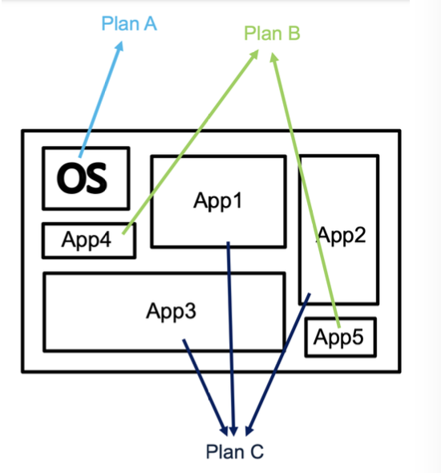
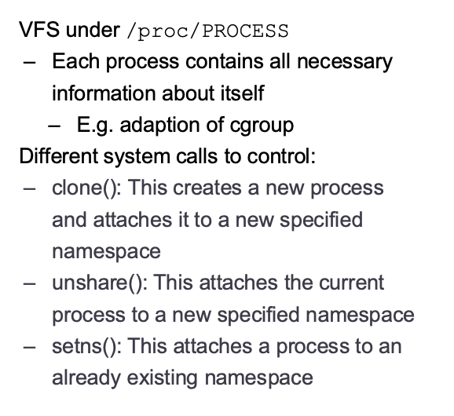

+++
title = "Week 04"
date = 2025-10-10
[taxonomies]
authors = ["fatlum"]
tags = ["cloud"]
+++

[Drehbuch](https://sgi.pages.fhnw.ch/moduluebersicht/cloud/drehbuch.html)  
[Aufgaben](https://spd.pages.fhnw.ch/module/cloud/platforms_site_generated/cloud-reports/hs25/index.html)

Abgabe zweites Projekt: **30.10.2025**

---

## Container

### What is a container?

- Proxmox/VMs **virtualisieren/emulieren** Hardware (Hypervisor).
- Container fahren einen anderen Ansatz: sie nutzen **Kernel-Features** des Hosts (Namespaces + cgroups) und laufen als **normale Prozesse** – nur sauber isoliert.
- Kapseln **Dateisystem, Ressourcen und Prozessraum**.
- Typisch startest du Container **aus Images** (mehrschichtiges, portables Dateisystem).
- Best Practice: **ein Hauptprozess pro Container** (klare Lifecycle-Semantik).

---

### Containers are disruptive…


- Egal welcher **Workload**: als Container portabel auf (fast) jedem Linux-Host startbar.
- Grundlage für **agile Entwicklung** und **schnelles Deployment**.
- Overhead ungefähr wie bei einem normalen Prozess.
- Kein klassischer Bootpfad (kein systemd in „echten“ App-Containern).

---

### … but what are containers?

- 
- Belegen so viel RAM, wie der Prozess braucht (plus wenig Overhead).
- **Starten sehr schnell**, weil ohne OS-Boot.
- Isolation ≠ VM-Isolation: falsche Mounts/Capabilities → **Security-Risiken**.
- Beispiel riskanter Mount:

```bash
docker run --rm -it -v /:/opt ubuntu:latest bash
```

→ Host-Root ins Container-FS binden = **no-go**.

- „**One process per container**“ hilft bei Stabilität, Logs, Restarts.

---

### We all use Docker …

- 
- Docker = **CLI + Engine**.  
- **Images** sind Layer-Stacks, **Container** sind laufende Instanzen dieser Images.

---

### Containerization VS Virtual Machines

- 
- **VMs**: eigener Kernel + eigenes Userspace-OS → starke Isolation, mehr Overhead.
- **Container**: teilen sich den **Host-Kernel**, isolieren per Namespaces/cgroups → leichter, schneller, aber vom Kernel-Hardening abhängig.

---

### Recap: Paravirtualized Environments

- 
- Gäste laufen „kernel-nah“ (Hypervisor-aware).  
- Effizienter als volle Emulation; Bindung an Host-Mechanik bleibt.

---

### Containerization

- 
- Historisch **alt** (chroot ist steinalt).
- Ebenen:
- **Application-Level**: schlanke Container nur mit App + Runtime.
- **OS-Level**: „fette“ RootFS mit init/systemd möglich (dann eher wie Mini-VM).
- PID 1 im Container kann jeder Prozess sein (java, python, …).

---

### Under the hood: What is a container?

- 
- Container = **Prozess(e) mit Isolationsschicht**. Lifecycle wie bei Prozessen (Start/Stop/Exit-Codes).
- **Keine Bootzeit**, direkter Kernel-Zugriff über Namespaces/cgroups.
- Portabel dank Image-Format; reproduzierbare Builds.

---

###  Such containers are ooooooooooooold

- **chroot** (sehr alt) → Root-Pfad eines Prozesses verschieben.
- **LXC** (Linux Containers) → nutzt chroot + Namespaces + cgroups.
- **Docker** (seit 2013) startete als komfortables Frontend, heute eigene Komponenten.

---

###  How to implement a Container from scratch?***

- Drei Bausteine:
- **chroot** → Dateisystem-Root prozesslokal umbiegen.
- **namespaces** → was der Prozess „sieht“ (PIDs, Netz, Mounts, UIDs, IPC, UTS).
- **cgroups** → was der Prozess **bekommt** (CPU, RAM, IO, Netzlimits).

---

### Chroot

- 
- 
- Legt fest, **wo** das neue `/` eines Prozesses liegt (innerhalb des Host-FS).
- Mit Mount-Namespaces kombiniert wirkt das Umfeld „wie eigenes System“.

---

### Cgroups

- 
- Regeln/Quotas als **Dateien** in einer **Hierarchie** (v1: Controller getrennt, v2: unified).
- Steuerung von **CPU/Memory/IO/Netz** pro Prozessgruppe.
- cgroup wirkt **auf Prozesse** (und deren Kinder).
- In der Übung: mit LXC Limits setzen (z. B. weniger CPU).

---

### Namespaces

- 
- 
- Virtuelle Sichten auf Kernel-Ressourcen:
- **PID**: eigener Prozessbaum (im Container denkst du, dein Prozess ist „PID 1“).
- **NET**: eigene Netz-Stacks/Interfaces/Ports.
- **MNT**: eigene Mount-Tabelle (was „eingehängt“ ist).
- **UTS**: eigener Hostname/Domainname.
- **IPC**: eigene Shared-Memory/Message-Queues.
- **USER**: Mapping von UIDs/GIDs (root im Container ≠ root auf dem Host).
- Systemaufrufe:
- `clone()` → neuen Prozess samt Namespace erzeugen.
- `unshare()` → aktuellen Prozess in neuen Namespace lösen.
- `setns()` → Prozess an bestehenden Namespace anhängen.
- Zusammenspiel: **Namespaces = Sicht**, **cgroups = Limit**.

---

### Putting it all together, lxc/lxd

- 
- **lxc** = CLI-Werkzeugkiste; **lxd** = „Daemon + UX“ für LXC (Images, Profiles, Networking, Storage).
- Gut zum Experimentieren mit Namespaces/cgroups auf OS-Level.

---

###  Docker

- 

- Fokus auf **App-Container**: ein Prozess, schnell, reproduzierbar.
- **Image-Build** (Dockerfile) → **Image** in Registry → **Run** auf beliebigen Hosts.
- **Compose** zum Orchestrieren mehrerer Services (abhängig, Netz, Volumes).
- Security-Basics:
- Prinzip **Least Privilege** (Capabilities reduzieren, rootless wenn möglich).
- Vorsicht mit **Mounts**, besonders Host-Root/`/var/run/docker.sock`.
- **Read-only** FS, **no-new-privileges**, **Drop Caps** wo möglich.
- Operational:
- Logs stdout/stderr, Restart-Policies, Healthchecks.
- Versionierte Images/Tags, reproduzierbare Builds.
