+++
title = "Week 08"
date = 2025-11-07
[taxonomies]
authors = ["fatlum"]
tags = ["cloud"]
+++

[Drehbuch](https://sgi.pages.fhnw.ch/moduluebersicht/cloud/drehbuch.html)  
[Aufgaben](https://spd.pages.fhnw.ch/module/cloud/platforms_site_generated/cloud-reports/hs25/index.html)

Abgabe zweites Projekt: **30.10.2025**

---

# K8

## Authentication, Authorization

- 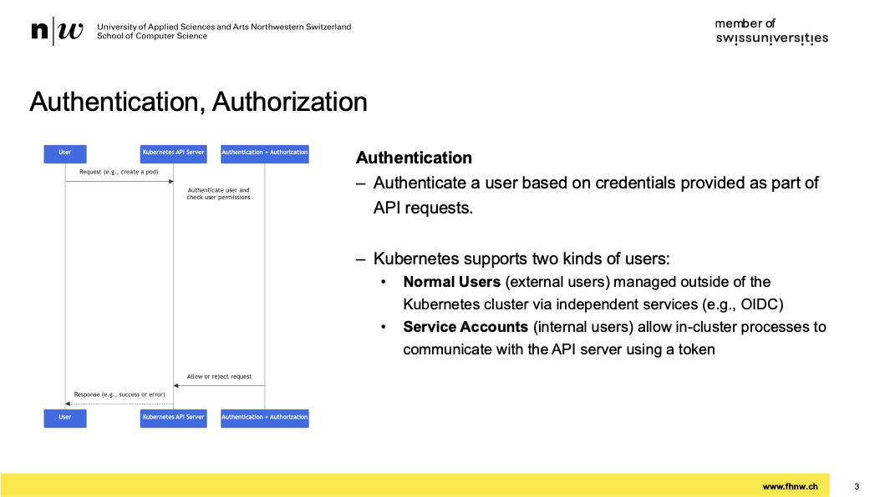
- 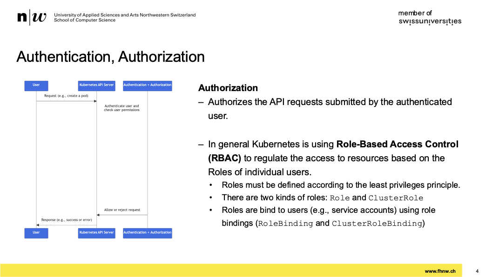
- die rolle defineirt, was wir können
- das binding verknpüft dann mit authorization
- der API server prüft rollen

## Authentication, Authorization, and Admission Control

- 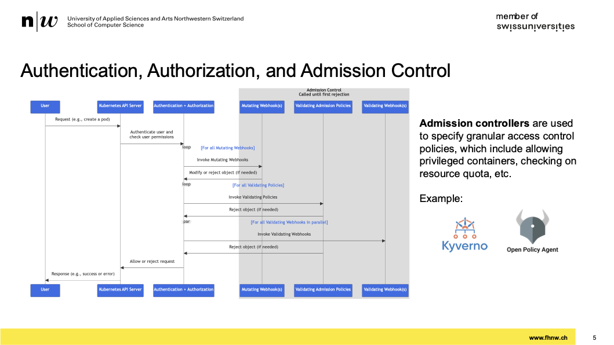
- besteht aus 4 komponenten
- nach authentication, gibt es weitere kompenten, die weitere sachen machen
- externe webhooks probiert man intern bei kuberentes rein zu bringen

## Admission Control: Kyverno

- 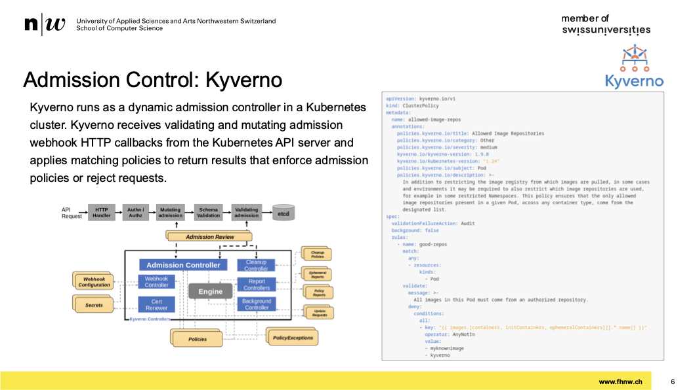
- wenn ein container erstellt wird, muss es ein gewisses image haben
- wird über http callback gecallt, dann wird eine policie angewendet

## Extending Kubernetes: Plugin Model

- 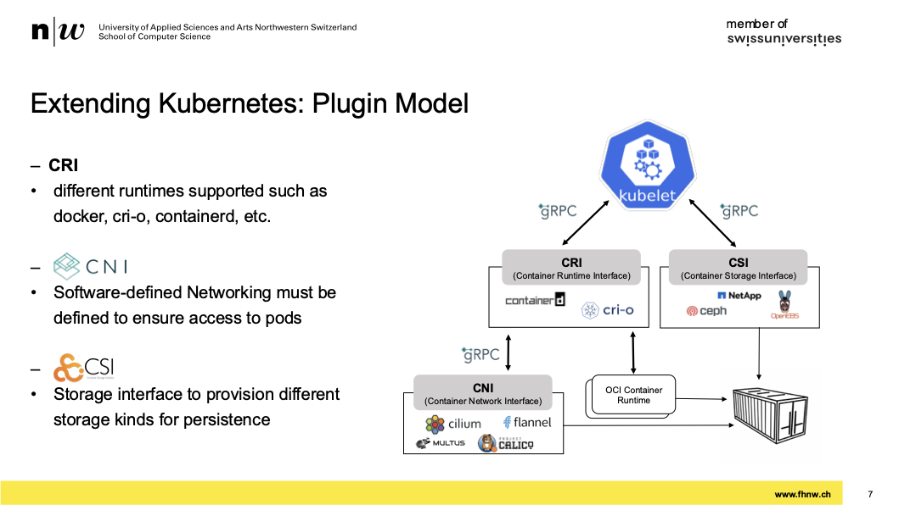
- schnittstellen für verschiedene plugins
- man defineirt ein interface, containerd (CRI) interface
- dann beschreibt man, wie zu kommunizieren ist
- zwei abstraktionen CRI und OCI container runtime
- CNI übernimmt networking über CRI
  - auch das konfiguriert den container
- CSI für storage

## Container Runtime Interface: Examples

- 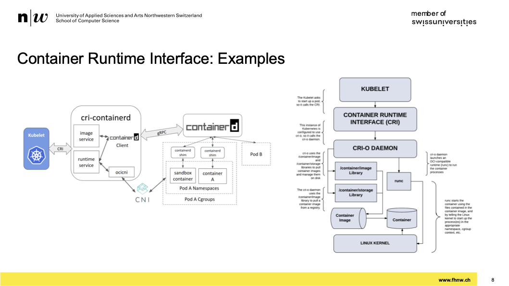
- CGroups und namespaces pro pod
- wenn kubelet info will, geht es über cri, dann containerd zu den infos
- bei kryo keine interne API
- kryo nur für kubernete entwickelt

## Isolating Container Runtimes

- 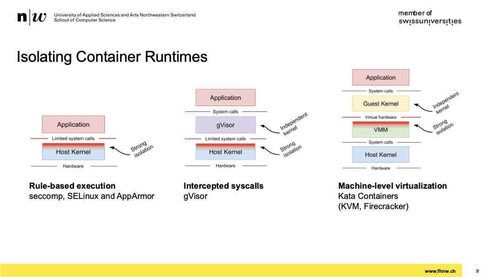
- container ist ein isolierter prozess
- durch namespaces will man den prozess isolieren
- die isolation bietet gewisse sicherheit aber nicht alles
- ein weitere ist ein rule-based exec
- man will zusätzliche isolation schaffen
- jeden container in eigene vm lassen lassen für zusätzliche isolation
- wir probieren intercepted syscalls
  - zusätzlichen kernel proxy nutzen
  - gVisor gibt sich aus kernel aus und filtert die syscalls bevor sie zum eigentlichen kernel gehen

## Isolating Container Runtimes: gVisor

- 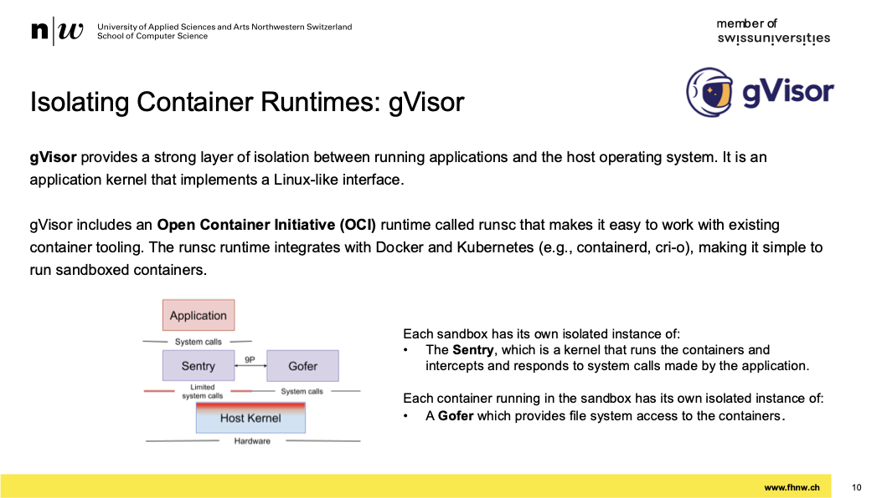
- gVisor nutzt OCI
- lässt sich gut mit kryo verbinden und dann hat man einen sandbox container
- komplett in Go geschrieben

## Container Network Interface

- 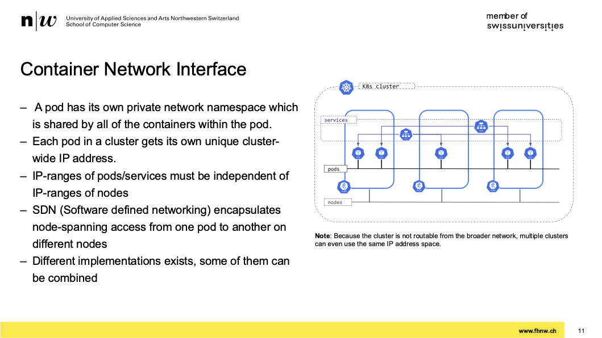
- ein netzwerk das alle nodes umfasst
- gibt spezielle pods die direkt mit node kommunizieren, diese haben dann selbe IP wie node
- auf node ist die ip-range der pods hinterlegt
- bei neustart eines podes, bekommt er neue ip
- problem lösen, mit service
- service ist kein pod, aber auf service gibt man an, welche art pods angesprochen werden sollen, bsp. alle mit "backend"
- ein loadbalancer leitet traffic weiter an entsprechende pods
- loadbalancer hat einen nodeport definiert

## Kubernetes Network Model

- 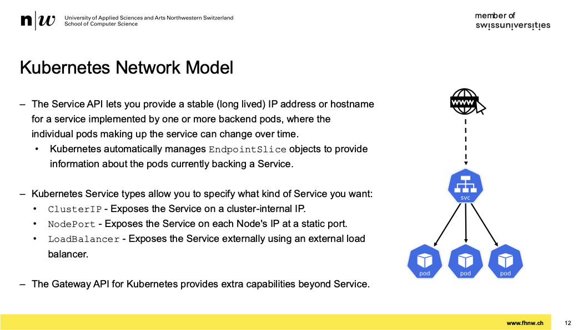

## Container Network Interface: Examples

- 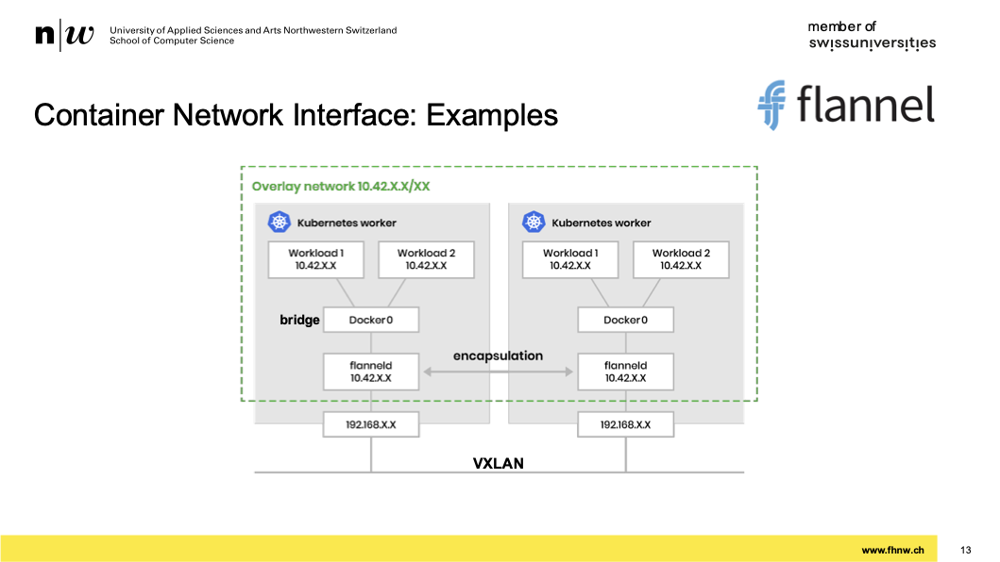
- man macht ein overlay network um pods in verschiedenen nodes zu kommunizieren
- wenn wir ein layer 2 paket senden wollen, dann macht layer aus eines netzwerk ein ARP zum beispiel zu einem UDP und sendet es so, er encasulatet es so
- genau das übernimmt das container network plugin
- cilium ist so eines für networking

## Cilium: What is eBPF?

- 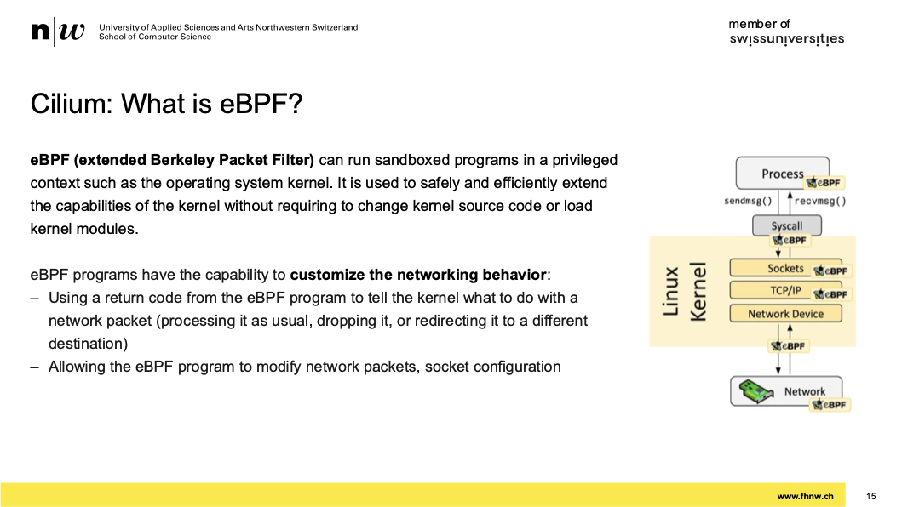
- man kann verhalten des kernels verändern
- 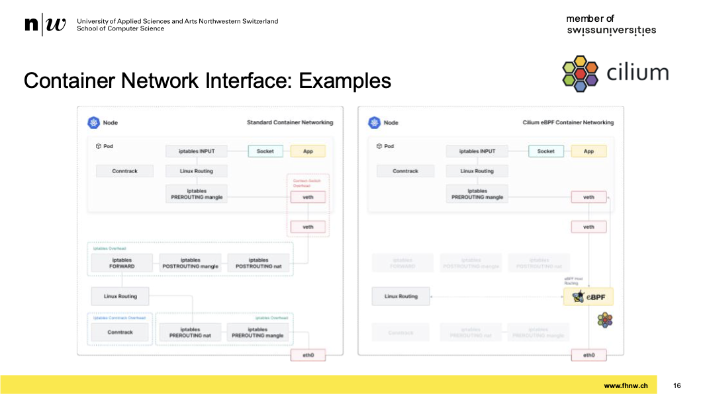
- im eBPF programm wird alles routing lastige gespeichert nud dann kann es direkt an pod geschickt werden
- mit cilium braucht man keinen kubeproxy mehr
- setzen wir in der plattform um

## Container Network Interface: Examples

- 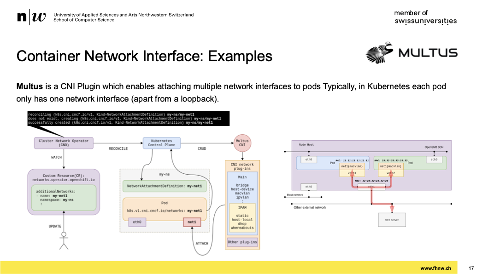
- ist ein CNI plugin
- mehrere network interfaces an pod anhängen
- gängigste methode ist mit vlan

## Kubernetes Network Model

- 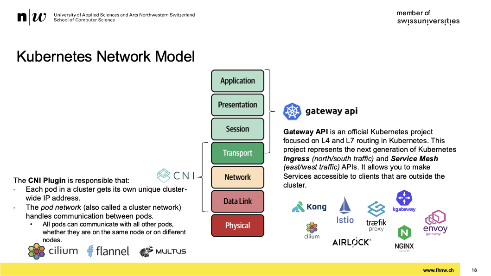

## Kubernetes Gateway API

- 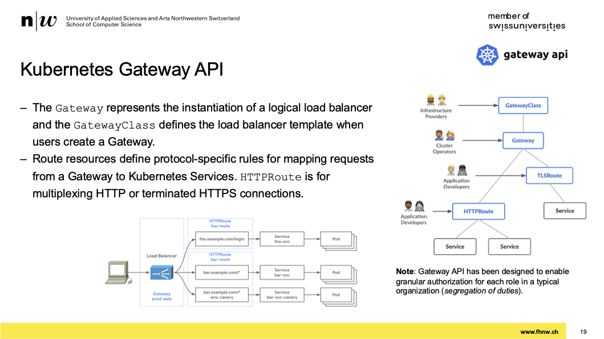
- gateway ist kernstück
  - ein laufender pod der traffic empfängt
  - laodbalancer ist dann ein service
- einen zentralen gateway der traffic an app weiterleitet
- LB im GW
- 

## Kubernetes Gateway API: Example

- 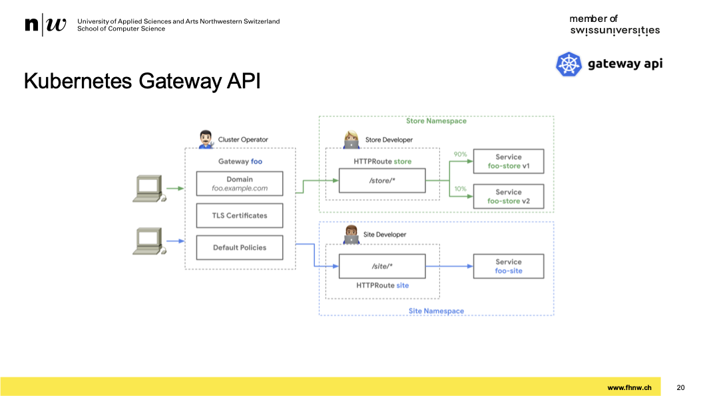
- zwei GW klassen die implementiert sind
- default kommt mit
- zusätzlich envoy GW
- da drin ist spezifiziert, welcher controller ist für welche GW klasse zuständig
- http route erstellen um von aussen auf GW zugreifen zu können

## Container Storage Interface

- 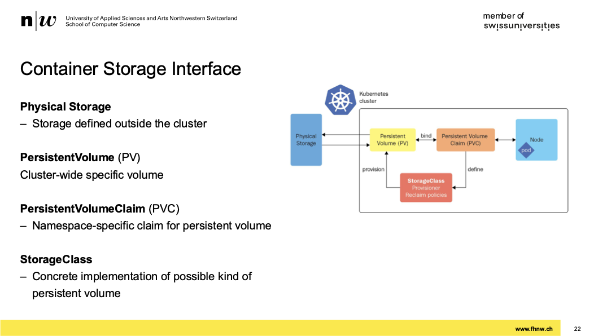
- zusätzliche komponenten für storage
- persistent volume ist ein service, der dann physical volume braucht
- PVC binded dann PV mit node und pod innerhalb

## Custom Resources

- 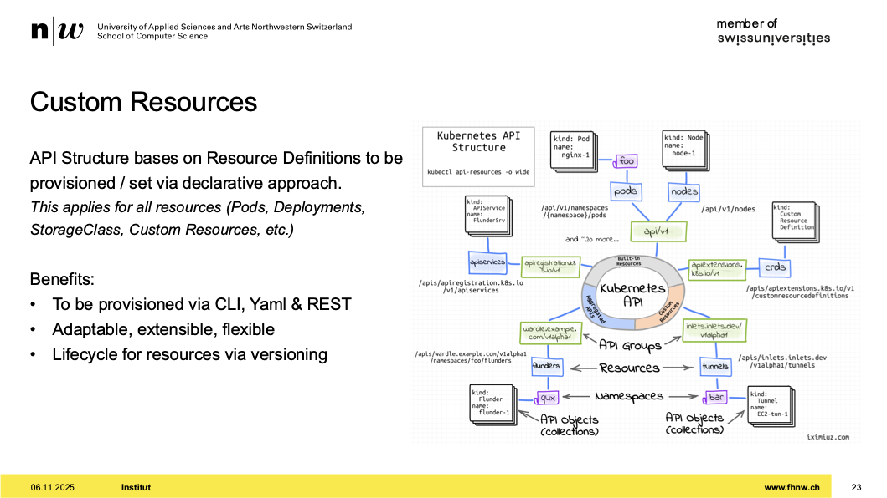
- GW ist custom resource
- es gibt built-in API's
- möglichkeit API beliebig erweitern
- eigene resource erstellen auf k8
- am schluss ist es oft ein pod

## Platform 3: K8s Tutorial

- ziel 1, kleinen cluster mit 2 nodes
- ziel 2 mit gVisor für OCI runtime
- ziel 3 vanilla kubernets
  - kubeporxy soll am schluss deinstalliert sein, statdessen andere service aufnehmen
- K9s installieren

## Helm

##
