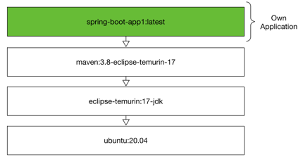
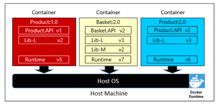
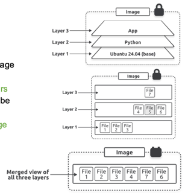
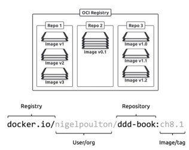
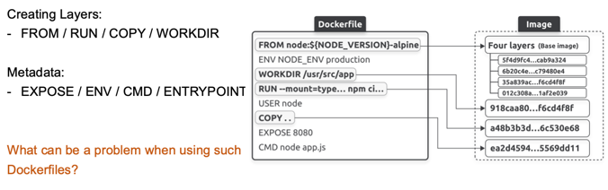

+++
title = "Week 03"
date = 2025-09-29
[taxonomies]
authors = ["fatlum"]
tags = ["devops"]
+++

- [📘 Aufgaben – DevOps Foundations HS25](https://spd.pages.fhnw.ch/module/devops/templates/reports/devops-foundations/hs25/index.html)
- [☁️ Azure Portal (AKS)](https://portal.azure.com)
- [🦊 GitLab – FHNW DevOps Projekte](https://gitlab.fhnw.ch/spd/module/devops)

---

## Reflektion Assignment 2
- **12-Faktor-App**
  - wichtig für die schriftliche Prüfung → vor der Prüfung unbedingt anschauen!
- Security-Flaws im Service schnell adressieren
- 9 wichtigste Funktionalitäten erfassen
- Git-Tag erstellen, dieser soll einen Release-Prozess triggern
- nächste Woche: Lösung containerisieren

---

## Introduction – Why Docker?
- Ganze Anwendungsschicht als Artefakt bauen, sodass sie auf jedem OS laufen kann
- **Portabilität**: OCI-Container sind darauf ausgelegt, von A nach B zu wandern
  - die Idee ist alt (Trennung von Concerns)
- **Reproduzierbarkeit**: einfacher Syntax für ein Dockerfile
- Container virtualisieren **keine Hardware**, sondern die Anwendungsschicht
- CI/CD gab es schon vor Docker, aber mit Containern ist es **generischer** und einfacher

---

## Where does it come from?
- **VM-Modell**:  
  App läuft auf OS → OS läuft in VM → VM läuft auf Hypervisor → Hypervisor läuft auf Host-Hardware
- **Container-Modell**:  
  Apps sind isolierte Prozesse, die nativ auf dem Server laufen
  - eine App wird wie ein Prozess behandelt
  - Shell und Application-Schicht übernimmt Docker
- Container sind wie **Rezepte** → man kann sie beliebig neu erzeugen
- → siehe Punkt 2 der **12-Faktor-App** (Trennung von Concerns ist Pflicht für gutes Operating)

---

## Linking to Cloud, Para-Virtualization
- Idee ist alt
- Container = Gruppe von Prozessen
- Normale Container haben **keinen eigenen Kernel** → laufen auf Anwendungsschicht
- Container brauchen weniger RAM, starten sehr schnell
- Container starten, sobald der Prozess startet  
  VMs starten zuerst Systemdienste (systemd, Timer, …)
- VMs sind stärker isoliert, Container sind abhängig von Runtime
- Achtung: Docker-Runtime kann Rootrechte erhalten (z. B. wenn man ein Root-Volume mountet)
- Entscheidung **Container vs. VM** nicht trivial
- **Best Practice**: ein Prozess → ein Image → ein Container

---

## OCI-Container / Images
- Docker war im Ursprung nur ein **Frontend** für `runc` (Open Container Initiative – OCI)
- Es gibt zwei Spezifikationen:
  - **Image Spec** (wie Images aufgebaut sind)
  - **Runtime Spec** (wie Container gestartet werden)  
    → siehe [OCI Runtime Spec](https://github.com/opencontainers/runtime-spec), [OCI Image Spec](https://github.com/opencontainers/image-spec)

---

## Dockerfile and Dockerimages
- 
- Keywords: `FROM`, `COPY`, `RUN`, `CMD`
- Pro Zeile im Dockerfile → **ein Layer**
- Baseimage = alles was im Image drin ist, wird weitervererbt
- Mit wenigen Zeilen lässt sich eine App containerisieren

---

## Immutable Software
- 
- Images sind unveränderlich („immutable“)  
  → **keine Patches im laufenden Container!**
- Wenn ein tiefes Baseimage fehlerhaft ist, wirkt sich das bis nach oben in der App aus
- Lösung: neue Images bauen statt im Container zu patchen

---

## Grundidee eines Containers
- 
- Isolation aller Abhängigkeiten in einem Paket
- Vorteil: Alles, was die App braucht, ist enthalten
- Nachteil:
  - mehr Speicherbedarf
  - regelmäßiges Monitoring der Dependencies notwendig
  - manuelles Patchen der Images wäre nötig
- Lösung: Automatisiertes Testing & Lifecycle Management

---

## Images and Container
- **Image** = gestapeltes Abbild der benötigten Pakete/Software, um einen Prozess zu starten
  - kann mehrfach geteilt und wiederverwendet werden
- **Container** = ein laufender Prozess basierend auf einem Image
  - Lifecycle wie ein normaler Prozess
- Workflow:
  1. Image lokal bauen (z. B. über GitLab CI)
  2. Build-Prozess pusht Layer (Hash-basiert) in Registry
  3. Beim Pull werden nur neue Layer heruntergeladen
- Best Practice: Container nach Benutzung entfernen, Images sauber generieren

---

## Detailed View of Layers
- 
- Große, selten geänderte Elemente → **unten im Image**
- Häufig veränderte Inhalte → **oben im Image**
- Dadurch können unveränderte Layers wiederverwendet werden (Caching)
- Beispiel: LLM bei Chatbots → weit unten platzieren
- Für Runtime nur kleine Baseimages verwenden (z. B. JRE statt JDK)

---

## Registries
- 
- Images werden automatisch gebaut und in einer Registry gespeichert
- Registry = Repository für Images, erreichbar via URL
- Vorsicht bei **Public Images** (Sicherheitsrisiko + Request-Quotas, z. B. Docker Hub)
- Lösung: eigene Registry oder Mirror verwenden

---

## Baseimage
Ein Baseimage ist das **Fundament eines Dockerimages**.  
Es enthält das Grundsystem (meist ein minimales Linux oder nur Laufzeitumgebung) und definiert damit:
- welche Bibliotheken und Tools zur Verfügung stehen
- wie groß die Angriffsfläche ist
- welche Abhängigkeiten enthalten sind

**Beispiele:**
- `alpine` – sehr klein, beliebt für schlanke Images
- `distroless` – ohne Bash, nur Laufzeitumgebung
- `ubi` (RedHat Universal Base Image)
- `chainguard` – sicherheitsoptimierte Images

---

## Out of Image, into the Container
- `docker run <IMAGE>` → startet Container
- Wichtige Punkte:
  - Port-Mapping (`-p`)
  - Volume-Mapping (`-v`)
  - Hauptprozess muss **PID 1** sein
- Nützliche Befehle:
  - `docker ps` → Container anzeigen
  - `docker exec` → Prozess im Container ausführen
  - `docker inspect` → Infos zum Container

---

## How to bring your application into a container?
1. Anwendung schreiben + Abhängigkeiten definieren
2. Dockerfile erstellen
3. Image bauen
4. Optional: Image in Registry pushen
5. Container starten

---

## Images and Stages
- 
- Kein stageabhängiges Image pro Umgebung bauen
- Stattdessen: **ein Image** durch alle Umgebungen (Test → Prod) durchlaufen lassen
- Jede Release-Nummer muss **eindeutig** sein (nicht wiederverwenden!)

---

## Dockerfile and Image
- 
- Layer erzeugende Keywords: `FROM`, `RUN`, `COPY`, `WORKDIR`
- Metadaten: `EXPOSE`, `ENV`, `CMD`, `ENTRYPOINT`
- Multi-Stage Builds:
  - Build-Stage: mit allen Tools
  - Run-Stage: nur schlanke Runtime
- Security/Lifecycle Checks laufen auf der letzten Stage (Prod-Image)

---

## How to build an image?
### Full Image
- **Vorteil**: einfach, transparent, sauber
- **Nachteil**: groß, viele unnötige Tools, große Angriffsfläche

### Multistage Build
- **Vorteil**: separates Build- und Run-Image → kleine Laufzeit-Images
- **Nachteil**: komplizierter zu entwickeln, weniger transparent

### Build Packs
- Dockerimage ohne Dockerfile
- Frameworks werden automatisch erkannt
- **Vorteil**: schnell und einfach starten
- **Nachteil**: komplexe Architektur, schwer zu debuggen, Bugs möglich

---

## Choice of Baseimage
- Alpine: klein
- Distroless: keine Shell
- Chainguard: sicherheitsoptimiert
- UBI: RedHat Universal Base Image
- Je größer das Baseimage, desto mehr unnötige Komponenten

Tooling:
- **Syft** → Software Bill of Materials (SBOM) generieren
- **Grype** → Security Scans

---

## Best Practices for Building Images
- Ein Hauptprozess (PID 1)
- Sich schnell ändernde Teile nach oben schichten
- Überflüssige Pakete entfernen
- Nicht als Root laufen (wenn nicht notwendig)
- Möglichst kleine Images bauen
- Layers wiederverwenden
- Images regelmäßig scannen
- Tagging-Strategie etablieren
- Vorsicht mit Public Images

Quelle: [Google Cloud Blog – Best practices](https://cloud.google.com/blog/products/containers-kubernetes/7-best-practices-for-building-containers?hl=en)

---

## Für nächste Woche
- Link zu Assignment 3:  
  [Assignment 03 – DevOps Foundations](https://spd.pages.fhnw.ch/module/devops/templates/reports/devops-foundations/hs25/assignments/assignment03.html)
- Kann Framework als SaaS agieren?
- Dockerfile ins **Root-Verzeichnis**
- Dockerfile muss **`Dockerfile`** heißen
- Dockerfile enthält **Build- und Run-Stage**
- Saubere Dockerfiles erstellen
- Applikation muss baubar sein
- Namenskonventionen einhalten
