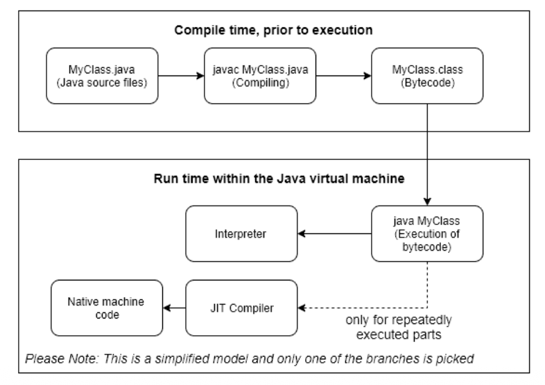
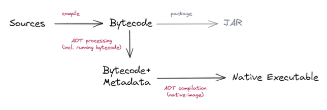
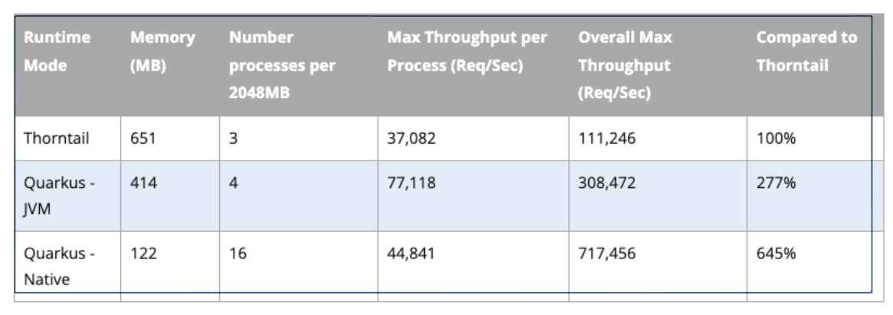
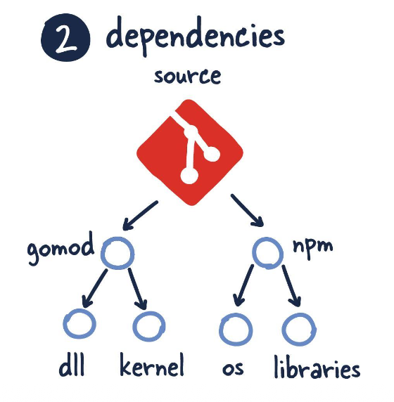
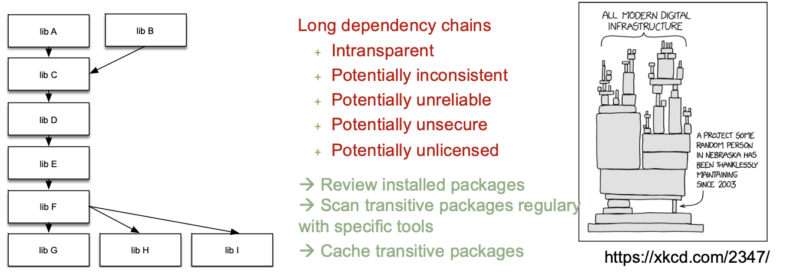
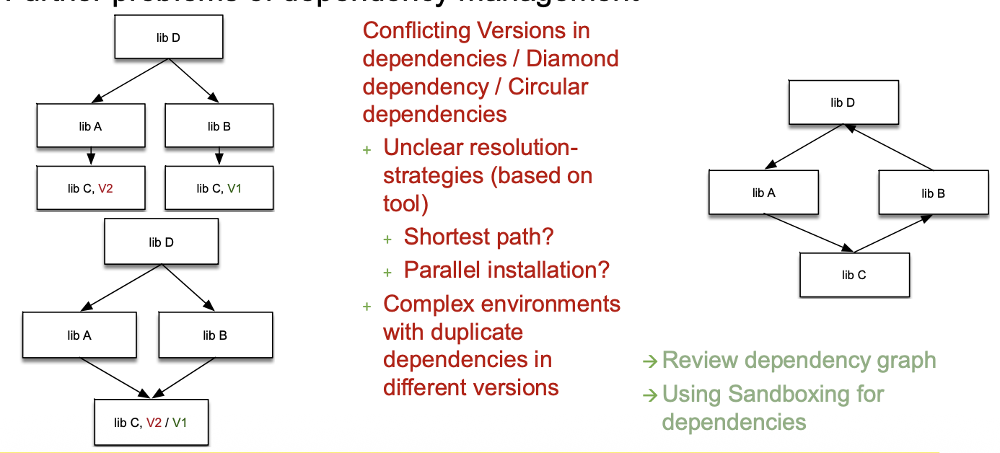
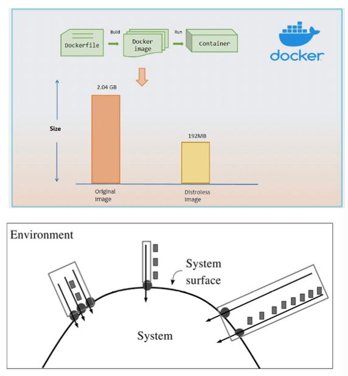
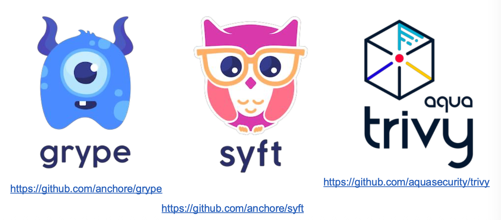

+++
title = "Week 04"
date = 2025-10-06
[taxonomies]
authors = ["fatlum"]
tags = ["devops"]
+++

- [📘 Aufgaben – DevOps Foundations HS25](https://spd.pages.fhnw.ch/module/devops/templates/reports/devops-foundations/hs25/index.html)
- [☁️ Azure Portal (AKS)](https://portal.azure.com)
- [🦊 GitLab – FHNW DevOps Projekte](https://gitlab.fhnw.ch/spd/module/devops)

---

## Reflektion Assignment 3

- Angeben, **welches Dockerfile** verwendet wird.
- Images **mit festem Digest (SHA)** referenzieren.
- **Multi-Stage Build** verwenden.
- **GraalVM** für Native Builds (ohne JVM-Runtime zur Laufzeit).
- Builder-Base: `quay.io/quarkus/quarkus-ubi9-quarkus-mandrel-builder-image`
- Runtime-Base: **Quarkus micro-image** (sehr klein).
- Eigene **Stages** für Dependency-Download und Build trennen (Cache-Effekte!).
- **So wenig Dependencies wie möglich** (Maven/Gradle nur das Nötige).
- **README.md** mit präziser Build-/Run-Anleitung, inkl. `docker buildx`, Tags, Digest-Pins.

---

## Cloud Efficiency

### Cost and Workload

- Ohne clevere Ressourcenplanung verschwendet man schnell CPU/RAM.
- **Requests/Limits** in Kubernetes bestimmen Scheduling → beeinflusst **Kosten direkt**.
- **Memory** ist oft der limitierende Faktor, CPU eher konstant; Memory-Sizing sauber festlegen.

### Container Platforms, Pay as you go

- Orchestrierung (z. B. Kubernetes) packt Workloads **auf passende Nodes**.
- **Pod-Größe** (Requests/Limits) beeinflusst **Cluster-Scale-Out** → Kosten.
- Node-Pools können „atmen“ (hoch/runter skalieren).

### Costs of infrastructure

- Laufzeitkosten sind berechenbar (CPU, RAM, Storage, Traffic).
- **RAM-Kosten** fallen oft stärker ins Gewicht als reine vCPU-Kosten.
- Für Kostenoptimierung: **rechte Größenordnung** wählen, Leerlauf reduzieren, Limits sauber setzen.

### Excurse: Java and the Cloud?

- Klassische JVMs hatten lange **kein volles cgroups-Bewusstsein** (heute besser).
- Typische Kostentreiber: **GC-Overhead**, **Fork-Join-Pool**, **Compiler-Threads**.
- Containerisierte JVMs müssen **explizit** über Container-Limits informiert werden (heute via Flags/Auto-Detect).

### What about Java?

- Moderne Runtimes/Frameworks (z. B. **Quarkus**) reduzieren **Startup-Zeit** und **Memory-Footprint** deutlich.
- **JIT-JVM** weiterhin sinnvoll für durchgehend CPU-lastige Services; **Native** stark für „cold-start-sensitive“ Workloads.

### Java and Native?

- **AOT** (Ahead-of-Time) kompiliert zur Binärdatei → extrem schneller Start, weniger RAM.

### Native Images with GraalVM

- **Pro:** Instant Startup, sehr niedriger RAM-Verbrauch.
- **Contra:** Längere Builds; teils **Reflection/Proxies/Serialization/JNI** nur mit Konfiguration; weniger JVM-Tools zur Laufzeit.

### Solutions: Specialized JVM (GraalVM) and Framework (Quarkus)

- Kombination: **GraalVM + Quarkus** liefert kleine, schnelle Services.
- Pattern: **Builder-Image** (Graal/Mandrel) → **Runtime-Image** (micro).

### Computation example

- Beispielhafte Rechnung: **Native** reduziert RAM signifikant → mehr Pods pro Node → **geringere Kosten** bei gleichem Budget.

### “Modern” languages

- Sprachen nach **Effizienzzielen** betrachten: Compute vs. Memory vs. Startup.
- In „typischen“ Microservices ist **Memory** oft der harte Constraint.

---

## Dependency Management

### Challenge?

- Viele Microservices ⇒ **permanente Pflege** der Abhängigkeiten.
- **Transitive Dependencies** erzeugen große, intransparente Bäume.

### Clear access from sourcecode base

- **Twelve-Factor**: **keine impliziten Systempakete**.  
  Alles **explizit deklarieren** (Manifest), Tools nicht stillschweigend voraussetzen.
- **Reproduzierbarkeit** > „funktioniert lokal“.

### Which dependency management frameworks do you know?

- **Java**: Maven, Gradle  
- **JS/TS**: npm, pnpm, yarn  
- **Python**: pip/pip-tools, Poetry  
- **Go**: Go Modules  
- **Rust**: Cargo  
- **PHP**: Composer  
- Immer **sprachenzentriert**, aber Grundprinzip gleich: Versionen **pinne**n, Lockfiles nutzen.

### Dependency Trees

- Selbst kleine Demos ziehen **viele** Artefakte.
- Visualisierung & „Pruning“ helfen (nur nötige Teile ziehen).

### Large Dependency Trees

- Probleme: **Intransparent**, **inkonsistent**, **unsicher**, **unlizenziert**.
- Maßnahmen:
  - **Installierte Pakete prüfen**
  - **Transitives Scannen** in der CI
  - **Artefakt-Cache** (resilient gegen Registry-Ausfälle/Entfernungen)

### Further problems of dependency management

- **Konflikte** (Version Clash, Diamond-Deps), **Zyklen**.
- Strategien:
  - **Dependency-Graph** regelmäßig prüfen
  - **Sandboxing/Vendor-Modus** erwägen
  - **Konsequentes Version-Pinning**, semantische Versionierung beachten

### Software Bills of Material

- **SBOM** = maschinenlesbare Metadaten zu Komponenten (inkl. Lizenz/Copyright).
- Liefert **Transparenz** in der Supply Chain; gehört **zur App**.
- Tools wie **Syft** generieren SBOMs aus Source/Images.

### Why? Supply Chain Attacks / Log4Shell

- **Supply-Chain-Angriffe** sind zentraler Risikofaktor.
- **Log4Shell**: massiver Impact; zeigt, warum **Transparenz + schnelles Patchen** Pflicht sind.

### Why? Supply Chain Attacks / XZ-Backdoor

- Hintertür in Build-/Release-Kette; **Social Engineering** bis in Maintainer-Kreise.
- Lehre: **Vertrauen ist kein Security-Mechanismus** → Reviews, Reproduzierbarkeit, Provenance.

### Why? Supply Chain Attacks / npm Libraries Compromised

- Hohe **Reichweite** durch Basistools/Utilities.
- **Stealth-Payloads** möglich (z. B. API-Hooks, Wallet-Manipulation).
- Konsequenz: **Transitive Deps regelmäßig scannen**, Lockfiles prüfen.

### Supply Chain Attacks

- Anzahl transitiver Dependencies **kaum manuell beherrschbar**.
- **13 %** der Log4j-Downloads verweisen noch auf verwundbare Versionen → Altlasten bleiben lange im Umlauf.
- **Fazit:** Supply-Chain-Risiken sind **Top-Bedrohung** beim Bauen von Software.

### Vulnerabilities of Software

- **Weniger Bibliotheken** = meist weniger Angriffsfläche – aber **Größe ≠ Sicherheit**.
- **Distroless** hilft (keine Shell/Package-Manager), aber **Execution-Path** ist entscheidend.
- Patch-Strategie: **kritische CVEs** zeitnah fixen, automatisches **Vuln-Scanning** (CI/CD).

### Tools

- **Trivy**: Filesystem/Container/Repo-Scanner (Vulns/Secrets/Misconfigs).
- **Grype**: CVE-Scanner für Container/FS.
- **Syft**: SBOM-Generator (Source & Image).
- Praxis: **Syft → SBOM**, **Grype/Trivy → Scan**, Ergebnisse in CI **failen** lassen (Schwellenwerte).

---

## Nächstes Assignement

- **KW44**, Abgabe **Milestone 1** (Sonntag).
- **LLM-Integration** (mehrere Varianten ok).
- Artefakte sollen **wiederverwendbar** sein (auch in anderen Modulen).
- Hinten dran eine **HTTP-Schnittstelle** (GET mit Parametern in der URL).
- Wichtig:
  - Weiterhin **Conventional Commits (cc-commits)**.
  - Pipelines mit **SBOM + Vulnerability-Scan** aufsetzen.
  - **Dependency-Updates** automatisieren (Renovate/Dependabot).
