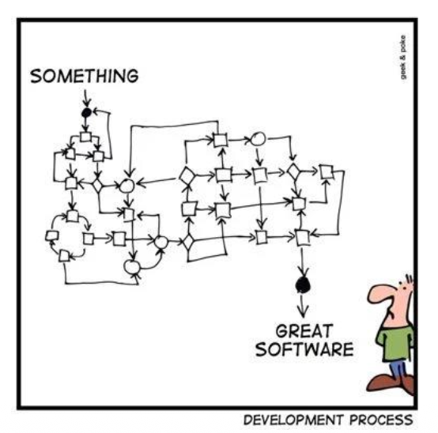
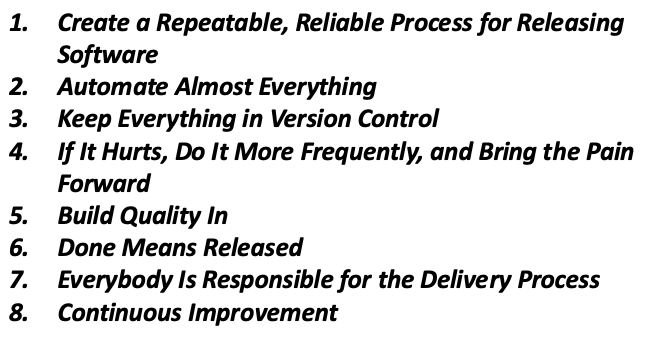
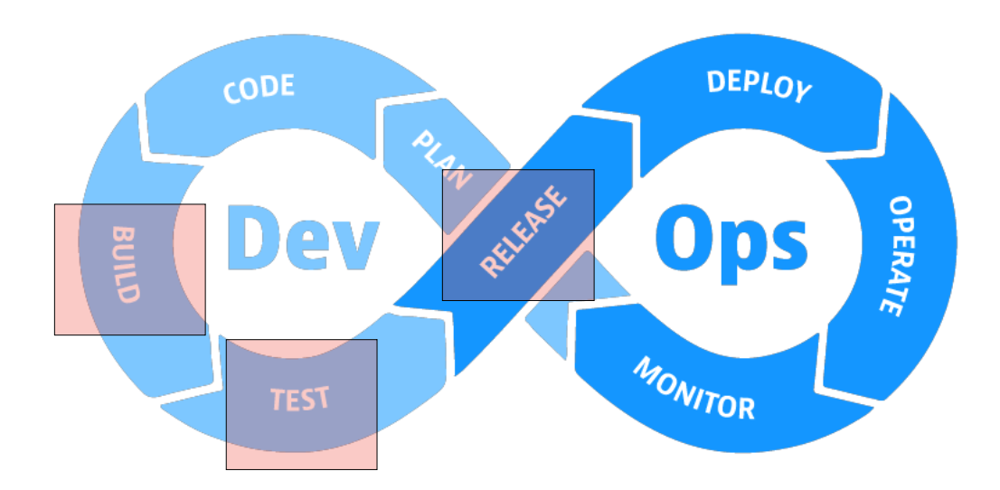
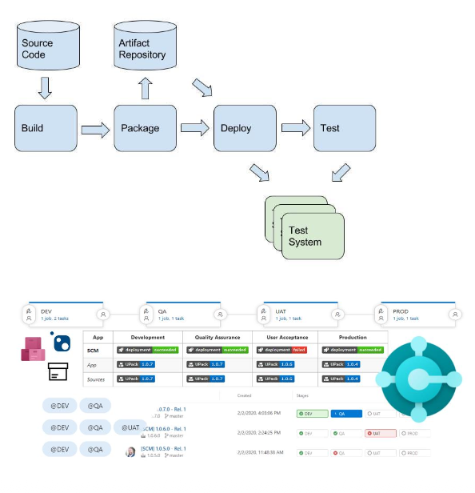
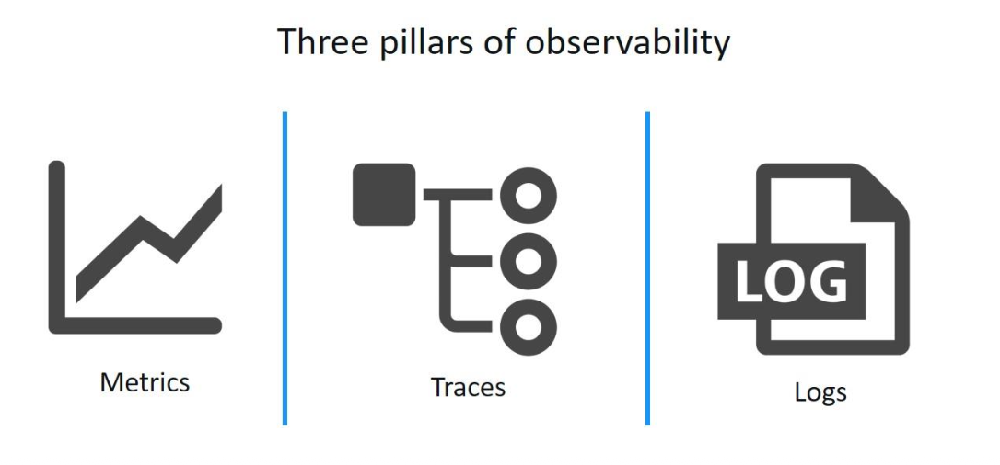
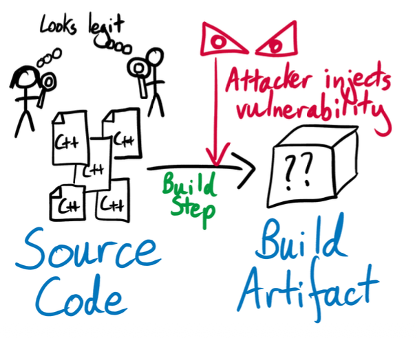
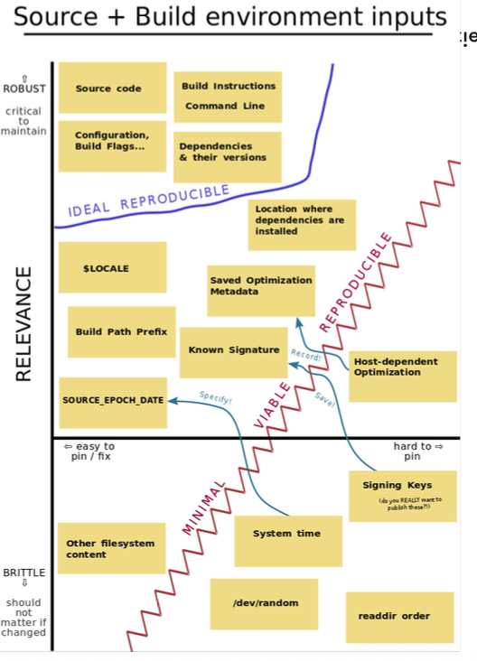
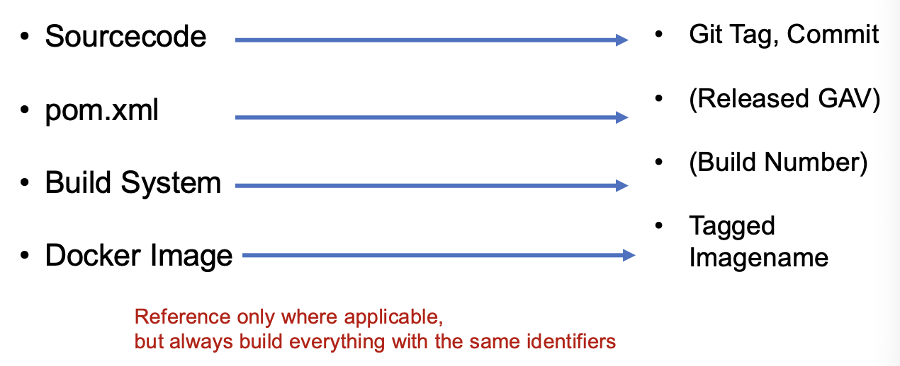
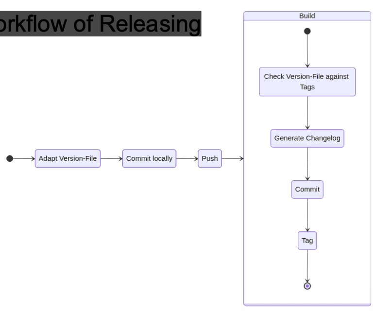
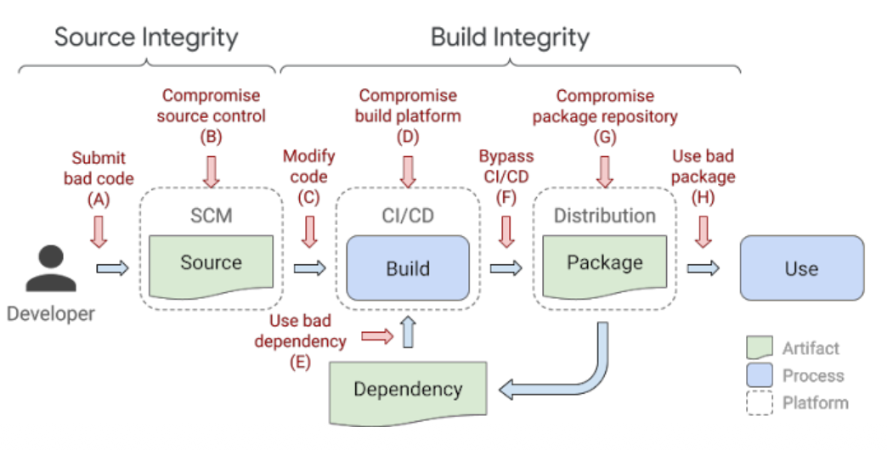

+++
title = "Week 05"
date = 2025-10-13
[taxonomies]
authors = ["fatlum"]
tags = ["devops"]
+++

- [📘 Aufgaben – DevOps Foundations HS25](https://spd.pages.fhnw.ch/module/devops/templates/reports/devops-foundations/hs25/index.html)
- [☁️ Azure Portal (AKS)](https://portal.azure.com)
- [🦊 GitLab – FHNW DevOps Projekte](https://gitlab.fhnw.ch/spd/module/devops)

---

## Reflektion Assignment 4

- vorteil von externen punkt abfragen:
  - weniger ressourcen
- nachteil: fragiler

## wichtig für devops

- Wichtig für bewertung:
  - source code wird mit qity überprüft
  - finding anschauen
  - global wird keine punkte geben
  - lokal notieren wieso wir was ignorieren
  - changelog markdown wollen sie im repo haben
  - im changelog soll auf commits verweisen
  - merge commits werden ausgelagert
  - pipeline wird angeschaut
  - source code qualität wird überprüft
  - CVE werden angeschaut
  - Dockerfile wird angeschaut wegen base image

---

## Releasing

- releasing soll transparent und einfach ein
- 
- nachvollziehbar, zuverlässig, einfaches releasing
- alles automatisieren
- CVE checks, quality checks keine unit tets
- wenn es releaset ist, sollte es irgendwo einen jar, .zip oder sonst was geben
- jeder ist verantwortlich, jede person muss releasen können

---

## Build and Release

- 

---

## What tests do you want to continuously run?

- integration tests
- unit tests sind im source code direkt integriert
- bei integration test bezieht man auch anderes wie datenbanken (Um-Systeme)
- Lasttests -> 5 Requests, 10 Requests, 1000 Requests
  - inheränt wichtig
- End-2-End tests
- Frontend tests

---

## What analysis do you want to continuously perform?

- code style, clean coding
- security scans
- supply chain

---

## What is a release?

- läuffähige software (getestet, gescannt)
- deplyoable artifakt, welches generiert worden ist
- source code management release: Tag

---

## Release != Deployments

- 
- sollte man trennen
- sind zwei verschiedene domänen
- bei release: SW bauen und artifakt kommt raus
- bei deploy: das artifakt dann deployen
- damit releasing resilient ist braucht man builds
- auf knopf druckt soll gebaut werden und artifakt generierung
- was raus kommt sind nicht veränderbare artifakte

---

## What is a release in frameworks?

- maven:
  - festgelegt durch eine stabile version
  - version ist einzigartig
  - sieht man als stable an
  - wenn in der version kein -SNAPSHOT, dann darf man nicht überschreiben
- Docker:
  - identifiziert anhand von Tags
  - kann man überschreiben
  - keine gefahr von transitive abhängigkeiten brechen sind selfcontained

---

## Releases can be complex…

- workflow:
  - ich tagge meine änderungen
  - dnach müsste ich pom anpassen, wegen version

---

## Why is regular releasing important?

- mit chat gpt machen

---

## Why?

- 
- wie viel ressourcen etc.
- traces: schaffen korrelation zwischen request
- repeatle builds

---

## Repeadible Builds

- releaen wenn eine neue funktionalität vorhanden ist
- die meisten builds sind nicht nachvollziehbar
- builds sollen immer ausgeführt werden können

---

## Repeatable Builds with the help of an Independent Build System

- immer zu jederzeit releaen
- multi stage docker builds
- natives buildsystem

---

## Reproducible Builds

- gegen attacken schützen
- input mit source code, parameter etc. am schluss den selben output
- 

---

## Reproducible Builds hard to achieve

- 
- möglichst viel rechts unten nach links oben zu schieben
- muss ich möglichst pinnen, möglichst viel wissen

---

## Try to get as close as possible

- 
- git tags nicht umhängen, neue version, neue releases
- bei maven, pom nicht updaten
- buildsystem nicht auf buildnummern stützen
- ein git tag, ein image

---

## Example Workflow of Releasing

- 
- changelog generieren, dieses commiten und auf diesen commit einen tag setzen
- ein file mit allen versionen

---

## Outlook for next session, SLSA

- 
- mit SLSA build porzess schützen

---

## Nächstes Assignement

- verschiedene möglichkeiten zu bauen
- einfache pipeline ausbauen
- in changelog anpassen, bei jedem tag
- raus kommen muss ein einzigartiges image was zu einem tag passt
