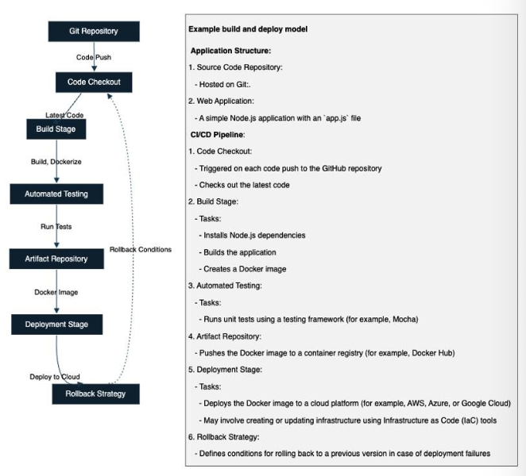
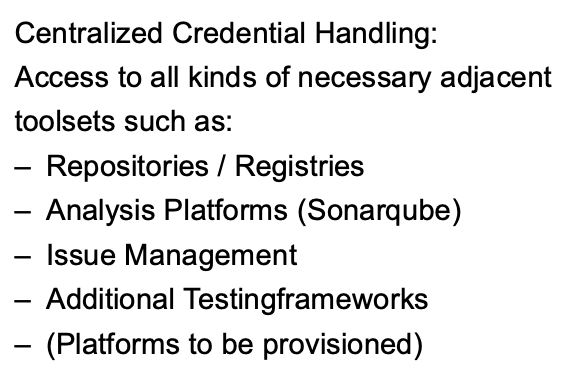
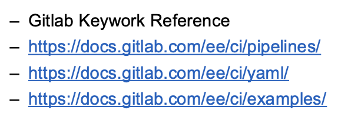

+++
title = "Week 06"
date = 2025-10-20
[taxonomies]
authors = ["fatlum"]
tags = ["devops"]
+++

- [📘 Aufgaben – DevOps Foundations HS25](https://spd.pages.fhnw.ch/module/devops/templates/reports/devops-foundations/hs25/index.html)
- [☁️ Azure Portal (AKS)](https://portal.azure.com)
- [🦊 GitLab – FHNW DevOps Projekte](https://gitlab.fhnw.ch/spd/module/devops)

---

## Reflektion Assignment 5

- Ab **übernächster Woche** wird’s eine **steile Lernkurve: Kubernetes**. Fokus: Deployments sauber strukturieren, Images korrekt versionieren, Trennung von Build und Deploy konsequent durchziehen.

---

## Wichtig für DevOps

- **Skaffold**  
  Lokale Dev-Loop für Container/K8s. Achtung auf **relative Pfade** (Build-Kontext, Manifeste).  
- **dind (Docker-in-Docker)**  
  Variante, um in CI Docker-Builds laufen zu lassen. Alternativen beachten (Kaniko/Buildpacks), wenn „privileged“ nicht möglich ist.  
- **Buildpacks**  
  Container ohne Dockerfile bauen; identifiziert Sprache/Framework automatisch. Gut für standardisierte Pipelines.  
- **Kaniko**  
  Baut Docker-Images **ohne Docker-Daemon**. Ideal in restriktiven Runnern.  
- **Pipeline-Grundsatz**  
  Stage **`build-application`** führt primär den **Applikationsbuild** aus (z. B. `mvn package`). Image-Build und Push als **eigene** Schritte planen – **Build & Deploy strikt trennen**.

**To-dos (ausbauen, teilweise parallelisieren):**

- **Vulnerability Scan** in der Pipeline (z. B. Trivy/Grype)  
- **SBOM** generieren (z. B. Syft/CycloneDX)  
- **Timeouts** für Jobs setzen (hängen nicht ewig)  
- **Templates/Components** nutzen (DRY)  
- **Ablauf dokumentieren**: „Wer macht wann was?“ – Sketch/Diagramm je Stage  
- **Unabhängige Schritte parallel** ausführen (z. B. Scan und SBOM nach dem Build)

---

# Continuous Integration / -deployment

### Breaking News – Strengthening npm security

- Kürzere **Token-Lebenszeit**, TOTP wird abgelöst, **Passkeys** und **Trusted Publishing (OIDC)** im Kommen. Heisst für uns: Token rotieren, wo möglich OIDC nutzen.

### Building Software and deploying it

- **Bauen** und **Deployen** sind unterschiedliche Domänen. Unterschiedliche Risiken, andere Werkzeuge.
- 

### Build and Release

- Release-Prozess klar definieren (Tagging, Artefakte, Changelog). Build reproduzierbar halten.  
- 

### Build and Deploy-Pattern

- **Build und Deploy trennen!**  
  → Mehr **Stabilität/Robustheit**  
  → Gleiches **Artefakt** für Test/Prod (Stage-Parity, 12-Factor)  
  → Orientierung am **Release-Workflow** der VCS-Plattform  
  → Fokus heute: **Build**
- 

### Why use a Build System?

- **Unabhängige Plattform:**  
  **Single Source of Truth** (VCS) & **Single Source of Build** (CI)  
  Version des Build-Tools definieren, **Guardrails** (Tests/Analyse), **Transparenz** schaffen.
  - 
- **Zentrales Credential-Handling:**  
  Sichere Anbindung an **Registries**, **Analyse-Plattformen** (z. B. SonarQube), **Issue-Tracker**, Zusatz-Testframeworks. Secrets nicht im Code, sondern **CI/CD-Variablen**.
  - 
- **Transparenter Build-Status:**  
  Team-Alignment, Release-Fähigkeit, Test-Status, Prioritäten – jederzeit sichtbar.
  - 
- **Bus-Faktor erhöhen:**  
  Kein „Person X ist Single-Point-of-Failure“. CI/CD erhöht die Resilienz. Bei Bus-Faktor == 1: sofort handeln.

### Modern CI-Systems

- CI hat sich stark weiterentwickelt: deklarative Pipelines, Caching, OIDC-Federation, Komponentenbibliotheken.

### Build as Code, GitLab

- Pipeline als Code im Repo.  
- **Ablauf:** 1) Push → 2) CI Trigger → 3) Pipeline-Definition laden → 4) Build → 5) Notify.  
- 

### GitLab Web IDE

- Schnelle Pipeline-Iterationen direkt im Browser (Feedback-Loop verkürzen).

### GitLab-CI Development

- Komponenten einer Pipeline modular denken; bei ähnlichen Services (z. B. mehrere Quarkus-Services) **auslagern** und wiederverwenden.

### GitLab-Registry

- Aggregierte Sicht über Projekte/Repos, **direkter Zugriff** aus GitLab-CI, **Pull-Credentials** bereitstellen. Vor „Mutationen“ (Rewrites) **Registry bereinigen**.  
- 

### Documentation

- Relevante GitLab-Doku: **Keyword Reference**, **Pipelines**, **YAML-Referenz**, **Beispiele**.  
- 

### Pipeline Libraries, GitLab Components

- **Ziel:** Wiederverwendung – **DRY**.  
- **Templates**: älter, gut integriert, Parametrisierung über **Variablen**.  
- **Components**: neuer, **parametrisierte Bausteine** mit klaren Schnittstellen; ideal für einen **CI/CD-Katalog**.  
- Achtung bei mehrfachem Konsum derselben Variablen; Komponenten sauber dokumentieren und versionieren.  
- 

### Do’s and Don’ts

- **Alles in den Sourcecode** (Infra- und Pipeline-as-Code).  
- **Kein Rad neu erfinden** – vorhandene Libs/Methoden/Variablen nutzen.  
- **Fail fast** und **einfach halten**.  
- Bei **externen Services**: Timeouts setzen, **Fehlschläge optional** behandeln.  
- **Build in Teilschritte** skizzieren:  
  Welche **Stage** macht was? Was läuft **parallel**? Wo werden **Artefakte** übergeben?  
- Vorsicht bei **mehreren Libraries**: Konflikte/Lifecycle-Themen früh erkennen.  
- Rechne damit, dass nicht alles sofort klappt – Debugging kostet Zeit.  
- **Referenzen** pflegen (Doku/Quellen/Code).  
- **Token rotieren**, Kalender für Schlüssel-Abläufe nutzen.  
- **Quotas** im Blick: Logs, Laufzeit, Anzahl Artefakte.  
- 

### Beyond Simple Building – SLSA

- Software-Supply-Chain absichern (Provenance, reproduzierbare Builds, unveränderliche Artefakte). SLSA als Rahmenwerk verstehen und schrittweise umsetzen.
- 

### Beyond Simple Building: ChatOps, Dependency Mgmt

- Automatisierung ausweiten: Notifications, Paket-Lifecycle, Issue- und PR-Management. Renovate/Dependabot & Co. für Dependencies. ChatOps für kurze Feedback-Loops.  
-  :contentReference[oaicite:20]{index=20}

---

## Konkrete Pipeline-Skizze (an unseren To-dos ausgerichtet)

1. **build-application**  
   - `mvn -B -ntp clean package` (bzw. Quarkus native build, wenn nötig)  
   - Artefakt: Jar/Binary hochladen

2. **build-image**  
   - `docker build` (oder **Kaniko**/**Buildpacks** als Alternative)  
   - Tag aus Version ableiten, **immutable tag** verwenden

3. **security-scan (parallel)**  
   - Trivy/Grype gegen Image, **Fail on high/critical** nach Policy

4. **sbom (parallel)**  
   - SBOM (CycloneDX/SPDX) erzeugen, als Artefakt speichern

5. **push-image**  
   - Push in GitLab-Registry, signieren/attestieren (wenn möglich)

6. **deploy (separat, manuell/auto)**  
   - K8s/ECS/AKS – **eigenständige Stage**, nutzt das bereits gebaute Image

Damit erreichen wir: klare **Trennung Build/Deploy**, reproduzierbare Artefakte, Sicherheit (Scan/SBOM) und bessere Parallelisierung.

---
