+++
title = "Week 07"
date = 2025-10-27
[taxonomies]
authors = ["fatlum"]
tags = ["devops"]
+++

- [📘 Aufgaben – DevOps Foundations HS25](https://spd.pages.fhnw.ch/module/devops/templates/reports/devops-foundations/hs25/index.html)
- [☁️ Azure Portal (AKS)](https://portal.azure.com)
- [🦊 GitLab – FHNW DevOps Projekte](https://gitlab.fhnw.ch/spd/module/devops)

---

## Reflektion Assignment 6

- to be continious -> tool um pipelines zu machen auf dem web
- beyond pipelines:
  - mend renovate für dependencie checks

## Wichtige punkte zur abgabe

- sehen das wir relasing dediziert umgesetzt haben
- referenz für pipeline run releasing
- referenz für normale pipeline run
- images müssen local baubar sein -> docker build
- ass7 braucht man nicht für abgabe

## Platform

### Build and Release

- 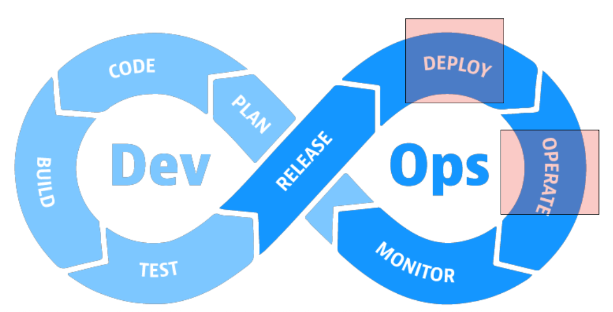

### Where do you deploy your software? How do you run your software?

- Laptop
- Kubernetes
- Switch Engines / Betriebssystem
- Azure / Hyperscaler -> IaaS, Webservices
- Mobile Devices

### How do you ensure, the platform is stable?

- Monitoring
- Logging
- Verfügbarkeit / SLA's / Kosten
- verschiedene service level bei AKS
  - wir arbeiten auf zweiten services level
  - wenn cluster weg ist, ist app weg
  - alles unter VCS
  - cluster werden von graf nicht repariert

### Lecture

- [buch](https://learning.oreilly.com/library/view/kubernetes-patterns-2nd/9781098131678/)
- [buch2](https://learning.oreilly.com/library/view/cloud-native-devops/9781098116811/)
- [buch3](https://github.com/cloudnativedevops/demo)

### Container Orchestration

- 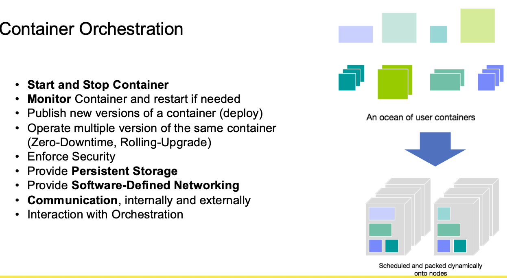
- liveness/readyness bruachen wir bei container
- bei neuer software ausrollen, wollen wir keinen ausfall haben
- verschiedene versionen eines images
  - damit ich weiss ob es fehler gibt
- docker ist nicht sicher, wir wollen sicherheit
- wir wollen einen orchestrator haben

### What is Kubernetes?

- 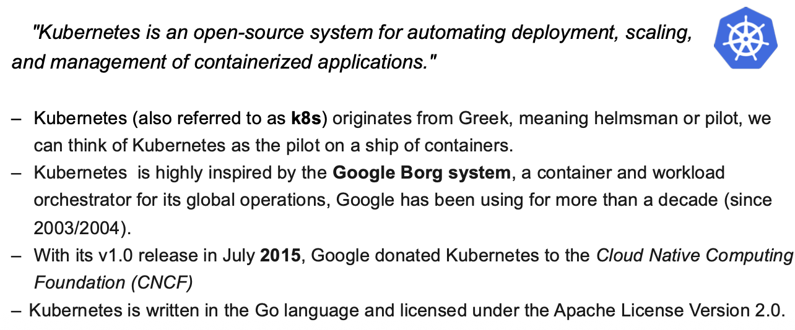
- offen system um zu deployen, orchestrieren
- ursprünglich kommt system von google -> Google Borg system

### Origin

- 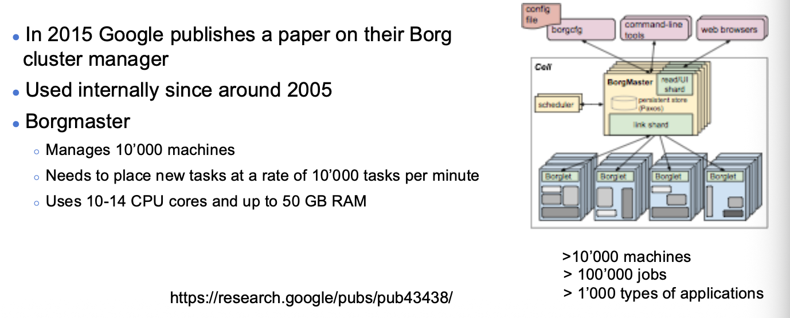
- 10000 maschinen die problemlos orechstrierbar sind

### What is Kubernetes?

- verschiedene Kubernetes anbieter
- K3S, MicroK8s, Rancher, Redhat, Google, Amazon EKS

### Usecase in SBB

- Zu 7 wurden 42 Cluster mit 800 Nodes orchestriert

### Kubernetes Architecture

- 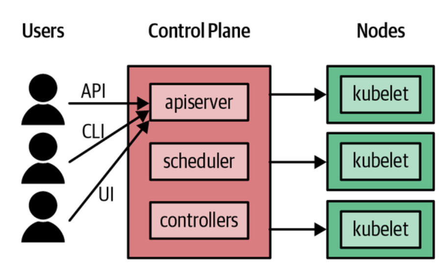
- API server und Kubelet

### Pods

- 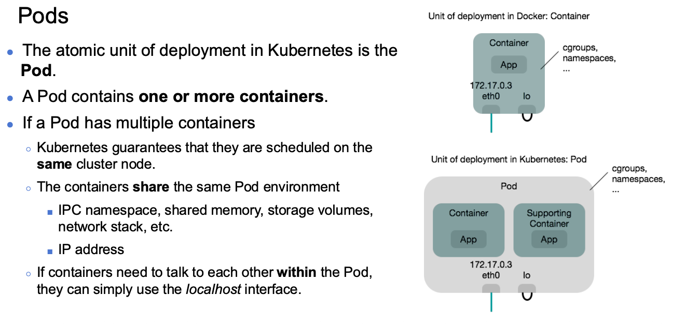
- auf kubelet laufen Pods
- in pods kann mehrere container laufen
- wir machen 1 pod 1 container
- pod landet immer auf einen knoten und shared alle ressourcen

### Resources Pod and Deployment

- 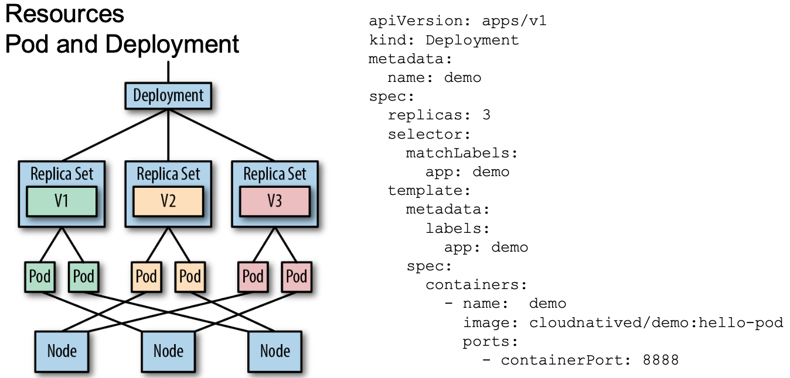
- deklarative spezifikation
- kubernetres arbeitet mit ressource definition
- man kann kubernetes sage, brauche DNS, brauche Loadbalancer, brauche Pod
  - ab dann, eine blackbox
- selector: auf welche app hören
- yaml wird an kubernetes server übergeben

### How to access Container? Service

- 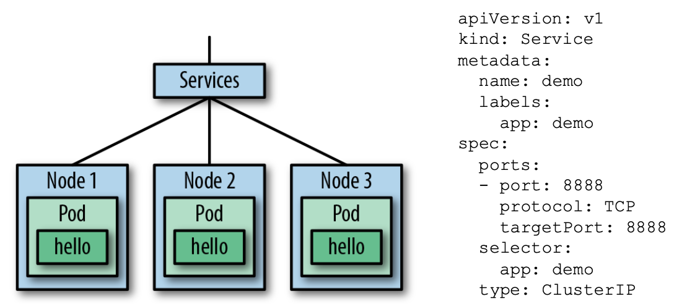
- ein pod hat ein netzwerk interface und unique IP
- hat internen DNS
- auf pod greife ich über DNS-namen eines pods
- im connecting worlds müssen wir dns eintrag anpassen, sonst reden pods nicht miteinander

### Injected Configurations → ConfigMaps

- 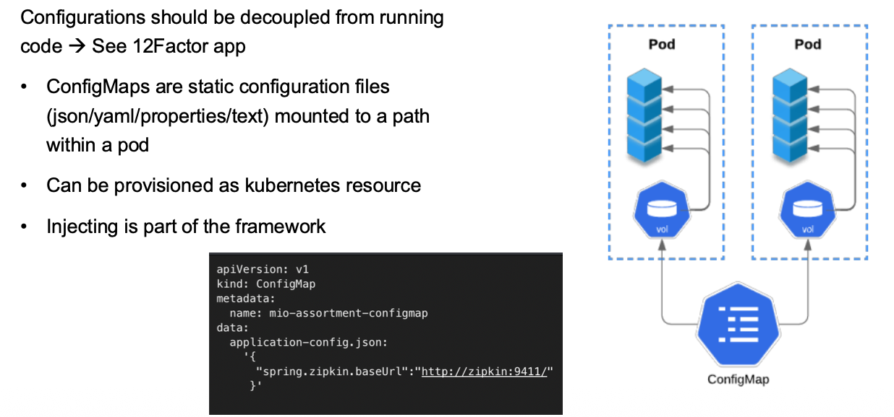
- pods sind stateless, haben keinen storage
- volume konstrukt nutzen für config map
- connecting worlds mounten wir in config map
- trennung von config und runtime wollen wir
- sind kubernetes ressourcen
- im pod nur eine datei drin, die app muss diese lesen
- applikation muss wissen, wo config ist
- yaml auf applikation anpassen

### Defining any kind of resources

- 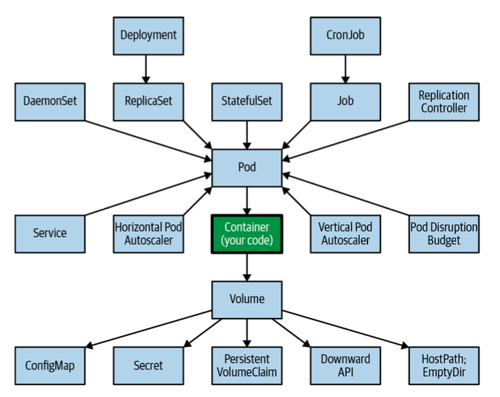
- es gibt unheimlich viele ressourcen
- macht einen durchschnitt mit deployment, config-map
- configmap, secret als volumue im container

### How elements are rolled out?

- 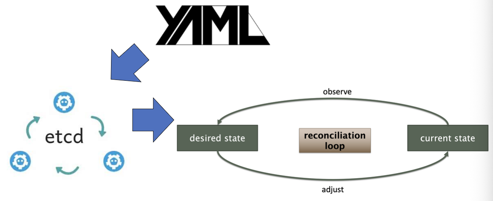
- yaml wird über api-server übergeben
- etcd: key-value container
- das deklarative wird kontinuierlich überwacht

### Workflow of Deployment

- 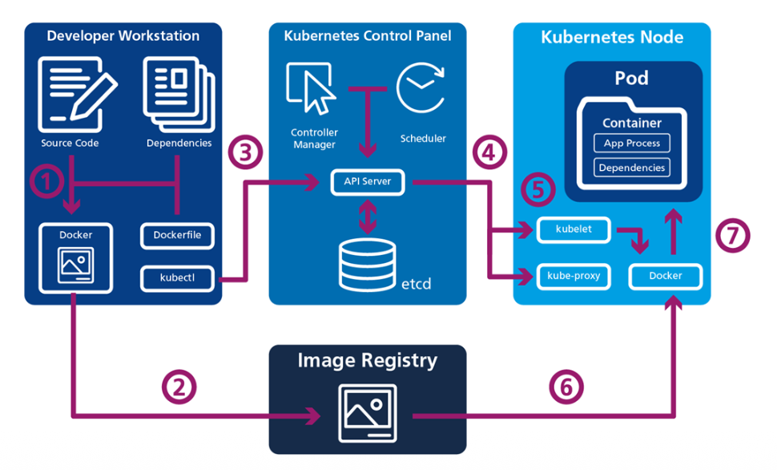
- ab punkt 3, wir sagen am api server er soll image deployen
- workernode kriegt notification er soll laufen lassen
- worker node holt sich dann von registry
- wir reden immer mit control plane

### Demo

- wie kommen wir an cluster
- loggin unter portal.azure.com
- wir sehen eine ressource gruppe
- conatainer wo man ressourcen laufen lassen kann
- jede gruppe kriegt kubernetes cluster
- es gibt einen start button
- sie fahren sich jede nacht runter, aus kostengründe
- kube-api-server anbinden
- reiter "login"
- dort gibt es copy paste like commands fürs terminal
- azure login -> terminal loggt sich in azure ein
- azure verlassen, dann auf kubernetes (kubectrl)
- logs sind wichtig für uns
- loggen auf std-out
-
