+++
title = "Week 08"
date = 2025-11-03
[taxonomies]
authors = ["fatlum"]
tags = ["devops"]
+++

- [📘 Aufgaben – DevOps Foundations HS25](https://spd.pages.fhnw.ch/module/devops/templates/reports/devops-foundations/hs25/index.html)
- [☁️ Azure Portal (AKS)](https://portal.azure.com)
- [🦊 GitLab – FHNW DevOps Projekte](https://gitlab.fhnw.ch/spd/module/devops)

---

# Deployment – Helm + Stages

## Recap, Elements within Kubernetes

- 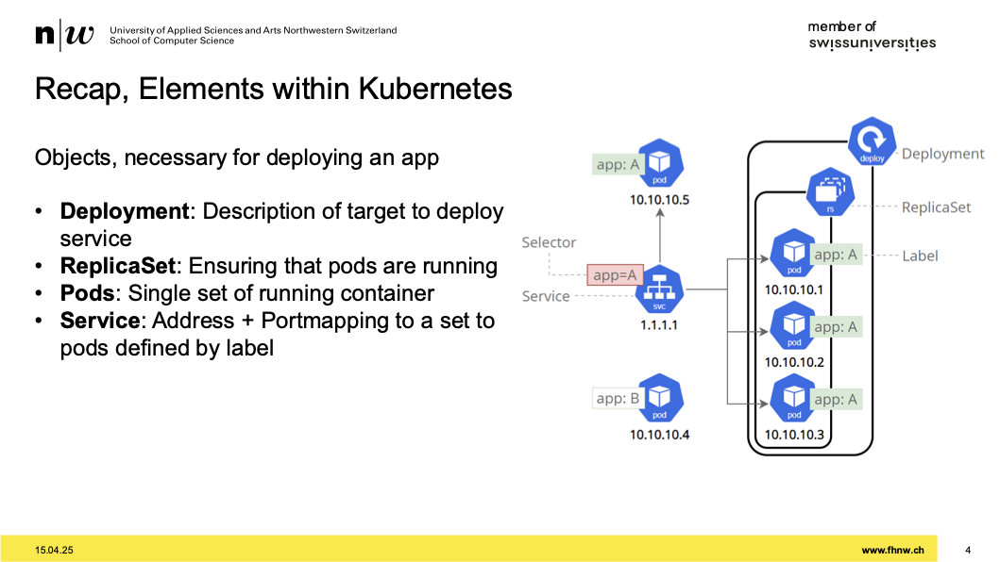
- Deklarativer Ansatz
- beshreibe zielansatz
- ich will pod haben, mit label a
- Man erstellt ein Deployment -> Ressources
- Deployment erstellt ein Replicaset
- Für Zugriff vorne einen Service
  - ist ein DNS eintrag
  - mappt einen namen auf allen ip adressen die im pod vorhanden sind
  - Service hat immer die richtigen IP adressen hinterlegt

## Service

- 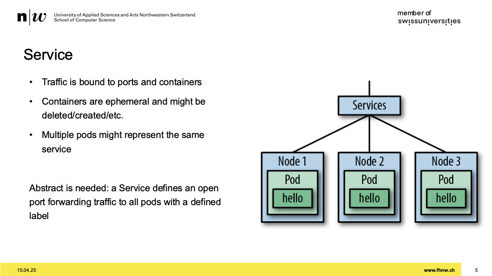
- Service ist ein DNS-Eintrag
- Im DNS auch anderes zeug ausser IP, wie namen
- über DNS load balancing betreiben
- in kubernetes verwendet weil, pods flüchtig sind
- pod hat lebenszyklus von prozess in container
- wenn ein container flüchtig ist, dann muss ein services möglich sein anzusprechen
- nodes sind auch flüchtig
- node -> server auf denen container laufen
- grundidee ist, dass nodes flüchtig sind, damit dieses sich selber abräumen
- upgrades, alten node löschen neuen node erstellen
- evakuieren -> pods in neue node packen
- zero down time ermöglich durch das

## Kubectl, Problems?

- 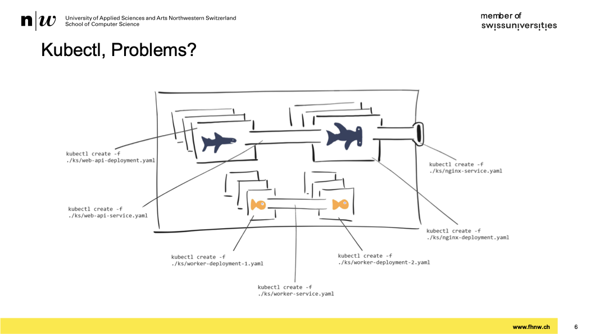
- problem: fest verdrahtet

## Common Antipatterns within Kubernetes Deployment

- config nicht direkt bei source code und images sein
  - bestimmes image wollen wir mit anderen paramter starten
  - yaml-files in einem git repo haben mit eigenem lebenszyklus
  - deshalb build und deploy sepparieren
- generisch halten und kustomisieren mit helm
- nicht davon ausgehen, dass images hochladen wie sie sollten
  - so resilient gestalten, dass ordnung eingehalten werden sollen
- nicht auf latest pullen
- nicht deployen damit pod stirbt
  - sigterm, was nicht gut ist

## Project Intro

- helm ist ein projekt von CNCF
- applikation die auf kubernetes laufen, paketieren
- packet managar für kubernetes

## Helm - Concepts

- 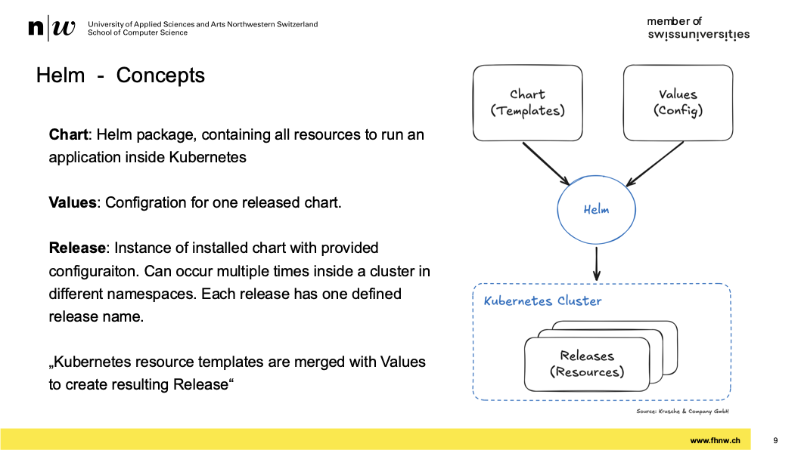
- yaml file mit platzhalter
- diese platzhalter werden gefüllt mit werten
- wenn man templates und config nimmt, kommt ein yaml raus, dass kubernetes verstesteht

## Structure and Usage

- 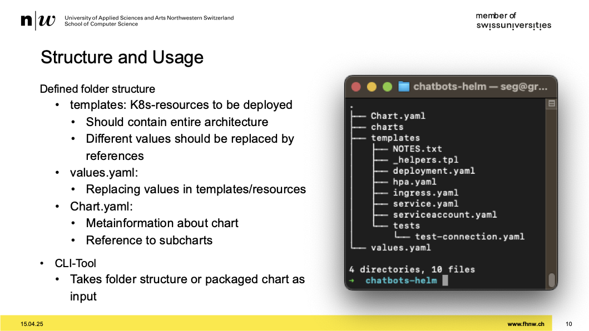
- arbeitet mit ordner konvetion
- templates befindet sich alle mit platzhalter angereicherten yaml files
- ich kann dort deployment ablegen ohne yaml
- ein fertiges yaml nehmen und step by step generisch gestalten mit variables => platzhalter

## Packaging

- [package and distribute](https://artifacthub.io/)
- [runnin on own registry](https://chartmuseum.com/)
- artifacthub -> helmcharts
- demo:
  - install
  - bevor man fremde images installiert, schauen was dahinter steht
  - selead-secrets, ein secrete im source code speichern können
  - selead-secret verwenden wir und monitoring

- hello-world chart
  - template und values yaml arbeiten zusammen
  - values.yaml mit templates engine in kubernetes deployt
- helm ist eine CLI, fixe ordnerstruktur

## Stages in the Real World

## Environment configurations separate from application

- 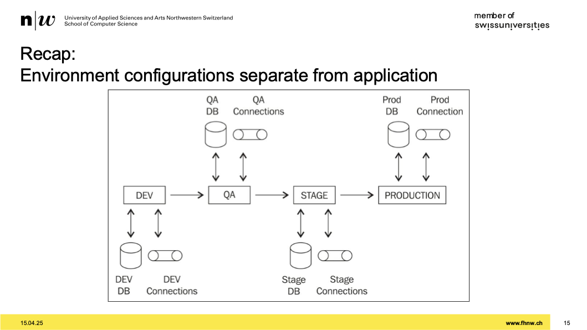
- grundidee ist dass man app durchgehend testen kann
- eine umgebung, zb kubenetes namespace wo ich app isntallieren kann
- verschiedene umgebungen: dev, qa, stage, production
- gleiches image für jede stage
  - durch configs
  - da kommt helm in frage
  - stage abhängige config mit helm steuern

## How could Helm help with Staging?

- 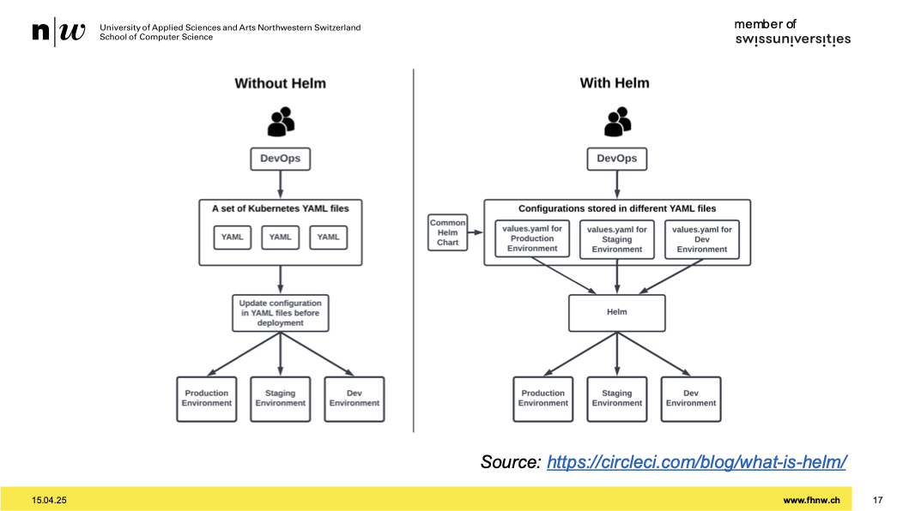
- deployment file ist immer das selbe
- stage unabhängige configs drin
- z.b: in prod mit gettaged images, in dev mit latest
- alles was stageabhängig ist, in values.yaml

## Staging and Namespaces

- 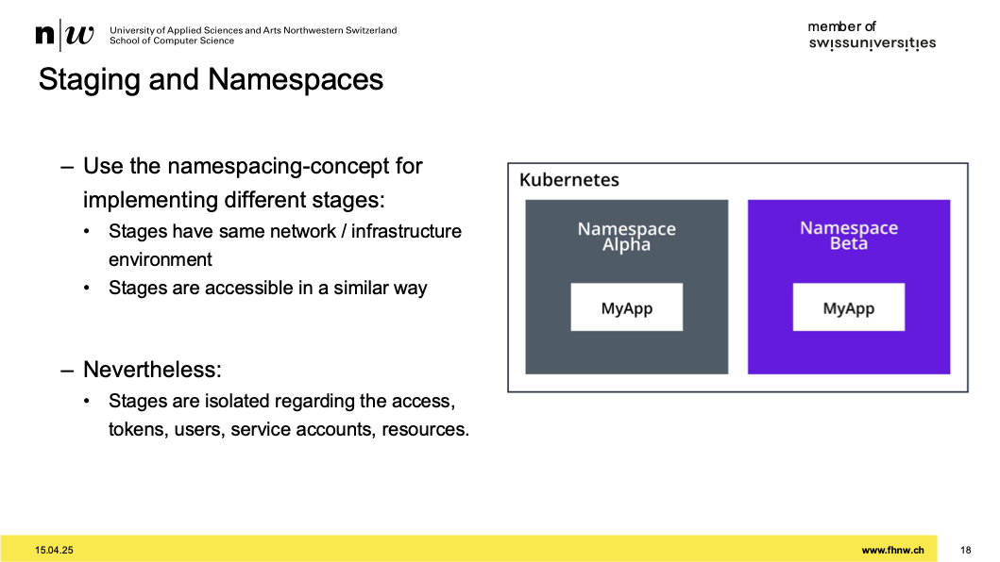
- stages implementieren durch extra namespace
- namespace beinhalet configs, stages, services
- wenn kein namespace angelegt wird, geht es ins default namespace
- namespace prod => stage prod
- in unserem kubernetes umfeld, keine strenge isolation deshalb eigenen cluster

## Workloads are independent from infrastructure

- 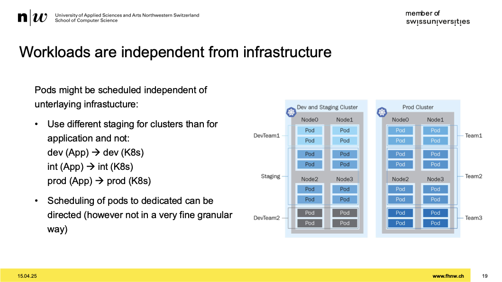
- nicht dev auf dev oder prod auf prod
- verschränken
- nicht tun weil:
  - plattform ist nicht die selbe
- dev auf dev installieren weiss man nicht ob ich devApp teste oder devPlattform
- verschiedene plattform verschränkt testen
- dev nicht auf dev testen
- dev auf prod testen
- was man ausrollen will, immer auf produktive plattform testen

## Dev/Prod Parity

- 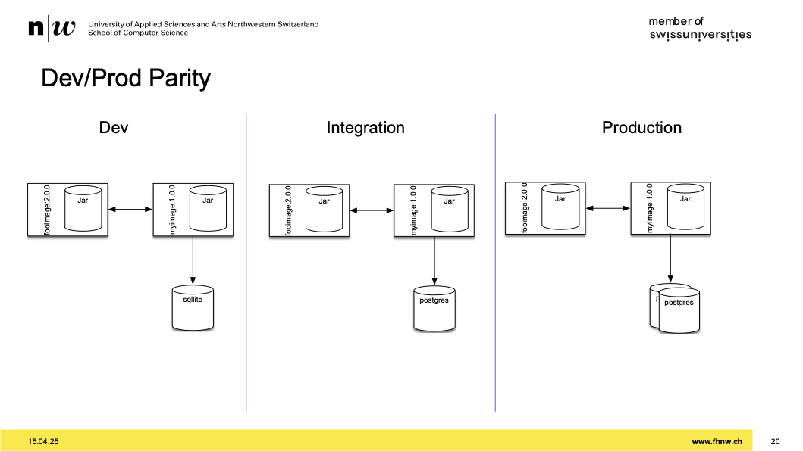
- bei dev geht man auf sqllight
- bei prod hat man vielleicht mehrere postgres db's
- wenn man auf dev oder integration rendundant arbeitet, kommt es teuer
- schnittstelle von integration selbe wie auf production

## Staging

- weitere meta information
- man erkennt von meta info was für workload ich habe
- metadata: annotations anschauen
  - sämtliche meta daten hinterlegt
  - version von gitrepo, link zu getrepo => wichtige meta info

## Labels are important

- zweite möglichkeit für meta info => labels
- bestimme ressourcen gruppieren
- labels sollen identifizieren
- label könnte sein abnahme, gitrepo
- annotations sind möchte ich monitoring haben
- es gibt recommandations:
  - was für annotations anlegen
- manche labels können nicht verändert werden
- wissen welche labels an deployment hängen, welche an prod-template
- die, die an pod hängen, sind immutable

## Labels within Prometheus on K8s

- 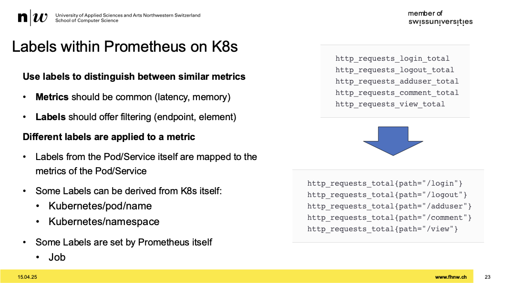
- labeling schema ist absolut essenziell
- vor labeling hat man statisch...
- label wichtig für monitoring
- wenn ich http req monitore, kann man anhand von labels filtern
- stages, verantwortung, sla/slo verfügbarkeit, verrechnugsnummer kann man als label verwenden

## Nächste Aufgabe

- ass8
- connecting worlds bauen
- das teil muss bauen und image generieren
- repo erstellen names k8s-resources
- kuberentes resourcen erstellen
- deployment über command line erstellen
- wir müssen an deployment configs kommen
- mit einem kleinen anfangen, werden schnell gross
- kubernetes-plugin für quarkus
- ziel: connectingworlds deployen, chatbots deployen
- bei 2er gruppe, 3 deployments
- müssen wir machen: 2 config-maps, 3 services
- das packt man in gitrepo mit readme
- secret für registry
  - token kreieren, auf gruppen ebene, danach settings, accesstoken, add new token, rolle: minimum developer, read_registry, username ist token name
  - diesen token nehmen wir und speichern in yaml file aber in gitignore
  - registry.yml, secret ablegen, es gibt einen oneliner
  - diese yml-file lokal behalten, nicht PUSHEN!!
- ziel muss sein, dass connecting worlds in kubernetes cluster laufen lassen
- wichtig: kubernetes ressourcen müssen wir auf k8s-resource namespace ablegen
- argo ist gitops
