+++
title = "Week 09"
date = 2025-11-10
[taxonomies]
authors = ["fatlum"]
tags = ["devops"]
+++

- [📘 Aufgaben – DevOps Foundations HS25](https://spd.pages.fhnw.ch/module/devops/templates/reports/devops-foundations/hs25/index.html)
- [☁️ Azure Portal (AKS)](https://portal.azure.com)
- [🦊 GitLab – FHNW DevOps Projekte](https://gitlab.fhnw.ch/spd/module/devops)

---

## Recap Ass8

- CW bauen
- komponenten problemlos wieder verwenden
- secret:
  - kubernetes.docs.configure-pod.secret
  - AT auf gruppen ebene machen
  - rolle: minimum developer
  - scope: read_registry
  - command eingeben von der seite
  - in ein file reinschreiben
  - das file kann man dann deployen auf kubernetes
  - danach: kubectl apply -f secete.yaml -n <namespace>
  - das secret ist dann nur auf diesen namespace gescoped

# Autoscaling and Resources

## Think about applications you programmed: What are symptoms when an application has not enough resources?

- request timeout ist zeichen, wenn app zu wenig ressources hat

## Think about applications you programmed: What are the resource-needs for your application?

- mit last tests herausfinden ob genug ressourcen vorhanden sind
- danach last aufzeichnen, die telemetrie, dann weiss ich wie viel ressources es braucht

## CPU and Memory (and Storage and Netwok and …)

- ressourcen sind hautpsächlich 2 dinge
  - CPU und Memory
- CPU:
  - vom system anders gemanaged von Memory
  - eine begrenzte ressource, bekommt bestimmte zeit auf CPU
  - zu viel CPU heisst, context switch konsumiert zu viel zeit
- Memory:
  - wenn prozess speicher alloziiert, dann bekommt er diese
  - disk ist immer länger als hauptspeicher
  - disk swapping macht man nicht mehr, nicht transparent
  - man sagt system du hast so viel memory, und wenn der prozess diese erreicht, dann ist schluss, prozess wird gekillt
- loadaverage
  - lv > 1 heisst warteschlange ist voll

## Fail Fast

- scheduler nimmt ein pod und weist im ressource zu
- CPU:
  - wenn eine app langsam ist, ist es meistens NICHT die CPU
- Memory:
  - da hackt es meistens, wenn app langsam läuft
  - memory ist teuer
  - die knoten bei azure haben zwei konten, wenn man memory nimmt wird knoten teurer
- in cluster bestimmen wir, was uns microsoft an rechnung stellt
- shift left schiebt die finanzielle verantwortung an dev
- infra ist teuer
- wir können effiziente kostenstruktur haben
- wenn wir es falsch verwenden, die ressourcen, ist es ein bug
- gleichzeitig auch schutz vor bug, wenn ressourcen nicht reichen obwohl es reichen sollte -> bug

## cgroups to the rescue

- cgroup heisst, ich habe prozesse diese kann ich an constraints anhängen
- bei kubernetes, bekommt jeder pod eine cgroup
- cgroup ist eine gruppe von prozessen
- in cgroup kann ich limits setzen
- cgroups tracken das

## CPU and Memory in Kubernetes

- bei momeory sind es bytes, oder MB
- bei cpu sind cpu-cors
- kann in milicores einstellen
- teileweise werden die CPU zum verrechnen verwendet
- restricting heisst nicht prozess killen
- wenn CPU einschränken, wird prozess langsam
- zu wenig RAM wird prozess gekillt

## Resources in Kubernetes

- 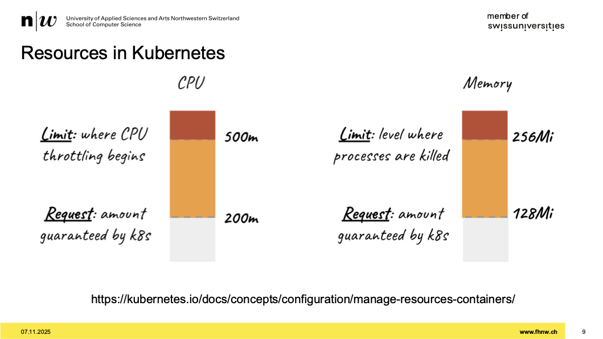
- 4 werte setzen:
  - request und limit CPU
  - request und limit Memory
- das garantiert dann kubernetes
- request werden zum schedulen genutzt
- limits sind oberer schwellwert wo system sich schützt

## What to define?

- 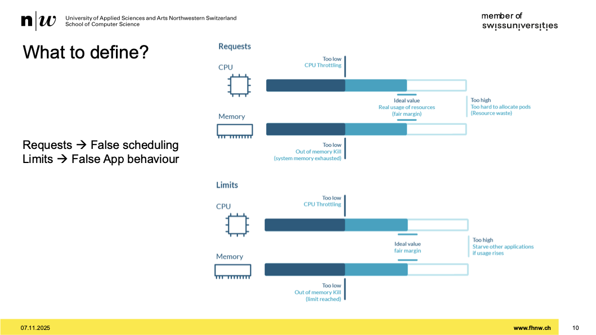
- wenn request falsch gesetzt sind, dann falsches scheduling
- wenn ich request zu niedrig setze, dann CPU throtelling
- wenn RAM zu niedrig, killt er immmer wieder
- bei limits:
  - zu niedrig, bremst er oder killt er bei RAM
  - zu hoch, schade ich andere cluster
  - kubernetes cluster wird immer funktionieren, aber unsere nodes je nachdem nicht

## Do you need limits everywhere?

-

## Different Quality of Services

- 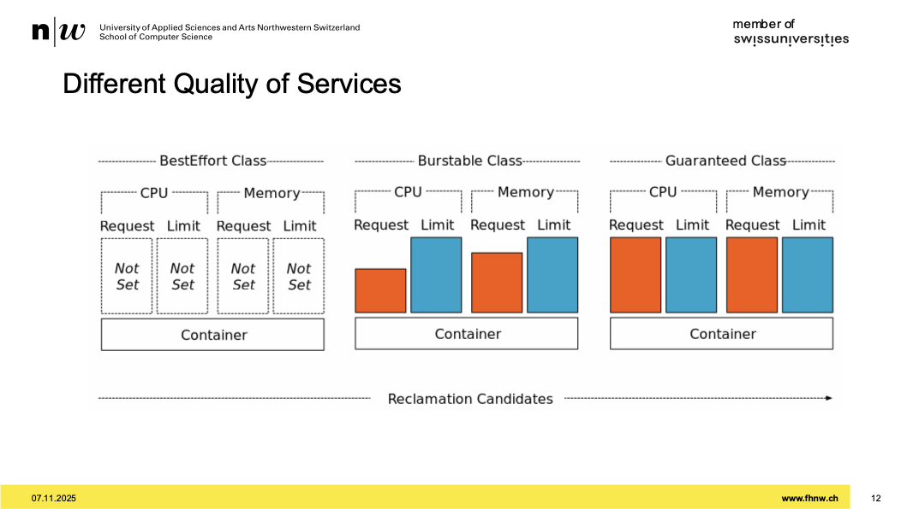
- wenn man das nicht setzt, wird dieser workload am ehesten abgräumt
- request < limit -> burstable klasse
- request = limit -> guaranteed class
- CW sollte man guranteed class geben
- chatbot eher auf linke seite

## How to find our resources? (DEMO)

- kubectl top pod <pod> -n <namespace> -> man sieht was er braucht
- schaune was sie so brauchen
- std-mässig speichert kubernets die metrics nicht
- das ist kein monitoring
- prometheus greift die metrics und speichert die telemetrie auf datenbank
- grafana zeigt dann diese metrics schön an

## Vertical Pod Autoscaler

- diese ressourcen kann man nutzen zum scalieren
- vertikale skalieren und horizontale
- vertical: pods anpassen und ressourcen zuweisen (vorschlag)
- muss man extra installieren

## Horizontal Pod Autoscaler

- passt anzahl pods an
- nicht extra installieren

## Cluster Autoscaler

- damit kann man cluster skalieren
- der deployt 2-3 workernodes

## Autoscaling Summary

- 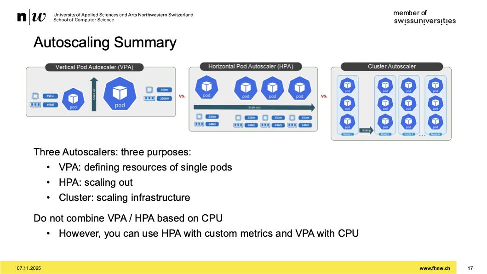
- in den meisten fälle braucht es restart
- VPA und HPA nicht gleichzeitig anpassen
- HPA auf metriken, http endpunkte basieren und damit skalieren

### Helm

- repo names monitoring-logging-tracing mit helmchart
- helm-chart installiert alles was es für monitoring braucht
- helm upgrade --install -> zum diesen monitoring stack installieren
- im values.yml manche sachen ausknipsen
- ein pod ensteht

# Secret Management

## What secrets to you have?

- 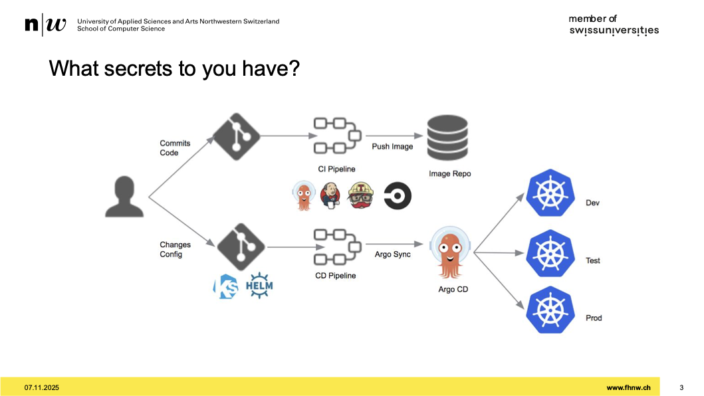
- wenn ich eine komponenten verlasse und in einer andere etwas mache, brauche ich ein secret
- 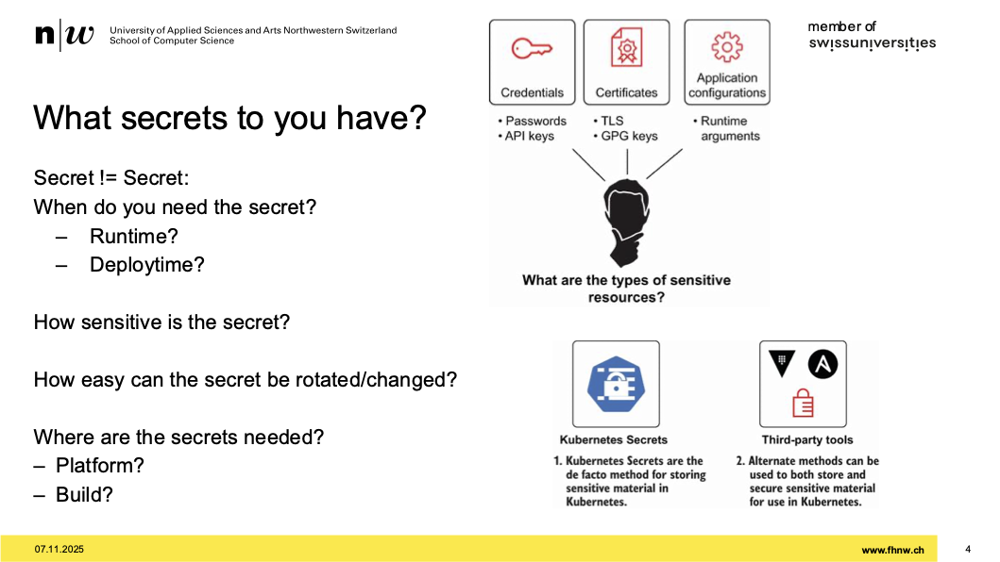
- immer reflektieren, wie sensitiv ein secret ist?
- wie einfach kann es rotiert werden?
- wo füge ich secrets hinzu?

## Secrets in K8s?

- 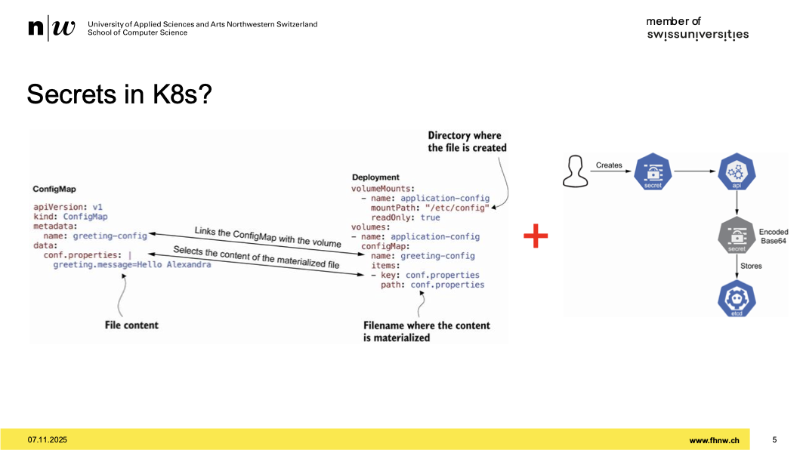
- im etcd liegt das secret drin am ende des tages
- ins git kann man nicht rein machen

## Handling Confidentiality externally

- 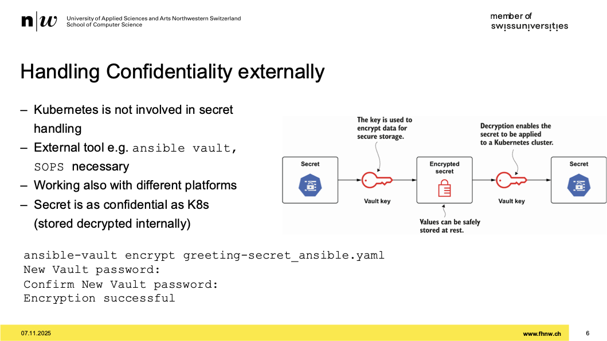
- exterenes tool verwenden
- synchron verschlüsseln auf der plattform
- im etcd ist es dann plain

## Handling Confidentiality externally with packaging

- 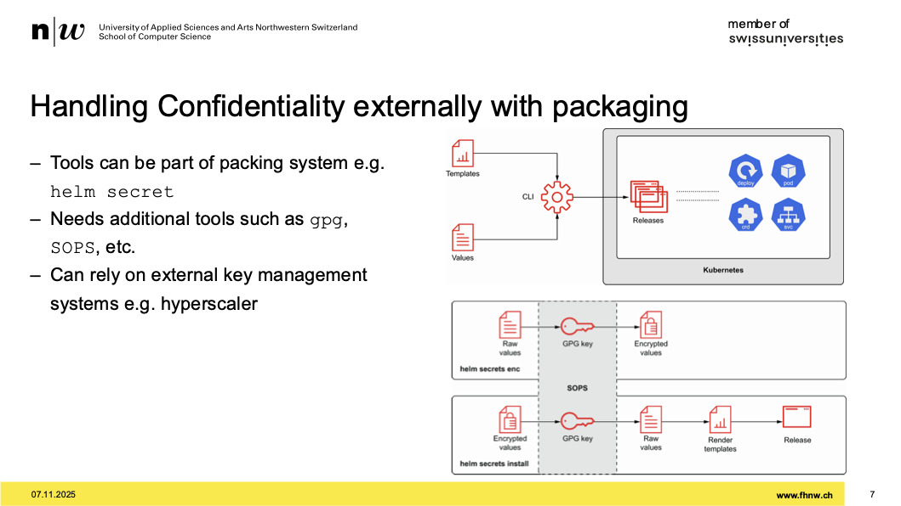
- framework an externe applicance hängen
- diese systeme sind single point of failure
- wenn die weg brechen, geht nichts mehr
- zeilenweise verschlüsselung gut weil:
  - man hat eine diff awarness
  - man sieht genau welcher teil modifiziert worden ist

## Handling Confidentiality internally

- 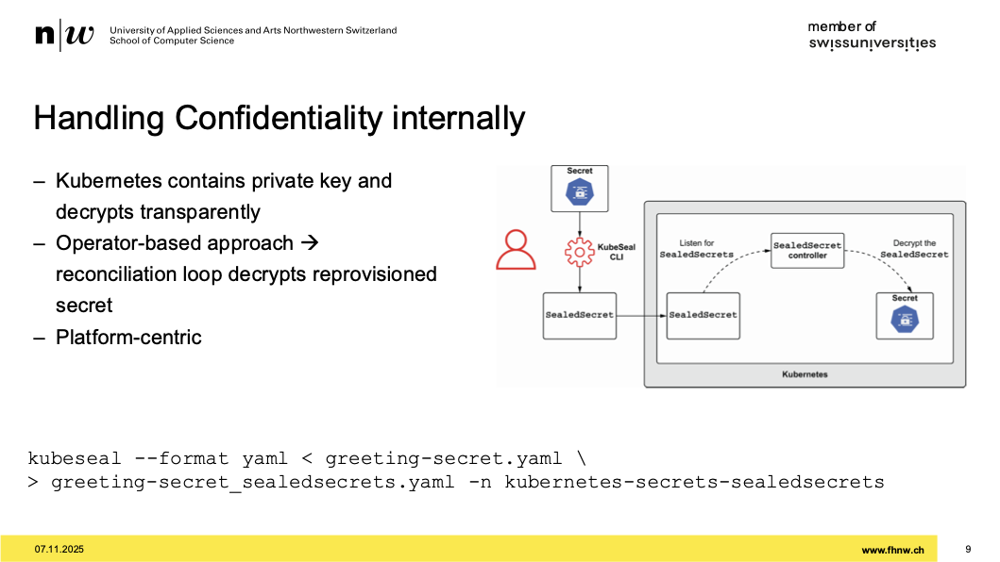
- pull secret sollte man verschlüsselt ablegen
- sealed-secrets sind das
- ein controller, der nimmt ein objekt
- der cluster hat einen private key
- der public key kann man sich rausholen
- auf lokal emacshine, ein secret
- verschlüssle es mit pub key -> danach wird sealed secret draus
- im cluste erkennt es das sealed secret, ud entschlüsselt es
- kubeseal: spezielle cli zum verschlüsseln

## Handling Confidentiality, Summary

- secrets in git ablegen, für gitops
- daten sind verschlüsselt
- je mehr komponenten umso komplexer

## Secrets in the Platform

- aks plattform nicht trauen
- die sollten nur so viel wisse, wie nötig
- [blog-secrets](https://www.macchaffee.com/blog/2022/k8s-secrets/)

# ArgoCD

- jetzt fehtl noch: ArgoCD
- ein mechanismus der regelmässig helmcharts und sonstiges in einem repo auch anwendet

## Helm, Components

- 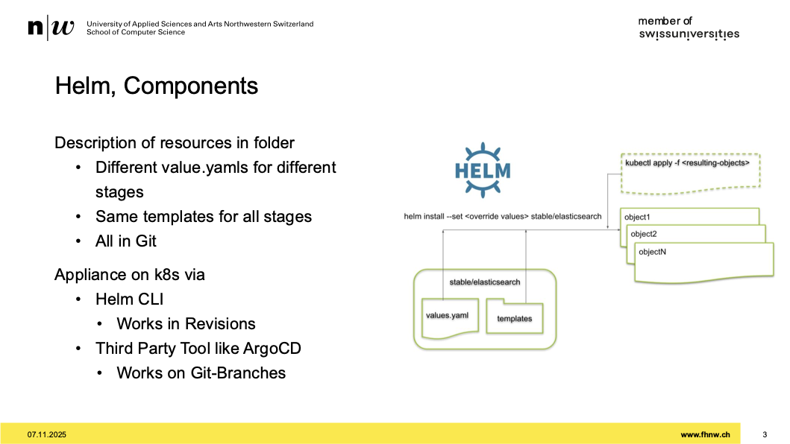
- laptop aus gleichung entfernen
- kubernetes soll mit gitlab reden

## Gitops

- 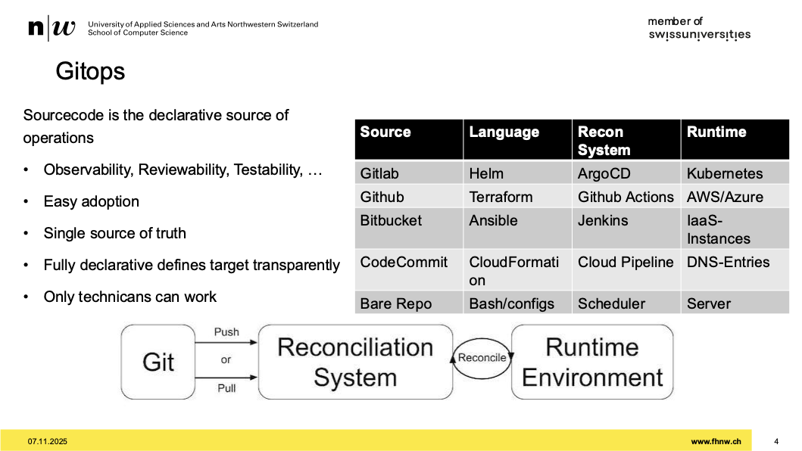
- mache nur git operationen und dann soll alles geschehen
- immer deklarativ
- nur techniker können daran arbeiten

## Argo CD reconciliation

- 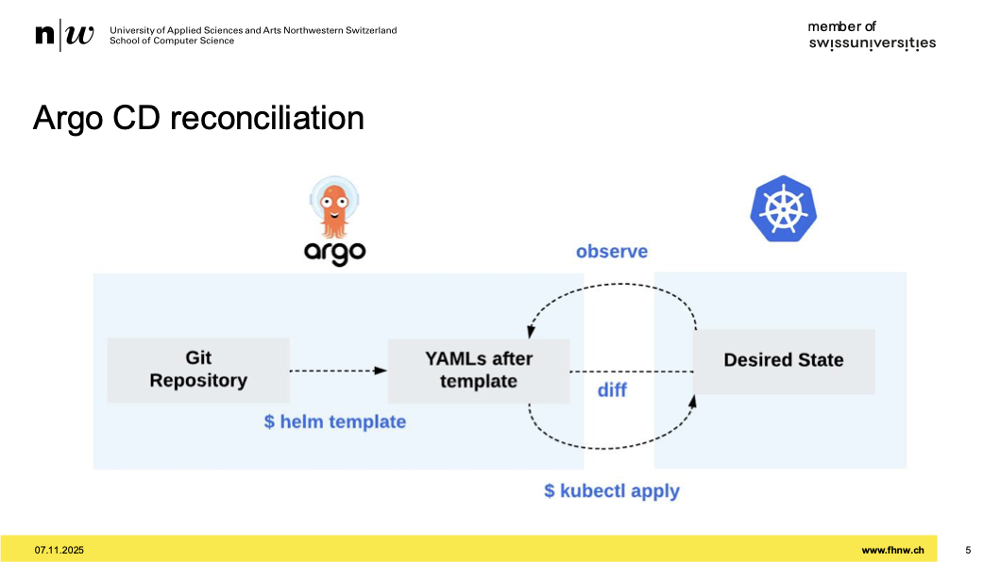

## ArgoCD-

- 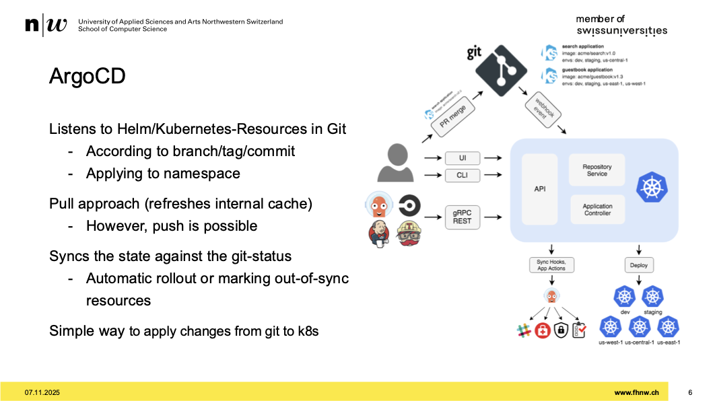
- argocd kann die änderungen nehmen und rollt diese aus

## Full Workflow

- commit code pushen images
- k8 ressource anpassen
- argo nimmt diese änderung und rollt sie aus

## Demo

## nächstes assignement

- monitoring deployen
- monitoring namespace beachten
- part 2:
- helm chart aus ressourcen machen
- manifests von kubernetes eins zu eins rüber kopieren
- helm create und roberta, eliza und CW rüber kopieren
  - helm charts sind gemacht
- helm-resources repo hinterlegen
- part3:
  - verschiedene values.yaml für verschieden stages (devs, prod, etc.) machen
  - jede stage einen zweck haben
  - releasing und stages beachten, abgleichen
  - für jede stage ein file values-produktion.yaml
  - für jede stage ein namespace machen
  - das namespace muss ein label environment
  - sinn der stage definieren
