+++
title = "Week 03"
date = 2025-10-02
[taxonomies]
authors = ["fatlum"]
tags = ["netsi"]
+++

# K2

***Netzwerksegmentierung***
- problem:
  - alle geräte im selben broadcast domain
  - kompromitiertes gerät überall zugriff
  - schwirige kontrolle und überwach
  - kein schwutz zwischen andere bereichen
- lösung:
  - logische trennung netzwerk
  - reduzierung angriffsfläche
  - kontrolle datenverkehrt zwischen segmenten
  - einfachere durchseetzung von sicherheitslinien

***Best Practice: Funktionale Segmentierung***
- mnmgt-vlan: zugriff auf switch und router
- office/clinet-vlan: arbeitsplatz pc und laptops
- server-vlan: interne server (file, print, app)
- DMZ-VLAN: öffentlich erreeichbare server(web, mail)
- gast-vlan: besucher zugang
- VoIP-VLAN: IP-Telefonie
- IoT/OT-VLAN: drucker, kameras, gebäudeautomation
- VLAN gute sicherung für layer 2
  - aber am router den übergang von vlans mit ACL regeln (layer 3)

***Referenzarchitektur: Klassisches Netzwerk***
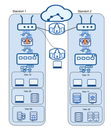

***Design-Prinzipien***
- grundprinzip:
  - least privilege: nur notwendiger zugriff
  - defense in depth: mehrere schutzschichten
  - zero trust: vertraue niemand, verfiziere alles 
- praktische umseetzung:
  - ACL zwischen VLAN sosnt am layer 3 übergang offen
  - Firewall-Regeln pro Segment
  - monitoring des Inter-Vlan-verkehr
  - regelmässige review der segmentierung

***Typische VLAN-IDs und Konventionen***
Namenskonventionen und Nummerierung:
- ▶ VLAN 1: Native/Default VLAN (nicht nutzen!) 
- ▶ VLAN 10-19: Management und Infrastruktur 
- ▶ VLAN 20-49: Office/Client-Netze 
- ▶ VLAN 50-79: Server und Dienste 
- ▶ VLAN 80-89: DMZ und öffentliche Dienste 
- ▶ VLAN 90-99: Gast und temporäre Netze 
- ▶ VLAN 100+: Standortspezifische Segmente 
- Wichtig: Konsistente Dokumentation und Naming! 

***Bedrohungsszenario: Kompromittiertes Gerät im Unternehmensnetz***
- ausgangslage:
  - laptop eines mitarboet wurde gehackt
  - malware über phishing ins netzwerk
  - angreifer hat zugriff auf internes netz
  - permiter-sicherheit wird umgangen
- gefahren:
  - lateral movement: auf andere computer rüber zu gehen
  - deten stehlen
  - privilege eskalation
  - persistenz
  - ransomeware-ausbreitung

***Angriffsszenario: Interner Angreifer***
- 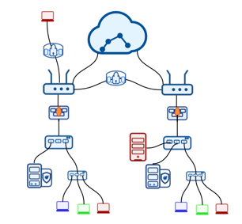
- grüne PC kommuniziert mit serrver lan
  - zuerst interssiert sich angreifer nur an netzwerk kommunikation
- nachfolgend schauene wir schutz auf netzwerk ebene

***Übersicht über Sicherheit für Endgeräte***
- ▶ Viele Angriffe auf die Netzwerkinfrastruktur kommen von innen
- ▶ Die Sicherung des internen Netzes ist ebenso wichtig wie die Sicherung gegen das öffentliche Internet
- ▶ Infizierte interne Computer können Ausgangspunkte für Angriffe werden
- ▶ Nachlässige Mitarbeitende sind vielleicht die größte Bedrohung

***Traditionell vs. Neu***
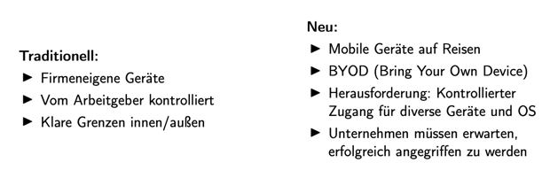

***Fragen nach erfolgreichem Angriff***
- woher kam angriff?
- war war einstiegspunkt?
- welche systeme sind betroffen?
- kann die bedrohung beseitigt werden?
- was muss ausgrräumt werden?
- wie können weitere angriffe bekämpft werdne?
- logs sollte man 6 monate und ein par tage aufbewahren

***Wichtige Abwehransätze***
- grundlegende:
  - antivirensoftware auf endgeräte
  - EDR-systeme (endpoint detection and response)
  - spam-filterung
  - URL-Filterung
  - Festplattenverschlüsselung
    - mitarbeiter ausserhalb unternehmen, immer gut wenn FP verschlüsselt, wenn geklaut oder verloren
- wichtige lösung:
  - AMP (antimalware protection)
  - ESA (email security appliance)
  - WSA (web security appliances)

***Schutz gegen Malware – Kategorisierung***
- statische analyse(Codesequenzanalyse, Mustererkennung):
  - schauen hashwert von einer datei an und schauene ob dieser hashwert in einer datenbank gepseichert ist
  - a) Host-basiert (Antivirenprodukte, z.B. McAfee, Windows Defender)
  - b. Netzwerk-basiert (DPI-Firewalls mit IPS – Traffic muss entschlüsselt sein)
- dynamische analyse(Softwareverhalten analysieren):
  - a) sandbox-ausführung(z.B. isolierte Umgebungen, Malware-Detonation), versucht es auf viele dateien und app zuzugreifen, versucht es verschlüsselung etc zuzugreifen und so
    - problem: cpu kann abgefragt werden, wenn 2-kerne heisst virtuelle maschine und mache nichts
    - erste 10 minuten einfach nichts machen, firewall bricht ab, weil zu lange und kein user wartet und man hat nichts herausgefunden
  - b) Systemausführung mit Verhaltensklassifikation (z.B. CrowdStrike, SentinelOne,
    EDR-Lösungen)

***nachteil der ansätze***
- ▶ Statische Analyse: Signaturen können mit Malware-Obfuskation immer verändert
werden
- ▶ Dynamische Analyse: Verteidiger ist immer einen Schritt hinter dem Angreifer;
kein Schutz gegen Zero-Day-Exploits

***Threat Intelligence***
was ist threat intelligence:
  - ▶ Wissensbasierte Informationen über bestehende oder aufkommende Bedrohungen
    - ▶ Unterstützt fundierte Entscheidungen zur Reaktion auf Bedrohungen
    - ▶ Basiert auf Datensammlung, Analyse und Kontextualisierung
    - wir bringen ganz viele daten zusammen und versuchen dadurch wo bedrohungen vorhanden sind 
    - verhindert von sprinen von unternhemen zu unternemen
- quellen und typen:
  - ▶ Open Source Intelligence (OSINT): Öffentlich verfügbare Quellen
  - ▶ Commercial Feeds: Bezahlte Threat Intelligence-Dienste (z.B. Talos, AlienVault,
    CrowdStrike)
  - ▶ Community Sharing: ISACs, CERTs, Branchen-Netzwerke
  - ▶ Internal Intelligence: Eigene Logs, Incident-Daten, Honeypots

***Threat Intelligence – Anwendungsbereiche***
Strategische Ebene:
- ▶ Trends und Risikobewertung für Management-Entscheidungen
- ▶ Investitions- und Ressourcenplanung
 Taktische Ebene:
- ▶ TTPs (Tactics, Techniques, Procedures) von Angreifergruppen
- ▶ Anpassung von Erkennungsregeln und Verteidigungsstrategien
 Operative Ebene:
- ▶ IoCs (Indicators of Compromise): IP-Adressen, Domains, Hashes
- ▶ Automatische Integration in Firewalls, IDS/IPS, SIEM
- ▶ Schnelle Reaktion auf aktuelle Kampagnen

***Verteidigung umfasst drei Phasen***
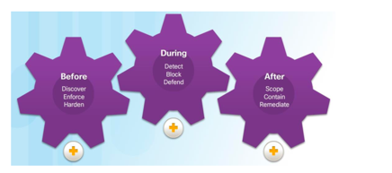
- ▶ Before: Discover, Enforce, Harden
- ▶ During: Detect, Block, Defend
- ▶ After: Scope, Contain, Remediate

***IMVS Ansatz***
Policy Enforcement mit Whitelisting distinkter Applikationen
- ▶ Regeln durchsetzen, was Applikationen dürfen oder nicht dürfen
- ▶ Rechte für einzelne Applikationen für potentiell gefährliche Aktionen vergeben
- ▶ Ziel: Nicht Malware-Erkennung (statisch), sondern Verhaltensregel-Durchsetzung
(dynamisch)

***Sicherheit für E-Mail und Web***
Haupteinfalltore für Malware:
- ▶ E-Mail-Verkehr
- ▶ Web-Verkehr
Gatekeeper:
- ▶ ESA: Email Security Appliance (früher IronPort)
- ▶ WSA: Web Security Appliance (inkl. AMP und Application Visibility & Control)
- ▶ CWS: Cloud Web Security (z.B. Talos)

***WSA Sequenz***
- inspektion direkt auf FW oder eine weitere instanz wo getestet wird
- kann auf meta daten machen oder einzelne packages
- metadaten bsp: paketheader, ip-adressen von http requests
- cloud flare bietet ddm schutz etc.
- meisten anfrage von mitar. pc gehen ins internet
- man sieht keine richtige ip
- für richtigen test, packete aufbrechen und richtig analysieren
  - problem: datenschutz, man sieht was mitarbeiter surft etc. sehr privat
  - müsste sagen, dass man das macht, aber kommt nicht gut an
  - gefährlich, weil Ende-zu-Ende wird unterbrochen
- FW unbedingt richtig konfigurieren und alte algorithmen raus und neue rein -> up-to-date halten
- 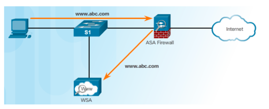

***Web Security***
- ▶ Web Security kann in moderne DPI-Firewalls (Next-Gen Firewalls) integriert werden
- ▶ Erfordert URL-Filtering und Threat-Intelligence-Integration
- ▶ Firewall muss als Web-Proxy fungieren und SSL/TLS entschlüsseln
- ▶ CA-Zertifikat der Firewall muss auf Clients verteilt werden (SSL Inspection)

***CWS Cloud Web Service***
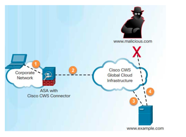
- firewall in cloud verschiebt
- der anbieter wird schauene das FW aktuell ist
- unternehmen das es betreibt, kann interne daten anschauen 

## Schicht-2-Sicherheitsmaßnahmen

***Verletzlichkeiten der Schicht 2***
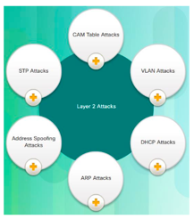
- interne webseiten sind meistens nicht gesichert

***Verteidigung – Überblick***
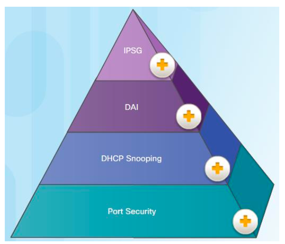
- das sind die verteidigungsmechanismem von so angriffen

***Angriff auf die MAC-Tabelle***
- tabelle die dafür sorgt, das datenpakete nicht an alle ports senden
- switch weiss nicht von anfang, wo welches gerät angeschlossen ist
- wenn ich von PC an switch anfrage sende, das ich mit andere PC reden will, schaut switch ob andere PC in tabelle ist
  - wenn nein, sendet er an alle und trägt dann ein
  - über ARP in der regel
- es kann aber sein, hinter einem port mehrere MAC-adressen
- das heisst, tabelle muss grösser sein als anzahl ports
- switch geht auf hub-mode wenn tabelle voll ist
  - alles geht an alle
  - auch sachen die nicht für mich gedacht sind, also auch zum angreifer 
  - wenn verbindung verschlüsselt kein problem, aber alte geräte kann man abhören 
- angreifer kann über netzwerk lernen weil er sieht welche ports wo sind etc. da auf layer zwei, keine überwachung
- switch führt logs, diese sollte man einsammeln 
- sicherheitsmassnahme: port security

***Port Security – Konfigurationsanforderungen***
- ▶ Port muss im Access-Modus sein
- ▶ Port Security aktivieren
- ▶ Anzahl MAC-Adressen pro Port begrenzen
- ▶ Optional: MAC-Adressen speichern
- ▶ Optional: Verletzungsaktion definieren (protect, restrict, shutdown)
- ▶ Optional: MAC-Adressen-Aging-Verhalten
- moderne OS aktualisieren MAC adresse, also nur eine MAC definieren ist nicht gut
- wenn man aber 5 MAC-adresse pro stunde erlaubt, dann schützt es

***Port Security – Aging-Syntax***
- portbefehl bei cicso
- 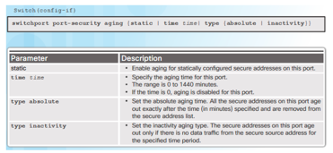
- Parameter:
  - ▶ static: Aging für statisch konfigurierte sichere Adressen aktivieren
  - ▶ time: Aging-Zeit 0–1440 Minuten
  - ▶ type absolute: Alle Adressen altern nach angegebener Zeit
  - ▶ type inactivity: Adressen altern nur, wenn für angegebene Zeit kein Verkehr

***Port Security – Beispiel-Konfiguration***
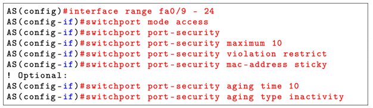

***NAC mit 802.1X***
- ▶ Beste Variante: Network Access Control mit 802.1X
- ▶ Jeder Teilnehmer muss sich gegen RADIUS-Server authentifizieren
- ▶ Nur diese spezifische MAC-Adresse ist erlaubt
- ▶ Benötigt AAA und zentralen Server
- ▶ NAC schließt klassische Port Security aus

***VLAN Hopping Angriff***
- 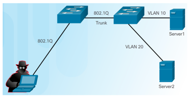
- ▶ Angriffspunkt: Switch-Port im Standard-‘dynamic’-Modus belassen
- ▶ Mechanismus: Angreifer setzt Interface auf IEEE 802.1Q Trunk Mode, DTP
schaltet Link auf Trunk Mode
- ▶ Resultat: Angreifer hat Zugang zu allen VLANs ohne über Router/ACL zu gehen
- PC an switch anhängen, dieser Port ist dann Access-Port
- verbindung von zwei switches, läuft vlan 20 und 10 drauf
- ports die zwei switches verindet, sind Trunk-Ports
- native VLAN: 
  - alle pakete die an switch ankommen, ohne tag(also die nicht im VLAN sind) landen im native VLAN(VLAN 1)
  - leitet pakete weiter ohne tags
  - native vlan nie auf access port
- dort dran hängt man geräte, switches etc. die dumm sind und kein VLAN unterstützen
- bei VLAN gibt es mode dynamic:
  - wenn das eingestellt ist, entschiedet der andere port, was es ist, also ein access oder trunk port
- switch spoofing möglich, indem er behauptet das er ein switch ist, wenn dynmaic eingestellt
- haben dann zugriff zu alle vlans die konfiguriert sind 
- wichtige regel: es darf keine dynamischen ports geben, entweder trunk oder access einstellen

***VLAN Double Tagging Angriff***
- 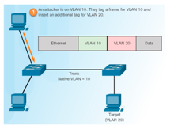
- ▶ Funktioniert unidirektional, wenn Angreifer im selben VLAN wie Native VLAN auf
  Trunk-Ports
- ▶ Angreifer fügt VLAN-Tag 20 ein (trotz Access-Port)
- ▶ Switch fügt bei Ingress VLAN-Tag 10 hinzu
- ▶ Bei Switch-Egress wird VLAN-Tag 10 entfernt (Native VLAN)
- ▶ Zweiter Switch liest VLAN-Tag 20 und leitet entsprechend weiter
- über so etwas kann ich ein paket irgendwo hinschicken obwohl es nicht dran ist
- native vlan sollte nicht an einem access port verfügar sein
- angriff funktioniert nur, wenn ich keine antwort brauche
- tagging wird vorallem für monitoring verwendet
- double tagging ist generell, wenn man über ein paket mit tag 10 von VLAN 10 ein weiteres tag legt, damit es dort gelangt, wo man es haben will

***Verteidigung gegen VLAN-Angriffe***
- Richtlinien:
  - ▶ Endgeräte dürfen nicht auf VLAN-Trunking zugreifen
  - ▶ Automatisches Trunking auf Access-Ports deaktivieren, auf Access-Modus setzen
  - ▶ Trunk Ports: Auto-Trunking deaktivieren, Trunks manuell konfigurieren
  - ▶ Native VLAN auf Trunks darf nur dort existieren, nicht auf Access-Ports

***VLAN-Schutz – Beispiel-Konfiguration***
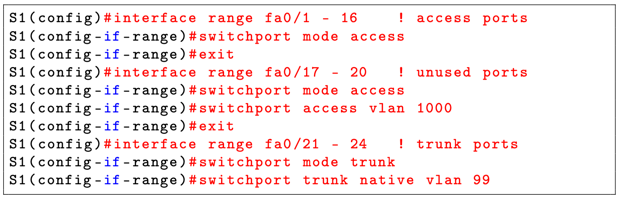
- gefährlich, wenn nicht gebrauchte ports auf dynamic lassen

***PVLAN Edge Feature***
- herstellerspezifische eisntellung
- wichtig für mikrosgmentierung
- auf switch sage ich, protected ports, dürfen miteinander nicht reden
  - sind zwar im gleichen VLAN, können nicht kommunizieren
- braucht nur eine ACL dadurch
- wichtig: können unter umständen trotzdem rede, wenn layer 3 übergang nicht geregelt ist
- PC zwingen über layer 3, layer 3 wird monitort und so sicherer
- nachteil:
  - layer 3 gerät immer mehr ein singel point of failure wird

***PVLAN Edge – Konfiguration und Beispiel***
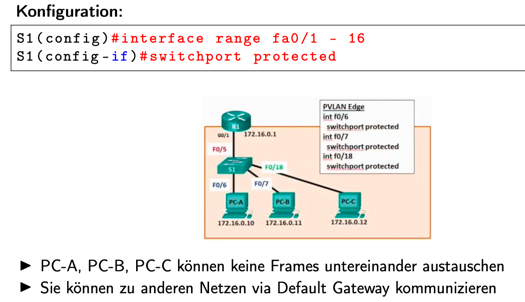

***Korrekter DHCP-Prozess***
- angreifer spielt selber DHCP möglicher angriffsversuch
- default gateway auf sich selber ändern

***DHCP-Angriffe***
- 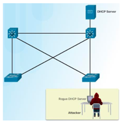
- Verletzlichkeiten:
1. Fremder Computer kann auf DHCP-Anfragen antworten
2. Host kann viele DHCP-Anfragen senden und IP-Adressen erschöpfen
   Verteidigung: DHCP Snooping

***DHCP Snooping***
- 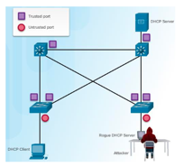
  - ▶ Unterscheidung ‘trusted’ Ports (legitime DHCP-Antworten) und ‘untrusted’
  - ▶ Switch hört DHCP-Verkehr auf trusted Ports, baut DHCP Snooping Database auf
  - ▶ Trust muss manuell konfiguriert werden
  - ▶ Nur Antworten von trusted Ports erlaubt
  - ▶ Switch speichert für jede Zuteilung: MAC-Adresse, IP-Adresse, Lease-Zeit, VLAN#,
  Switch-Port
- lösung:
  - ich konfigurier, was trusted und untrusted ist
  - trusted -> offer ok
  - untrusted -> offer wird abgelehnt, nur getter durch

***DHCP Snooping – Konfigurationsschritte***
- relay agent könnte gefährlich sein
- wenn man trusted port hat und für jedese vlan konfiguriert, dann schonmal sicher, dass dhcp-snooping nicht möglich ist
- dhcp-anfragen auf untrusted port limitieren 

***DHCP Snooping – Beispiel-Konfiguration***
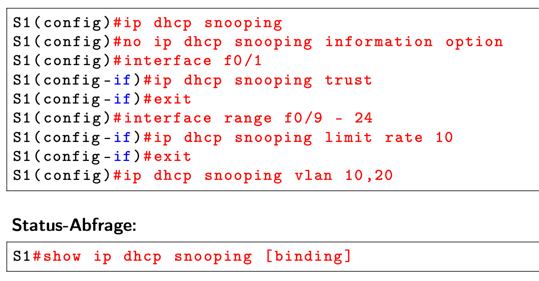

***ARP-Angriff – Verletzlichkeit***
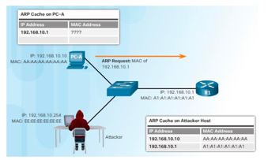
- ▶ Verletzlichkeit: ARP RFC erlaubt spontane ARP-Antworten (“gratuitous ARP”)
- ▶ Andere Computer speichern MAC/IP-Adresse-Paar in ihrer ARP-Tabelle
- ▶ Angriffsmechanismus: Angreifer sendet gratuitous ARP-Frames mit gefälschten
MAC-Adressen
- ▶ Verteidigung: Dynamic ARP Inspection (DAI)

***ARP Man-in-the-Middle Angriff***
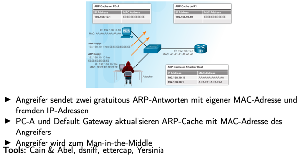

***Dynamic ARP Inspection (DAI)***
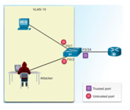
- ▶ DAI baut auf DHCP Snooping auf
- ▶ Validiert ARP-Antworten/Gratuitous ARP gegen [IP, MAC, VLAN, Port]-Tabelle aus
DHCP Snooping
- ▶ DAI benötigt DHCP Snooping
- ▶ Switch überwacht ARP-Requests/-Responses
- ▶ Erweitert DHCP DB mit Infos über Hosts mit statischen IP-Adressen
- ▶ Unterscheidung ‘trusted’ und ‘untrusted’ Ports (Standard)
- ▶ ARP-Antworten/Gratuitous ARP, die DB widersprechen, werden verworfen

***DAI – Beispiel-Konfiguration***
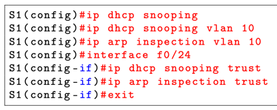
- einfache config, die wir aber machen müssen
- netzwerk viel sicherere mit diesr einstellung

***Bekämpfung von Adressfälschungen***
- ▶ Angreifer kann MAC-Adresse ändern, um anderen Host an Switch-Port zu imitieren
- ▶ Angreifer kann IP-Adresse ändern, um anderen Host zu imitieren
- ▶ Cisco bietet IP Source Guard Feature zur Validierung von Adressen
- ▶ In der Praxis ist die Aufrechterhaltung der Konsistenz über die Zeit schwierig
- ▶ Wird in diesem Kurs nicht verwendet

***STP-Angriff – Verletzlichkeit und Mechanismus***
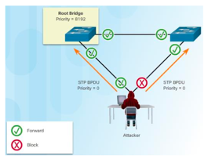
- STP = Spanning Tree
- dafür da um schleifen im netzwerk zu verhindern
- ▶ BPDUs können gefälscht werden
- ▶ Angreifer generiert BPDUs mit niedriger Bridge-ID auf Computer
- ▶ Computer des Angreifers erscheint als Root Bridge
- ▶ Angreifer kann Man-in-the-Middle spielen

***STP-Angriff – Resultat***
- ▶ Angreifer wird zur Root Bridge
- ▶ Forwarding-/Blocking-Ports werden neu angeordnet
- ▶ Gesamter Verkehr fließt über Angreifer
- niedrigste prio wird der root bridge
- wenn aber angreifer einstellt, dass er die tiefste prio hat, dann ist er die root bridge
  - alles fliest über ihn, bzw. fast alles

***Verteidigung gegen STP-Angriffe***
- PortFast:
  - ▶ Auf Access-Ports konfigurieren
  - ▶ Port geht sofort in Forwarding State über ohne STP zu durchlaufen
  - ▶ Port hört weiterhin auf eingehende BPDUs
- BPDU Guard:
  - ▶ Sollte auf Access-Ports aktiviert werden, wo PortFast aktiviert ist
  - ▶ Wenn BPDUs empfangen werden, wird Port heruntergefahren
-Root Guard:
  - ▶ Stellt sicher, dass Switch, der nicht Root werden soll, nicht  Root werden kann
  - ▶ Begrenzt Switch-Ports, wo Root ausgehandelt werden kann
  - ▶ Sollte auf allen Ports aktiviert werden, die nicht Root Port werden sollen
- der core-switch ist meist der root bridge
- den andere switchen sagt man, dass sie kein switch sind 

***Root Guard – Beispiel***
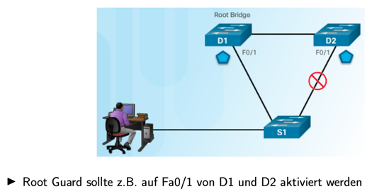

***STP-Schutz – Konfiguration***
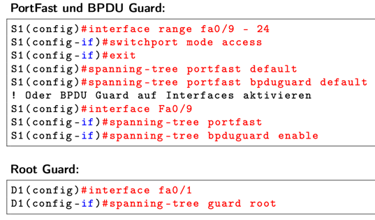

***Zusammenfassung***
- ▶ Bedrohungen von innen sind ebenso gefährlich wie von außen
- ▶ Endgerätesicherheit umfasst Malware-Schutz, E-Mail- und Web-Sicherheit
- ▶ Layer-2-Sicherheit bildet die Grundlage für ein resilientes Netzwerk
- ▶ Port Security, DHCP Snooping, DAI und STP-Schutz sind essenzielle Maßnahmen
- ▶ Kombination technischer Kontrollen und klarer Prozesse entscheidend
- ▶ Kontinuierliche Verbesserung durch Monitoring, Audits und Training

