+++
title = "Week 05"
date = 2025-10-16
[taxonomies]
authors = ["fatlum"]
tags = ["netsi"]
+++

# K3: Firewalls, Policy Enforcement & IPsec VPNs

## Firewall Fundamentals

### Evolution des Firewallings

- ACL sind niedrigst liegende art für firewall, paketfilter
  - fokus auf L3, L4 header
- stateful inspection
- application gt, proxy: verständnis von protokollzuständen und request validierung
- next gen FW: kombi aus routing, vpn, dpi (Deep Packet Inspection), bneutzer-id und threat feeds
- Wachstum getrieben durch verschlüsselten Verkehr, Zero Trust und Cloud-Workloads
- packet inspection beliebte technologie für politik

### Aufgaben und Grenzen einer Firewall

- verbindung filtern wollen wir
- bei übergang von l2 und l3 pakete wollen wir filtenr
- bei banken oft so, gibt es eine doku pflicht
- Zentrale Durchsetzung von Unternehmensrichtlinien und gesetzlicher Vorgaben (Audit-Trail, Nachvollziehbarkeit)
- FW können single point of failure sein, nachteil
- NAT ist erster schutz
- keiner kann mich direkt adressieren, weil pc in der regel keine pub. ip haben
- NAT ist kein firewalling, kein policy enforcment

### Sicherung von Netzen – Referenzszenarien

- 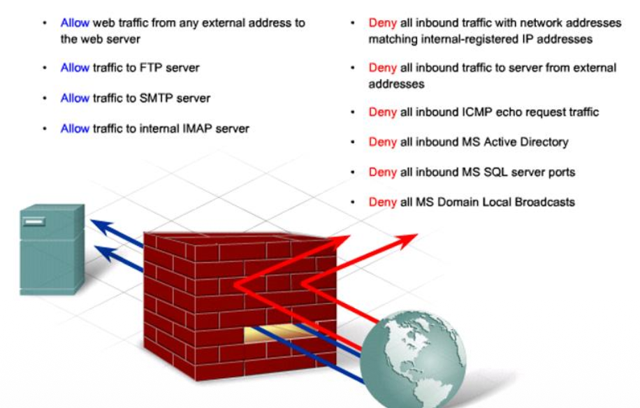
- ICMP verbietet man oft bei firewall

### Decision Stack einer Firewall

- anhängig von routing wird entschieden ob ein paket eine firewall ereeciht oder nicht
- NATing ändern header bevor firewall erreicht woird
- vor und nach NAT muss regel durchgesetzt werden, z.b bei Linux network
- source NAT: vor NAT prüfen, da nach nap die ip nicht mehr stimmt
- policy evaluation ist top down, implizites deny am schluss
- session management, erfolgreiche flows landen in state table
  - rückkanal wird dynamisch überprüft, ob paket zurück gelassen wird
- innerhalb der firewall, state tabelle füllen -> möglicher angriff
- logging

### State Table Grundlagen

- speichert verbindungszustände
- sequenzbereiche, es weiss wie gross etwa die nächsten pakete sind
- rückkanäle dynmisch öffnen
- protokollvalidierung verhindet session hijacking

### Session-Handling: DoS & Dynamische Protokolle

- SYN ist erste paket der TCP verbindung
- angriff: ich mache eine embryonische verbindung
  - chathpt erkläre was embryonische verbindung ist
- dynmaische protokolle FTP, benötigen ALGs zur Portfreigabe
- ressourcen management: max sessions, uonen limits, aging gegen table exhaustion
- wenn server langen timeout hat, versucht er paket zurück zu senden

### Sicherheitswirkung und Grenzen

- wo setzen wir firewall an?
- bei nrzwwerkgränzen
- sehr effizient gegen unerwünschte verbindungen
- wenn FW korrekt konfiguriert ist, dann keine chance über technischen weg
- dann geht man zu social engineering
- wenn man im netzwerk ist, schaut man was für ein dienst drauf ist
  - z.b welche dienste verwendet werden, google, exvel
- dann schreiben sie infos in eien datei, lädt die google drive hoch etc

## Access Lists

### ACL-Typen und Einsatzfelder

- Standard ACL: Filtert nur auf Source-IP, geeignet für einfache Outbound-Filter
oder Route-Maps.
- Extended ACL: Prüft Source, Destination, Protokoll, Ports; Grundlage für
Stateful-Firewall-Policies.
- Named ACL: Erleichtert Wartung, erlaubt das Einfügen neuer Regeln ohne
komplette Neuerstellung.
- Nutzen als Vorfilter (z.B. Management Plane Protection), QoS-Classifikator oder
‘Interesting Traffic’ für VPNs.

### Evaluationslogik und Implikationen

- acl werden top-down ausgewertet, erster match greift
- implizites deny any
- reihenfolge kritischer regeln definieren
- logging spezifisch auf deny regeln

### ACLs in Netzentwürfen

- unglaublich schnell, nur abgleichen mit tabelle
- platzierung an randzonen, reduziert angriffsfläche
- nutzung als vorfilter, vor stateful/layer7 inspektion um last zu senken
- Beispiele für Policy-Tabellen: Quelle-Zone, Ziel-Zone Service, Begründung, Kritikalität, Owner, Ablaufdatum.
- Review-Zyklus: halbjährliche Re-Zertifizierung und automatisierte Reports zu ungenutzten Einträgen

### ACL-Policy – Visualisierung

- 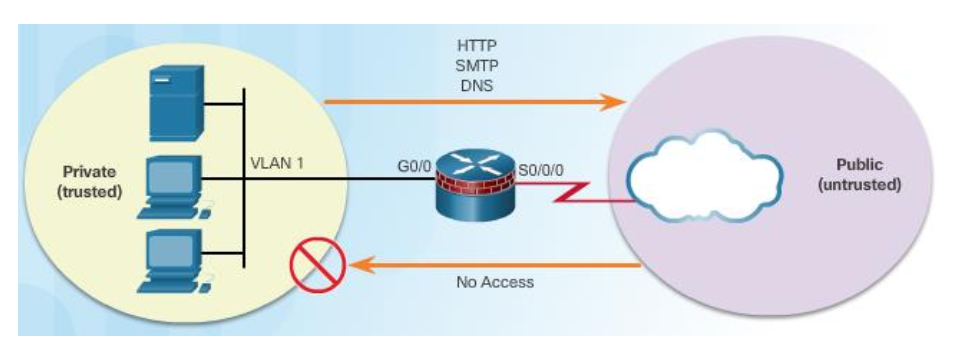

### Herausforderungen im Betrieb

- Kein Zustandsverständnis: Rückkanal muss aktiv erlaubt werden (z.B. TCP-ACK oder dynamische Ports).
- Applikationen mit dynamischen Ports (VoIP, RPC) erzeugen große Regelwerke oder bleiben ungeschützt.
- Fehlende Objektabstraktion führt zu IP-basierten Regeln die bei Umnummerierungen schnell veralten.
- Konsistente Dokumentation (Ticket-ID, Owner, Begründung) fehlt oft und erschwert Audits

### Best Practices zur ACL-Pflege

- Benutzen von Objekt-, Service- und Zeit-Gruppen zur Reduktion redundanter Einträge.
- Staging-Phase: Neue Regeln zunächst in Monitoring-Mod(log) beobachten, bevor sie produktiv gehen.
- Regelmäßige Rezertifizierung: ungenutzte Einträge identifizieren (Hit Count, NetFlow, Firewall-Logs).
- Automatisierte Tests (Packet-Tracer, Simulationen) nach Änderungen durchführen.
- Übergang zu Zonen-basierten Policies planen, sobald Stateful Inspection verfügbar ist

## Zone-Based Policy Firewalls

### Referenz-Zonenmodell

- 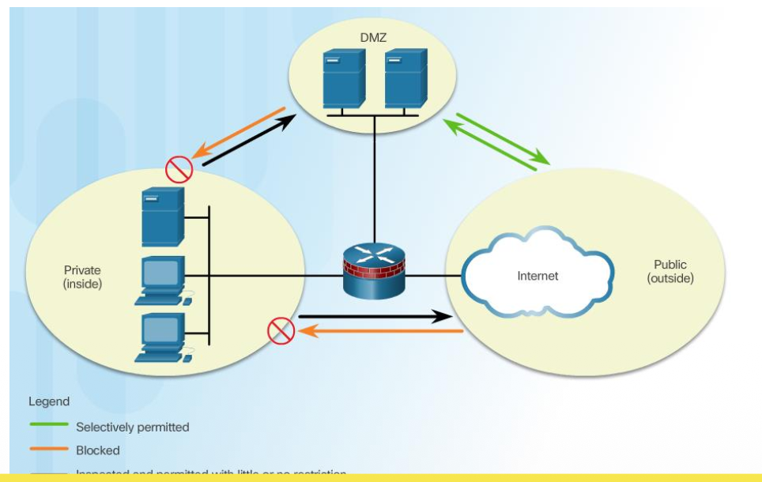

### Grundprinzip der Zonen

- erstellt zonen
- interfaces genau einer zone zugeordnet
- Interfaces werden genau einer Zone zugeordnet; Verkehr innerhalb derselben Zone bleibt uninspektiert.
- Zonenpaare (Quelle → Ziel) definieren gültige Verkehrsrichtungen; nicht definierte Paare werden gedroppt.
- Self-Zone behandelt den Verkehr zur Control Plane (Management, Routing-Protokolle) separat.
- Default-Aktion ist deny; nur explizit erlaubte Flows werden inspiziert und durchgelassen

### Designmethodik für Zonen

- überlegen welche zonen braucht man
- benutzer zonen
- Inventarisierung: Welche Sicherheitsdomänen existieren (Benutzer, DMZ, OT, Partner, Cloud)?
- Datenflussanalyse: Welche Applikationen sprechen zwischen den Zonen? Welche Protokolle/Ports?
- Risikobewertung: Welche Assets brauchen ‘least privilege’, welche Zonen erfordern IDS/IPS?
- Abbildung auf Plattform: Interfaces, Subinterfaces, VLAN-Trunks, virtuelle Systeme.
- Dokumentation in einer Policy-Matrix (Quelle, Ziel. Service, Begründung, Owner, Expiry)

### Policy-Konstruktion

- 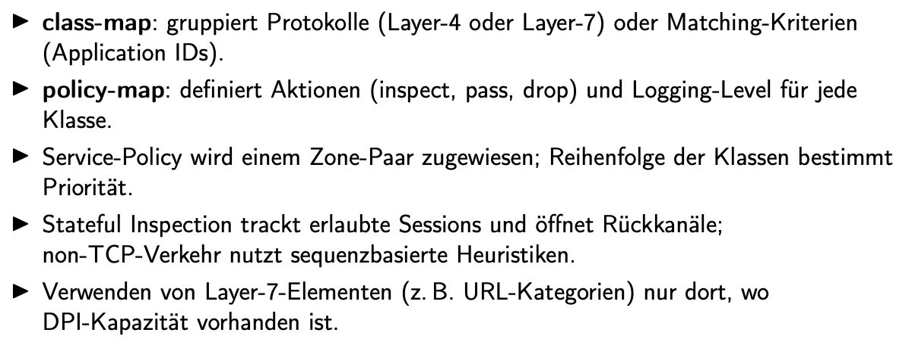
- in cisco definiert man zuerst eine class map

### Zonen-Policy – Visualisierung

- 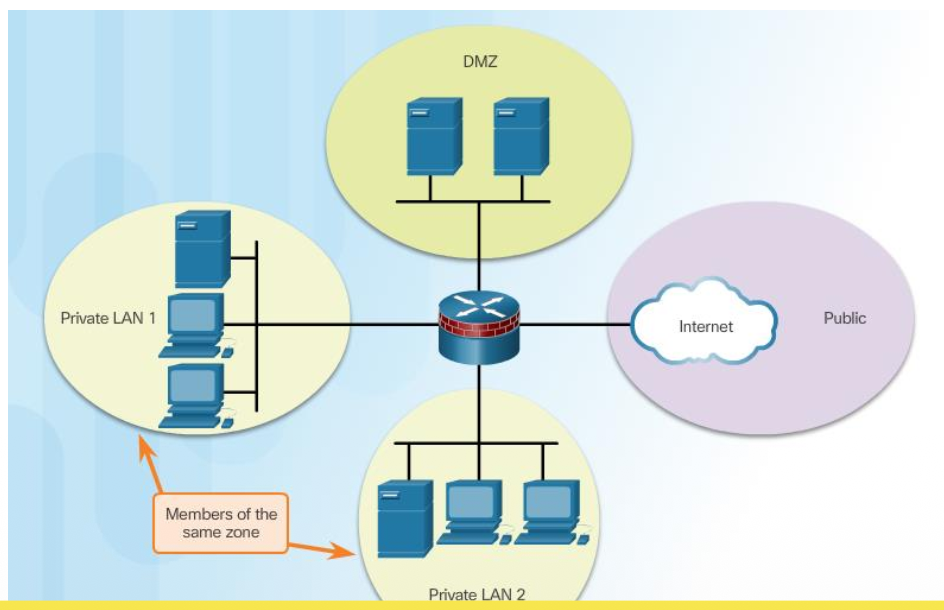

### Integration mit Routing und NAT

- 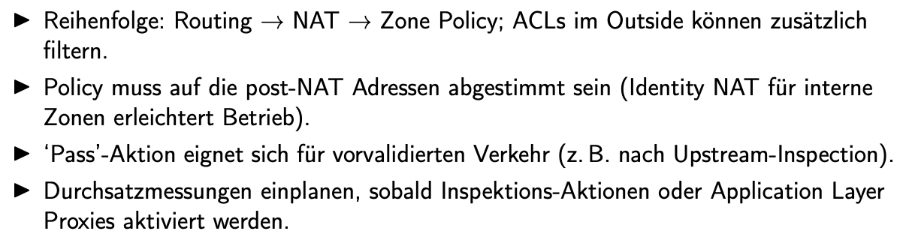
- in outside kann man zusätzliche regeln machen vor zonen etc.

### Monitoring und Pflege

- 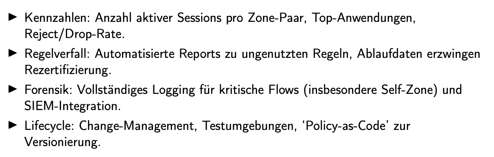
- genügend brandbreite planen damit es keine probleme gibt
- was ist reject and drop rate? -> monitoren
- zwsichen kritischen zonen immer ein logging machen

### Zonen- und Self-Zone-Besonderheiten

- 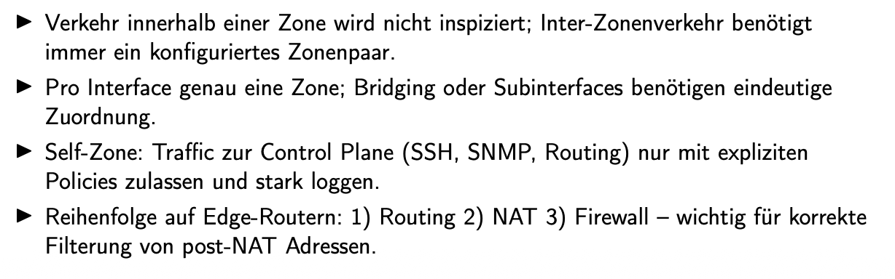
- innerhalb einer zone wird nicht inspeziert
- selfzonen mit expliziten policies und stark loggen

## Deep Packet Inspection

### DPI-Analyse-Pipeline

- 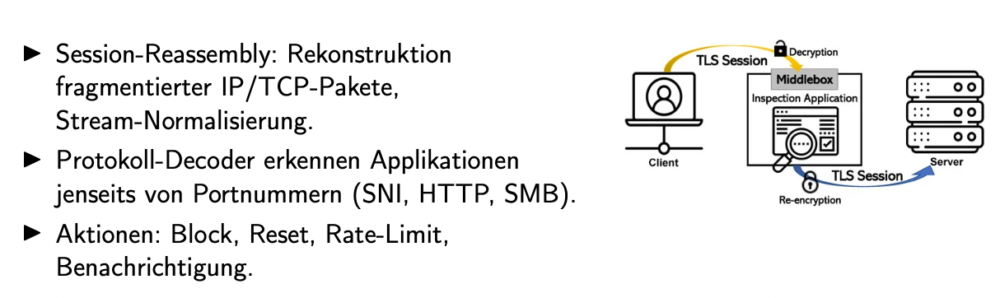
- alles was im header steht, inspezieren
- bei DPI, nicht nur header anschauen, sondern auch paketinhalt
- ich habe eine middle box, dort schaue ich paketinhalt an und leite es dann weiter
- hat seiteneffekt:
  - client sagt, middlebox hat kein zertifiakt
  - anfrage an middle box, ich möchte google
  - middle box macht im namen von client anfrage an google
  - google schickt an middlebox
  - middlebox schaut inhalt an und gibt an client weiter
  - kann feststellen ob tcp verbindung von middle box ist:
    - bei browser auf schlüssel drücken und dann zertifikat anschauen

### TLS-Inspection: Prinzip

- 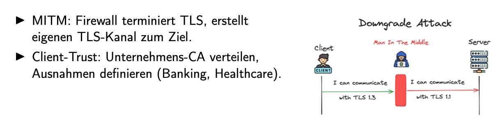

### TLS-Inspection: Betrieb & Datenschutz

- 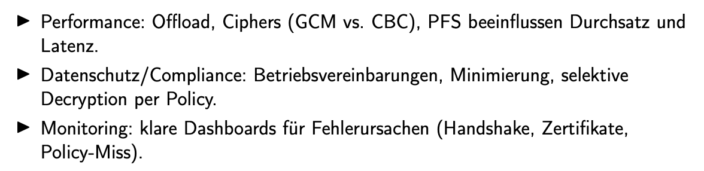
- ssh geht an paketinspection vorbei, also per ssh bringt sie nichts
- DPI bringt mehr risiko auf sich als es vorteile hat
- hat mehr overhead
- man sieht alles, also datenschutz problem
-

### NGFW-Services im Kontext (Next-Generation Firewall Services)

- 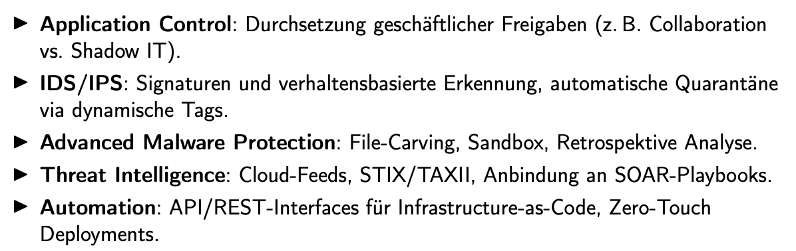

### Grenzen und Betriebsmodelle

- 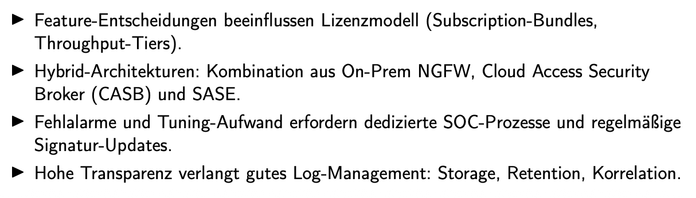
- man zahlt dafür
- packet inspection auf firewalls wird nicht mehr gemacht
- man verlagert auf SASI, applikation auf der firewall

## IPsec VPN Foundations

### VPN-Szenarien und Topologien

- 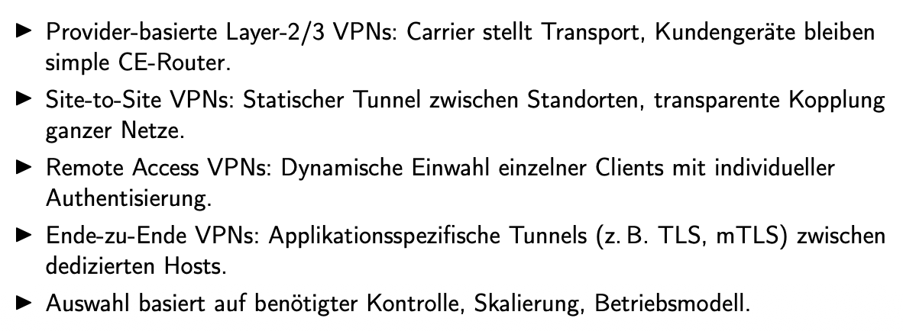
- remote acc vpn ist das normale, zb bei fhnw zuschalten
- site-to-site ist für zwe unternehmen

### VPN-Topologien – Visualisierung

- 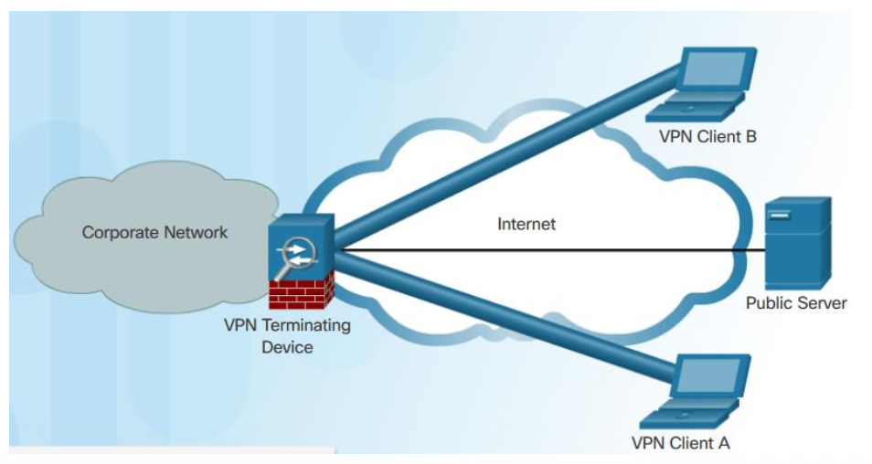
- aller datenverkehrt geht über dieses vpn
- bei terminating device kann DPI stattfindetn
- DPI = deep paket inspection
- bei kritischen unternehmen (phara, armee) ist ein pc ohne VPN unbrauchbar

### IPsec-Bausteine

- 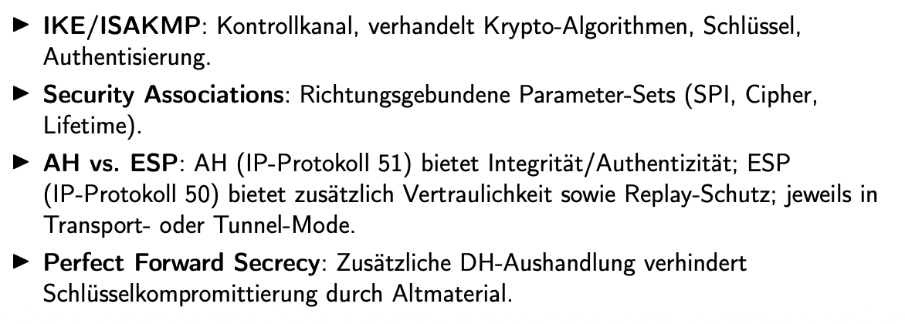
- standard von sec asso
- ah = authentication header, esp = Encapsulating Security Payload

### AH vs. ESP — Bedeutung und Unterschiede

- 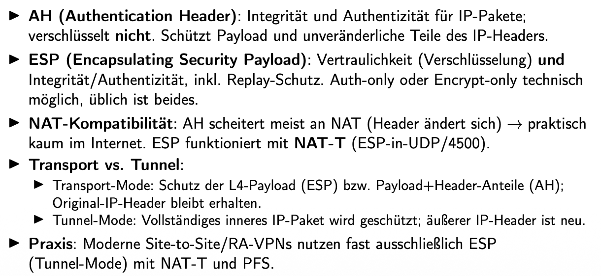
- tunnel-mode, wird komplett neuer head hinzugefügt
  - alles verschlüsselt
- transport mode war zum brandbreite sparen

### IPsec – Betriebsfluss

- 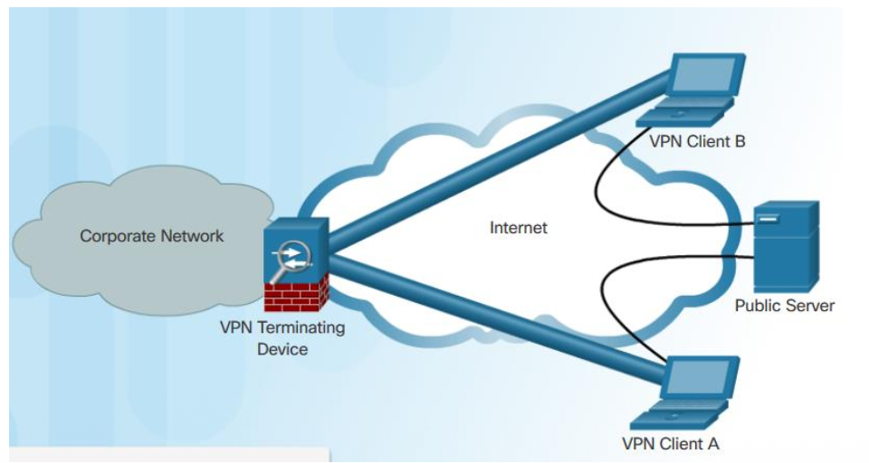

### IKE Phase 1 und im Detail

- 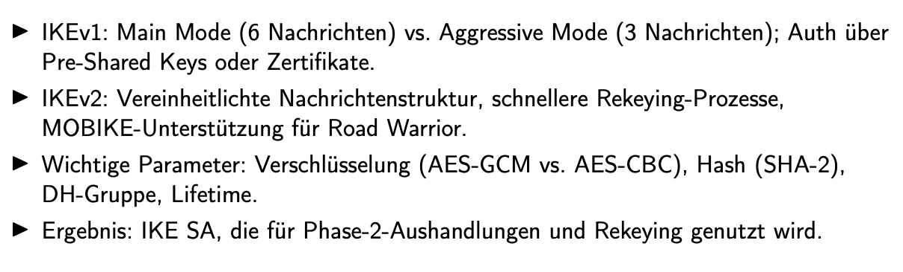
- 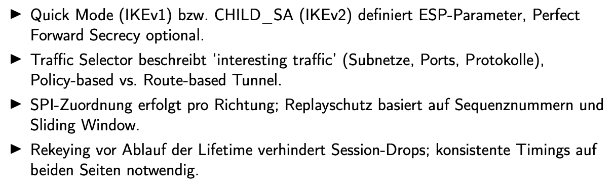

### IPsec Design-Aspekte

- 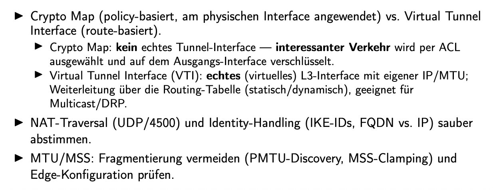

### IPsec Betrieb & Failover

- Überwachung: SLA/Track-Objekte, Dead Peer Detection, Rekeying-Zeitpunkte
- Redundanz: HSRP/VRRP, Active/Standby Peers, SD-WAN-Pfadselektion
- Dokumentation: Schlüssel-/Zertifikatslaufzeiten, Change-Historie, Notfallprozeduren
- mehr wie ein vpn zugang, falls eines failt

### IKE/IPsec Visuals

- 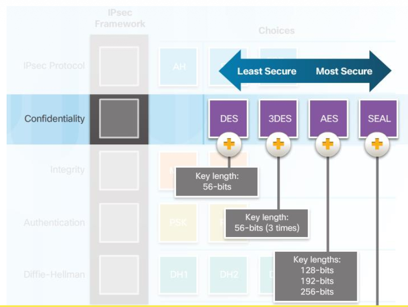

### Troubleshooting und Telemetrie

- Prüfen von IKE- und IPsec-SAs (Status, Lifetimes, Bytes, Fehlerzähler)
- Analyse von Aushandlungs-Logs (IKE Debugs) zur Identifikation von Policy-Mismatch (Proposal, Pre-Shared Key, Identity-ID)
- Erweitertes Ping/Traceroute mit Quell-IP prüft Tunnel-Endpunkte und Routing.
- Korrelation mit Firewall-Logs (Zone-Paare, ACLs) stellt sicher, dass interessanter Verkehr nicht vor Erreichen des Tunnels blockiert wird

## Important Commands

### ACL und Baseline-Firewall

- 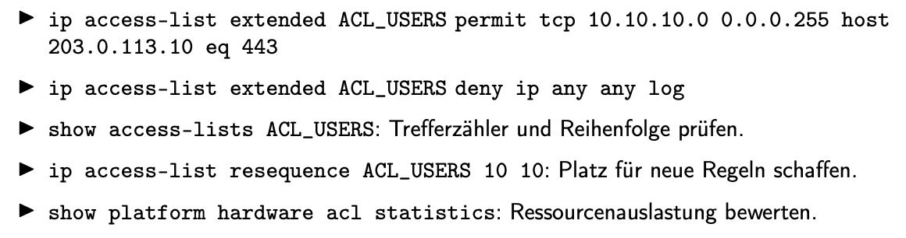

### Zone-Based Firewall

- 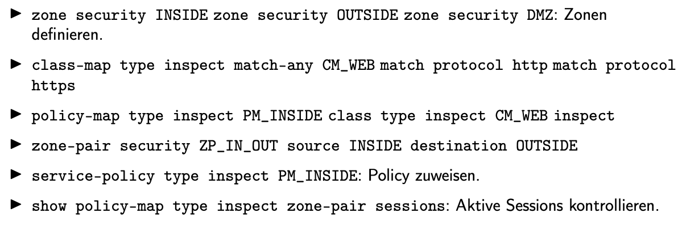

### IPsec Site-to-Site

- 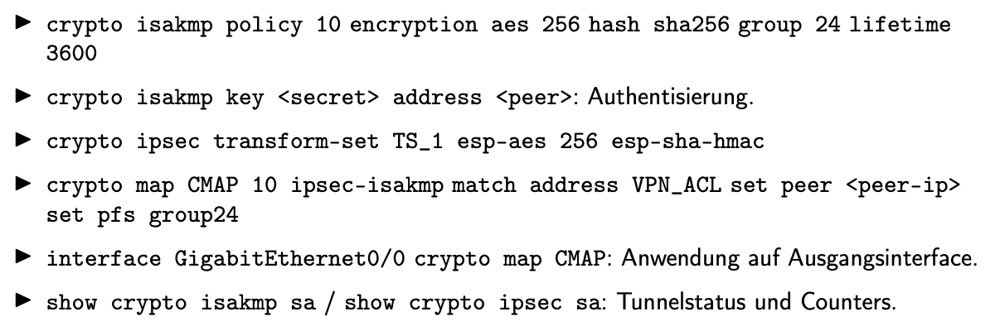
