+++
title = "Week 13"
date = 2025-12-11
[taxonomies]
authors = ["fatlum"]
tags = ["netsi"]
+++

# K6 Public Clouds

## Cloud Computing: Definition & Eigenschaften

- 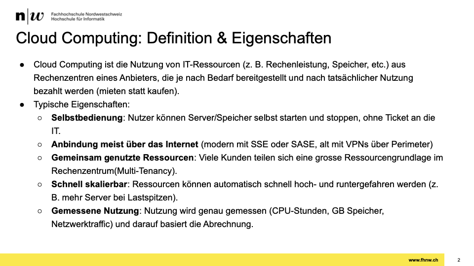

## Virtualisierung: Grundlagen

- 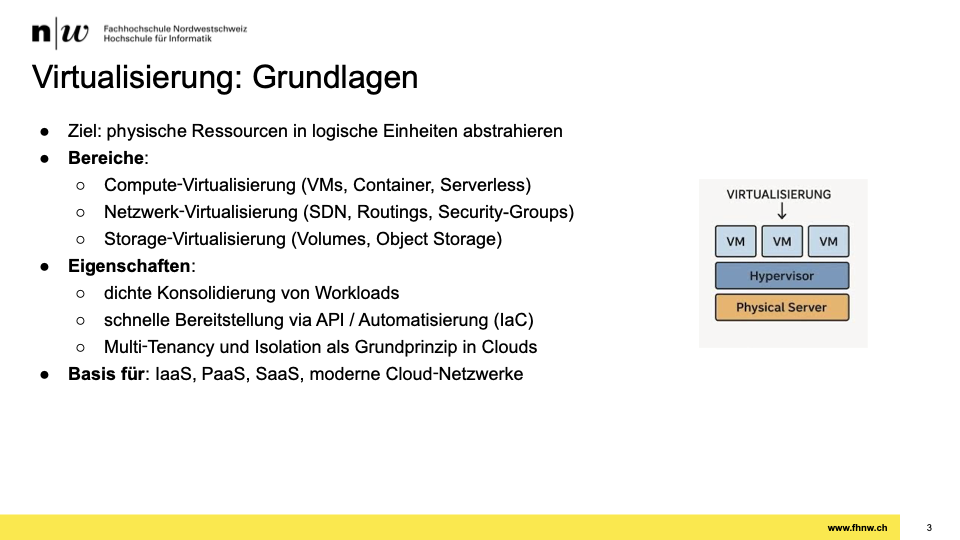

## Cloud Bereitstellungsmodelle

- 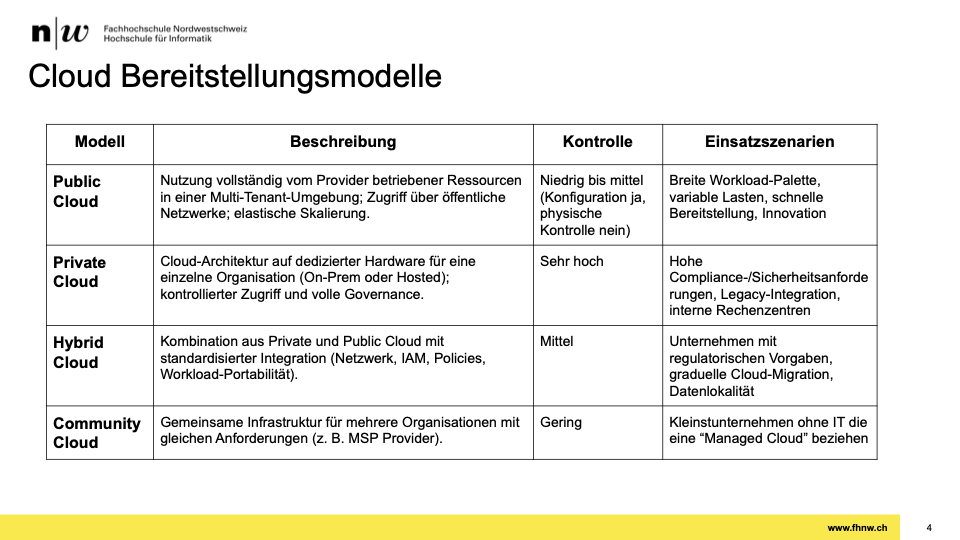

## Cloud Service-Modelle: IaaS, PaaS, SaaS

- 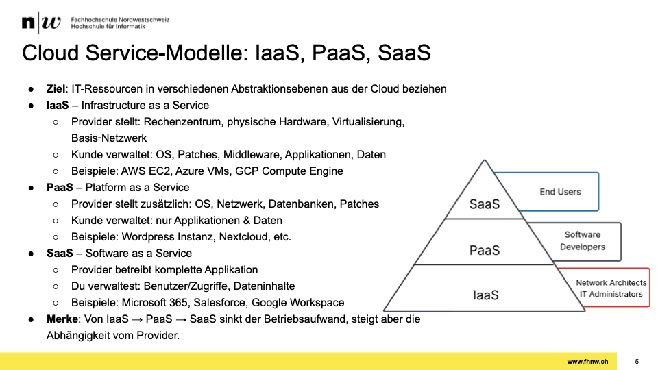

## Compute‑Modelle: VMs, Container, Serverless

- 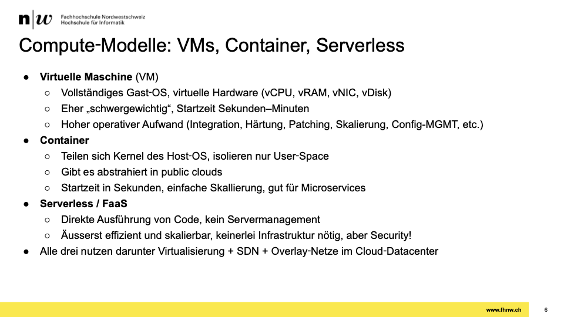

## VMs in der Public Cloud

- 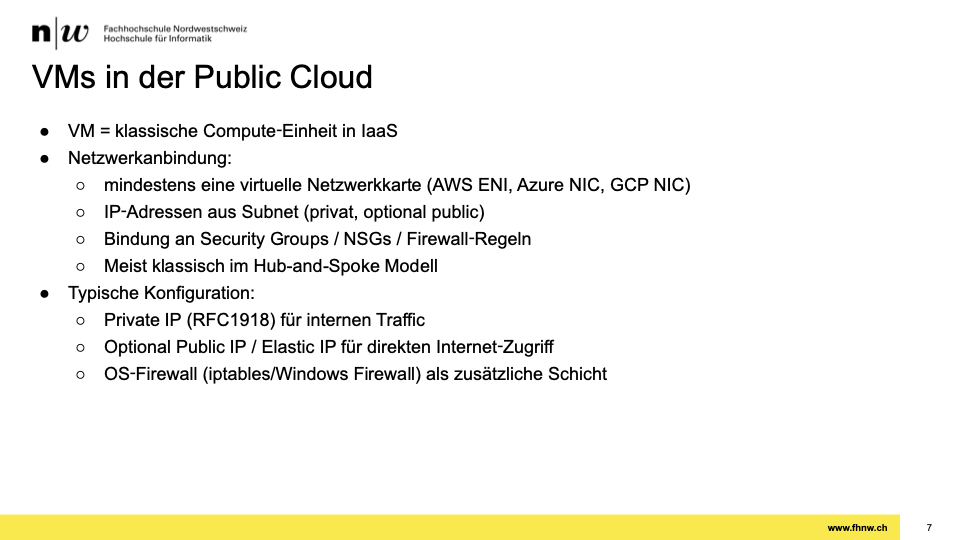

## Container & Kubernetes im Cloud‑Netz

- 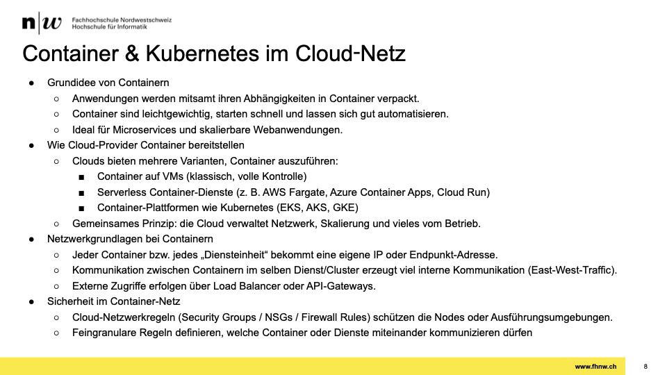

## Serverless / Functions‑as‑a‑Service im Netz

- 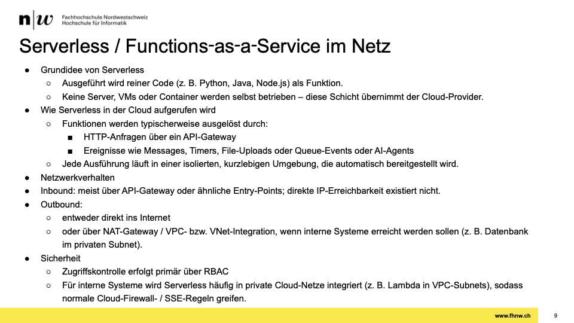

## Architektur von Public Clouds

- 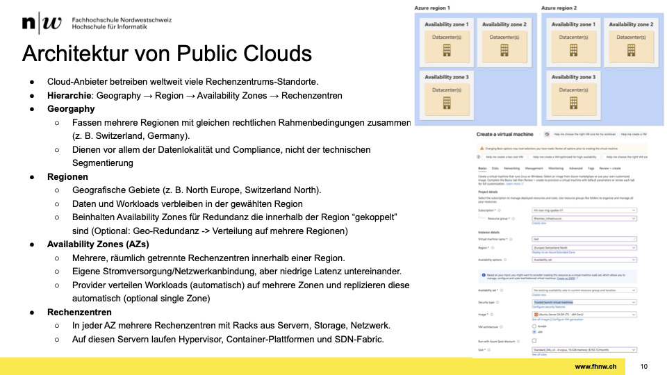

## Begriffe in Public Clouds

- 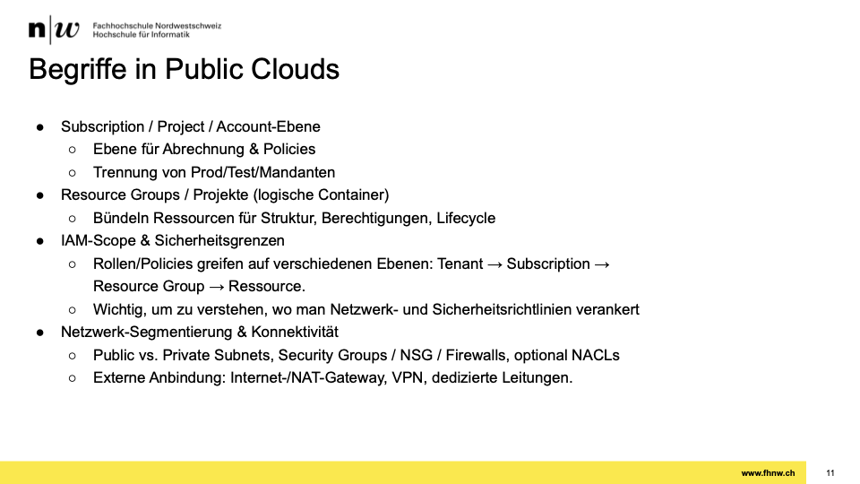

## Virtuelle Netzwerke: VNet & Subnet

- 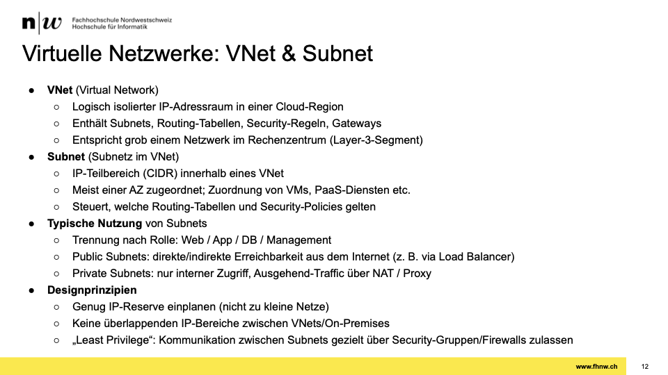

## Load Balancer & VNet-„Stretching“ über Availability Zones

- 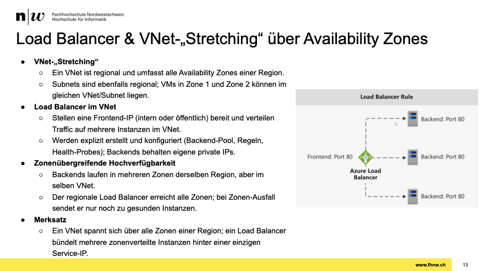

## Standard Routing in Public Clouds

- 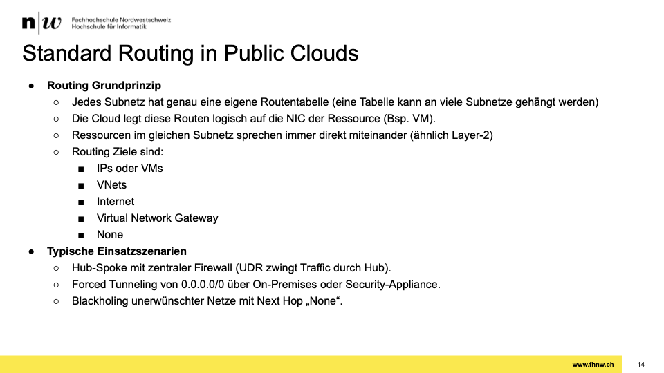

## Segmentierung in Public Clouds

- 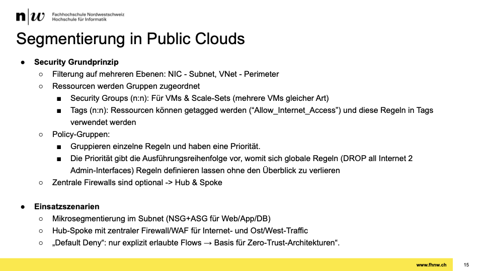

## Hub‑and‑Spoke‑Prinzip in Clouds

- 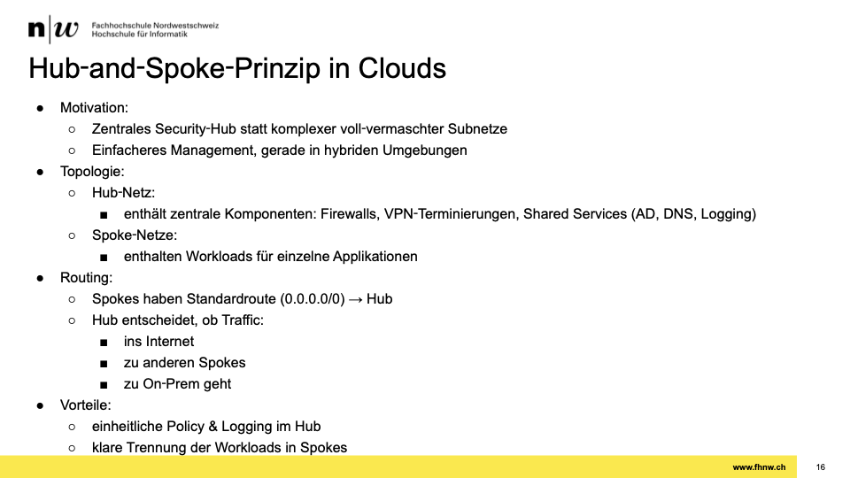
- 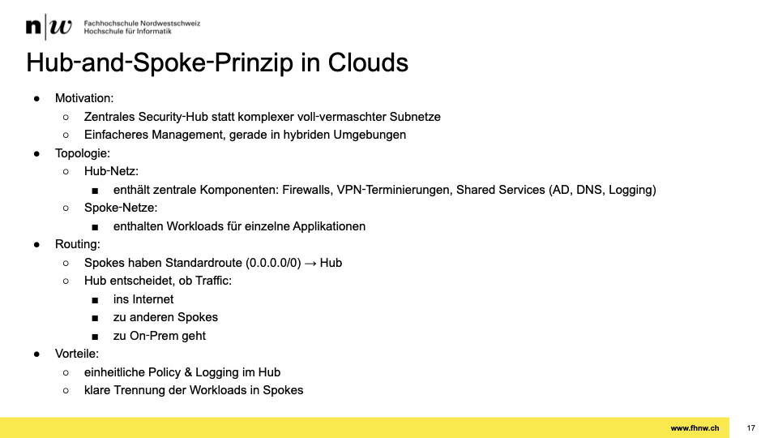

## Anbindung von Public Clouds

- 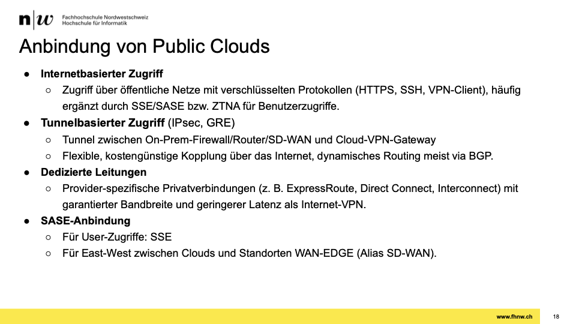

## Content Delivery Netzwerke (CDN)

- 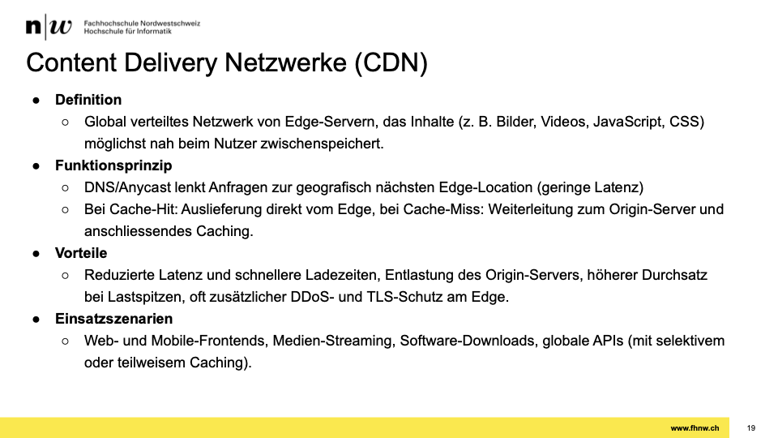

## Content Delivery Netzwerk

- 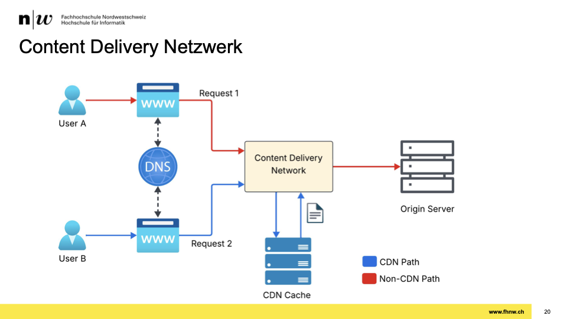
