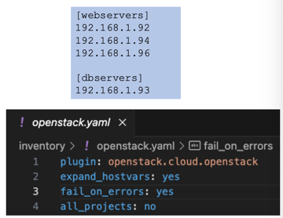

+++
title = "Week 03"
date = 2025-09-30
[taxonomies]
authors = ["fatlum"]
tags = ["pcls"]
+++

***Drehbuch: [Modulübersicht PCLS – Drehbuch](https://sgi.pages.fhnw.ch/moduluebersicht/pcls/drehbuch.html)***  
***Gitrepo: [spd/module/pcls (GitLab)](https://gitlab.fhnw.ch/spd/module/pcls/)***  
***Assessments / Assignments: [Public Cloud Services – HS25](https://spd.pages.fhnw.ch/module/pcls/tutorials/assignments/public-cloud-services/hs25/index.html)***  
***Report: [Assessments Pages (Ordneransicht)](https://gitlab.fhnw.ch/spd/module/pcls/tutorials/assignments/-/tree/main/modules/assessments/pages/)***  
***Switch Engines: [engines.switch.ch](https://engines.switch.ch/)***  
***AWS: [FHNW AWS-SSO Portal](https://fhnw.awsapps.com/start/#/?tab=accounts)***  
***Azure: [Azure Portal](https://portal.azure.com)***  
***O’Reilly: [O’Reilly-Literatur (Playlist)](https://learning.oreilly.com/playlists/a27d30d7-f139-4476-9c3a-e0abeb0f89da/)***

---

# Frontalunterricht

## Reflektion Assignment
- **Docker Compose**:
  - Standard zum Deployen mehrerer Services
  - YAML-File beschreibt Services
  - Jeder Service kann Builds, Ports, Volumes haben
  - `:ro` = *read-only* → verhindert Schreibzugriff vom Container
    - Vorsicht: wenn Root-Volume gemountet, hat Container Root-Zugriff
  - Container sehen sich gegenseitig über ihren **Service-Namen**
  - Name wird direkt unter `services:` definiert
- **Bootstrap Machine**:
  - In Switch Engines via **Cloud-Init** konfigurierbar

---

## IaC – Infrastructure as Code

- Betrieb kann **manuell (Click-UI)** oder **vollständig per IaC** erfolgen
- **Warum IaC?**
  - On-Premise wächst nicht mehr
  - Alles ist virtualisiert → Infrastruktur als Software
  - Reproduzierbarkeit, Automatisierung, Skalierung

### Iron Age vs. Cloud Age
- Früher:
  - Hardware bestellen → Wochen Lieferzeit
  - DNS-Einträge ändern → mehrere Tage
  - Änderungen dauerten oft >10 Tage
- Heute:
  - Server in Minuten provisionieren
  - Container-basierte Workloads statt Monolithen
  - Chaos Engineering (z. B. Chaos Monkey) prüft Resilienz

### 5 Principles of Infrastructure in the Cloud Age
1. **Systeme sind nicht zuverlässig**
  - viele Layer → Fehler unvermeidbar
  - Änderungen oft nur mit Neuaufbau stabil
2. **Alles reproduzierbar machen**
  - Stage-Parity (Test = Prod)
  - Horizontal Scaling ermöglichen
3. **Systeme disposable kreieren**
  - Infrastruktur wie Software: löschbar, elastisch
4. **Variationen minimieren**
  - 1000 gleiche Services einfacher als 50 unterschiedliche
  - gleiche Architekturen, OS, Setups
5. **Prozess gemeinsam betreiben**
  - Bus-Faktor > 1 (mehr als eine Person versteht IaC)
  - alles in Git, Skripting, Transparenz

### Pet vs. Cattle
- **Pet**: manuell betreute Systeme (CAPEX) → hoher Aufwand, individuelle Pflege
- **Cattle**: Cloud-freundlich, austauschbar (OPEX) → keine Namen, skriptgesteuert, automatisiert

---

## IaC – Grundbegriffe

### Infrastructure Provisioning
- Spricht über API mit Cloud-Anbieter
- Erzeugt atomare Bausteine (VM, Netzwerk, Security Groups …)
- Bestehendes wird oft gelöscht/neu erstellt (→ Datenverlust möglich)
- Muss **State** verwalten (Terraform, Crossplane …)

### Configuration Management
- Passt bestehende Systeme an (User hinzufügen, Pakete installieren …)
- Arbeitet agentlos (z. B. via SSH) oder mit Agenten
- Beispiele: **Ansible, Puppet, SaltStack**
- Anpassung statt Neuaufbau → stabiler für laufende Systeme

---

## IaC is Source Code
- Alles in **Git** (Versionierung, Reverting, Nachvollziehbarkeit)
- **Linting** → Syntaxcheck
- **Testing** → Semantikcheck
- **Auditing** → Merge Requests, Reviews
- **Versioning** → Historie & Rollback

---

## Pitfalls

### Fear the Fear Spiral
Prinzipien (nach Jez Humble & David Farley):
1. Repeatable, reliable Release-Prozesse
2. Automatisiere (fast) alles
3. Alles in Version Control
4. Painful Tasks → öfter tun, Pain forward
5. Quality built-in
6. Done = Released
7. Jeder ist verantwortlich
8. Continuous Improvement

### Mind the Blast Radius
- Fehler im IaC → gesamte Stacks betroffen
- Lösung:
  - dedizierte Test-Accounts
  - keine Tests direkt in Prod
  - Naming-Konventionen, Tags
  - Blast Radius klar einschränken

### Sourcecode-Definition: Imperativ vs. Deklarativ
- **Imperativ**: Schritt für Schritt → „System ist dumm, du bist schlau“
- **Deklarativ**: gewünschter Zustand → „System ist schlau, du sagst was du willst“
  - besser für IaC, aber schwieriger zu debuggen

---

## Summary
- Deklarative Sprachen vereinfachen Komplexität
- Tools für verschiedene Use Cases (Terraform vs. Ansible)
- Keine „One Tool“-Lösung
- Kombination der besten Ansätze

---

## Terraform / Opentofu

- Terraform = Framework für Infrastructure Provisioning
- CLI liest `.tf`-Dateien → Module, Variablen, Provider
- Übersetzt in API-Calls an Cloud Provider
- **Cloud-agnostisch in Sprache**, aber Module oft provider-spezifisch

### Terraform Workflow
1. **Init** → lädt Provider & Module, initialisiert Backend
2. **Plan** → vergleicht Desired State (Code) mit Real State, generiert DAG
3. **Apply** → setzt Änderungen um
  - **Wichtig**: Lauf nie unterbrechen!

### Terraform State
- Gespeichert als JSON
- Basis für alle Änderungen
- Bei Teamwork → Remote State (z. B. GitLab, S3)

### Multi-Module
- Module strukturieren Code
- Ermöglichen Wiederverwendung
- Provider-Definitionen für Cloud (AWS, OpenStack …)

### OpenStack Heat / AWS CloudFormation
- YAML/JSON Templates
- Keine State-Verwaltung (Heat)
- AWS CloudFormation → ähnlich, Provider-gebunden

---

## IaC – Configuration Management

### Ansible
- Agentlos → nur SSH
- Idempotent (mehrfach ausführbar, Ergebnis bleibt gleich)
- Kein eigener State → Facts zur Laufzeit gesammelt

**Use Case:**
- Installiere Nginx
- Generiere Config
- Starte Service neu

### Inventory
- Liste aller zu verwaltenden Server
- statisch oder dynamisch (z. B. Script gegen Cloud)

### Playbooks
- YAML-basierte Rezepte
- Beispiel: Apache oder PostgreSQL installieren und starten

### Puppet

- Master/Agent-Architektur
- Eigene DSL
- Inventory nicht nötig (Selbstregistrierung)

### SaltStack

- Kann sowohl Provisioning als auch Config Mgmt
- Master/Minion oder SSH
- Event-getrieben (reagiert auf Änderungen)

---

## Assignment 03
- **IaC for IaaS**
- Ziel:
  - Cloud-Init + eval-User mit SSH-Key
  - Repo mit Infrastruktur-Definition
  - Regelmäßige Updates & Package-Installs
  - Neues Dockerimage automatisch ausrollen
- **Bonus:** Continuous Deployment Pipeline
