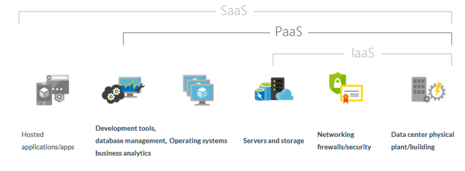
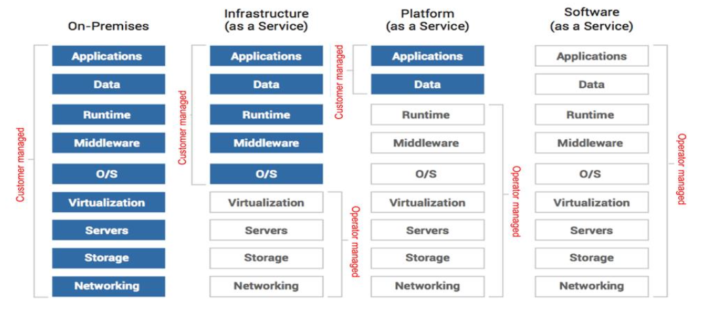
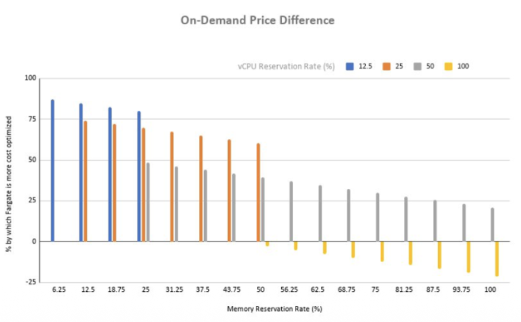
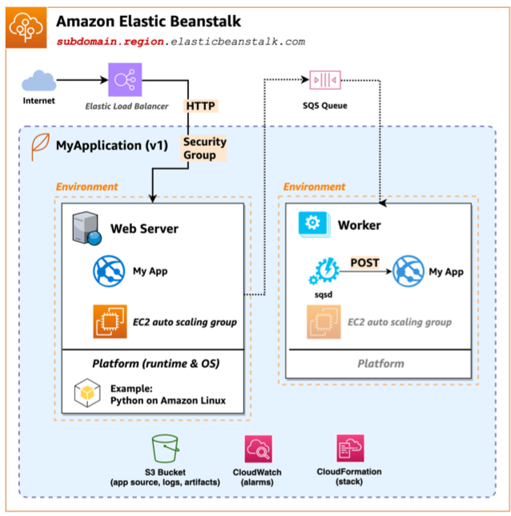
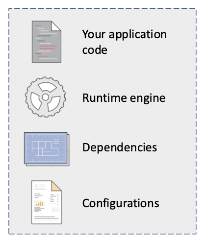
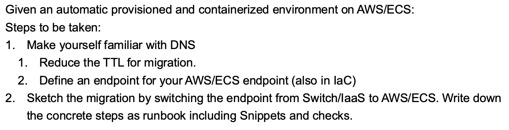

+++
title = "Week 04"
date = 2025-10-07
[taxonomies]
authors = ["fatlum"]
tags = ["pcls"]
+++

[Drehbuch: Modulübersicht PCLS – Drehbuch](https://sgi.pages.fhnw.ch/moduluebersicht/pcls/drehbuch.html)  
[Gitrepo: spd/module/pcls (GitLab)](https://gitlab.fhnw.ch/spd/module/pcls/)  
[Assessments / Assignments: Public Cloud Services – HS25](https://spd.pages.fhnw.ch/module/pcls/tutorials/assignments/public-cloud-services/hs25/index.html)  
[Report: Assessments Pages (Ordneransicht)](https://gitlab.fhnw.ch/spd/module/pcls/tutorials/assignments/-/tree/main/modules/assessments/pages/)  
[Switch Engines](https://engines.switch.ch/) · [AWS SSO](https://fhnw.awsapps.com/start/#/?tab=accounts) · [Azure Portal](https://portal.azure.com) · [O’Reilly-Playlist](https://learning.oreilly.com/playlists/a27d30d7-f139-4476-9c3a-e0abeb0f89da/)

---

## Reflektion Assignment

### part 1

- auf dem service soll die app laufen
- für die infrastruktur-provisionierung IaC verwenden
- kein root-passwort setzen, **nur SSH**
- OpenTofu OpenStack Provider
- public IP von außen erreichbar
  - Floating IP wird auf die Instanz gemappt

---

### part 2

- ansible macht eine SSH-Connection zur Instanz und konfiguriert
- `ansible.cfg` verwenden (inventory, host key checking, etc.)

---

### Input für zukunft

- semesterwoche 42 → BSS
- semesterwoche 43 → assessment
  - 10 minuten fragen zum source code
  - allfällige fragen zum screencast
  - live migration

---

## Frontalunterricht

### For the start…

- wir schieben immer weiter „links“, aber am ende des tages wollen wir einfach **programmieren**

---

### PaaS – Platform as a Service

- ziel beim programmieren: code deployen, nicht infra managen
- wir bauen eine plattform, auf der ein „normalo“ deployen kann → PaaS

---

### What functionalities do you expect from a PaaS?

- gute dokumentation
  - wie man provisioniert
  - wie man deployed
- saubere schnittstellen zu den sachen, die man verwendet
- image bauen und hochladen
  - ideal: dockerfile pushen → wird deployed
- schnelle zyklen
- monitoring
- kostentransparenz
- kein interesse an skalierung/HA/LB (soll die plattform übernehmen)

---

### NIST Definition of PaaS

- eigene apps auf provider-infrastruktur deployen
- keine verwaltung von servern/netz/OS/storage, aber kontrolle über app + runtime-config

---

### What are components of a PaaS?

- runtime: laufzeitumgebung (sprache/framework), config (env, secrets)
- build/deploy-pipeline
- service-katalog (db/cache/msg), routing/LB, autoscaling, observability

---

### Blured lines…

- kubernetes: container-plattform, fühlt sich mit extras oft wie PaaS an
- azure/openshift: registry, api management, autoscaling → „kompletteres paket“

---

### Container Platform VS PaaS

- container orchestration:
  - container gehört mir, ich sage der plattform, **wie** er zu betreiben ist
- application (PaaS, application platform):
  - ich bin nur für **app code** verantwortlich
  - wie es gerunt wird, ist mir egal

---

### Serverless Compute

- bei groß skalierten workloads egal, welches OS drunter
- oder einfach: „hier mein container, lauf ihn nur“

---

### Price of serverless

- serverless lohnt sich **nicht**, wenn die app nonstop läuft
- wenn serverless, braucht man weniger system engineering
- wenn ein pod nonstop läuft, lohnt sich oft eher IaaS
- [blogPost](https://aws.amazon.com/blogs/containers/theoretical-cost-optimization-by-amazon-ecs-launch-type-fargate-vs-ec2/)

---

### Besides Compute…

- load balancing muss die infrastruktur kennen
- bei scale-out muss die instanz „warm“ werden (startzeit)
- load balancer braucht awareness der instanz-landschaft

---

### AWS Beanstalk

- beanstalk ist ein service
- im kern ein aggregator (LB, infra, autoscaling, monitoring)
- gui-gesteuert angenehm, kostentransparenz im blick behalten

---

### Feedback regarding Complexity in Setup / Operating

- PaaS-Produkt von AWS
- machbare komplexität
- gui-gesteuert positiv
- kostentransparenz fehlt teilweise

---

### AWS ECS

- grundidee: ein service, der container laufen lässt (tasks/services)

---

### Updates / Upgrades of PaaS/SaaS-Products

- wenn man nicht nonstop upgraden will, fällt man irgendwann runter
- plan für updates/upgrades einbauen (wartungsfenster, blue/green)

---

### Lifecycle of PaaS/SaaS-Products

- durchschnittliche lebensdauer von produkten kann kurz sein
- bei IaaS kann man zügeln
- bei PaaS weiß man nicht, ob der dienst bleibt
- bsp: atlassian-kunden mussten migrieren

---

## Container Services

### Compute, Product Classes in AWS

- wir schauen ECS an

---

### Compute, Product Classes in Azure

- PDF 04-2 seite 4 für die grafik anschauen

---

### Compute, Product Classes in Google Cloud

- PDF 04-2 seite 5 für die grafik anschauen

---

### Managed Kubernetes

- PDF 04-2 seite 6 für die grafik anschauen
- wenn man kubernetes will, dann managed von hyperscalern nutzen

---

### Running Container Natively

- kleinstes, um container laufen zu lassen:
  - OCI-runtime, z. B. containerd
  - OS-layer liefert basics, runtime reicht dann

---

### Compute Engines, e.g. ECS

- OCI image: kümmer dich ums image
- IaaS musst du nicht mehr komplett managen
- klare architektur
- serverless-instanzierung möglich (fargate)

---

### Definition of an ECS instance

- cluster fasst alles zusammen (services/tasks/instances)

---

### Overview about orchestration

- alle tasks laufen im cluster, können hochverfügbar laufen
- folie 04-2 seite 10 anschauen

---

### Serverless VS IaaS

- kapazität richtig managen
- für den chatbot reicht eigentlich 1 GB
- T-Instanz reicht aus
- netzwerkinterface zum container
- ECR: image manuell bauen, dann in source code referenzieren
- task bei aws/ecs ggf. mit chatgpt ergänzen

---

## Migration

### High Level Strategy: The 5 R’s Gartner und die 7 R’s von AWS

- 5 R’s von gartner:
  - rehost
  - refactor
  - rearchitect
  - rebuild
  - replace

---

### Technical Basics of Cloud Migration

- von hand starten ist ok, aber einen plan machen
- wir gehen in migration:
  - manuell starten, schrittweise iterieren

---

### 1. Target Platform

- zielplattform soll container hosten → aws/ecs
- token für read registry nutzen (ggf. aws token)
- sauber hinterlegen (secrets)
- 

---

### 2. Migration Plan

- DNS wird migrationsherausfordernd sein
- einen endpunkt definieren und DNS darauf zeigen
- ablaufplan machen: wann machen wir was
- 

---

### DNS-Basics

- wir bekommen einen DNS-Server
- gruppe.01 zeigt auf gruppe von switch
- lebenszeit im cache (TTL) steuert propagation
- **vor** der umstellung TTL **runterstellen** (z. B. 10 s), dann Route53-Einträge anpassen
- [text](https://learn.microsoft.com/en-us/windows-server/identity/ad-ds/plan/reviewing-dns-concepts)

---

### 3. Performing the migration

- bonustask: was, wenn es state gibt?
- 

---

### assessment 4

- tofu für provisionierung nehmen
- unter `iac-aws` speichern
- wenn nicht vollautomatisch, dann **README.md** mit schritten
- generell **README.md**: wie baut/deployed man
- bonustask:
  - überlegen, wie man **secrets** handhabt (z. B. Mozilla SOPS, Ansible Vault)
- Switch Engines erstmal stehen lassen (rollback-pfad)
- ein repo namens `reports` erstellen
  - aufschreiben, wie ihr die migration durchgeführt habt
