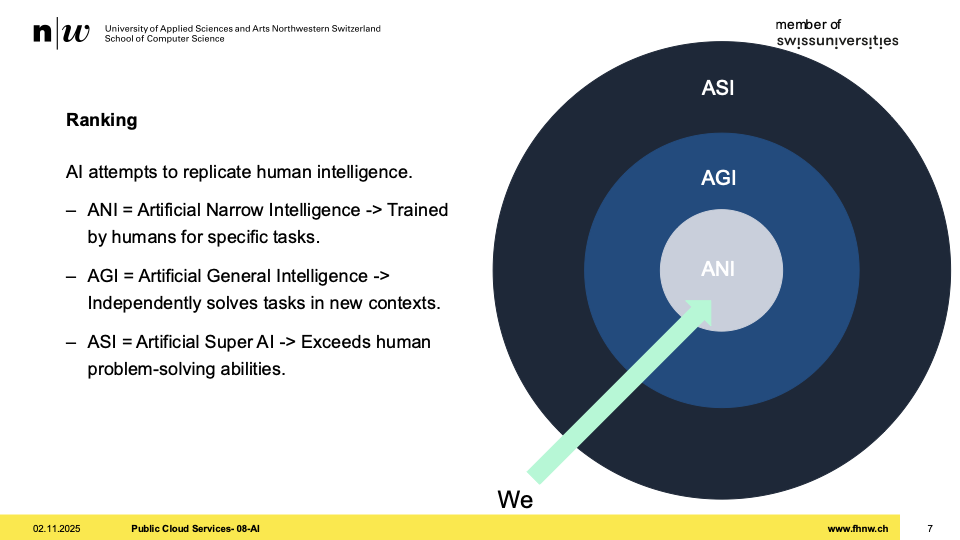
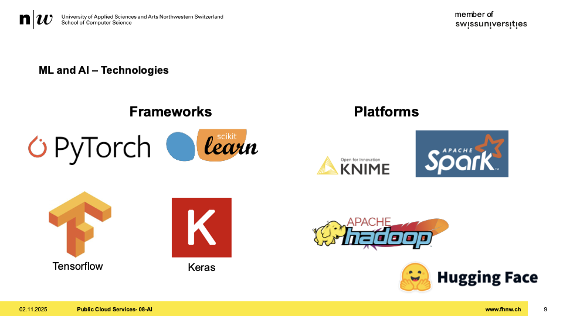
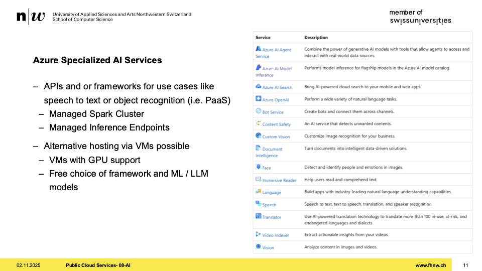
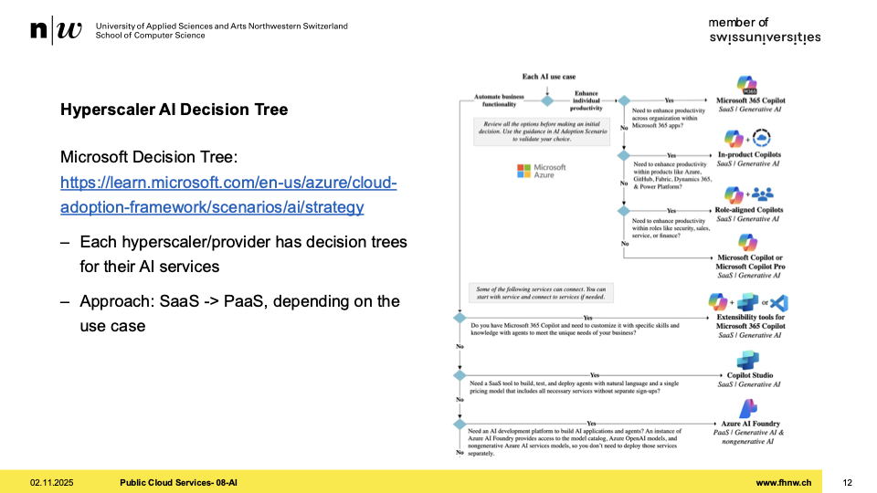
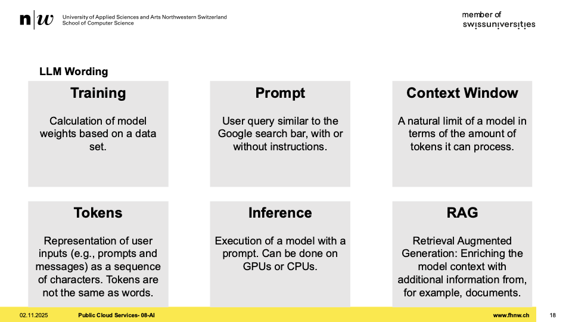
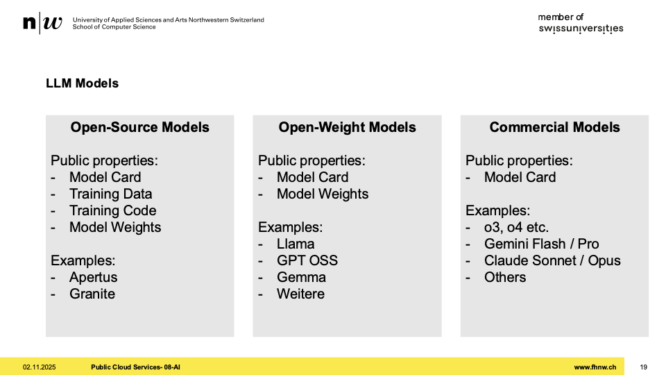
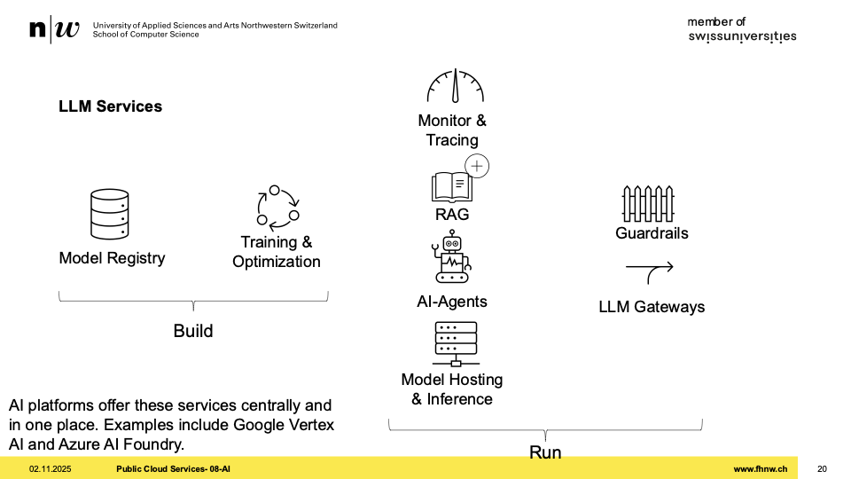
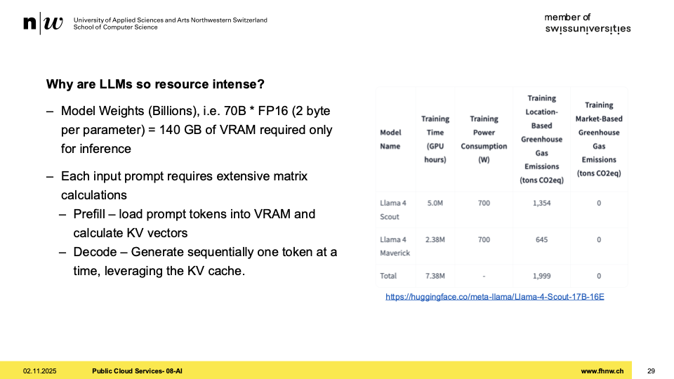
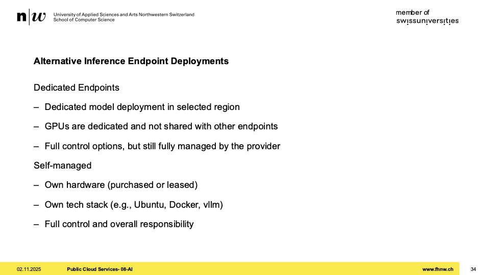

+++
title = "Week 08"
date = 2025-11-04
[taxonomies]
authors = ["fatlum"]
tags = ["pcls"]
+++

[Drehbuch: Modulübersicht PCLS – Drehbuch](https://sgi.pages.fhnw.ch/moduluebersicht/pcls/drehbuch.html)  
[Gitrepo: spd/module/pcls (GitLab)](https://gitlab.fhnw.ch/spd/module/pcls/)  
[Assessments / Assignments: Public Cloud Services – HS25](https://spd.pages.fhnw.ch/module/pcls/tutorials/assignments/public-cloud-services/hs25/index.html)  
[Report: Assessments Pages (Ordneransicht)](https://gitlab.fhnw.ch/spd/module/pcls/tutorials/assignments/-/tree/main/modules/assessments/pages/)  
[Switch Engines](https://engines.switch.ch/) · [AWS SSO](https://fhnw.awsapps.com/start/#/?tab=accounts) · [Azure Portal](https://portal.azure.com) · [O’Reilly-Playlist](https://learning.oreilly.com/playlists/a27d30d7-f139-4476-9c3a-e0abeb0f89da/)

---

# Artificial Intelligence (AI)

## Wrap Up

- Ansatz bestehendes Framwork in Funciton umzuwandeln
- eine flask app zu erstellen
- vorgefertige funktion um in function umzuwandlen
  - ist ein wrapper
- jetzt mit wrapper zeigt es nicht mehr alle function-namen an
- funktioniert alles was REST-basiert ist
- eliza
  - rückwendigen dependencies hinzugegfügt
  - ins pom.yaml
  - ganze methoden signatur von quarkus in function signtatur geändert
  - auch die klassen der azure function runtime
  - http trigger
  - anpassung der gesamten api
- files:
  - task.json
  - launch.json

## AI History

- erstesmal aufgetaucht beim touring test
- durch more's law hat sich deep learning und big data entwickelt

## Ranking

- 

## Use Cases

- bildanalayse
- speech to text
- sentiment analysis
  - heraus zu finden, wie die stimmung in einem text ist
- support bots

## ML and AI – Technologies

- 
- links frameworks zum bauen
- rechts frameworks zum ausführen

## Azure Services

- zwei welten
  - klassiches machine learning
  - mathematische modelle um für etwas spezifisches zu bauen
- azure openai:
  - focus auf llm's
  - eigene llm's trainieren und tunen

## Azure Specialized AI Services

- 
- für jeden use case hat azure einen service
- alle haben gemeinsam
  - haben eine api
- kann auch selber hosten mit VMs

## Hyperscaler AI Decision Tree

- 
- im sinn haben was haben wir für ein problem
- es geht um bauen oder zu konsumieren
- wir wollen azure ai foundry -> PaaS

## Large Language Models

- mathematische modelle die auf text trainiert worden sind
- grossen corpus an wissen zb wikipedia
- trainiere dieses und bekomme ein modell

## Context Awareness for LLMs

- awarness mit geben

## Multi-Modality in LLMs

- nicht jedes LLM ist multi modal
- immer schauen, wenn man modell auswählt, welche modalitäten abgebildet werden

## LLM Wording

- 
- trainieren ist compute intensiv
- inference: laden modell in gpu oder cpu
- tokens: ai versteht tokens
  - sind nicht einfach worte
  - können wort teile oder mehrere worte sein
  - überstzung von input auf token
  - umso mehr tokens ich beziehe, umso mehr muss ich zahlen
- context window: limit das ai hat zum text zu lesen
  - zu langer promt, könnte dazu führen dass der teil von anfang weg ist, weil keine tokens

## LLM Models

- 
- open-weight ist nicht gleich open source
  - viele firmen werben damit

## LLM Services

- 
- run ist
  - unterschiedliche kategorien über api sprechen
- llm gateways:
  - firma selbst hat eigene lösung
  - kann prüfen was geht raus
  - wie eigenere proxy

## LLMOps

- man nimmt foundations modelle, die schon antraniert ist wie llama
- wenn man es aber besser machen will, trainiert man es weiter
- kommt günstiger das tunen, also von grundauf trainieren

## Pricing and Cost Factors for ML Services

## Pricing and Cost Factors for AI Services

- man zahlt, wenn man den openAI Endpoint provisioniert

## Example: Calculate Cost for LLM Hosting

- wir wollen Llama instruct provisionieren
- auf HF bei der modell card kann man schauen wie viele tokens etc. gebietet werden

## Example: Calculate Cost for LLM Hosting – Azure AI Foundry

- azure ai foundry service um ein modell zu hosten
- nicht jedes modell ist in allen kategorien verfügbar
- bei cloud LLMs zahlt man input und output token

## Why are LLMs so resource intense?

- 

## Demo

- marketplace
- azure ai foundry
- namen geben
- angeben wo sein soll
- network angeben ob public oder private
- theme kann man verschlüsseln
- das ist dann nur eine hülle
- dort kann ich llm api endpunkte definieren
- azure report hat dann eigenes portal
- function nutzen um llm abzufragen

## Demo WrapUp

- foundry service gemacht
- eigenen endpoint mit domäne
- api key für auth
- global unterwegs
- paymentist pay-as-you-go

## Alternative Inference Endpoint Deployments

- 

## Inference API Specifications

## Inference APIs

## AI Platforms and Inference APIs

## AI – Artificial Intelligence – AWS Bedrock

## Data Protection and Encryption

## Data Residience

## Data Retention and Training Usage – Example Open AI

## Data Protection – Guardrails and Content-Filter

## AI-Agents

## Agents Toolcalling

## Agent Frameworks

## AI Search / RAG

## RAG Reference Architecture

## Why RAG is needed

## Infrastructure as Code for Azure AI Foundry

## Summary
