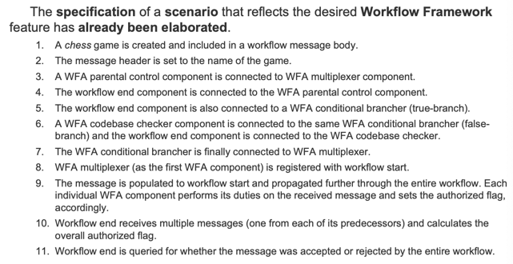
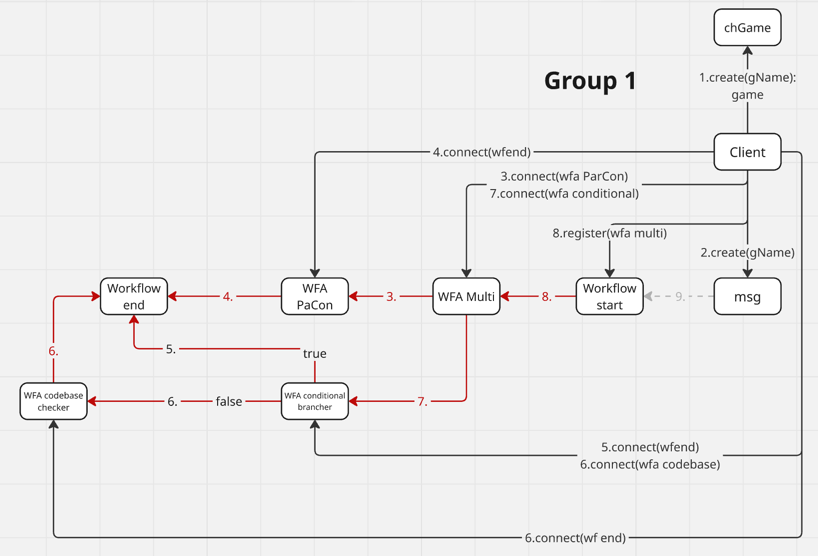

+++
title = "Week 03"
date = 2025-09-30
[taxonomies]
authors = ["fatlum"]
tags = ["swa"]
+++

# Software Architecture – Week 03

## Rückblick letzte Vorlesung
- Baustein A, Baustein B, Baustein C
  - Was muss A können?
  - B muss *beta* können
  - C muss *gamma* können
- Das ist die **Logical View**
  - Daraus haben wir die **Development View** abgeleitet
  - Unterscheidungen finden auf der Development-View-Seite statt

---

## Menti-Fragen
(Details aus der Vorlesung – keine weiteren Infos im PDF.)

---

## Aufgabe in der Vorlesung

### Workflow
- Einen Satz von ersten Grundbausteinen erstellen
- Start- und Endkomponente definieren
- 
  - Von diesem Szenario einen Übergang zur **Logical View** (Kommunikationsdiagramm) machen
- Grundidee:  
  Aus den Schritten eine Logical View (Kommunikationsdiagramm) ableiten und danach Klassen/Objekte bestimmen.
- Kommunikationsdiagramm zeigt Objekte + Methoden auf Pfeilen
- Daraus:
  - alle Klassen ableiten
  - Attribute und Methoden bestimmen
- Anschließend: Klassendiagramm erzeugen
- Nächstes Mal: Lösung anhand des Kommunikationsdiagramms diskutieren
- 
  - „Das oben stimmt fast“

---

## Theoretischer Input aus den Folien

### Architecture Conditions
- Architektur entsteht nicht zufällig → sie ist durch **Bedingungen (Conditions)** getrieben
- Bedingungen sind:
  - **Requirements** (funktionale + nicht-funktionale Anforderungen)
  - **Constraints** (harte Fakten wie Budget, Zeit, Skills)
  - **Assumptions** (Annahmen, Unsicherheiten, „known unknowns“)
- Anforderungen an Bedingungen:
  - korrekt (von Stakeholdern bestätigt)
  - realisierbar (feasible)
  - eindeutig
  - überprüfbar
- **Erfassung**:
  - funktionale Anforderungen → *Use Cases*
  - nicht-funktionale Anforderungen, Constraints, Annahmen → *Quality Attribute Scenarios*  
    (nach *Bass et al., Software Architecture in Practice*)

---

### Architecture Significance
- Frage: Welche Bedingungen sind **architekturrelevant**?
- Booch (2009): *„Architecture is the set of significant design decisions that shape a system.“*
- Heuristiken (Arnold 2021):
  - Anzahl der betroffenen Architekturentscheidungen
  - Wichtigkeit der Stakeholder
  - Nicht-Funktionalität (z. B. Sicherheit, Performance)
  - Neuheit einer Bedingung
  - Volatilität (Wahrscheinlichkeit von Änderungen)
  - Konfliktgrad mit anderen Bedingungen (Trade-offs nötig?)
  - Strategische Relevanz (trägt es zu Unternehmenszielen bei?)
  - die kosten der änderung die entstehen würden
  
---

### Architecture Approach
- Ein **Architecture Approach** ist ein *Teil-Design* (Teillösung), das eine oder mehrere Bedingungen adressiert
- Viele Approaches ergeben zusammen die Gesamtarchitektur
- Approaches sind **nachvollziehbar**:
  - zeigen, welche Bedingungen sie adressieren
  - beschreiben Impact (Force) und gewünschte Reaktion (Response)
  - beinhalten beteiligte Architekturbausteine (dynamisch + statisch)
  - dokumentieren die wichtigsten Architekturentscheidungen
- Approaches = auch „Microarchitectures“ oder „Solution Design Segments“

#### Beispiel: Authentifizierung in einer Web-App
- Bedingung: Nutzer müssen authentifiziert werden
- Approach:
  - App-Server mit AuthN/AuthZ-Modul
  - Nutzung eines LDAP-Directory
  - Synchronisation zwischen User-DB und LDAP
  - Web-App nutzt `getRemoteUser()` und `isUserInRole()`
- Vorteile:
  - Standard JEE-Mechanismen
  - leicht austauschbar (z. B. anderer LDAP)
  - deklarative Sicherheit + feingranulare Regeln programmatisch

---

## Exercise – Gaming Platform (Iteration #2)

### Motivation
- Neuer Requirement von **Quality Assurance**:  
  Neue Spiele auf der Plattform müssen durch einen **Genehmigungsprozess** laufen
- Qualitätsaspekte: Elternkontrolle, Accessibility, Schadcode-Prüfung etc.
- Lösung: **Workflow Engine** einführen → flexible Konfiguration ohne Recompile

### Workflow-Idee
- Ein Workflow besteht aus:
  - Workflow Activities (WFA)
  - Verbindungen zwischen diesen
  - Nachrichten (Workflow Message) → laufen durch den Workflow
- **Komponenten**:
  - `WFA Multiplexer` → verteilt Nachricht an mehrere
  - `WFA Parental Control` → prüft Altersfreigabe
  - `WFA Conditional Brancher` → logische Entscheidung, True-/False-Zweig
  - `WFA Codebase Checker` → prüft Codebasis
  - `Workflow Start` und `Workflow End` → definieren Anfang und Ende
- Jede Nachricht hat:
  - Header + Body
  - Flag `authorized` (kann auf *false* gesetzt werden)

### Beispiel-Szenario
1. Spiel „Chess“ wird in Message-Body gesetzt
2. Multiplexer verteilt Nachricht
3. Parental Control prüft
4. Brancher entscheidet über Codebase-Check oder direkt End
5. Workflow End sammelt Ergebnisse und entscheidet, ob Spiel zugelassen ist

---

## System Architecture – Von Szenario zur Logical View
- Aufgabe: Szenario als **Kommunikationsdiagramm** darstellen
  - Objekte interagieren über Methodenaufrufe
  - Pfeile = Methoden
- Wichtig: unterscheiden zwischen:
  - **Workflow-Instanziierung** (Komponenten verbinden)
  - **Nachrichtendurchlauf** (Message läuft durch Workflow)

---

## Logical View → Development View
- Klassenliste erstellen:
  - jede Objektart hat eine Klasse
  - gleiche Funktionalität → gemeinsame Klasse
- Methoden bestimmen:
  - jeder Pfeil im Diagramm = eine Methode
  - daraus: Signatur (Rückgabe, Parameter)
- Beziehungen zwischen Klassen modellieren

---

## Implementation (Java)
- Design in Code umsetzen
- Prinzip: keine direkte Bindung → Nutzung von Interfaces
- Objekte werden in einer **Composer-Klasse** erstellt und verbunden
- Testfall: Workflow-Szenario „Chess“ von oben

---

## Zusammenfassung
- Bedingungen (Requirements, Constraints, Assumptions) bilden die Grundlage
- Architektur-Signifikanz filtert die wichtigen Anforderungen heraus
- Architecture Approaches geben konkrete Teillösungen
- Praktische Übung: Workflow Engine → von Szenario → Logical View → Development View → Code
