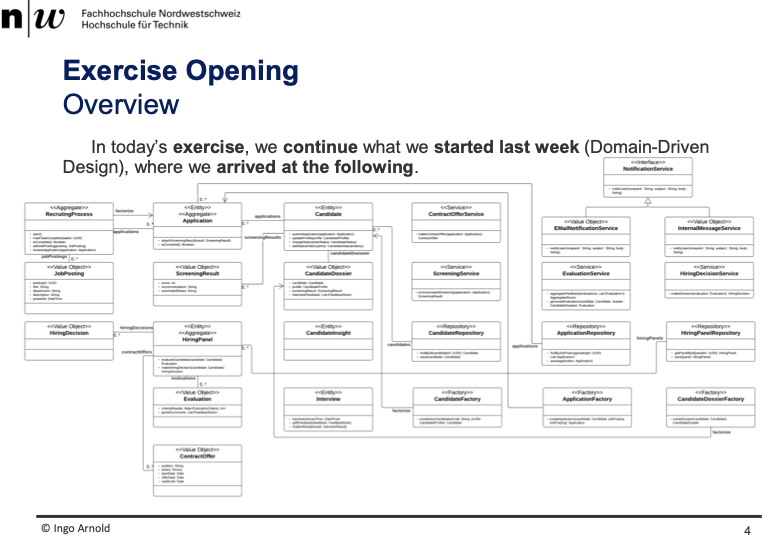
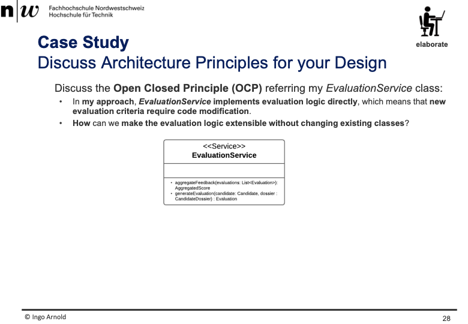
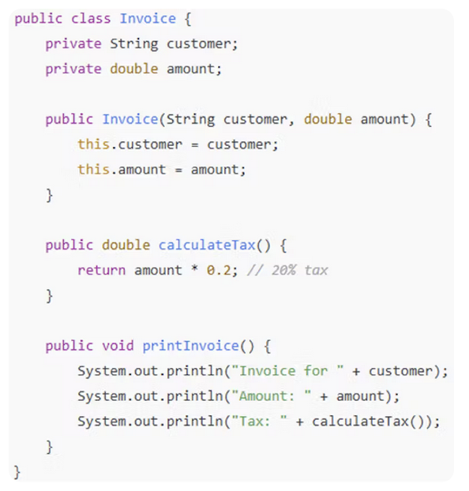
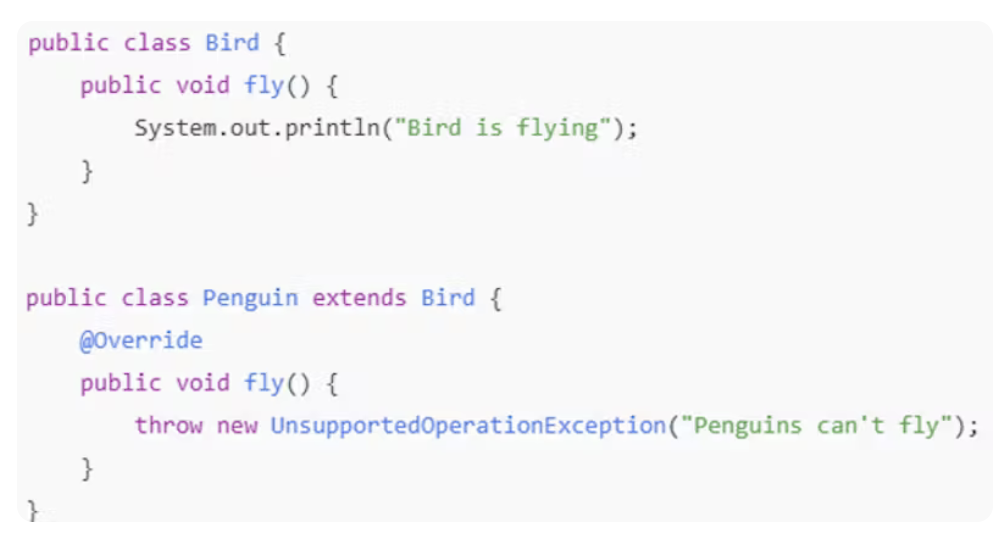
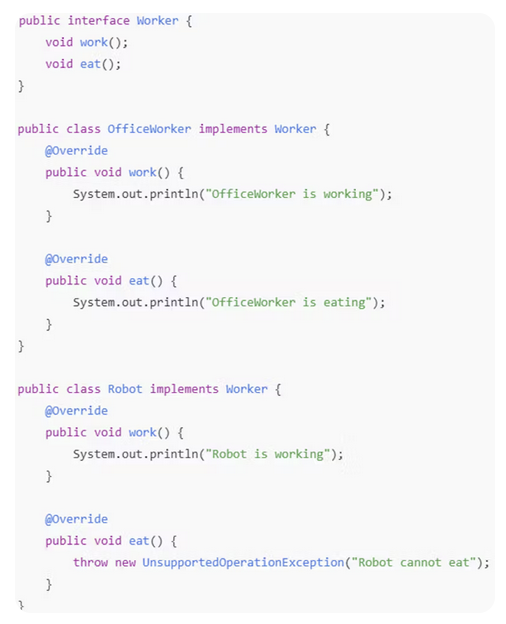
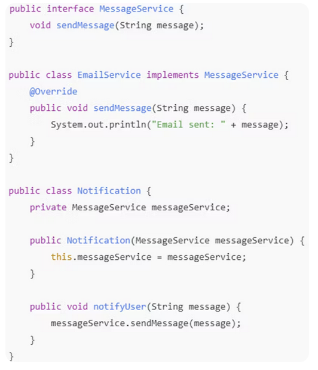

+++
title = "Week 09"
date = 2025-11-11
[taxonomies]
authors = ["fatlum"]
tags = ["swa"]
+++

# Software Architecture – Week 09

## Repository

- schirmt dauerhaften speicher ab
- organisiert das
- jeder weitere baustein typ der persistiert, ...

## DDD – Domain Model Bausteine (kurz erklärt)

- Fly weight: wenn nicht genug speicher, dann kommt dieses pattern zum zug
- UUID: unviversaly unique id
- DTO: data transfer object
- Aggregate
  - Besteht aus anderen Bausteinen
  - kann eigene idetität beinhalten
  - stellt eine neue konsistenz grenze dar
  - Fasst mehrere Entities und Value Objects zu einer logischen Einheit zusammen.  
  - Sorgt für Datenkonsistenz innerhalb des Aggregats.
- Entity
  - Objekt mit eigener Identität, bleibt dieselbe Instanz auch wenn sich Daten ändern.
  - Typische Pattern: State, Aggreagte
  - Beispiel: Kunde, Bestellung.
- Value Object
  - Objekt ohne Identität, wird nur durch seine Werte definiert.
  - immutable, nur getter keine setter
  - Beispiel: Adresse, Geldbetrag.
- Service
  - Fachliche Logik, die keiner bestimmten Entity oder keinem Value Object gehört.  
  - Beispiel: Zahlungsprüfung, Preisberechnung.
- Repository
  - Abstraktion für das Speichern und Laden von Aggregaten
  - Trennt Domänenlogik von Datenzugriff
  - dieses konzept, macht aus einer entity von einer Datenbank zu einem OO-Klasse
  - kommt auch vorallem zum zuge, wenn man persistente daten aus einer DB in klassen persisitieren soll
  - abschirmung gegenüber persitente technologie, zum beispiel API's, SQL etc.
- Factory
  - validiert andere objekte oder bausteine
  - typische patterns: factory methode, abstract-factory, builder
    - abstract factory:
      - mehrere klassen die sehr ähnlich sind, und man möchte diese gruppe von klassen mit einer anderen klasse ersetzen
  - eine klasse, eine werkstatt quasi, die eine methode anbietet um eine andere klasse zu erstelle
    - BSP:
      - CandidateFacotry, bietet methode an, einen Canditaten zu erstellen ohne das man "new" verwenden muss
  - Erzeugt komplexe Objekte oder Aggregate.  
  - Kapselt die Erstellungslogik.

- Einordnung im DDD
  - Alle Bausteine gehören zur **Domain Layer** des Domain-Driven Designs.  
  - Sie bilden zusammen das **Domain Model**, das die Geschäftslogik abbildet.

## Enrich your Domain Model by DDD-Concepts

- 
- <<"Stereo-Type">>
  - diese angabe hilft uns dann vom domain model, konkrekte klassen zu definieren
  - es gibt mir eine richtung, wie eine konkrete java klasse aussieht
  - es geht von einem domain model, zu einem konktreten klassendiagramm
- sind vom domänenmodell ausgegange, nicht technisch und jetzt haben wir mit den DDD-Konzepten zu dem Klassendiagramm geführt

## Coupling (Kopplung)

- Definition
  - Kopplung beschreibt, wie stark Klassen oder Objekte voneinander abhängig sind.  
  - Je geringer die Abhängigkeit, desto **lockerer (loose)** ist die Kopplung.

- Arten der Kopplung

  - Kopplung zwischen Klassen
        -Entsteht auf **Code-Ebene**, wenn eine Klasse eine andere direkt kennt oder importiert.  
        -Beispiel: Verwendung von `new`, direkter Methodenzugriff oder Attributzugriff.  
        -→ Änderungen in einer Klasse können andere Klassen direkt beeinflussen.

  - Kopplung zwischen Objekten
    - Entsteht **zur Laufzeit**, wenn konkrete Objekte miteinander interagieren.  
    - Beispiel: Objekt ruft Methode eines anderen Objekts über ein Interface auf.  
    - → Nur Instanzen sind verbunden, nicht die Klassen selbst.

- Starke Kopplung
  - Direkte Abhängigkeit zwischen Klassen.  
  - Änderungen in einer Klasse erzwingen oft Anpassungen in anderen.  
  - Schwer testbar und schlecht wiederverwendbar.

- Lose Kopplung
  - Abhängigkeiten laufen über **Interfaces oder Abstraktionen**.  
  - Klassen kennen nur die Schnittstelle, nicht die konkrete Implementierung.  
  - Erhöht Flexibilität, Testbarkeit und Wartbarkeit.

- Coupling Klasse:
  - eine andere klasse bindet sich an die klasse B zum beispiel
- coupling objekt:
  - ein objekt kann sich an mehrere B-objekte binden, wenn es zum beipspiel ein array ist

## Single Responsibility Principle

- SOLID architecture principles
- eine klasse hat nur eine verantwortung
- risk: erhöhte kopplung zwischen klassen
- es ist sehr subjektiv, wie viel verantwortung in einer klasse gesehen wird
- StatePattern hilft bei diesem prinzip

## Open/Closed Principle

- eine klasse sollte offen für erweiturung sein, aber geschlossen für modifikation
- um das zu erreichen, sollte man klassen extenden durch inheritance, vererbung
- decorater ist ein beispiel für dieses prinzip
- delegation kann auch benutzt werden, statt inheritance
- 
  - mit dem Strategy-Pattern könnte man den evaluation service besser machen
    - grundansätze von strategy ist using delegation
    - Wrapper Pattern gibt es das auch delegation nutzt
    - Keine Bindung auf Klassen ebene bei delegation
    - kopplung erst zur laufzeit

## Interface Segregation Principle (ISP)

- To ensure that clients do not depend on methods they do not use
- man reduziert/vermeidet überdehnte abhängigkeiten

## Dependency Inversion Principle

- Both high-level and low-level modules should depend on abstractions
- mit generalisierung arbeiten
- mit abstraktionen arbeiten und bindungen anderer art vermeiden
- What is dependency injection in the context of the Dependency Inversion Principle?
  - Supplying dependencies to a class from outside, rather than creating them inside

## Was wird hier verletzt?

- 
  - Single responsibility wird verletzt
  - print invoice sollte nicht aufgabe von einer invoice (Rechnung) sein

- Which modification could fix the LSP violation in the code snipped, above?
  - 
  - problem, pinguin können nicht fliegen
  - heisst, laut dieser klasse, können alle vögel fliegt, was aber nicht so ist
  - lösung: weitere klassen hinzufügen, zum beispiel, fliegende- und nicht fliegende vögel
  - wenn ich eine methode implementieren muss, die aber keinen sinn macht, ist zeichen für LSP verletzung

- Which principle is violated by the Worker interface in the code snipped, above?
  - 
  - LSP wird verletzt und interface aggregation
  - lösung: aus eat und worker zwei interfaces machen und dann so viel implementieren wie nötig

- How does the Notification class adhere to the Dependency Inversion Principle?
  - 
  - die bindung die dort passiert, geht gegen eine abstraktion und nicht gegen eine implementation (MessageService messageService;)
  - wenn new im spiel ist, dann heisst das, dass man sich an einer konkreten implementation bindet (nicht gut)

##
