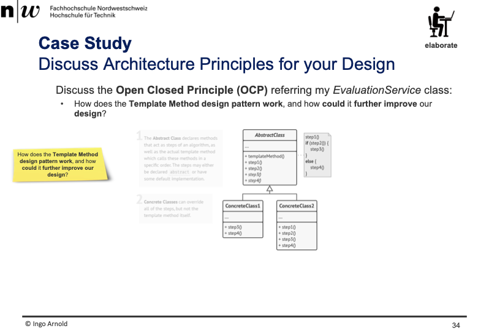
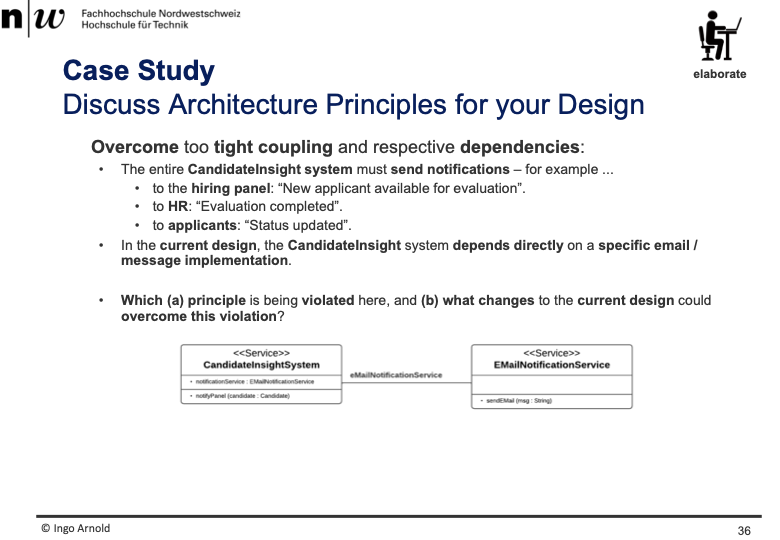
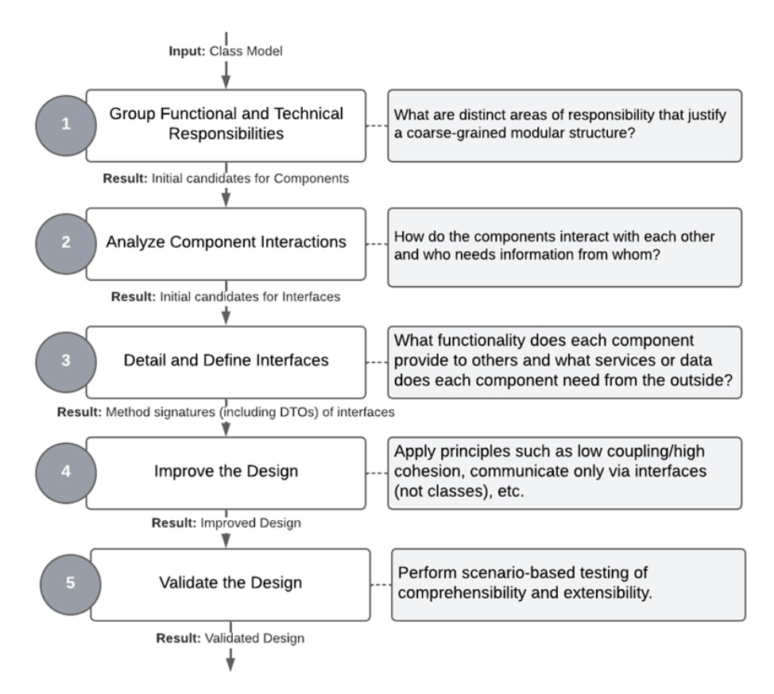
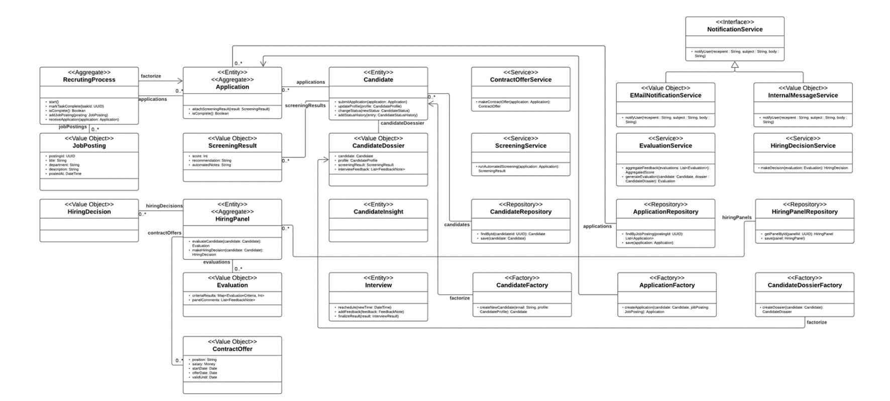
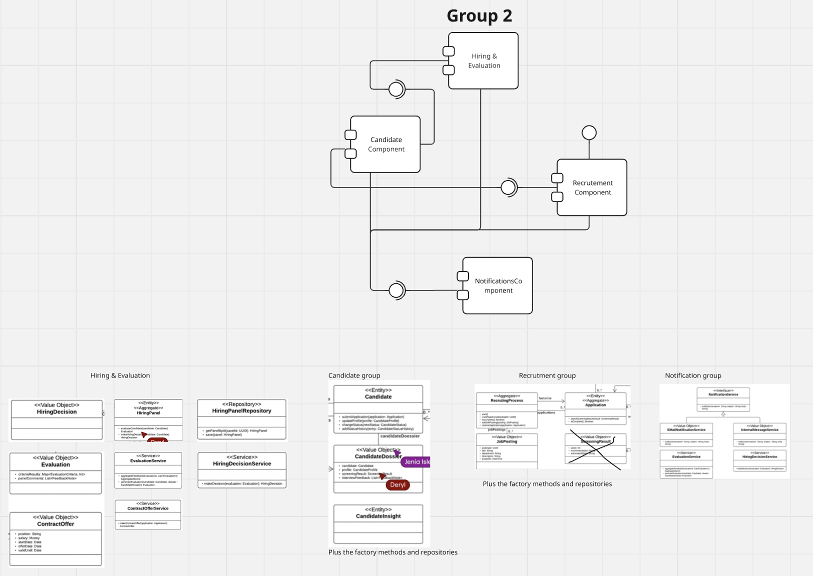

+++
title = "Week 10"
date = 2025-11-18
[taxonomies]
authors = ["fatlum"]
tags = ["swa"]
+++

# Software Architecture – Week 10

## OCP-Principle

- 
- die methode evaluation delegieren
- mit strategy pattern kann man das erreichen
- vererbung anwenden an dieser EvaluaitonService
- früh und elementar spezailisierung anwenden
- evaluationService-Klasse hat ein instanz von evealtionStrategy"Interface" und diese gibt ein stragy mit, für ctor
- das interface hat eine methode evaluate und bekommt ein candidate und dossier
- danach gibt konkrete klassen die eine evaluation implementieren
- bsp. ScoreBasedEvaluation und ValueEvaluationStrategy
- weiter mit decorater-pattern um klasse zu erweitern
- Eine menge von Strategien gibt zu evaluieren könnte man composite-pattern verwenden
- *beispiel für zweite variante*:
  - evaluateCandidate wollen wir weiter erweitern
  - weiteres pattern anhängen um das zu erweitern: template-method
  - grundidee:
    - auf eine ebene einer klasse die noch nicht fertig ist
    - es gibt eine algorithmische struktur
    - man kennt aber die einzelnen funktionspunkte
    - wenn man eine klasse noch nicht fertig ist, nutzt man template-method-pattern
    - die abstrakte klasse hat dann eine templateMethod()
    - templateMethod() muss final beschrieben sein
    - Open-Close -> delegation und inheritance
- 
- hier wird dependcy inversion verletzt
- hier wird konkrekte an email service gebunden, obwohl es weitere notification-services gibt

## wrap up

- ddd-lauf gemacht
- danach prinzipien dagegen gehalten
- design würde qualitativ wachsen -> mehr klassen
- das bringt uns zum neuen thema -> komponenten orientierung

## Komponenten Orientierung

- *Why are classes alone insufficient to design complex software
systems in a structured way?*
  - damit wir die beziehung zwischen komponenten reduzieren können
  - eine komponenten besteht aus mehreren klassen
  - hohe innenbezüglichkeit, loosere aussen bezüglichkeit

- *What advantages do components offer over classes/objects in terms
of maintainability and reusability?*
  - innerhalb der componenten muss bei einem refactor nicht vorgenommen werden
  - explizite interfaces, statt jede klasse redet mit jedem
  - innerhalb einer komponenten, eine hohe zusammengehörigkeit
  - zwischen komponenten loose kopplung

- *What is the key feature of a software component?*
  - hello

- *Which is NOT a typical feature of a component?*
  - frage beantworten

- *Why is a distinction made between interfaces and their
implementation in the context of component orientation?*
  - frage beantworten

- *What aspects and types of "binding" exist when components
cooperate with each other via a corresponding interface?*
  - repository pattern

- *What happens when a component changes its interface?*
  - andere komponenten die das nutzen/importieren können davon betroffen sein
  - muss nicht sein, weil bsp. es wird erweitert

- *What are the ingredients of the schema for a component in Java
that I introduced in the “Composition” chapter?*
  - komponenten sind wie bausteine, also kann man mehrere komponenten zu neuen komponenten definieren
  - wo es das nicht gibt, kann man das nachbauen quasi
  - zutaten um eine komponente zu bauen mit java boardmittel:
    - Binding, package
    - quasi eine methode bindU und dann die instanz variable mittels methode bind an dieses instanzvariable zu binden

## Components Orientation

- vorgehen komponenten zu machen:
  - 

- 
- das ist daraus resultiert:
  - 
- ähnliche Klassen, die das gleiche vorhaben, beispiel irgendetwas mit einem candidate zu machen, zu einem component machen
- diese components mit einem interface mit anderen components kommunizieren lassen
- nächstes thema: from mud to structure
