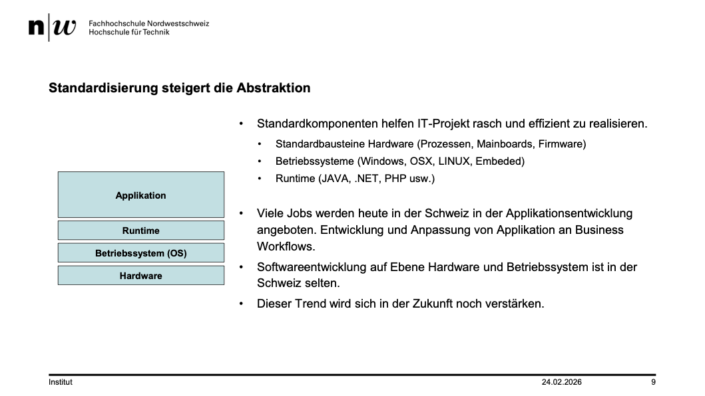
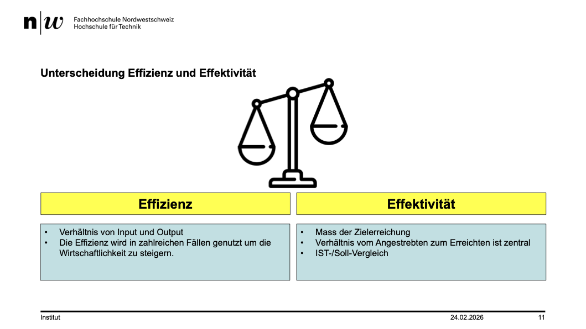
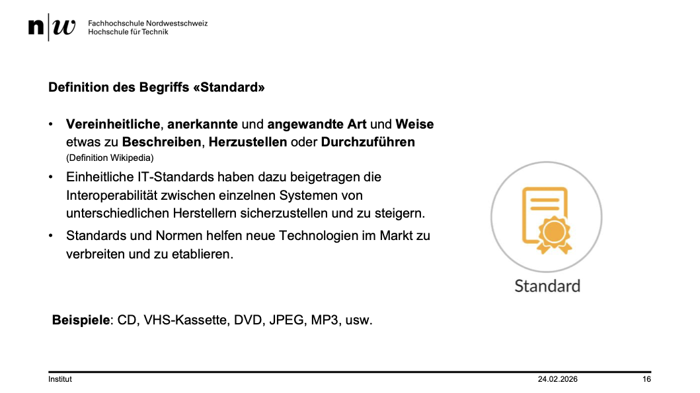
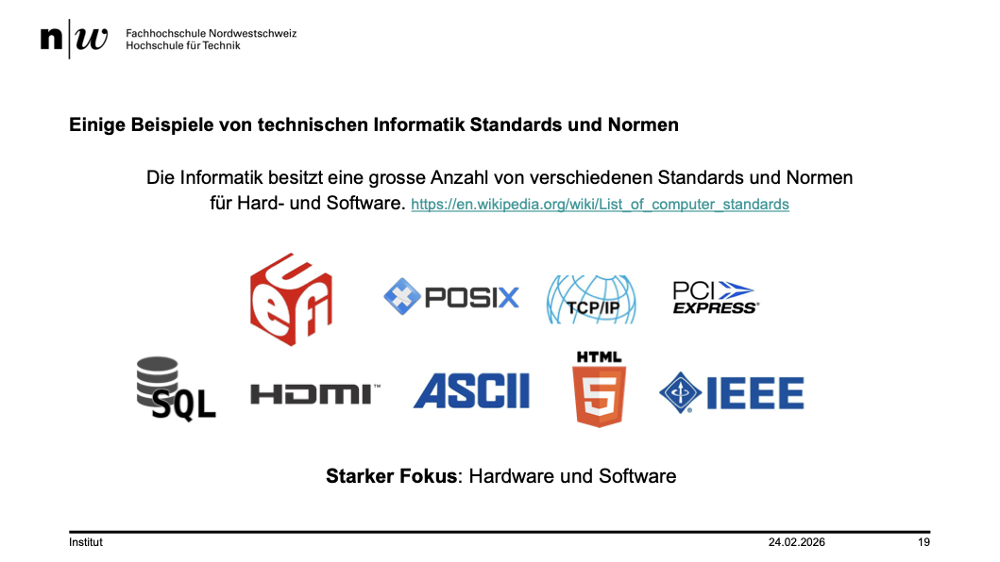
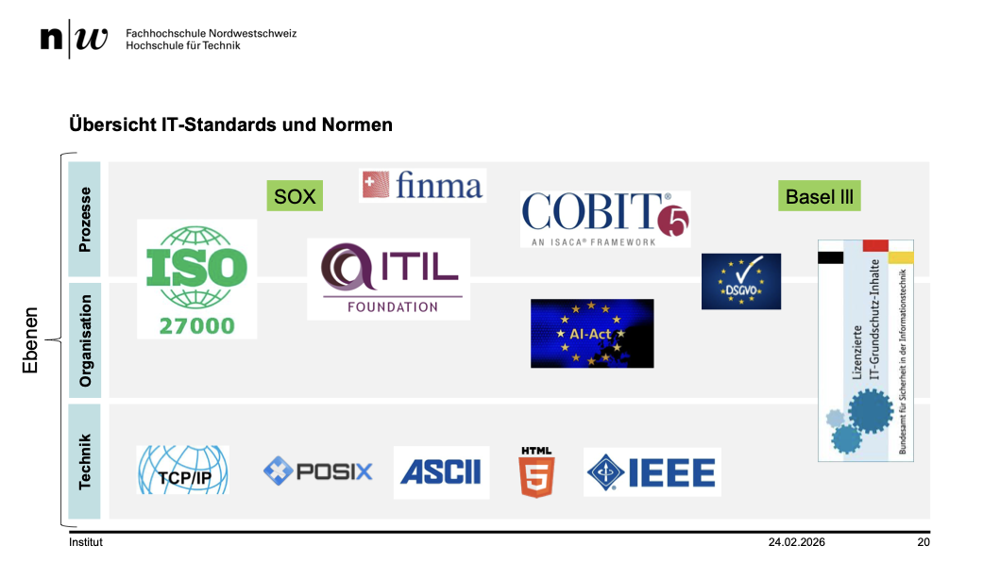
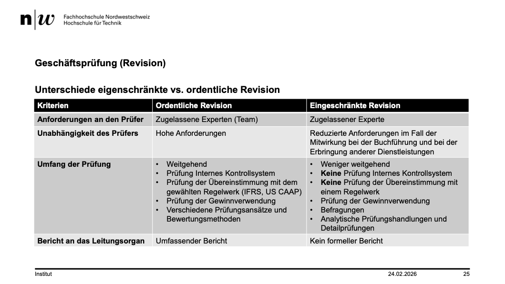
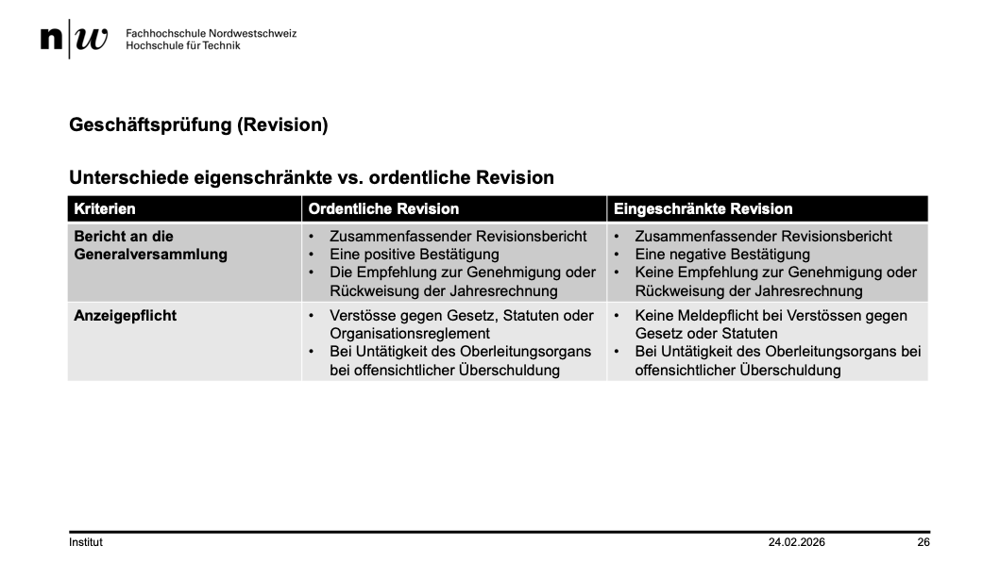
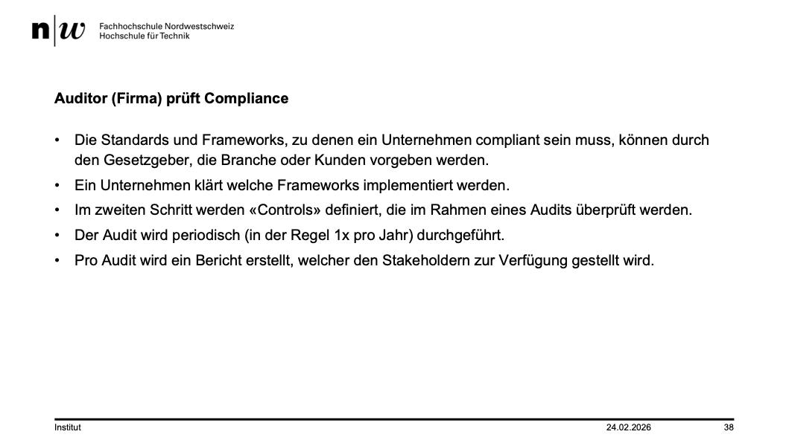
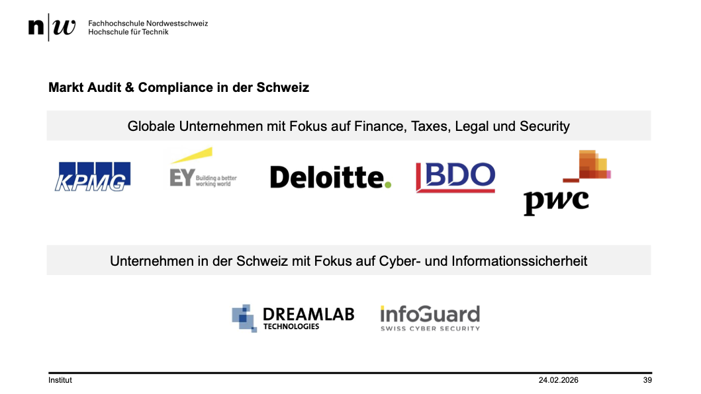

+++
title = "Week 01"
date = 2026-02-24
[taxonomies]
authors = ["fatlum"]
tags = ["itfs"]
+++

---

***Drehbuch: [Modulübersicht PCLS – Drehbuch](https://sgi.pages.fhnw.ch/moduluebersicht/2026fs/itfs/drehbuch.html)***

***Organisation:***

- Eine schriftliche Prüfung
- eine Case Study in einer 2er/3er Gruppe
- Prüfung: 31.03.2026 -> 50%

# Stoff erste Woche

## Geschichte der Informatik

- Einführung personal PC
- Nächster Meilensprung: 2007 Erfindung und Markteinführung Smartphone

## IT-Industrialisierung

- Wir befinden uns zwischen Manufakur und Industrielle Produktion

## Standardisierung steigert die Abstraktion

- 
- In zukunft ist es wichtig, den gesamten Zusammenhang zu verstehen

## Künstliche Intelligenz verändert IT-Branche radikal

- Kein selbständiges Coden mehr
- Alles mit KI machen in zukunft
- Schmeiss AI an und vollgas
- Was nicht automatisiert wird ist, Kommunikation mit Kunden

## Effizienz und Effektivität

- 

## Definition des Begriffs «Standard»

- Ohne Standard kein Internet
- 

## Verbreitung von Standards und Normen

- Guten Standard heisst nicht, dass es sich durchsetzt

## Framework

- Ein Rahmen
- Softwareentwicklung ohne Framework nicht möglich, nicht wirklich

## Technische Standards

- 
- 

## Revision

- ordnetliche Revision in der Schweiz
  - wenn mehr als 40 Mio obligatorisch
- unterschied beides revisionen:
- 
- 

- was wird geprüft?
  - alles, ohne informatik geht aber nichts

## Auditor (Firma) prüft Compliance

- 
- 

## Regulierungen
