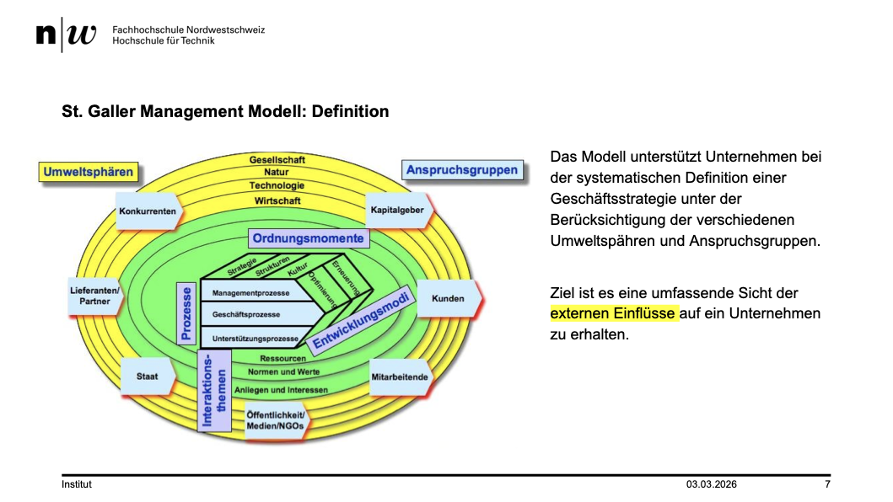
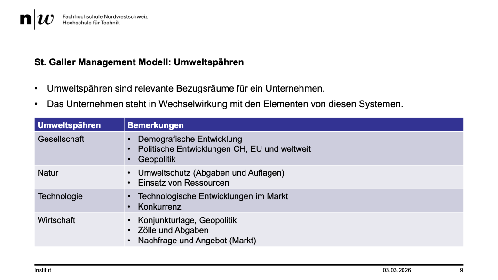
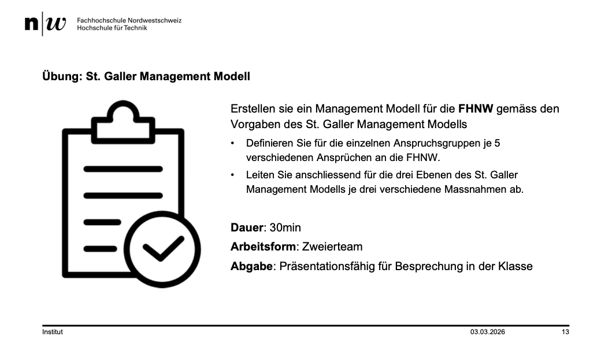
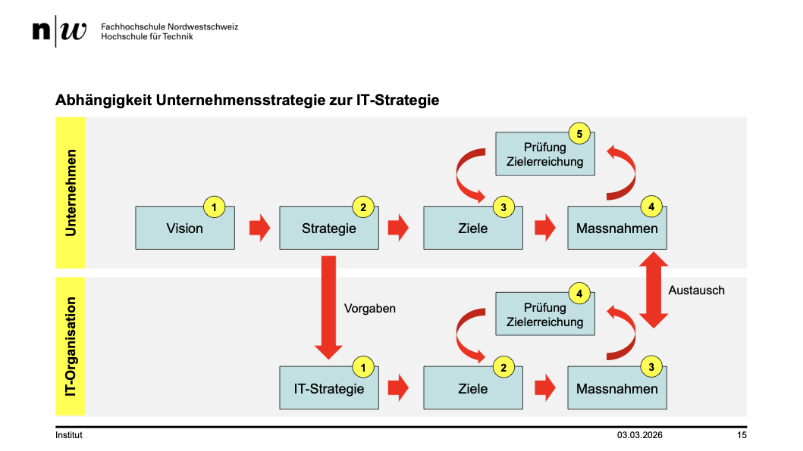
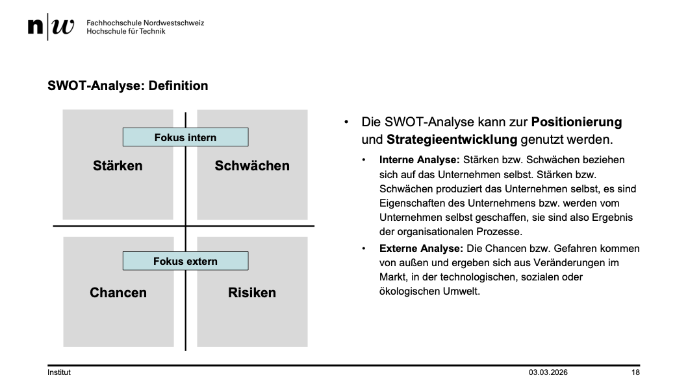
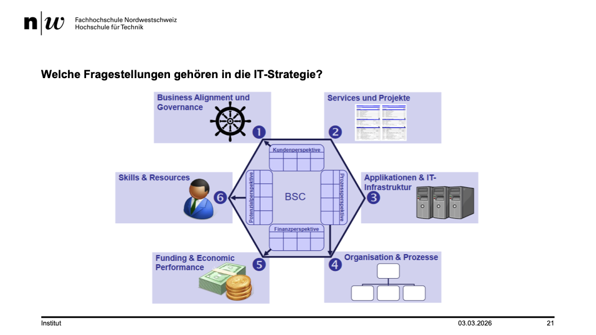
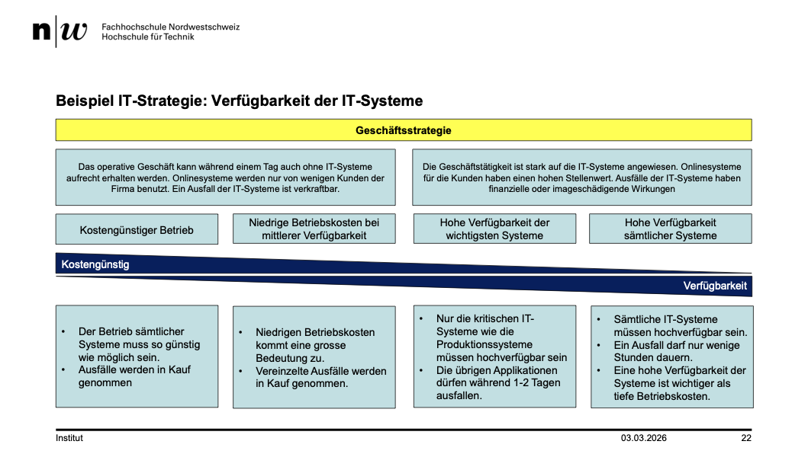
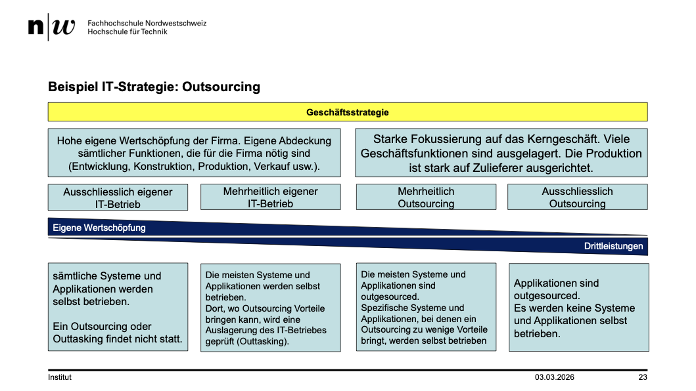
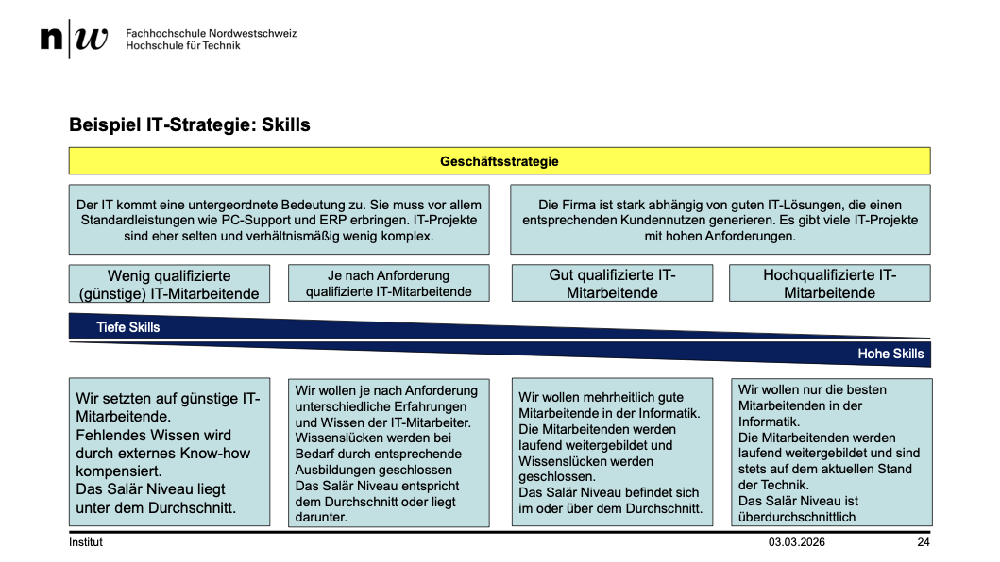

+++
title = "Week 02"
date = 2026-03-03
[taxonomies]
authors = ["fatlum"]
tags = ["itfs"]
+++

---

***Drehbuch: [Modulübersicht PCLS – Drehbuch](https://sgi.pages.fhnw.ch/moduluebersicht/2026fs/itfs/drehbuch.html)***

---

# IT-Strategie erarbeiten

## Notes

- stragetisch arbeiten
- eine vision haben, danach eine strategie, aus der strategie gibt es ziele und davon eine massnahme
- strategie ist häppchenweise einpacken um vision zu erreichen
- je nach unternehmen macht strategie alleine oder mit verwaltungsrat oder geschäftsleitung
- wieso machen wir das?
  - weil IT-ansatz ist unterschiedlich gross
- wie kann man u.strategien erarbeiten
- an HSG kann man das lernen
- daraus hat sich ein model entstanden
- 
  - in gelb:
    - umwelt, wir sind in einem ökosystem
    - was ist wichtig für mitarbeiter: wertschätzung, lohn, aufstiegsmöglichkeit
  - die unternehmen sind erfolgreich, die gute, motivierte, commitetet arbeiter für sich gewinnen
  - zeiten wo löhne in informatik stark gestiegen
  - die party ist aber vorbei
  - früher 140-200'000, das ist fix vorbei
  - die arbeiter müssen kreativ sein
  - home office wird sich auch wieder drehen
  - austausch und kreativität extrem wichtig
- konkurenten einfluss auf unternehmensstrategie:
  - extremwichtig in jedem unternehmen:
  - nicht jedes unternehmen lebt ewigs
  - die IT ändert fundamental
- staat:
  - wir leben in einer hoch dynamischen welt
  - im berufsleben müssen wir das genauso machen
- in der strategie gibt es viele werte
- wir müssen diese werte adressieren in der stratgie
- normatives management:
  - Legt die grundlegenden Werte, Prinzipien und den langfristigen Zweck (Mission und Vision) einer Organisation fest und gibt damit die übergeordnete Richtung vor
- 
- in einer guten strategie müssen wir diese themen ansprechen können
- prozessperspektive:
  - managementprozess
  - geschäftsprozess
  - unterstützungsprozess
- ordnungsmomente
- 
- Mein Teil:
- Anspruchsgruppen:
  - Studierende:
    - flexibel
    - aktuell
    - praxisnah
    - moderne Infrastruktur
    - gute Betreuung
  - Mitarbeiter:
    - gute Arbeitsbedingung
    - Lohn
    - Ferien
    - Forschungsfreiraum
    - Mitgeschaltung
  - Wirtschaft/Unternehmen:
    - gute absolventen
    - projekte
    - forschungskooperation,
    - innovationspartnerschaften

- Normatives Management (Werte & Grundausrichtung):
  - Leitbild für die verkörperten Studiengängen
  - Klare Vision
  - Verankerung von Nachhaltigkei
- Strategisches Management (mittelfristige Ausrichtung)
  - Ausbau von Kooperationen mit Wirtschaft/Firmen
  - Werbung an Oberstufen/Maturas
  - Spezialisieren in Zukunftsfelde
- Operatives Management (konkrete Umsetzung)
  - Einführung neuer Studiengänge
  - Optimierung von Prüfungsprozessen
  - Investition in moderne IT-Infrastruktur

- 
- Im Plenum:
- Kunden:
  - Studierende
  - Unternehmen -> Innovationen, Transfer
- Staat:
  - Geldmittel -> Steuern
  - Stabile Finanzen -> Expertise
  - Reputation
- Konkurenten:
  - Fairer Umgang -> Kooperation
- Mitarbeiter:

- 
- IT-Strategie muss auf Unternehmensstrategie abgestimmt sein
- CIO (Chief Information Officer)
- Strategie erarbeiten
  - 
  - Mit SWOT
  - Stärken, Schwächen, Chance, Risiken

## SWOT-Anlayse

- Thema: Einsatz KI Softwareentwicklung

- Stärken
  - Branchenwissen
  - Viel Erfahrung
  - Komplexe Lösung umgesetzt
  - Kreative Leute

- Schwächen
  - Flexibilität / Know-how neue Technologien
  - Alte Infrastruktur
  - Qualitätsbewusstsein
  - Komplexität (Produkte)

- Chancen
  - Time to Market
  - Neutrale Sicht
  - Neue Produkte
  - Kleines Team -> Grosser Markt

- Risiken
  - Abhängigkeit
  - Qualität
  - Sicherheit

- 
- Was für Projekte und interne Programme haben wir?
- Was für IT-Infra haben wir? Eigene Server oder Cloud?
- Was für Organisation haben wir?
- Wie viel Gelder bruache ich

- Kostengüntig und Verfügbarkeit der IT
- 
- 
- 

## Risk Management

- Scannen und Bedrohung erkennen
- Bedrohung bezüglich Verfügbarkeit, Inegrität, Vertraulichkeit, Informationen
- Ziel ist es, aus Bedrohung ein Risiko zu machen
- Bewertete Kombination aus Eintrittswahrscheinlichkeit und Auswirkung einer Ungewissheit auf ein Ziel, wobei die Konsequenz negativ (Schaden) oder positiv (Chance) sein kann
- Risikoanalyse machen
- Versicherung von Risiken:
  - Keine Versicherung abschliesen, die sie ein Regenschirm bekommen, den sie zurück geben müssen wenn es regnet
  - Bei IT-Versicherungen prüfen, was bedeckt ist

## Ransomware

- Lösegeld zahlen in der Schweiz ist legal
- Versicherungsverträge durchlesen, bei Krieg oder höherer Gewalt zahlen nichts
