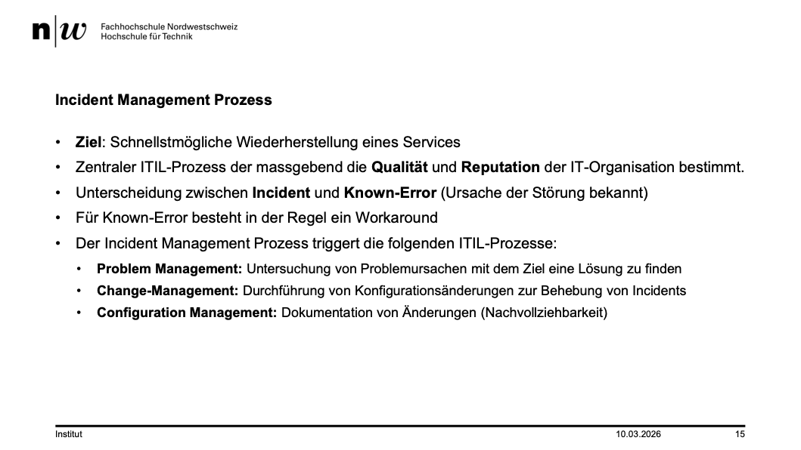
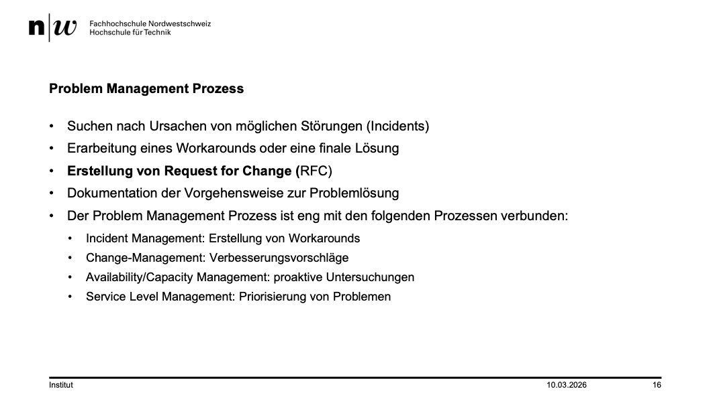
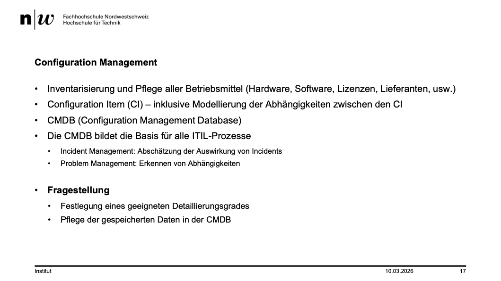
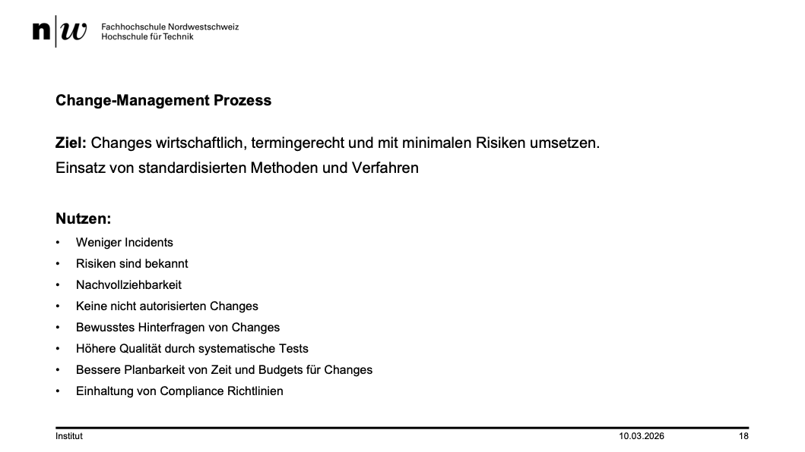
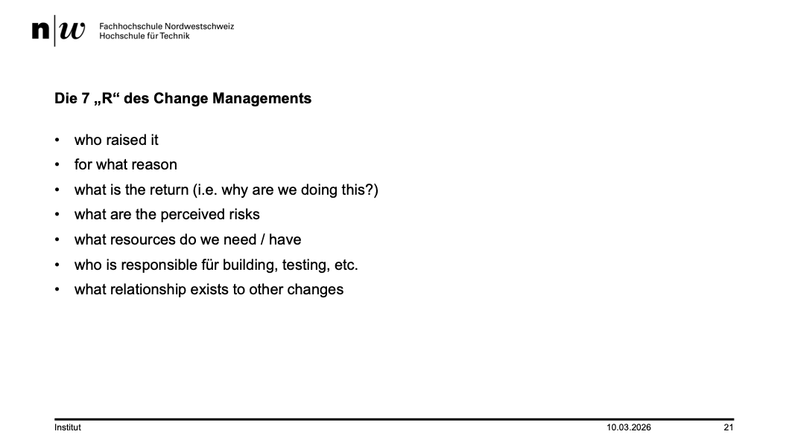
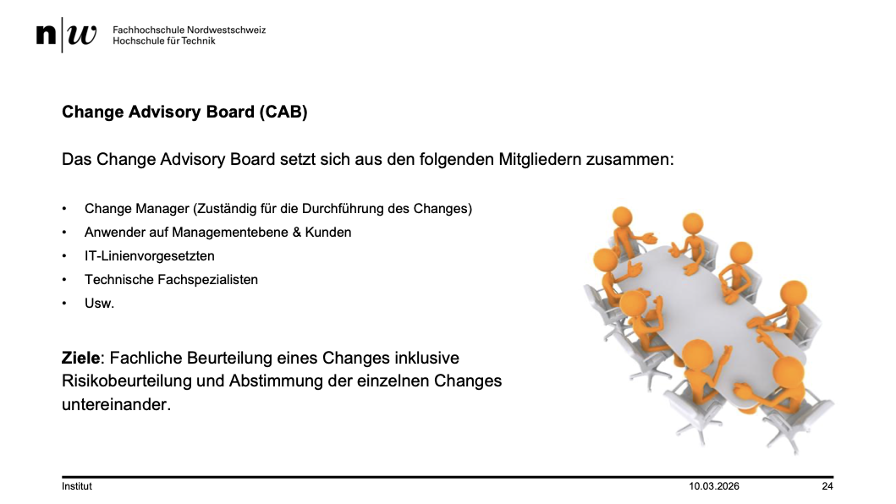
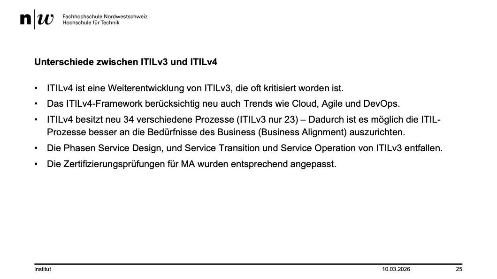
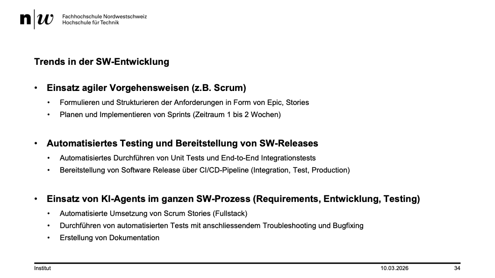
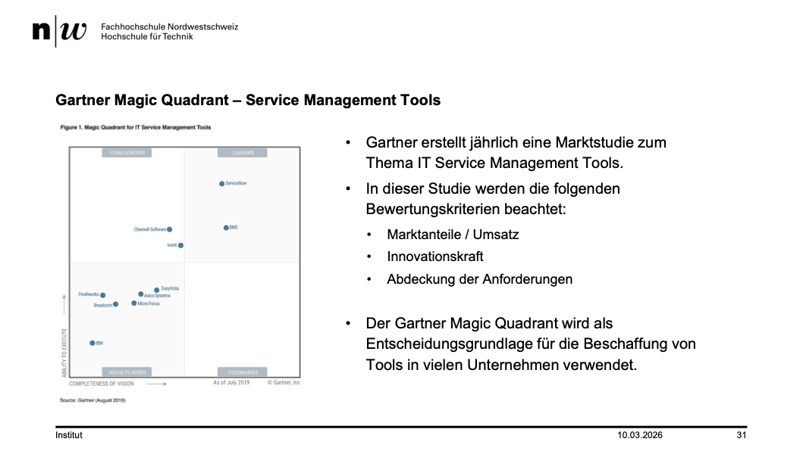

+++
title = "Week 03"
date = 2026-03-10
[taxonomies]
authors = ["fatlum"]
tags = ["itfs"]
+++

---

***Drehbuch: [Modulübersicht PCLS – Drehbuch](https://sgi.pages.fhnw.ch/moduluebersicht/2026fs/itfs/drehbuch.html)***

---

# Strategien

- Alle reden von von DevOps
- DevOps = Entwickler und Betrieb in einer Rolle
- Strategie:
  - Herkömmlichen Betrieb zu DevOps-Betrieb switchen
- Kultur:
  - Gewohnheit, Umgang ändern
- Organisation ändern
  - Flache Struktur, ein Team nach Service
- Know-How
  - Entwicklung | Server Engineer | Network | Security
- Was braucht man um jetzt auf DevOps-Betrieb um zu steigen:
  - Offene Mitarbeiter
  - Zeit und Geduld

## KMU Gründung

1. Krieg / 3. Weltkrieg -> Rohstoffe
2. Terror / Cyberrisiken
3. Inflation -> Energie / Rohstoffe
4. Zölle / Handelskonflikte
5. Digitale Souverinität (Office365, Windows -> alles USA)
6. KI als Wertvernichtung

# ITIL

- verschiedene versionen
- erfunden in great britain
- ist ein best practice ansatz
- 5 bereiche gibt es
  - strategie: was bieten sie an
  - desgin: wie bauen sie auf
  - transition:
  - operation: mit betrieb verdient man geld
  - improvement: betreiben und verbessern KVP
- alles das in ITIL definiert und standard
- phasenübersicht mit drei lifecyclephasen:
  - design, transition, operation
- in einem kreis, weil alles wiederholt sich am ende des tages

## Servicedesk

- wichtig, weil mit einem guten kundendienst spaltet man sich ab
- mit richtigen leuten am service desk kann man punkten
  - im zeitalter von AI ist jeder betrieb technisch gut aufgestellt
- kundenfokus wird immer wichtiger
- servicedesk kann man auf verschiedenen lvl betreiben
  - callcenter:
  - unskilled:
  - skilled:
  - expert:
- Rollen und Aufgaben in der Serviceorganisation:
  - unterschied lvl2 und lvl3: 3 hat tieferes verständnis
- was ist unterschied help- und servicedesk:
- was ist support:
  - melden fehler
  - bug fixing
- was ist helpdesk:
  - benutzer hat keine ahnung
  - weiss nicht wo welche funktion ist, etc.
- was ist servicedesk:
  - bietet SW an
  - in servicedesk ist support enthalten aber kein help desk
- was ist ein ITIL-Prozess
  - prozess hat folgende merkmale:
    - steuerbar und messbar
    - eingaben, ausgabe
    - ergebnis bewertbar und nachvollziehba

## Incident Management Prozess

- 
- BSP:
- Kunde melden Incident
- Ich bin verantwortlich und bin Engineer
- was ist wichtig für gute incident aufnahme:
  1. Kontakt aufnehmen -> sofort mit Kunden kommunizieren
  2. Status Update
  3. Arbeiten rapportieren -> eine gute dokumentation machen -> wichtigste
- es geht nicht das ein problem sofort gelöst wird
- eher sauber dokumentieren was war
- wenn man sauber dokumentiert und kommunziert passiert einem nichts

## Problem Management Prozess

- 
- Dieser Prozess erarbeitet eine finale Problemlösung
- Grösstes Problem in der IT

## Configuration Management

- 

## Change-Management Prozess

- 
- meisten ausfälle wegen falschen changes
- changes in rendundanz oder falsche configs am meisten
- hardware ausfälle extrem selten heutzutage
- gutes changemanagement hat das ziel mit dummen fragen auf grobe fehler zu achten
- also absichern, dass alles korrekt schritt für schritt gemacht wurde
- 
- ein change kann immer schief gehen
- ein backup oder snapshot von systemen vor dem change
- die backups unbedingt testen
- RFC beliebte prüfungsfrage
  - RFC ist request for change
- CAB
- 
- ein CAB nicht nur mit Managern
- ein change geht in die Hose, was ist das wichtigste wenn man am nächsten Tag mit dem Mitarbeiter redet
  - wenn man hart durchgreift, kann es sein dass MA sich nicht mehr melden und fehler selber ausbügeln will
  - gute fehlerkultur, gute feedback kultur ist A und O

## Unterschiede zwischen ITILv3 und ITILv4

- 
- man wollte mehr devops und mehr agilität rein bringen
- doing und agil sein ist im wiederspruch zu ITILv3

## Trends in der SW-Entwicklung

- 
- agil ist nur gut, wenn jemand saubere arbeitspakete definiert

## DEVOPS

- zum devops machen braucht man gute leute
- kultur sowie fachlich

## Gartner Magic Quadrant – Service Management Tools

- 
