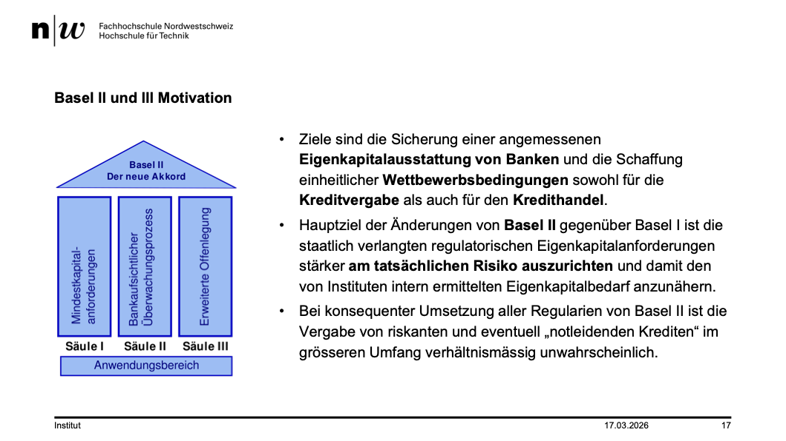

+++
title = "Week 04"
date = 2026-03-17
[taxonomies]
authors = ["fatlum"]
tags = ["itfs"]
+++

---

***Drehbuch: [Modulübersicht PCLS – Drehbuch](https://sgi.pages.fhnw.ch/moduluebersicht/2026fs/itfs/drehbuch.html)***

---

# Modul 9: Basel ll/lll und SOX Compliance

- wieso bringt er das thema banken etc?
- finanz branche ist eine wichtige branche
- vertrauen und wertschöpfung ist wichtig in einem unternehmen
- gesellschaft braucht wenig um kapput zu gehen
- IT-Sicherheit ist extrem wichtig

## Grundlagen Finanzbranche

- 6.9 Bio CHF verwaltet
- lange zeit ein riesen geschäft
- 4.4 Mrd. Steuern nur von den Banken
- Durch die Krisen immer mehr Compliance eingeführt worden
- Die Compliance Anforderungen so hoch, dass es sich kaum lohnt eine Bank zu eröffnen
- Bankgeheimniss weg gefallen
- Dadurch können wir keinen Mehrwert bieten für die Ausländer

## Basel I II III

- Ziel ist in einer Krisenzeit, das Banken nicht konkurs gehen
- Aus jeder Krise wurde gelernt
- 
- im Prinzip diverse Regeln damit eine Bank nicht bankrott geht

## Folgenden von Basel I II III

- Höhere Zinsen für Kunden mit niedriger Bonität

## Sarbanes-Oxley Act (SOX)
