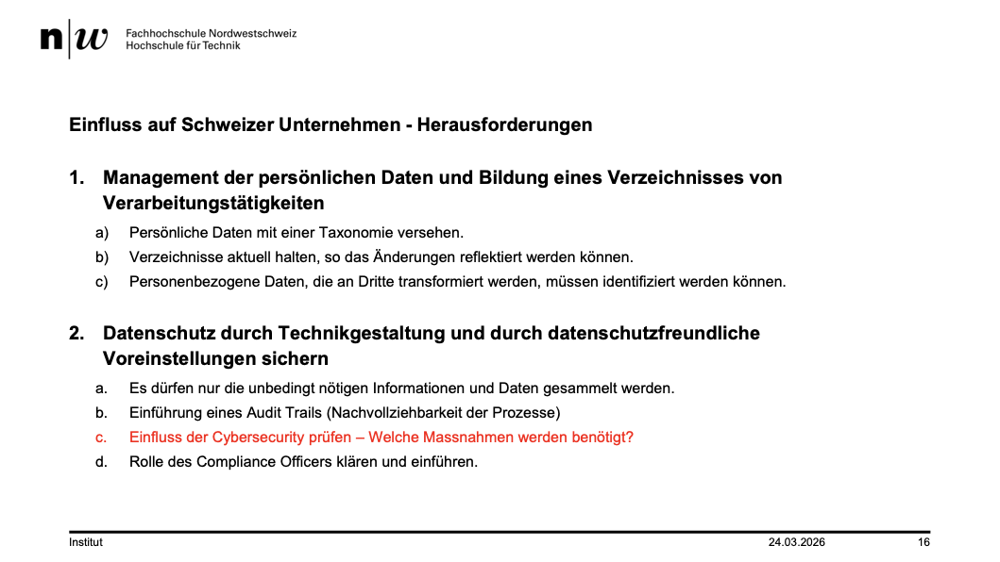
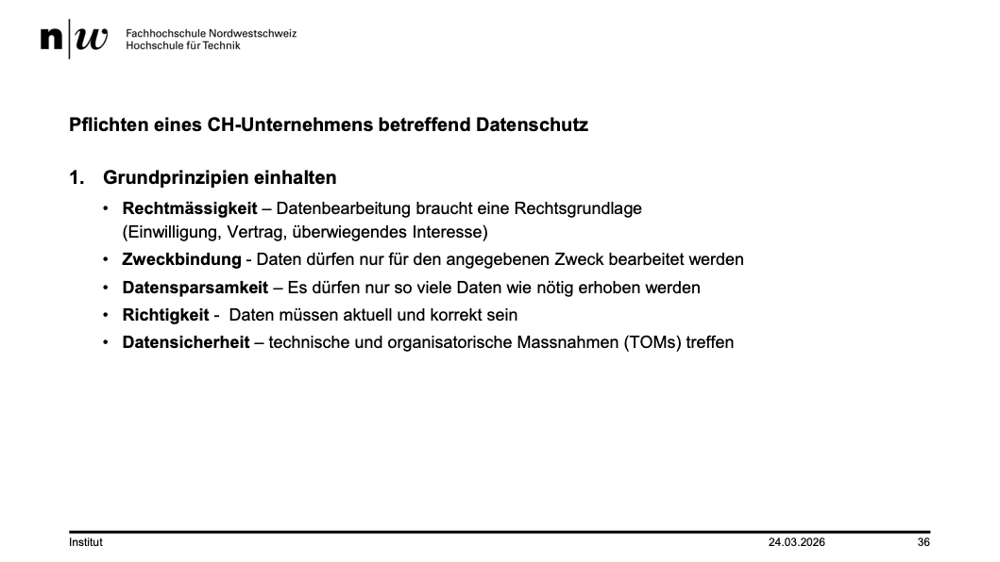

+++
title = "Week 05"
date = 2026-03-24
[taxonomies]
authors = ["fatlum"]
tags = ["itfs"]
+++

---

***Drehbuch: [Modulübersicht PCLS – Drehbuch](https://sgi.pages.fhnw.ch/moduluebersicht/2026fs/itfs/drehbuch.html)***

---

# Modul 10: Datenschutzgesetz und DSVGO

- Alle Gross- aber auch Kleinunternehmen speichern Daten von uns
- Wenn als privater Peson feststellen, dass Daten genutzt werden, dann muss man als Privatperson die Firma anklagen -> so gut wie unmöglich

## Datenschutzgesetz (CH)

- Schweiz hat im 2022 das Gesetz verabschiedet
- was wird geregelt:
  - naürliche Pesonen schützen
  - Harte Sanktionen eingeführt, wenn DS nicht eingehalten wird
  - besonders Schützenwerte Personendaten schützen (Biometrische, genetische)
- Als Firma muss man lösen, was passiert wenn Datenschutz gebrochen wird
- EU DSG sagt, verarbeiten von Personendaten nicht erlaubt
  - Schweiz ist erlaubt, wenn gewissen sachen eingehalten werden
  - Zweck, Datenminimierung, Richtigkeit, Speicherbegrenzung, Inegrität und Vertraulichkeit$
  - Grosses Problem bei den obigen Punkten:
    - Richtigkeit: Wie richtig sind Daten? Sicherstellen, dass das Messgerät vielleicht kein Problem hat
    - Datenminimierung: Was sind genug Daten genug? Also was beziehe ich an Daten?
    - Personendaten, die kein Problem sind:
      - Name, Adresse, Tel, Email, Geburtsdatum

- Auskunftsgesetz
  - in CH, rasch als möglich
  - in EU, sofort wenn jemand will

- 
- Mitlgiedererfassen SW:
  - Verschl. in DB
  - Benutzername + PW + 2FA
  - Berechtigung
  - Verschl. bei Uebertragung
  - Soft-Delete
  - Audit Log
    - Benutzer, Aktion, Zeit, Datum
- Problem mit E-DSG und Audit Trail

- Löschen der Daten, wenn ein User das will
  - Grosses Problem

- 3 Anbieter
  - Die Cloud die man nutzt z.B. muss auch DG einhalten

- Chief Compliance Officer (CCO)
  - Schaut das Compliance eingehalten wird
  - Also alle DG

## ePrivacy

- Anonymisieren

## Backup

- Policy:
  - Ein Backup pro Tag - > Speicherung 7 Tage
  - Wochen Backup -> 4 Wochen
  - Montatsbackup -> 12 Monate
  - Jahres Backup -> 3 - 10 Jahren
- Andere Policy -> 30 - 60 Tage
- Backups sind nicht mehr DS konform
- In einem Backup sind Name und andere Daten
- Lösung: Bevor Datengeschriebn in Backup, Anonymisieren und Eine Zuweisungstabelle halten
- Wenn jemand seine Daten löschen will, dann lediglich Eintrag aus Zuweisungstabelle löschen
- Auf Applikationsebene schon Massnahmen

## Massnahmen für ein CH-Unternehmen

- Muss man einfach machen
- Nur Daten die zum Zweck gebunden
- 
- Mitarbeiter macht falsch Deklaration -> Richtigkeit
- Massnahme, einen Check einfügen, wo der User klicken muss, dass er die Daten Korrekt sind

- Pflich eines Unternehmens:
 Verbindliche Pflichten eines Unternehmens
- Datenschutzerklärung – Erstellung und Publikation einer Datenschutzerklärung
- Verzeichnis der Bearbeitungstätigkeiten - Unternehmen mit mehr als 250 Mitarbeitenden oder mit
risikoreichen Bearbeitungen müssen ein internes Verzeichnis führen (Art. 12 DSG). Von dieser
Massnhame ausgenommen sind Kleinunternehmen ausgenommen, sofern kein erhöhtes Risiko besteht.
- Erstellung einer Datenschutz-Folgenabschätzung (DSFA) - Pflicht bei hohem Risiko für die
Persönlichkeitsrechte (z.B. Profiling, Gesundheitsdaten)
- Meldepflicht - Verletzungen der Datensicherheit müssen dem EDÖB (Eidgenössischer
Datenschutzbeauftragter) gemeldet werden. Zusätzlich müssen betroffene Personen bei hohem Risiko
ebenfalls informiert werden.
- Auftragsbearbeitung – Verträge mit Drittanbietern schriftlich regeln
- Auskunftsrecht – Betroffene Personen können jederzeit ihr Auskunftsrecht wahrnehmen.

- Besondere Datenkategorien prüfen und Daten identifizieren
  - Gesundheit Sozial Daten
  - Strafregistereinträge
  - Biometrische genetische Daten
  - Religiöse, politische, gewerkschaftliche Ansichten
  - Rassische / ethnische Herkunft

---

## Kommt in Prüfung

- Datenbank problem
  - Benutzer -> Gruppe -> Berechtigung
  - Problem mit diesem Ansatz:
    - Wenn ich Berechtigung bekomme, habe ich trotzdem vollen Zugriff auf die Datenbank
    - Lösung: Datenfilter einbauen, dass man trotzdem Berechtigung nur bestimme Datensätze angezeigt werden
    - Der Datenfilter könnte ein App Server sein

Zweites Thema:

- Office365 <-> Unternehmen <-> MA
- Auf Office ist Sharepoint, Email, etc.
- Was muss man den MA sagen/schulen:
  - Datenschutzerklärung für MA machen, IT-Richtlinien machen
  - Datenschutzerklärung: Schreiben das wir Office365 nutzen, und diverse Daten da drin gespeichert sind
  - IT-Richtlinie wo gesagt wird, dass MA Datenschutzerklärung akzeptiert

Softwareentwicklung:

- OnPremis Datenbank wo App drauf lauft
- Wenn Datenbank exportiert werden muss, was ist geregelt?
- Grosses Problem, wie klären, wenn man bei einem Kunde die die App OnPremise hat, die Datenbank oder sonstiges exportieren muss um zu Troubleshooten:
  - Hat man gesichertes Testsystem, verschlüsselung, tracing etc.

- Weiterer Punkt:
  - Kunde schliesst mit mir Vereinbarung ab
  - Ich muss mit allen meinen Lieferanten auch eine Vereinbarung schliessen
  - Grösse Gefahr in SW: Libraries

- Wichtig, in diesen vier Fällen verstehen, was es mit Datenschutz aufsich hat

Prüfung im Raum 1.021 um 15:15
