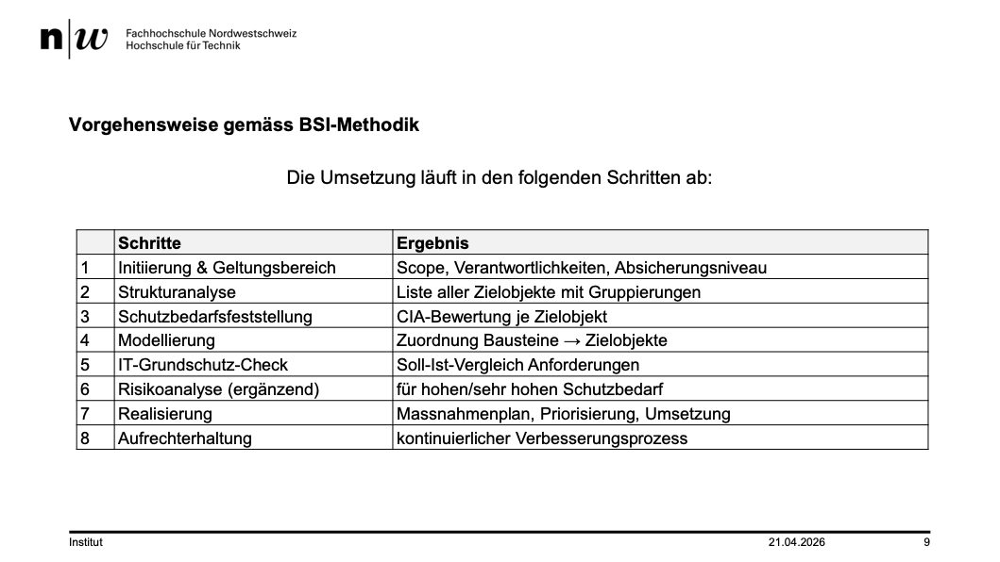

+++
title = "Week 07"
date = 2026-04-21
[taxonomies]
authors = ["fatlum"]
tags = ["itfs"]
+++

---

***Drehbuch: [Modulübersicht PCLS – Drehbuch](https://sgi.pages.fhnw.ch/moduluebersicht/2026fs/itfs/drehbuch.html)***

---

# Modul 8: BSI IT-Grundschutzkompendium (Teil 2)

- lokale entwicklungsumgebung bauen:
  - Tools
  - Einstellung
  - Packages
  - Datenset

- Code wird in git abgelegt
- wie sieht das bei dozenten firma aus:
  - eine entwicklungsumgebung im .NET
  - alle services, API und weiteres laufen sicher bei ihnen lokal
- was braucht es das um das für kunden zu deployen?
- Bei k8s cluster zum beispiel:
  - tanent/mandanten-fähigkeit?:
    - man deployt für jeden kunden die services
    - jeder kunde hat seine environment-variables
    - somit kann jeder kunde gezielt auf eine DB zugreifen
- wenn app über internet verfügbar sein soll:
  - dns -> app.test.ch
  - reverse-proxy
  - FW
  - keycloack server
- wie sieht das aus sicherheitsüberlegungen aus:
- 
  - Schritt 1:
    - Rollen & und Verantwortlichkeiten
    - Absicherungsniveau wählen
  - Schritt 2:
    - Strukturanalyse
    - Geschäftsprozesse / Anwendungen
    - Welche Systeme brauche ich?
    - Netze
    - Standorte
    - Kommunikationsverbindungen
  - Schritt 3:
    - Schadenskategorien definieren
      - Bei "Finanzieller Schaden" Zahlen definieren
    - Schutzbedarf Anwendung
    - Vererbung auf IT-Systeme
    - Vererbung auf Netze
  - Schritt 4: Modellierung
    - Was müssen wir Umsetzung um den Schutzbedarf abzudecken
    - Prozessbausteine
    -
