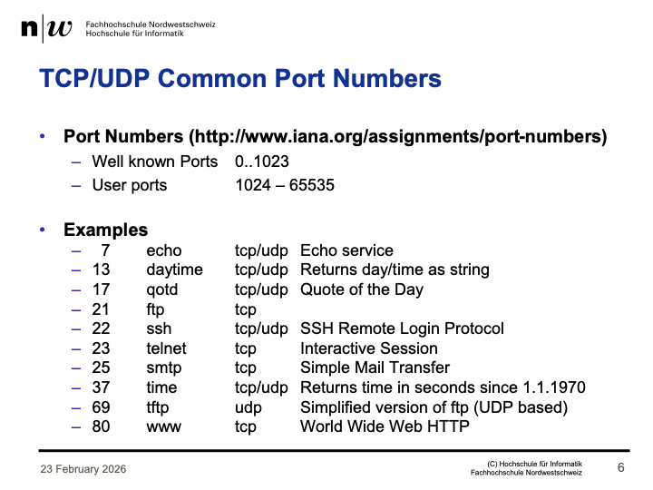
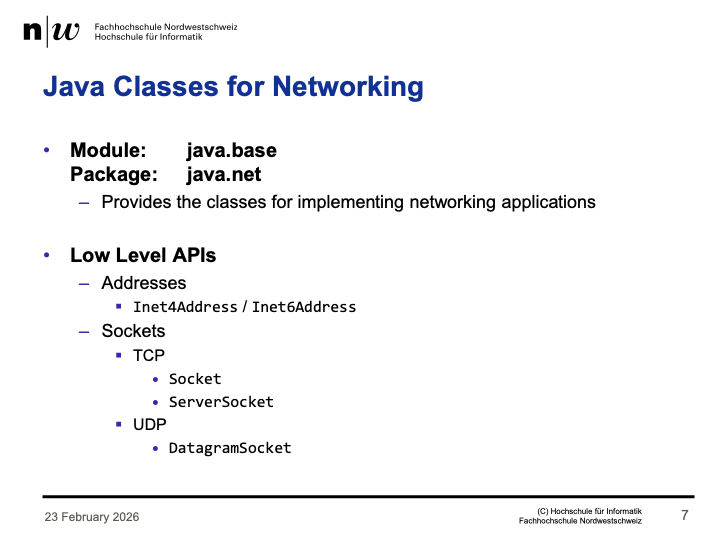
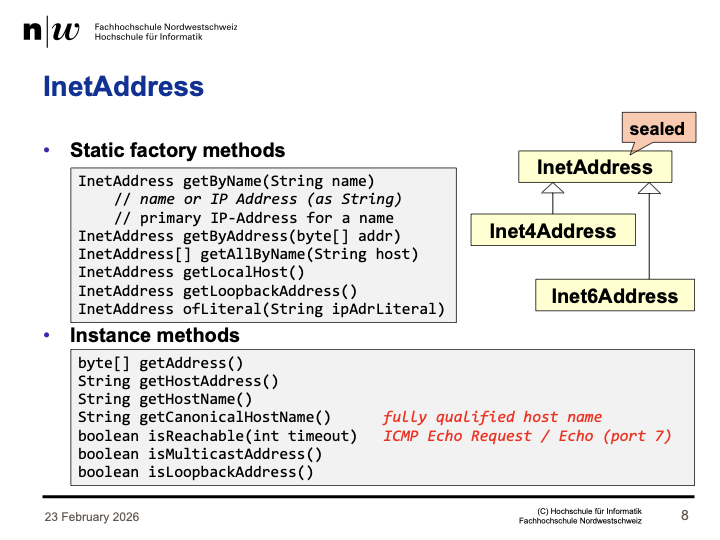
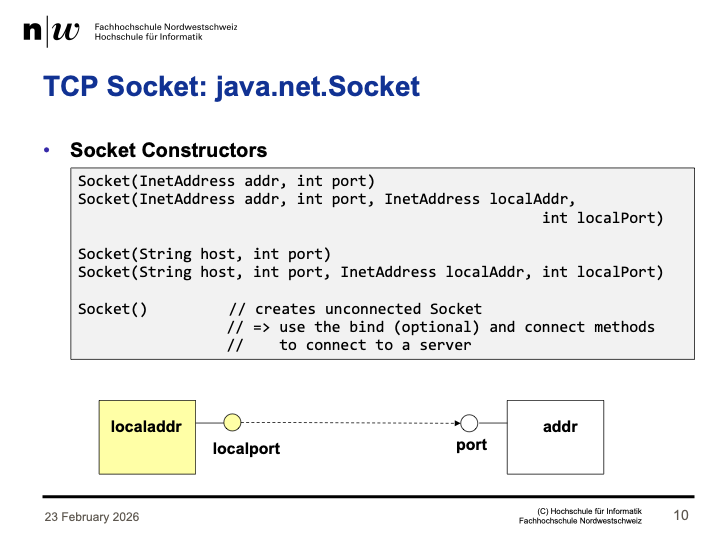
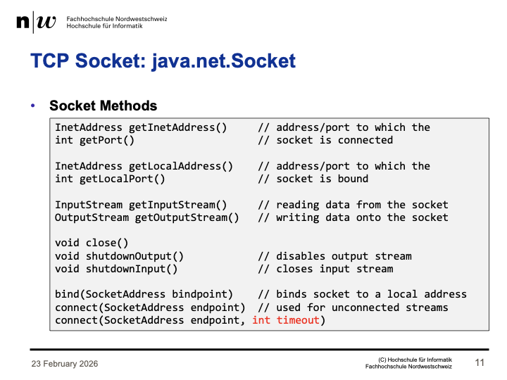

+++
title = "Week 01"
date = 2026-02-23
[taxonomies]
authors = ["fatlum"]
tags = ["Vesys"]
+++

---

## Socket

- Socket muss geschlossen werden, wenn man nicht mehr kommunizieren will
- teil des protokolls
- socket sind basis aller technologien
- REST, GraphQL sind http protokolle
- diese laufen alle über socket
- Portnummern gibt es konventionen
- 

## Java for networking

- 
- ServerSocket für Dienst bereitstellen
- 
- es gibt nur diese klassen, sie sind sealed
- adresse als byte angeben möglich
- git all by name bekommen wir array
- auf eine inetadresse-objekt können die instanz methoden verwendet werden
- 
- klasse socket
- 
- input stream, daten lesen
- close() wenn socket nicht mehr gebraucht wird
- mit dieser klasse auf jeden http server zugreifen

## ServerSocket

- Klasse um einen Dienst bereit zu stellen
- Port kann nur von einem Dienst genutzt werden

## Assignement

- Als Proxy objekt nachfragen, ob man get balance übertragen kann
- Für Bank sowie für Account braucht es Proxy
- Wie sieht das Protokoll aus?
- Frei mit welcher Technologie der Server implementiert wird
- wie serialisiert man die attribute etc. müssen wir selber machen
- zeurst local driver implementieren
- die local bank, kann dann für alle weiteren implemenrtierungen verwendet werden
- Test kann man machen
