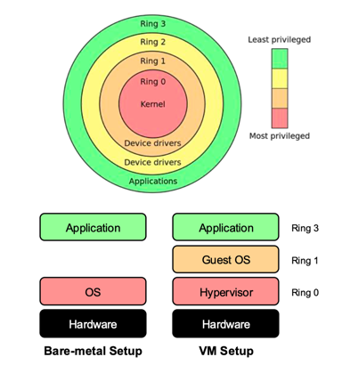

+++
title = "Week 01"
date = 2025-09-19
[taxonomies]
authors = ["fatlum"]
tags = ["cloud"]
+++

## Learning target
- technisches Wissen über Cloud-Technologien
- Wissen über die Konzepte der darunterliegenden Technologie
- selbst Plattformen aufbauen
- verstehen, was es braucht, um eine Cloud zu bauen

## Vorlesungsstruktur
- IaaS:
  - virtualisieren
  - Lab: Proxmox
- PaaS:
  - Container, Paravirtualisieren
  - Labs: Container, Docker, Swarm, Kubernetes
- SaaS:
  - Storage
  - Lab: Ceph Storage

***Lecture (on-site)***
- normale Vorlesung:
  - kein Recording
- BSS: Lab-Session
  - wir bauen Cloud-Plattformen
  - 4 Sessions, kein aktiver Content

***Assessment: building platforms***
- keine wöchentlichen Hausaufgaben
- wir bauen **4** Plattformen
- zu jeder Plattform ein **individueller** Screencast
- jede Plattform → **25 %** zur Erfahrungsnote
- gemeinsam bauen, gleicher Anteil pro Person

***Daten***
- Proxmox (IaaS)
  - Duration: 26.9 – 9.10
  - BSS: 3.10
- Container, Docker Swarm (PaaS)
  - Duration: 17.10 – 30.10
  - BSS: 24.10
- Container, Kubernetes (PaaS)
  - Duration: **7.11 – 20.11**
  - BSS: **14.11**
- Storage, Ceph (SaaS)
  - Duration: 28.11 – 11.12
  - BSS: 5.12

***Wie Gruppenarbeit***
- 1er–3er-Gruppen (bevorzugt 2)
- Plattformen auf SwitchEngines
- Bewertung via Ansible + SSH
- User **eval** mit Root/Sudo und hinterlegtem Pubkey

***Motivation***
- Cloud-Market wächst
- Software „frisst“ Infrastruktur
- IaC-Tools werden brauchbar
- Shift-Left: Dev braucht Cloud-Know-how
- 3 Dinge für AWS-Server:
  - Geld, E-Mail, Internet

# Frontaler Unterricht T1

***history of cloud computing***
- 1960, Mainframe:
  - alte Computer-Architektur
  - Timesharing, mehrere SW gleichzeitig
- 1969, ARPANET:
  - Vorläufer des Internets
- 1970, Virtualization
- 1997, Cloud Computing (Begriff)
- 1999, **Salesforce**, Cloud kam dazu
- 2006, Amazon startet **EC2** und **S3**

***Cloud Computing***
- es gibt keine Cloud, es ist der Computer von jemand anderem
- 5 Charakteristiken
  - **On-Demand Self-Service**: Ressourcen werden ohne menschliche Interaktion provisioniert
  - **Broad Network Access**: über Netzwerk erreichbar
  - **Resource Pooling**: Ressourcen werden mehreren Nutzern bereitgestellt
  - **Rapid Elasticity**: Ressourcen können dynamisch wachsen oder schrumpfen
  - **Measured Service**: Nutzung messbar, Pay-as-you-go

***How can clouds be provided? – Cloud Deployment Models***
- **Private Cloud** für eine einzelne Organisation
  - innerhalb der Firewall
  - kann Third-Party-managed sein
  - skaliert oft schlechter als Public Cloud
- **Public Cloud** für die Allgemeinheit
  - Multi-Tenant
  - allgemeiner Nutzen
  - eingeschränkte Datenkontrolle → **Confidential Computing** als Thema
- **Community Cloud** für Organisationen mit geteilten Anforderungen (z. B. Staat, Uni)
- **Hybrid Cloud**
  - Kombination aus mehreren Cloud-Infrastrukturen (z. B. Private + Public)

***Services***
- wenn ich **PaaS** anbieten will, nutze ich **IaaS** darunter
- wenn ich **SaaS** anbieten will, nutze ich eine **PaaS** darunter
- Grenzen sind teils verschwommen
- Fragen zur Einordnung IaaS/PaaS/SaaS:
  - muss ich OS selbst managen/auswählen? → **IaaS**
  - schreibe ich keinen eigenen Code? → **SaaS**
  - OS/Virtualisierung gegeben, ich bringe App/Runtime/Libs → **PaaS**

- ***IaaS***
  - umfasst v. a. Physik: Network, Storage, Compute, Virtualisierung
  - darüber beginnt die eigene Verantwortung
- ***PaaS***
  - Network, Storage, Compute, Virtualisierung, OS, Tools & Libraries, Application Runtime vom Provider
  - Kunde liefert Daten und App
  - weit verbreitet
- ***SaaS***
  - Provider managt alles
  - man schreibt keinen Code mehr

## Fragen
- What is ARPANET?
- You need to migrate Windows-Instances to your new cloud. What level of service class are you using on the new cloud?
- What types of clouds are existing according to NIST?
- What necessary criterias exist for clouds according to NIST?
- Why are the denoted cloud layers much less dependent on each other than the layers from the OSI model?
- The following tech stack is given: map the elements of the tech stack to the cloud layer model:

# Frontaler Unterricht T2

- **abstraction vs virtualization**
  - **abstraction**
    - tieferes Level verstecken
    - OS macht das oft
    - ein File ist eine Abstraktion von Storage-Blöcken
  - **virtualization**
    - virtuelle Repräsentation einer Ressource
    - nichts wird versteckt
    - volle Flexibilität über Speicher und andere Komponenten

***VM***
- **process virtual machine**
  - kein typischer Rechner
  - nutzt Intermediate Language, z. B. Java Bytecode
  - Bsp.: JVM
- **system virtual machine**
  - versucht die komplette Hardware zu „mimen“
  - Beispiele: Xen, KVM, VMware
- Fokus: **Type-1-Hypervisor**

***Anforderungen an Virtualisierung (Popek/Goldberg)***
- **Efficiency** – möglichst geringer Overhead, gute Performance
- **Resource Control (Safety)** – Isolation Guest↔Host und zwischen Guests
- **Equivalence** – gleiches Ergebnis mit und ohne VMM

***Hypervisor Type 1***
- Full-Virtualization mit Binary Translation
- Paravirtualization (OS-Assisted)
- Hardware-assisted Virtualization

***x86 Privilege Rings***
- 4 Ringe, Ring 0 am privilegiertesten
- nur höher privilegierter Code kann tiefer zugreifen
- Ring 0: Kernel/Hardware-Interaktion
- Vergleich:
  - **Bare-metal Setup**: App → OS → Hardware
  - **VM Setup**: App → **Guest OS** → **Hypervisor** → Hardware
- 

***Full Virtualization using Binary Translation (Type I)***
- Kernel-Instruktionen werden umgeschrieben
- User-Level-Code läuft direkt
- + Gast-OS unverändert; hohe Performance
- − schwierig zu implementieren; Übersetzung kostet

***Paravirtualization (Type I)***
- Gast-Kernel nutzt Hypercalls
- + weniger Overhead
- − schlechtere Portabilität, OS-Modifikation nötig

***Hardware-assisted Virtualization (Type I)***
- CPU-Erweiterungen (Intel VT-x, AMD-V)
- VMM läuft in Root-Mode
- privilegierte Instruktionen lösen Trap zum Hypervisor aus
- + schnell und heute Standard
- − IO-Virtualisierung braucht weiter Übersetzung

Nächstes Mal: „02-1 – cloud – Virtualization.pdf“ ab Seite 14 weiterlesen.
