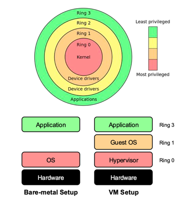
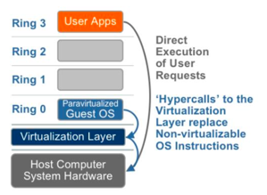
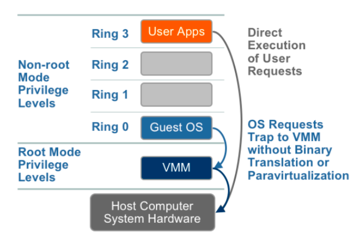
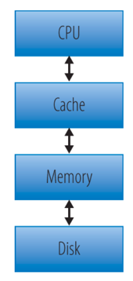
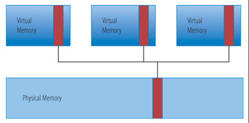
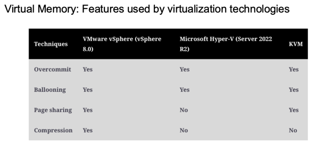
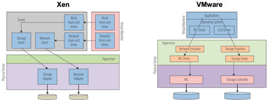
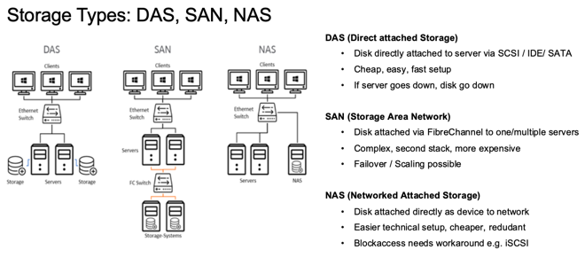
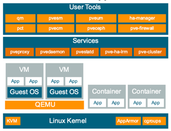
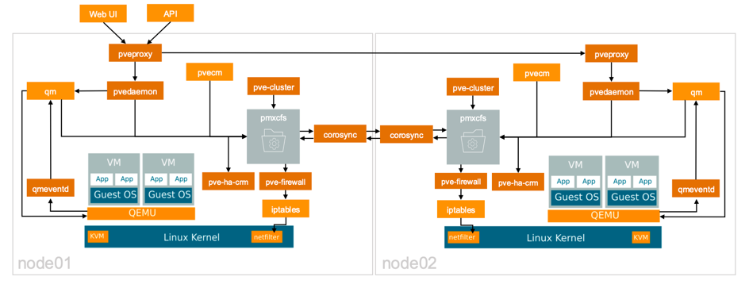

+++
title = "Week 02"
date = 2025-09-26
[taxonomies]
authors = ["fatlum"]
tags = ["cloud"]
+++

[Drehbuch](https://sgi.pages.fhnw.ch/moduluebersicht/cloud/drehbuch.html)  
[Aufgaben](https://spd.pages.fhnw.ch/module/cloud/platforms_site_generated/cloud-reports/hs25/index.html)

Abgabe erstes Projekt: **09.10.2025**

---

## Virtualization

- **abstraction vs virtualization**
  - **abstraction**
    - tieferes Level verstecken
    - OS macht das oft
    - ein File ist eine Abstraktion von Storage-Blöcken
  - **virtualization**
    - virtuelle Repräsentation einer Ressource
    - nichts wird versteckt
    - volle Flexibilität über Speicher und andere Komponenten

***VM***
- **process virtual machine**
  - kein typischer Rechner
  - nutzt Intermediate Language, z. B. Java Bytecode
  - Bsp.: JVM
- **system virtual machine**
  - versucht die komplette Hardware zu „mimen“
  - Beispiele: Xen, KVM, VMware
- Fokus: **Type-1-Hypervisor**

***Anforderungen an Virtualisierung (Popek/Goldberg)***
- **Efficiency** – möglichst geringer Overhead, gute Performance
- **Resource Control (Safety)** – Isolation Guest↔Host und zwischen Guests
- **Equivalence** – gleiches Ergebnis mit und ohne VMM

***Hypervisor Type 1***
- Native
- Full-Virtualization mit Binary Translation
- Paravirtualization (OS-Assisted)
- Hardware-assisted Virtualization

***x86 Privilege Rings***
- 4 Ringe, Ring 0 am privilegiertesten
- nur höher privilegierter Code kann tiefer zugreifen
- Ring 0: Kernel/Hardware-Interaktion
- Vergleich:
  - **Bare-metal Setup**: App → OS → Hardware
  - **VM Setup**: App → **Guest OS** → **Hypervisor** → Hardware
- 

***Full Virtualization using Binary Translation (Type I)***
- Kernel-Instruktionen werden umgeschrieben
- User-Level-Code läuft direkt
- + Gast-OS unverändert; hohe Performance
- − schwierig zu implementieren; Übersetzung kostet

***Paravirtualization (Type I)(PV)***
- Gast-Kernel nutzt Hypercalls zum kommunizieren mit Hypervisor statt direkt mit Hardware
- + weniger Overhead, einfacher zu implementieren
- − schlechtere Portabilität, Guest-OS-Modifikation nötig
- 

***Hardware-assisted Virtualization (Type I) (HVM)***
- CPU-Erweiterungen (Intel VT-x, AMD-V)
- VMM läuft in Root-Mode
- privilegierte Instruktionen lösen Trap zum Hypervisor aus
- + schnell und heute Standard
- − IO-Virtualisierung braucht weiter Übersetzung
- 

***Intel Virtualization Technology (VT-x)***
- VM control structure (VMCS) überprüft, ob ein Call privilegiert ist
- wenn ja → Trap zum Hypervisor (vmexit), nach Abarbeitung zurück zur VM (vmentry)
- VMCS speichert CPU-Kontext (Register etc.) für schnelle Umschaltung

***Example: Amazon EC2***
- AMIs brauchen entweder HVM oder PV
- HVM ist Standard für CPU und Memory
- PV-Treiber (z. B. Storage, Network) können in HVM-Instanzen genutzt werden → bessere IO-Performance

***Example: KVM (Kernel Virtual Machine)***
- Hypervisor als Linux-Kernelmodul eingebaut (seit 2007, Kernel 2.6.20)
- unterstützt HVM (Intel VT-x, AMD-V) und PV für IO (VirtIO API)
- QEMU emuliert Hardware (CPU, Devices) → läuft oft zusammen mit KVM
- **Hypervisor-Typ?**
  - KVM: Host-OS ist selbst Hypervisor → Type 1
  - QEMU: Emulation als Prozess → Type 2

***Xen***
- läuft direkt auf Hardware
- spezieller Guest „Dom0“ (privilegiert) übernimmt Management und IO
- normale Guests „DomU“ laufen darauf
- Virtualisierungstechniken:
  - PV: braucht spezialisierten Kernel, sehr leichtgewichtig
  - HVM: volle Virtualisierung (mit VT-x/AMD-V)

***Virtual Resources: CPU***
- Zeit-Slicing der CPU zwischen Guests
- kein fixes Mapping vCPU↔physische CPU
- Hyperthreading macht Scheduling einfacher (nicht doppelt so schnell, aber ~30 % Mehrleistung möglich)
- vCPU-Berechnung:  
  (Threads × Cores) × Physical CPUs = vCPUs
- typische Ratios: 1:1–3:1 (compute-intensiv), bis 6:1 (weniger Last)
- Befehl: `lscpu` zeigt CPU- und Virtualisierungs-Infos

***Virtual Resources: Memory***
- Host sieht Guest als Blackbox
- Paging auf Host-Ebene teuer → deshalb Techniken wie Ballooning, Overcommitment, Memory Sharing
- 

***Virtual Memory: Ballooning***
- Balloon-Treiber im Guest gibt vom Guest nicht benötigtes RAM frei
- Host kann Speicher anderweitig nutzen
- Problem: wenn Guest später RAM wieder braucht → Paging von Disk zurückladen (Performance-Killer)

***Virtual Memory: Overcommitment***
- nur aktiven Guest-Speicher auf Host-RAM mappen
- inaktive Blöcke bleiben ungemappt
- Ratio bis ca. 2:1 möglich
- erfordert Wissen über Memory-Patterns der Guests

***Virtual Memory: Sharing***
- gleiche Pages (z. B. gleiche OS-Binaries) zwischen mehreren VMs nur einmal im Host-RAM
- spart 10–40 % Speicher
- Copy-on-write falls Guest etwas verändert
- eher bei horizontal skalierten Systemen praktisch
- 
- 

***Virtual Resources: Storage***
- Disks werden als Blockdevices in Guests gemappt
- Filesystem wird vom Guest erstellt, Host/Hypervisor sieht nur Blöcke
- Architektur: NIC ↔ SAN oder NAS
- 

***Storage Types***
- **DAS** – direkt an Server, günstig, schnell, aber kein Failover
- **SAN** – über FibreChannel, teuer/komplex, aber skalierbar und Failover möglich
- **NAS** – übers Netzwerk, günstig, einfacher, braucht Workarounds für Blockzugriff (z. B. iSCSI)
- 

***Thin vs Thick Provisioning***
- **Thick:** gesamter Platz reserviert, evtl. Verschwendung
- **Thin:** dynamisch nur das, was gebraucht wird; Risiko wenn alle gleichzeitig viel brauchen

***Virtual Resources: Network***
- VMs haben virtuelle NICs
- Host hat virtuelle Switches für Routing zum physischen NIC
- VM↔VM Traffic bleibt lokal auf Host

***Fragen***
- Explain why Moore's Law is important regarding virtualization
- Describe the difference between
- Type1 and Type2 virtualization
- Hardware-assisted, Full, and Paravirtualization
- Why are the properties and requirments for virtualization also important for cloud computing?
- Which virtualization approach provides the best performance?
- Compute the number of vCPUs for a machine with 4 Quadcores and hyperthreading enabled
- What can be a problem with Balooning?
- What is thick provision? When should you use it?
- Why is generating backups with Snapshots only not a good idea?
- What is the primary advantage of using Open vSwitch (OVS) with VxLAN in a cloud environment?

---

## From Virtualization to IaaS Platforms

***NIST Definition of Cloud Computing***
- Cloud Computing Modell mit 5 Eigenschaften:
  - **On-demand self-service:** automatisierte Provisionierung ohne menschliche Interaktion
  - **Broad network access:** über das Netzwerk erreichbar
  - **Resource pooling:** geteilte Ressourcen → Virtualisierung als Basis
  - **Rapid elasticity:** dynamische Anpassung (hoch/runter)
  - **Measured service:** nutzungsbasierte Abrechnung (pay-as-you-go)

***Example: OpenStack***
- Open-Source Orchestrator für Cloud-Features
- Module:
  - Horizon (Dashboard/UI)
  - Keystone (Auth)
  - Glance (Images)
  - Ceilometer (Monitoring & Billing)
  - Nova (Compute)
  - Neutron (Network)
  - Cinder (Block Storage)
  - Swift (Object Storage)
- kommerzielle Lösungen bieten Enterprise-Integrationen (Security, Management)

***OpenStack Architecture***
- **Controller Node**: Management-Services (Keystone, Nova, Neutron Mgmt)
- **Compute Node**: VMs, Network Agents
- **Network Node**: DHCP, L3 Agent, Open vSwitch
- **Storage Node**: Block/Object Storage (iSCSI)

***Example: VMware vSphere / ESXi***
- Closed Source, einer der größten Anbieter
- **vCenter (VIM)**: verwaltet bis zu 2500 Hosts / 40’000 VMs
- Services:
  - vpxd: zentrales Mgmt
  - vpxa: auf jedem Host als Endpoint
  - hostd: Host-spezifisches Mgmt
- Cluster-Features: Load Balancing, Failover, Live-Migration

***VIM (Virtual Infrastructure Manager)***
- Unterschied zu VMM (Prüfungsfrage!)
- Aufgaben:
  - Templates verwalten (Prebuilt Instanzen)
  - virtuelle Ressourcen starten, pausieren, terminieren
  - Policies erzwingen (Security, Usage)
  - Monitoring von phys./virtuellen Ressourcen
  - Failover: Live-Migration bei Host-Ausfall

***Failover System***
- **Active-Passive:** eine Hälfte steht oft ungenutzt → ineffizient
- **Active-Active:** heute Standard, bessere Auslastung

***Example: Proxmox VE***
- Open-Source Plattform für VMs und Container
- basiert auf Debian Linux
- Verwaltung über WebUI oder CLI
- 

***Proxmox VE Cluster Architecture***
- Komponenten: corosync, pmxcfs, pvecm, pveproxy etc.
- Cluster-Kommunikation über pmxcfs (DB-basiertes FS mit Live-Replikation)
- 

***Proxmox VE Cluster Manager***
- `pvecm` CLI: Cluster erstellen, Nodes joinen, Status abfragen
- `/etc/pve` wird über pmxcfs auf allen Nodes synchron gehalten
- Beispiele:
  ```shell
  ls /etc/pve/nodes
  ```
  → Übersicht aller Nodes

  ```shell
  ls /etc/pve/nodes/node01/qemu-server/101.conf
  ```
  → Details einer VM

  ```shell
  ls /etc/pve/nodes/node01/qemu-server
  ```
  → alle VMs auf Node01

- WebUI: Port 8086
- root-Login sehr sensibel (starkes PW!)

***Fragen***
- Why is simple virtualization not sufficient to withstand the NIST-Definition of Cloud Computing?
- What is the difference between a VMM and a VIM?
- Why is a HA-setup consisting of different nodes important related to virtualized environments?
- What is the difference between an active-active and an active-passive architecture?
- Explain why Keystone is neuralgic in OpenStack to exist.
- Explain how the Proxmox VE Cluster synchronizes the configuration between nodes.
