+++
title = "Week 04"
date = 2025-10-10
[taxonomies]
authors = ["fatlum"]
tags = ["cloud"]
+++

[Drehbuch](https://sgi.pages.fhnw.ch/moduluebersicht/cloud/drehbuch.html)  
[Aufgaben](https://spd.pages.fhnw.ch/module/cloud/platforms_site_generated/cloud-reports/hs25/index.html)

Abgabe zweites Projekt: **30.10.2025**

---

## Container

***What is a container?***

- proxomos sind emulatoren
- cotainer sind ein anderer ansatz
- datei system, ressourcen und prozessraum nutzen
- container muss nicht aus images bestehen

---

***Containers are disruptive…***

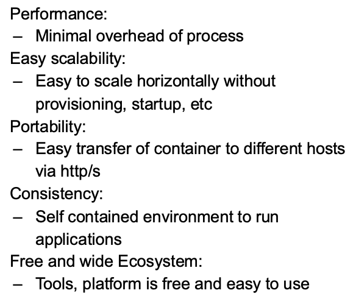

- egal was drin läuft (workload) kann ich nehmen und auf maschine laufen lassen
- so bekommt man basis für agile software entwickelt
- nicht mehr als ein linux prozess
  - hat overhead eines prozesses
- container nimmt ganze Anwedungsschciht(AS)
  - abstrahiert hardwarde und kernel
- problemlos provisioniere, starten, stopp etc.
- gegensatz zu VM, kein systemd, bootprozess etc.
- horizontal skalieren geht instant
- sehr portabel
- gesamte AS zippen und übers netzwerk schieben
- alles ist drin, libs, packages etc.

---

***… but what are containers?***

- 
- nutzen so viel ram wie auch der prozess ram braucht
- starten schneller weil ohne startprozess, systemd etc.
  - kann jeder prozess sein, java, python...
- eine vm ist isoliert, aus vm auszubrechen ist schwer
- bei container kann man durch falsche verwendung sicherheitslücken erschaffen
- bsp: filesystem kann man rein mounten
  - docker run ubuntu:latest /:/opt
    - ich maunte das ganze root verzeichnis in /opt
- aus container kommt man leichter raus als aus vm
- schwer zu wissen, was man in einem container alles machen kann
- immer nur einen prozess in einem container

---

***We all us Docker …***

- 
- läuft auf einer container engine dann

---

***Containerization VS Virtual Machines***

- 

---

***Recap: Paravirtualized Environments***

- 

---

***Containerization***

- 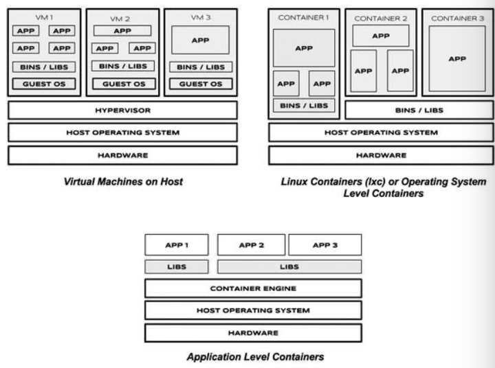
- das zeig ist stein alt
- verschiedene level:
  - app level
  - os level
- kann container so bauen dass sie ein komplettes os haben
- erster prozess der gestartet ist, war ein systemd
- in container kann man jeden prozess rein schreiben

---

***Under the hood: What is a container?***

- 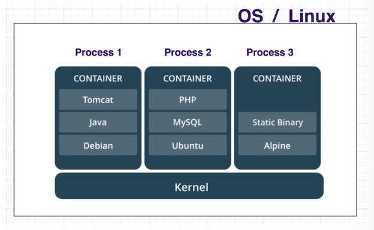
- docker container nach start oder stopp löschen
- erst dann ist prozess echt gestoppt
- container soll lebel wie ein prozess

---

***Such containers are ooooooooooooold***

- docker war (2013) eigentlich nicht mehr wie ein frontend das LXC nutzt

---

***How to implement a Container from scratch?***

- ich brache drei sachen changeroot, namespaces, cgroups
- chroot:
  - sagen wo der neue root ist
  - irgendwo im host file system liegt das filesystem von einem container
- namespaces:
  - mit chatgpt ergänzen
- cgroups:
  - sagen er soll nur bestimmte anzahl cpu's haben
  - mit chatgpt ergänzen

---

***Chroot***

- 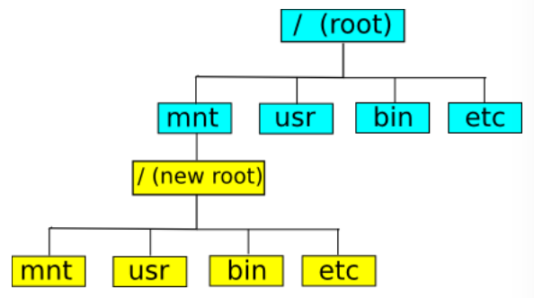
- 
- man kann sagen wo das neue root liegen soll

---

***Cgroups***

- 
- regeln die ich fest lege
- diese regeln sind festgelegt in dateien
- kann in hirarchie festlegen
- wie schaut so eien aus?:
  - 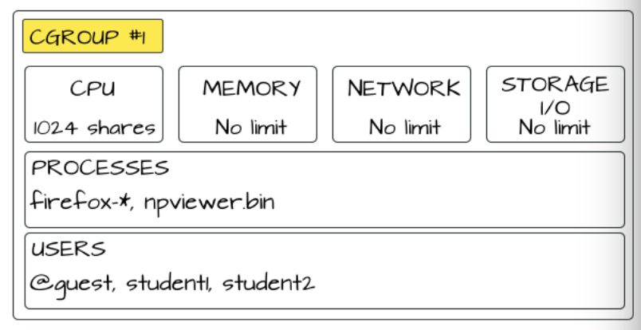
- ab jetzt langsam durch man pages navigieren
- hirarchie of file system:
  - 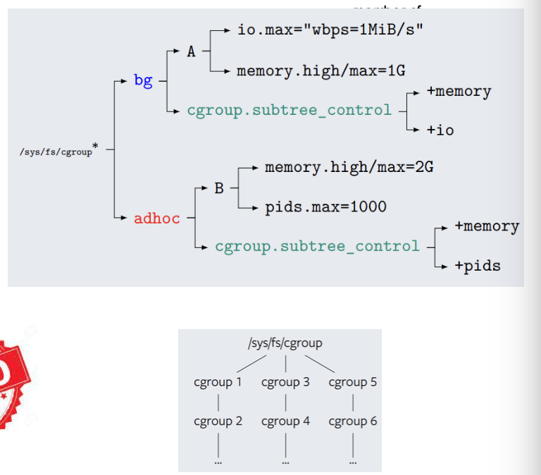
- cgroup geht auf prozess
- jetzt kann man für einen prozess einen bestimme cgroup erstellen, z.B. um weniger CPU zu bekommen
- wir müssen solche auslastungen mit LXC auf der plattform machen

---

***Namespaces***

- 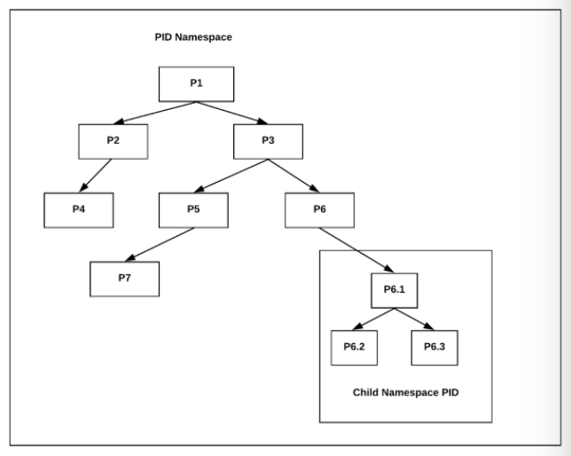
- 
- virtuelles filesystem auf linux
- neu was container machen:
  - prozesse kann man clustern
  - p6 bist jetzt in einem eigenen namespace, du denkst du bist p1, auf host ist er es aber nicht
- prozesse können geclustert werden
- können sagen prozess läuft in eigenem namespace
  - bekommt eigene cgroup
- 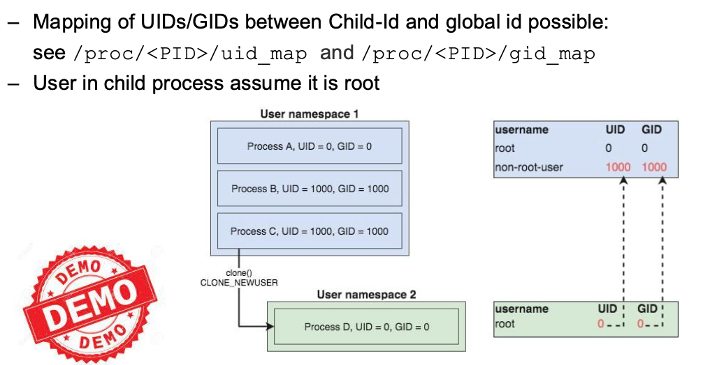
- 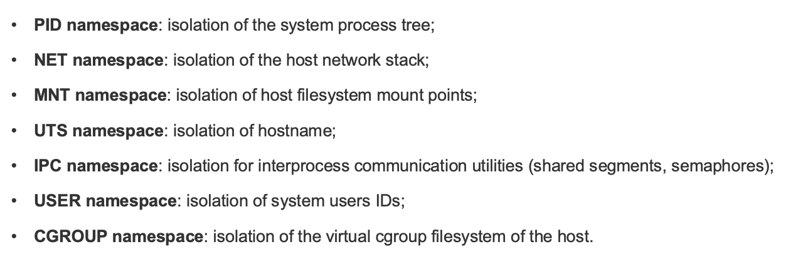
- 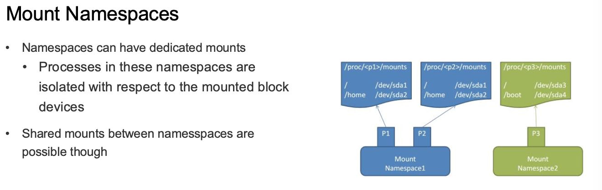

---

***Putting it all together, lxc/lxd***

- 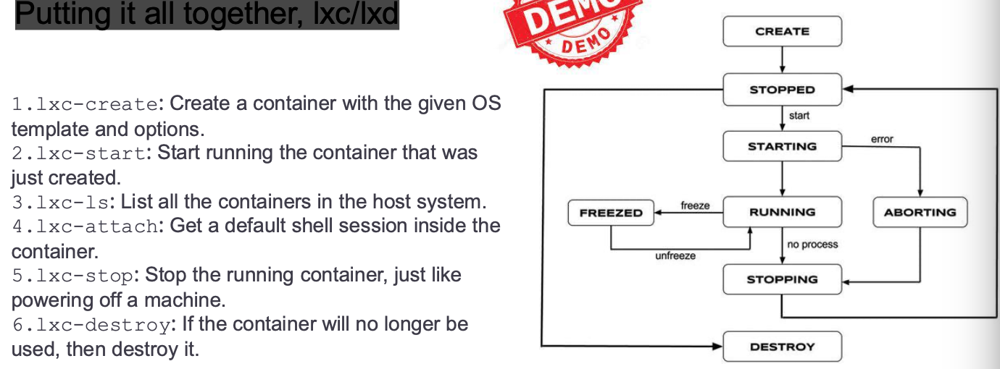
- lxc ist command-line interface

---

***Docker***

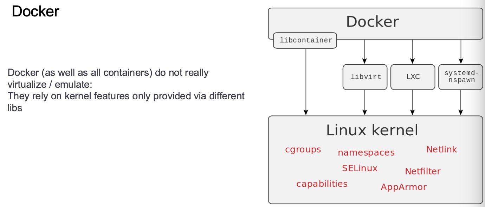
