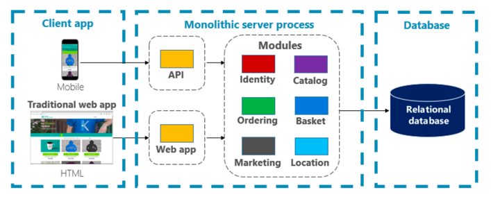
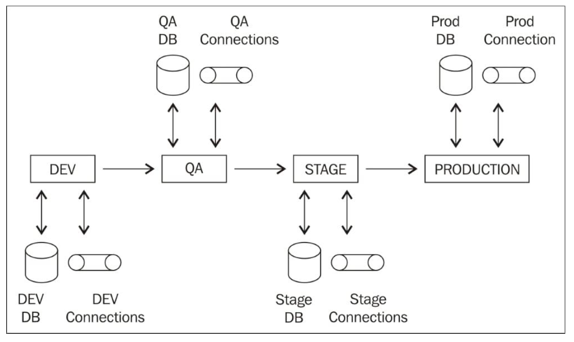

+++
title = "Week 02"
date = 2025-09-22
[taxonomies]
authors = ["fatlum"]
tags = ["devops"]
+++

# DevOps Foundations – Application Architecture and Conventions

## Frontalunterricht

### Convention over Configuration
- „Konvention vor Konfiguration“: Standards und Konventionen werden bevorzugt, anstatt alles individuell zu konfigurieren.

---

### Probleme mit klassischer Architektur
- 
- Probleme:
  - Keine Resilienz zwischen Modulen
  - Nicht verfügbar und schlecht skalierbar
  - Einzelne Services in einem Modul können nicht separat verändert werden, man muss das gesamte Modul „größer“ machen
  - Neue Features (z. B. im Catalog) erfordern Änderungen an API und Datenbank
  - Starke Abhängigkeiten zwischen den Modulen
  - Änderungen schlagen stark auf die Datenbank durch

---

### Conway’s Law
- „Any organization that designs a system will produce a design whose structure is a copy of the organization’s communication structure.” – Melvin E. Conway
- Beispiel: Frontend-Team für Frontend, Backend-Team für Backend → Architektur bildet Organisationsstruktur ab.

---

### Lösung: Kleinere Services nach Value Streams
- Teams werden nach Produkt ausgerichtet (z. B. „Ordering“-Team)
- Jedes Team ist end-to-end verantwortlich (inkl. eigener Datenbank)
- Ziel: Unabhängigkeit und Verantwortlichkeit pro Produkt

---

### 12-Factor-App – Grundidee
Eine Methodologie für Cloud-native Apps.  
Die 12 Faktoren:
1. One Codebase (eine Codebasis)
2. Active Dependency Management
3. Environment Configurations separat vom Code
4. Backing Services als externe Ressourcen
5. Build, Release, Run strikt trennen
6. App als stateless Prozesse ausführen
7. Kommunikation über fixe Ports
8. Prozessmodell für Skalierung nutzen
9. Schnelles Starten und sauberes Shutdown
10. Stages (Dev, Test, Prod) möglichst ähnlich halten
11. Logs als Event-Streams behandeln
12. Admin/Mgmt als einmalige Prozesse ausführen

---

### One Codebase
- Alles, was nötig ist, um die App zu bauen und deployen, gehört ins Versionskontrollsystem:
  - Sourcecode
  - Funktionale Konfigurationen (z. B. DB-Connection)
  - Icons, Stylesheets
  - Nicht-funktionale Konfiguration (z. B. Logging)
- **Nicht in Git**:
  - Generierte Binaries (jar/war)
  - Generierte Dokumentation / Websites
  - `node_modules`, `target`
  - Generierte Testdaten
- Stattdessen: Artifact-Repositories wie GitLab Registry, JFrog, AWS S3, Nexus

---

### Monorepo vs. Polyrepo
- **Monorepo**:
  - Ganze Architektur in einem Repository
  - Vorteil: Selbstenthaltend, einfache Refactorings, gemeinsame Dependencies
  - Nachteil: Repo kann riesig werden
- **Polyrepo**:
  - Jeder Service in eigenem Repository
  - Vorteil: Entkopplung, Security/Visibility natürlicher, besser skalierbar
  - Nachteil: Mehr Abhängigkeiten zwischen Repos

---

### Conventional Commits
- Einheitliches Commit-Schema:
``` txt
  <type>[optional scope]: <description>
  [optional body]
  [optional footer(s)]
```
- Typen: `feat`, `fix`, `perf`, `chore`, `test`, `docs`
- Vorteile: Besseres Versionieren, Filtern, Automatisierungen

---

### Git Handling
- **Reviews**:
- Merge Requests / Pull Requests
- Issue Templates, Referenzen zu Git
- **Builds**:
- Branch-/Tag-aware
- **Force Push**:
- Notwendig bei Rebase oder um falsche Daten (z. B. Credentials) zu entfernen

---

### Branching Strategien
- Branches sind nur Labels auf Commits
- Nicht zu viele Branches erstellen
- Strategien:
- **Trunk Based Development**:
  - Kurze Feature-Branches, schnelle Releases direkt vom Main
- **Gitflow**:
  - Mehrere Branches (Feature, Release, Hotfix), die in Main gemerged werden

---

### Releasing
- **SemVer**:
- MAJOR: inkompatible API-Änderungen
- MINOR: neue Funktionen, abwärtskompatibel
- PATCH: Bugfixes, abwärtskompatibel
- **CalVer**:
- `YYYY.MM.DD` (z. B. 2021.03.22)
- `YYYY.MM` für monatliche Releases
- **ZeroVer**: 0.x-Versionen, nie 1.0 erreicht
- **HashVer/GitHashVer**: basiert auf Datum + Commit-Hash
- **Was ist ein Release?**
- **Maven**: Fixe Versionen sind „stable“, für CD `-SNAPSHOT`
- **Docker/OCI**: Identifiziert durch NAME:TAG@HASH, Images sind self-contained, für CD: `latest`

---

### Configuration Management
- 
- Strikte Trennung von Code und Konfiguration
- App braucht Konfigurationsdateien (z. B. `.env`, `application.properties`)
- **Stabile Configs**:
- Ändern sich nicht (App-Name, Log-Level, Version)
- **Runtime Configs**:
- Stage-abhängig (z. B. DB-URL)
- Beispiel Quarkus: YAML-/Properties-Dateien für beide Config-Arten

---

### Backing Services
- Alles, was extern konsumiert wird (DB, Storage, Messaging, Monitoring, Identity)
- Code macht keinen Unterschied zwischen lokal oder extern
- Empfehlung: „Externalize your pain“ → möglichst auslagern, selbst nur Businesslogik entwickeln

---

### Statelessness
- Apps sollen **stateless** sein
- Kein Teilen von State mit anderen Prozessen
- State wird extern gespeichert (DB, Cache)
- Vorteil: horizontale Skalierbarkeit
- Memory/Disk nur als temporärer Cache, niemals persistent

---

### Kommunikation über Ports
- Jede App definiert klar ihren Port
- Verhindert Kollisionen, erleichtert Debugging
- Auch in Containern dokumentieren (`EXPOSE` im Dockerfile)
- Security: Ports absichern
- Dienste können über ihre Ports auch selbst zu Backing Services für andere werden

---

### Prozessmodell
- Eine App = ein Prozess
- Kein Anti-Pattern mit mehreren Apps in einem Container
- Vorteile:
- Sauberes Signal-Handling (SIGTERM)
- Sauberes Exception-Handling
- Sauberes Hoch- und Runterfahren
- Horizontale Skalierung durch mehrere Prozesse möglich

---

## Assignments
👉 [Link zum Assignment 02](https://spd.pages.fhnw.ch/module/devops/templates/reports/devops-foundations/hs25/assignments/assignment02.html)
- **Assignment 2**:
- Framework so erweitern, dass es ausbaufähig ist
- Entscheidung über Branching (Trunk Based oder Gitflow)
- Release-Konzept festlegen
- Nächste Woche: Richtung LLM arbeiten
- Konventionen einhalten → Chatbot muss `service-<Name>` heißen
- Im Repo ein `meta.json` hinzufügen
- Sourcecode dokumentieren → wird geprüft
- Checker wie SonarQube einsetzen
- Security beachten
