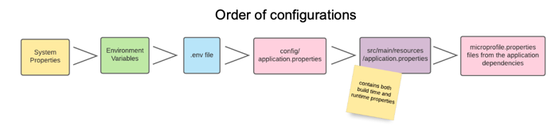

+++
title = "Week 02"
date = 2025-09-22
[taxonomies]
authors = ["fatlum"]
tags = ["devops"]
+++

# Frontalunterricht
- convention over configuration

- problem mit folgender architektur:
- 
- problem: 
  - keine resilizen zwischen modulen
  - nicht verfügbar und skalierbar
  - einzelne services in den modules kann man nicht verändern, man muss alles grösser machen
  - wenn ich ein neues feature hinzufügen will, z.b. in catalog, dann muss ich API und database ändern
  - sehr starke abhängigkeiten zwischen den micro services 'modules'
  - änderungen schlagen stark auf die database
- conways law:
  - überall zu sehen
  - eine organisation ist aufgeteilt in strukturen, diese strukturen finden sich in der architecture wieder
  - frontend-team für frontend, backend-team für backend ...
- Lösung:
  - teams nach produkt ausrichten, bedeutet: team 'ordering' macht alles was es dazu braucht, hat diesbezüglich auch eigene database
  - team soll end-to-end selbst verantworten
- 12factor Grundidee:
  - 12factor-App ist eine Methologie
- codebase:
  - sprich alles in Version control (git), alles was wichtig ist, sprich configs, sourcecode, icons, stylesheet etc.
  - nicht in git: alles was generiert wird, node_modules, generated docs, generated testdata
  - monorepo vs polyrepo:
    - monorepo:
      - ganzes service architektur in ein repo
      - nachteil: repo wird riesengross
    - polyrepo:
      - jeder service, eigenes repo
      - dann arbeitet man mit dependencies
- convetional commits;
  - immer ein prefix
  - zum versionieren und filtern etc
  - bsp:
        <type>optional scope: <description>
        optional body
        optional footer(s)
- gitlab-handling:
  - reviews:
    - merge requests, pull requests
    - template for issues, reference to git
  - builds:
    - can be brach/tag aware
    - kann branches brauchen
  - force:
    - für rebase muss man forcen
    - um flasche daten raus zu nehmen, brauch es einen force
- branching:
  - ein branch bei git ist ein label von einem commit
  - nicht zu viele branches machen
  - strategien:
    - trink based: immer auf dem mainstream
    - gitflow branching: mit verschiedenen branches, dann in main pushen
  - releasing:
    - semVer:
      - bedeutet, meine software ist ausgebraucht
      - major: API cghanges
      - minor: zusätzliche funktionalität
      - patch: bug fixes
    - calVer:
      - YYYY.MM.DD: Full date (e.g., 2021.03.22) indicating the exact release day
      - YYYY.MM: Year and month (e.g., 2021.03) for monthly releases
  - was ist ein release:
    - maven:
      - identifiziert bei fixen versionen
      - alle releases sind stable
      - für CD brauche -"SNAPSHOT"-suffix
    - Docker /OCI:
      - identifiziert mit tags, hash
      - unqiue mit NAME:TAG@HASH
      - name:tag kann überschrieben werden
      - keine gefahr trasitive dependecies kapput zu machen, images sind self-contained
      - für CD: use latest
- configurations:
  - 
  - umgebungen sind installationen der software
  - endpunkte heisst url, http-endpunkte, müssen konfiguriert werden
  - eine app braucht eine config
  - strikte separierung vom code 
  - dockerimages wurden stage-abhängig gebaut -> absolutes NO GO
    - image muss immer stage unahängigkeit sein
    - was ist eine umgebung genau?
  - exmaple von quarkus:
    - 
    - 7 verschiedene stages zum konfigurieren 
    - application property, text-file mit key value 
    - definieren wohin es kommt und dabei bleiben: also wenn entschieden im .env, dann nur dort
    - zwei arten von confis;
      - runntime configs: sind stage abhängig
      - stable configs: name der app, log-leve, version, sachen die sich nicht ändern 
    - in quarkus kann man yaml file anlegen für stabile und nicht stabile configs
- backing serrvices:
  - externe services konsumieren, TUT es
  - database zum beispiel, externisieren
  - code sollte es nicht interssieren ob extern oder self-hosting
  - alles was man extern konsumieren kann, tut es, "externalize your pain"
  - beispiel für extern: storage, security, messaging, monitoring, analytics
  - unser job ist eine cloud native system
- die app selber sollte ***stateless*** sein:
  - nichts teilen mit anderen prozessen
  - wegen dem horizontal scaling sollte es stateless sein
  - ***frage klären, was ist genau LLM?***
  - state sollte irgendwo gepseichert werden: shared-cache zum beispiel oder in einer database
  - jede app sollte einen port definieren:
    - verhindert port-collision
    - bei fehler weiss ich schnell welche app spinnt
    - auch in conaitaner (kubernetes cluster) schreibt den port hin
    - expose in docker file, welcher port zu welcher app -> DOKUMENTIEREN!!
    - bei chatpot im team: jeder verwendet eigenen port
    - securtiy concern, man kann sich auf die ports konzentieren und diese dann schützen
- mit prozessen arbeiten
  - in linux haben wir super prozess management
  - bsp: eine app für einen prozess
  - anti-pattern: 5 apps in einem image
  - horizonatel skalierung problemlos möglich mit prozessen, ein docker ist ein prozess
  - signalhandling: sigterm kann sich der prozess noch sauber abschalten 
  - eine app pro prozess erlaubt schnelles starten und sauberes herunterfahren mit signalhandling
  - sauberes exception-handling

## assignements:
- assignement 2: [https://spd.pages.fhnw.ch/module/devops/templates/reports/devops-foundations/hs25/assignments/assignment02.html]
  - schauen das framework, dass wir haben erweitbar ist
  - wie gehen wir mit branching? trunk based oder nicht...
  - welches release konzept?
  - nächste woche richtung LLM arbeiten
  - an konventionen halten, chatbot muss wie folgt heissen "service-<Name>"
  - in repo ein meta-json hinzufügen
  - source code dokumentieren, source code wird angeschaut
  - mit checkern wie sonaCube wird source-code überprüft
  - security wird beachtet