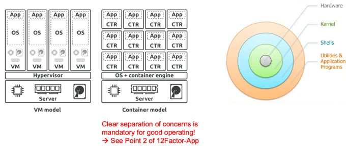
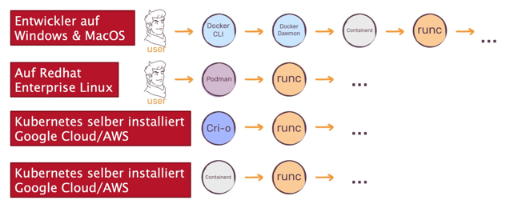
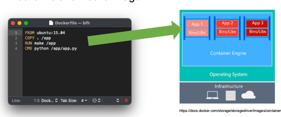
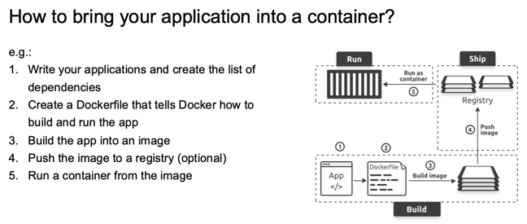
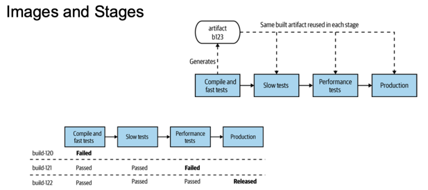
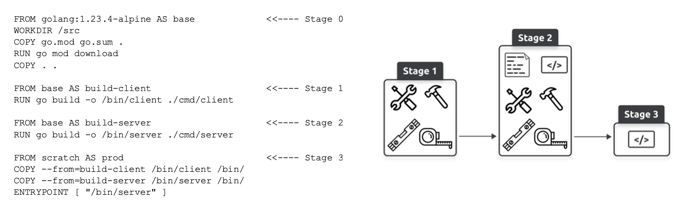

+++
title = "Week 03"
date = 2025-09-29
[taxonomies]
authors = ["fatlum"]
tags = ["devops"]
+++

## Reflektion Assignement 2
- 12-faktor-app
  - wichtig für die schriftliche prüfung -> anschauen vor der prüfung!!
- security-flaws schnell adressieren im service
- 9 wichtigsten funktioanlitäten erfassen
- git tag machen und das soll system triggern für einen release
- nächste woche die lösung containerisieren

## Introduction, why docker?
- ganze anwendungsschicht als artefakt bauen, sodass es auf jedem OS laufen kann
- portabilität, OIC-kontainer darauf ausgelegt von A nach B zu wandern
  - idee wie es funktioniert ist steinalt
- reproduzierbarkeit, einfacher syntax für ein dockerfile
- container virtualisieren keine software!
- grundidee von CI/CD gab es schon vor Docker
- mit container ist CI/CD viel generischer 

***where does it come from?***
- VM model:
  - app läuft auf os, vm läuft auf hypervisor und diese läuft auf hardware von host
- container model:
  - die apps werden isoliert und laufen nativ auf server
  - eine app wird wie ein prozess behandelt
  - shell und application-schicht wird von docker abgenommen, läuft in einem container
- 
- container gedacht auf rezept zu erstellen

***linking to cloud, para-virtualization***
- idee ist sehr alt
- ein container ist eine gruppe von prozessen
- ein normlaer container hat keinen eigenen kernel und laufen auf anwendungsschicht
- es möglichkeit container bootable zu machen
- brauchen weniger ram, sind sehr schnell
- container startet, wenn prozess dahinter startet 
- bei vm zuerst systemd danahc timer starten etc. 
- vm sind besser isoliert, bei container ist es abhängig von runtime 
- docker runtime kann man rootrechte geben, wenn man root-volum darin mountet
- schwiriger zu entscheiden wann contaienr verwenden wann nicht
- ein prozess ein image und ein container ist best practice

***OCI-container/images***
- docker war nicht mehr als frontend für NIC
- Imagespezifikation und runtime spezifikation, darin steht wie sie aufbeaut werden müssen

***wie läuft es?***
- 
- wenn man auf oberste schicht etwa baut, muss es augrund von spezifikation in kubernetes laufen
- in wirklichkeit redet man über OIC-Images und nicht dockerimages

***Dockerfile and Dockerimages***
- 
- FROM, COPY, RUN, CMD
- standard containerisieren mit dockerfile
- alles was im baseimgae ist ist im dockerimage auch drin
- pro linie ist ein layer
- mit 4 lines of code bekommt man eine anwendungsschicht, eine app im container

***immutable software***
- 
- jedesimage zieht ein weiteres image hinterher 
- wenn im tiefsten image etwas kapput geht, badet man es bei der app aus 
- wir patchen keine software im laufenden container!!!

***grundidee eines containers***
- 
- isolation der abhängigkeiten 
- in der gesames anwendugnsschiht ist alles drin was ich brauche, also auch verschiedene abhängigkeiten 
- nachteil:
  - mehr speicher
  - ein mechanismus der regelmässig monitort, die verschiedene abhängigkeit
  - man müsste manuell die images patchen
  - automatisiertes testing, lifecycle management um dieses problem zu beheben 

***Images and Container***
- ein image ist ordner auf einem dateisystem
- ein staack von snapchats eines dateisystem die man übereinander legt
- pro layer schaut er ob image änderungen hat
- wenn container beendet, image steht noch 
- grundsätzlich container immer remove
- workflow:
  - lokal image bauen im gitlab CI, danach build prozess pusht die einzelnen layer (jedes layer eine hashsumme), und dann pullt docker
  - wenn layer vorhanden sind, lässt es, pull nur die neuen layer
- images richtig generieren 

***detailed view of layer***
- 
- wenn mehrere images, gleiche baseimage verwenden 
- überlegen wie dockerfile aufbauen
  - grosse elemente weiter unten im OIC-image
  - elemente die häufig ändern, eher in obere layer
- bei chatbots: LLM wo im image stehen: möglichst weit unten 
- was braucht man wirklich? kleine baseimages machen 
- bsp java app:
  - zum entwickeln braucht man JDK, zum laufen lassen nur runtime
  - maven braucht man nicht zum starten, nur java
- das was hier drauf steht ist für containerisieren sehr wichtig 
- kleine images zur runtime, nur was man braucht 

***Registry***
- 
- in der regel autoamtisch gebuildet
- kann als images eines repo gesehen werden 
- erreichbar via URL
- aufpassen vor public images
- docker.io machen request quota 
- nicht deren images verwenden, stattdessen einen mirror verwenden 

***baseimage***
- ChatGPT soll hier in ein par punkte erklären was es ist, mit beispiel 

***out of image, into the container***
- docker run und dann startet er einen container
- aus einem blueprint image, viele container starten
- der prozess hat im container drin id1
- im container kann man sachen ausführen 
  - docker exec 

***how to bring application into a container?***
- 

***images and stages***
- 
- keine stageabhängigen images bauen 
- ein image bauen und dieses durch test umgebung machen und dass dann deployen
- releaenummer nicht wiederverwenden
- jedes releasenummer muss unique sein

***Dockerfile and Image***
- 
- alpine ist ein gutes baseimage 
- welche key-words generieren layer 
- problem im build:
  - viele sache die ich nicht haben will -> wegen node
- das laufende image ist sehr klein und dünn
- das build hat alles was es braucht um es überall zu bauen 
- in der produktion hingegen soll man nicht wieder bauen 
- das nennt man multi-stage dockerfile 
- mehrere from etc. 
- 
- security/lifecycle checks laufen auf prod build(letzte stage), letzter teil

***how to build an image? full image***
- build und run time in ein image -> viel werkzeuge die ich nicht braucht, grosses image
- vorteil:
  - einfach zu maintainen 
  - cleane und transpartente struktur
- nachteil:
  - grosses image
  - grosse angriffsattacke
  - unnötige werkzeuge darin

***how to build an image? multi stage***
- vorteil:
  - separat build und run stage
  - kleinere run image mit kleinerem angrissfläche
- nachteil:
  - komplizierter zu entwicklen 
  - nicht so transparent zum warten 

***how to build an image? build packs***
- vorteil:
  - dockeriamge ohne dockerfile
  - auto detect frameworks
- nachteil:
  - New project, bugs occur
  - Complicated architecture, hard to track errors in framework

***choice of baseimge***
- alpine: small
- distroless: no bash
- chainguard
- ubi
- je grössr base image, umso mehr unnötiges ist drin
- werkzeug zum wissen was drin ist:
  - syft

***best practices for building images***
- einen main prozess der startet 
- eine applikation ein image
- ohne root, wenn man nicht muss -> user setzen
- grosse teile nach unten
- images scannen: syft und grype
- nicht irgendwelche public images

***für nächste woche***
- link zu assignement 3:
  - https://spd.pages.fhnw.ch/module/devops/templates/reports/devops-foundations/hs25/assignments/assignment03.html
- kann framework als SaaS agieren?
- docker file im root verzeichnis
- dockerfile mit build und run und muss Dockerfile heissen
- recherchieren was base image ist
  - klein und minimal
- container anfangen zu bauen 
- saubere dockerfiles 
- app muss im dockefile baubar sein 
- names konvention einhalten 