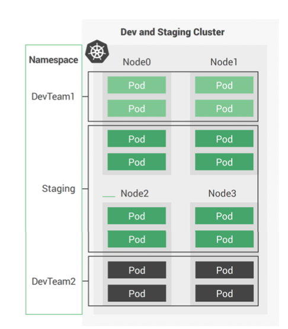
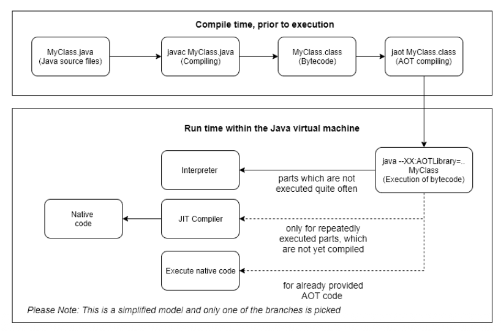
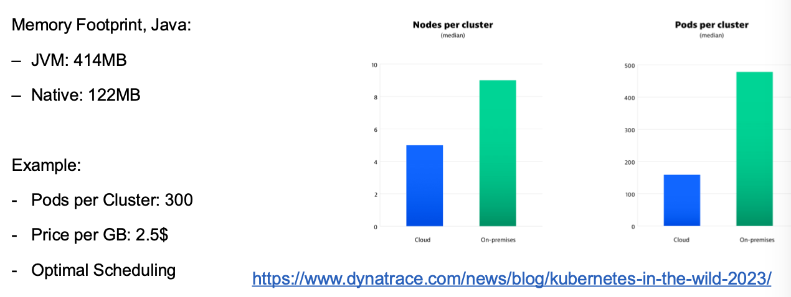
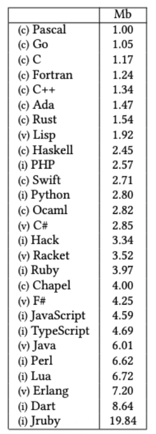
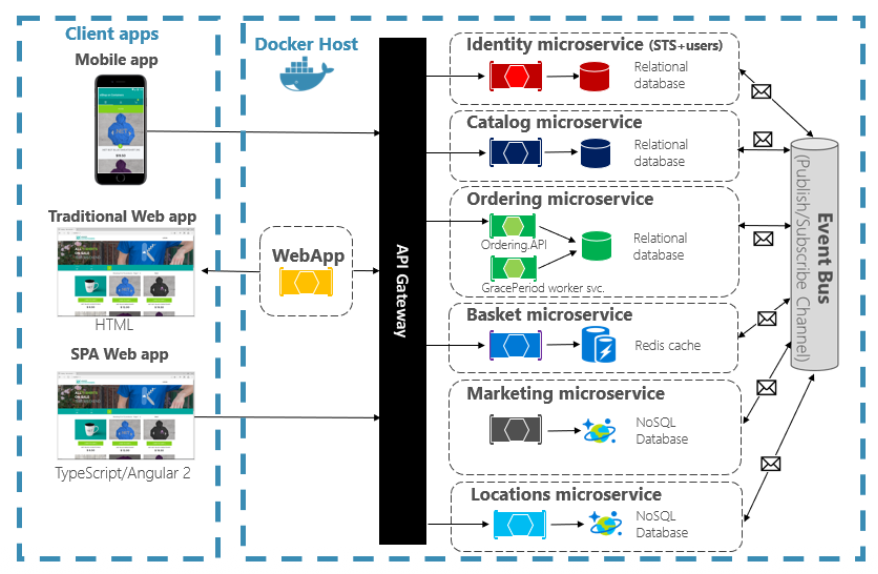
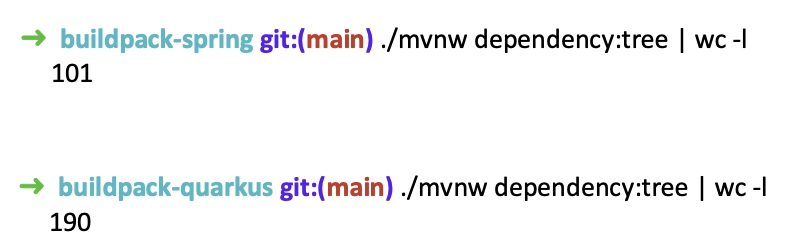
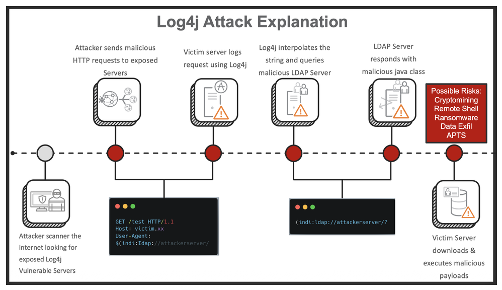

+++
title = "Week 04"
date = 2025-10-06
[taxonomies]
authors = ["fatlum"]
tags = ["devops"]
+++

- [📘 Aufgaben – DevOps Foundations HS25](https://spd.pages.fhnw.ch/module/devops/templates/reports/devops-foundations/hs25/index.html)
- [☁️ Azure Portal (AKS)](https://portal.azure.com)
- [🦊 GitLab – FHNW DevOps Projekte](https://gitlab.fhnw.ch/spd/module/devops)

---

## Reflektion Assignment 3

- Angeben, welches Dockerfile
- die images mit dem SHA-Wert versehen
- multi stage
- GraalVM für native build, ohne runtime
- base imgae von quay.io/quarkus-ubi9-quarkus-mandrel-builder-image
- base image: [micro-Image](https://quay.io/repository/quarkus/quarkus-micro-image?tab=info)
- eine stage für dependencies herunterladen, eine zum bauen
- so wenig dependencies wie möglich im maven oder sonst wo, nur die sachen reinmachen die es wirklichkeit braucht
- README.md anlegen und genau schauen wie gebaut wird

---

## Cloud Efficienty

***Cost and Workload***

- keine schlaue ressourcen auslastung

---

***Container Platforms, Pay as you go***

- 
- orchestrierung nimmt container und schiebt ihn dort wo er läuft
- node01 -> serverinstanzen und diese könne atmen

---

***Costs of infrastructure***

- laufzeit kosten gut rechenbar
- die wahren kosten der infrastrktur

---

***Excurse: Java and the Cloud?***

- einen hohen verschnitt in memory bei java
- kommt von der JVM
- containiserte JVM weiss nicht, das sie in einem container läuft
- eine JVM will mehrere prozesse warten

---

***What about Java?***

- mittlerweile geht es besser und schöner
- mit den native build

---

***Java and Native?***

- AOT = Ahead of time compiling

---

***Native Images with GraalVM***

- schneller
- weniger memory consumption
- nachteil:
  - builds gehen länger
  - zur runtime könnte es fehler geben, dass es nicht läuft
  - teilweise keine JVM-Tools

---

***Solutions: Specialized JVM (GraalVM) and Framework
(Quarkus)***

---

***Computation example***

- 

---

***“Modern” languages***

- sprachen evaluieren nach effizient

---

## Dependency Management

***Challenge?***

- alle microservices muss man kontinuierlich pflegen und überprüfen
- jeder micro services hat einen riesen baum vom abhängigkeiten
- wieso kontinuierlich und nicht nur zur build-zeit monitoren?:
  - nach jahren kann eine vurnebility entstehen
  - services haben einen lifecycle

---

***resolving dependencies***

- wenn ein build scheitert, muss man von vorne weg alles rückverfolgen

---

***Clear access from sourcecode base***

- eine 12 faktor app vertraut nie auf implizite dependencies
- also immer alles explizite dependincies
- dependencies framework brauchen

---

***Which dependency management frameworks do you know?***

- maven composer
- npm
- gradle
- zentrisch zur programmiersprache
- meistens sehr unterschiedlich

---

***Dependency Trees***

- riesen zoo an imges nur für ein kleines hello world

---

***Large Dependency Trees***

- riesen grosse tree -> intransparent
- npm libs können gelöscht werden
- wenn man ein transitives package gelöscht wird, fällt vorne in der app alles zusammen
- teilweise, nicht gut lizensiert
- teileweise nicht gut gesichert
- regelmässig die dependencies vor den füssen führen
- am besten dependencies mit grossen firmen dahinter
- wenn man das teil baut, die packages cachen
  - man wird resilienter
  - wenn man ein package auf maven central löscht, aber man hat es im cache, kann man immerhin bauen

---

***Further problems of dependency management***

- konflikte können entstehen
- versionsnummer clashen aufeinander
- dependencie-zyklen kann man bauen, aber so schisst man sich ins knie

---

***Software Bills of Material***

- wie kriegt man transparenz rein?
- ein SBMO ist machinenlesbares meta daten format
  - vergleichbar mit beipackzettel
- diese SBOMS haben copyright, lizenz etc drin
- diese nimmt man und legt sie bei der App bei
- kann man generieren
- ein werkzeug heisst syft
  - direkt auf sourcecode gemacht
  - kann man auch direkt auf ein image machen
  - da sieht man auch dependencies von den base imagaes und deren transitiven packete etc.

---

***Why? Supply Chain Attacks / Log4Shell***

- hauptangriffsvektor: supply chain attacken
- erste attacke: log4shell
  - war eine attacke vor 3-4 jahren
  - haupt logging framework
  - eine klasse geladen hinter einer ip-adresse
  - das war der hammer, ein stab kam zusammen
  - wissen wo log4j läuft, auf allen ebenen verteilt
  - ein kleines skript gemacht, wo alles scannt
  - container ebene ist wichtig, ist auf dem execution pfad
  - war ein bug der ausgenutzt wurde
- zweite attacke: XZ-Backdor
  - eine backdor auf ssh
  - wäre der durch gekomme, könnte man auf jeden server drauf, der ssh nutzt
  - social engineering vom feinsten
  - es folgen ganz gezielte attacken auf pakete
- dritte attacke: npm
  - transitive abhängigkeit wo ein stealth-injection gemacht wurde
  - dieses paket wurde 2 milliarden mal heruntergeladen
  regelmässig patchen

---

***Supply Chain Attacks***

- anzhal transitive abhängigkeit ist nicht messbar
- 13% der downloads sind immernoch angreifbar
- es gibt immernoch builds, die heruntergeladen werden
- supply-chain-attacken sind die grössten angriffe bei software bauen

---

***Vulnerabilities of Software***

- was machen wir dagegen?
- distro less sind extrem minimal, nicht mal eine shell drin
- jedes system hat eine oberfläche, schnittstellen, prozesse etc.
- die oberfläche wird angegriffen, wenn verwundbarkeiten vorhanden sind
- häufig weiss man nicht was der aufführungspfad ist
- pakete darf man patchen
- critical und cve ausmertzen
- schauen das man eine automatismus hat um vulnerbilitys zu entdecken

---

***Tools***

- trivy kann man root filesystem scannen

---

## Nächstes assignement

- Kalenderwoche 44, Sonntag ist abgabe Milestone 1
- LLM Integration
- Am ende des tages auf verschiedene arten machen
- das was wir hier bauen, können wir in anderen modulen verwenden
- hinten dran eine schnittstelle via http-get-request reden können
- im get request oben in den url etwas angeben
- wichtig:
  - weiter cc-commits
