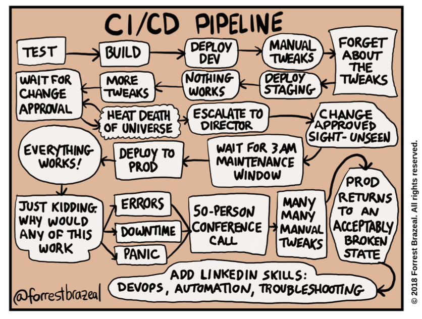
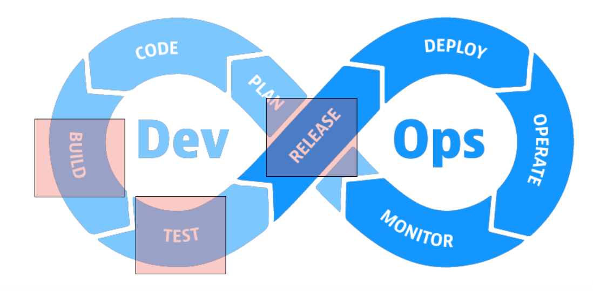
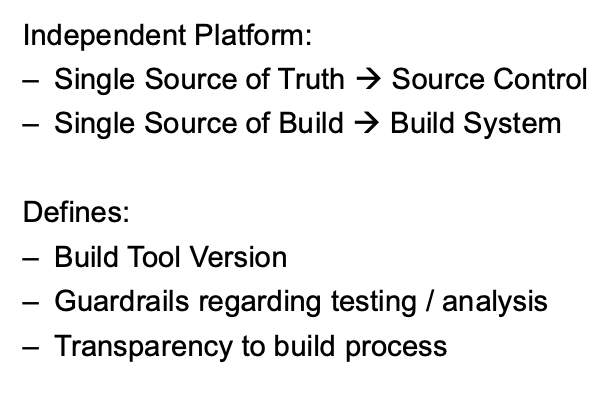
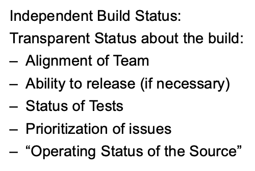
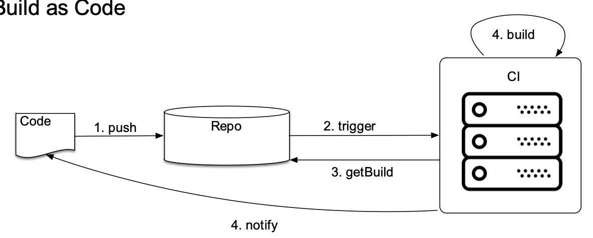
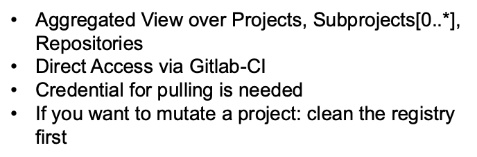
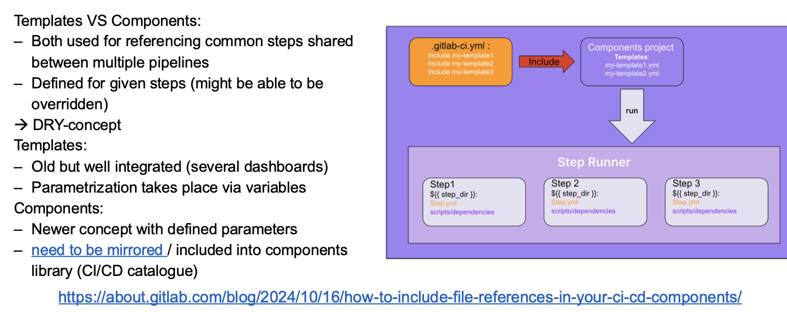
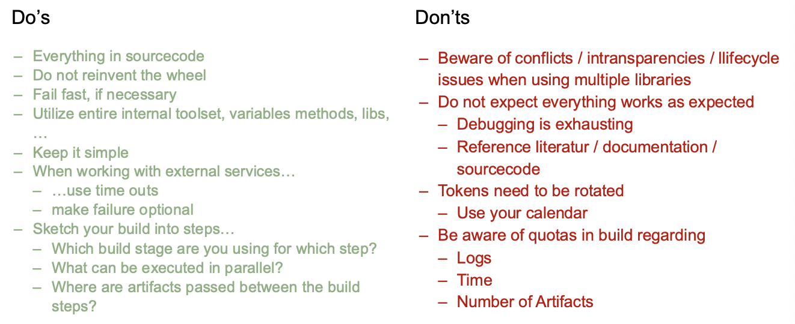
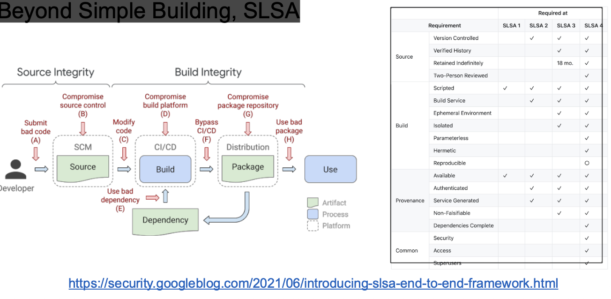
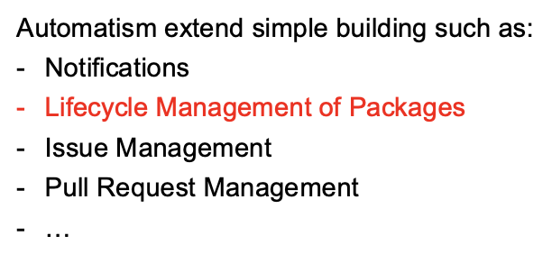

+++
title = "Week 06"
date = 2025-10-20
[taxonomies]
authors = ["fatlum"]
tags = ["devops"]
+++

- [📘 Aufgaben – DevOps Foundations HS25](https://spd.pages.fhnw.ch/module/devops/templates/reports/devops-foundations/hs25/index.html)
- [☁️ Azure Portal (AKS)](https://portal.azure.com)
- [🦊 GitLab – FHNW DevOps Projekte](https://gitlab.fhnw.ch/spd/module/devops)

---

## Reflektion Assignment 5

- ab übernächste woche wird es steile lernkurve -> kubernetes

## wichtig für devops

- Skaffold
  - eine lokale umgebung
  - [Skaffold](https://skaffold.dev/)
  - relative pfaden müssen stimmen
- dind -> docker in docker
- andere möglichkeit images zu bauen:
  - buildpacks
- kaniko
- in pipeline:
  - stage build-application macht vorallem mvn package

***todos***

- vulnerability scan in pipeline
- SBOM in pipeline
- mit timeouts arbeiten
- template arbeiten
- aufzeichnen wann wird wo was gemacht, einen sketch für uns
- schritte, die nicht abhängig sind, parallelizieren (scan und sbom, analysesteps)

---

# Continuous Integration / -deployment

### Breaking News - Strengthening npm security

- wenn mir mit tokens areiten, die vorgefertigen verwenden

### Building Software and deploying it

- 
- keine wartungen nachts machen

### Build and Release

- 

### Build and Deploy-Pattern

- 
- bauen und deployen sind zwei paar schuhe
- unbedingt trennen
- erhäht stablität und robustheit
- wenn deploy nicht funktioniert, kann ich ein altes artefakt nehmen und testen
- build kann ich auf release workflow legen
- build und deploy trennen!!
- wenn ich 3. software habe, muss ich die nicht bauen

### Why to use a Build System?

- 
- 
- 
- software zu bauen auf laptop ist keine gute idee
- ich will unabhängige app haben
- beim bauen will ich eine single source of build haben
- wenn ich auf ci nicht bauen kann, aber lokal schon, dann ist der fehler lokal, wie ich baue halt
- unabhängige plattform
- credentials nicht in source code einpacken
- buildsystem erlaubt dieses als verschlüsselt zu hinter legen -> CI/CD variables
- transparenten status bei build
- zum beispiel linting nicht ausgeführt
- busfaktor:
  - anzahl personen die umgefahren werden können, bis eine app nicht läuft?
- bei bus faktor == 1, sofort handeln
- ein buildsystem, erhöht den bus-faktor um einiges

### Modern CI-Systems

- viel getan die letzten jahre

### Build as Code, Gitlab

- irgendwo ein file wo vorliegt, dort steht drin, was für ein build ich benutze
- ich pushe code an repo, repo triggert ci-system und er holt rezept vom repo, wie bauen, und dann builded er
- 
- bevor es das gibt, erstelle man einen job manuell
- kein system haben irgendwo ne automatisierung, kein manuelles bauen

### wie baue ich so etwas?

- pipeline entwickeln in pipeline edior in webbrowser machen
- weil direkt feedback
- lokal müsste man nonstop commit and push

### Gitlab-CI Development

- komponenten in ci-pipeline
- bei ähnlichen services, zum beispiell connetting world und eliza beide quarkus, dann kann man auslagern

### Gitlab-Registry

- 
- speichert images
- pull token auf dieser ebene hinterlegen (auf projekt ebene)
- access token mit minimalen rechten anlegen
- auf teamgruppe erstellen mit read registry bei kubernetes dann

### Documentation

- 

### Pipeline Libraries, Gitlab Components

- 
- securtity scans, SBOM erstellen, braucht man mehrfach
- dont repeat yourself
- templates ist der alte weg
- neue weg sind components
- umgebungsvariablen sind problem wenn mehrfach konsumiert
- komponents:
  - ich gebe dem externen komponent eine variable
- es gibt ein template repo mit komponenten zum wieder verwenden bei ci-pipeline

### Do's and dont's

- 

### Beyond Simple Building, SLSA

- 
- Supply-chain Levels for Software Artifacts
- build-chain ist schützenswert

### beyond simple building: chatops, dependency mgmt

- 

## Assignement 06

- prüfung in vorletzter woche (KW50, 08.12.25, 19:15)
- prüfung mit campla
  - eine woche vor prüfung testen (KW49)
- letztes vor abgabe
- gitlab component basteln
- components sollen release bar sein
- für zusatzpunkte:
  - git jobs, externe dependencies scannen
  - renovate bot
  - binding zu einem teams channel
  - einfach etwas was über den scope geht, nicht einfach eine pipeline
- in meta json, jede einzelnen component auflisten
- abgabe devops: Sonntag, 02.11.25, 23:59
- wochenende vor abgabe, taucht sebastian ab
