+++
title = "Week 10"
date = 2025-11-16
[taxonomies]
authors = ["fatlum"]
tags = ["devops"]
+++

- [📘 Aufgaben – DevOps Foundations HS25](https://spd.pages.fhnw.ch/module/devops/templates/reports/devops-foundations/hs25/index.html)
- [☁️ Azure Portal (AKS)](https://portal.azure.com)
- [🦊 GitLab – FHNW DevOps Projekte](https://gitlab.fhnw.ch/spd/module/devops)

---

## Recap Ass9

- repo kubernethes prometheus stack hinzufügen
- monitoring als aller erstes aufbauen, wenn man einen service hat
- sinnvolle stages:
  - 2 reichen, dev und prod
- nächste woche 5.0A52
- an der probeprüfung sind wir im raum: 5.0B56
- an der prüfung: 5.0A52
- industrievortrag:

# Liveness / Readiness

## In-Place Pod Resize Graduated to Beta in k8s v1.33

- request und limits werden mit cgroups angepasst

## "Recap" - How to access Container? Service

- services (pod) wird verfügbar über eine service ressource
- pods haben eigene ip-adressen
- intern ist ein dns server am laufen
- dieser namen wird über service-ressource aufgelöst

## How do you get awarness, when application runs normal?

- health-check -> q/health

## Liveness and Readiness

- 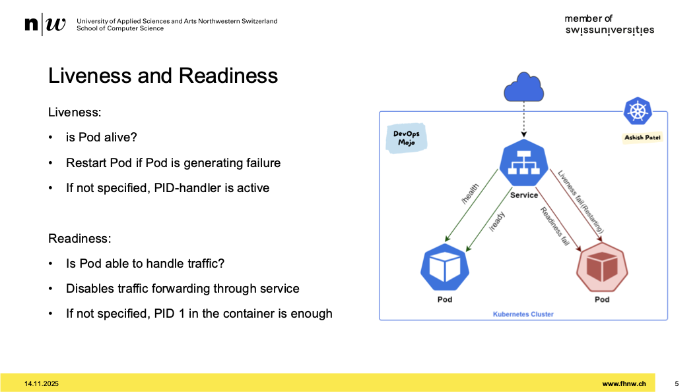
- liveness sagt ob der prozess lebt/läuf
- wenn liveness nicht läuft, probiert kubernetes in zum laufen zu bringe, also pod abräumen und neu starten
- wenn liveness nicht implementriert, checkt der den linux prozess
- readiness heisst ob er traffic handlen kann -> bsp. llm nicht geladen
- readiness sagt ob prozess gesund ist

## How to implement it?

- jedes framework hat seine health-checks
- diese endpunkte in deployment reinziehen
- bei dockercompose auch möglich diese health-endpunkte implementieren

## Workflow Readiness, Startup and Liveness

- 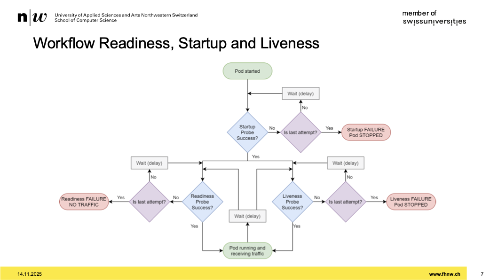
- es gibt startup probe

## Bigger Picture

- 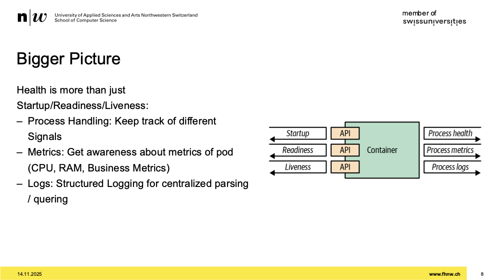
- container muss mit signale umgehen können
- sigkill muss man kennen
- problem, bei sigkill speichert keine daten mehr, wird einfach abgebrochen
- container besser mit sigterm herunterfahren, sauberes killen
- process handling muss von container gemanaged wird
- metrics:
  - mit metrics liest er alle 5 sekunden die daten aus
  - appli metriken haben wir nun auf plattform
- logs:
  - logs auf std. out geschrieben
  - müssen gewisse struktur haben
  - appli muss das bereit stellen

## Demo

- [example](https://github.com/sebinxavi/kubernetes-readiness/tree/master)

# Adaptions to Deployment

## Recap: How to deploy?

- 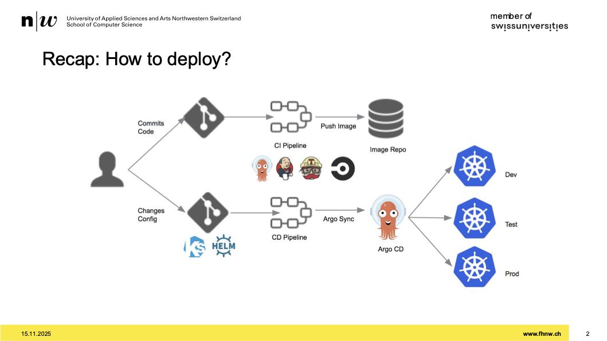
- argocd als nächstes implementiert

## How do you rollout?

## Recreate Deployment

- 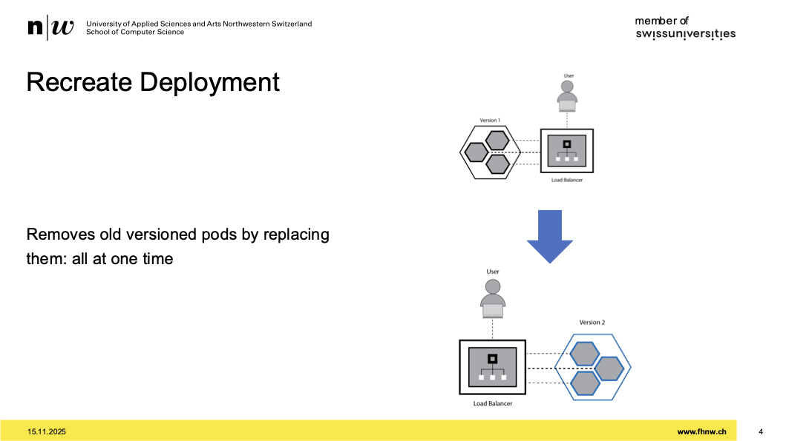
- nur deployments mit board mittel behandeln wir
- lösche alte, erstelle neue
- eine art des deployments

## Recreate Deployment - Implementation

- 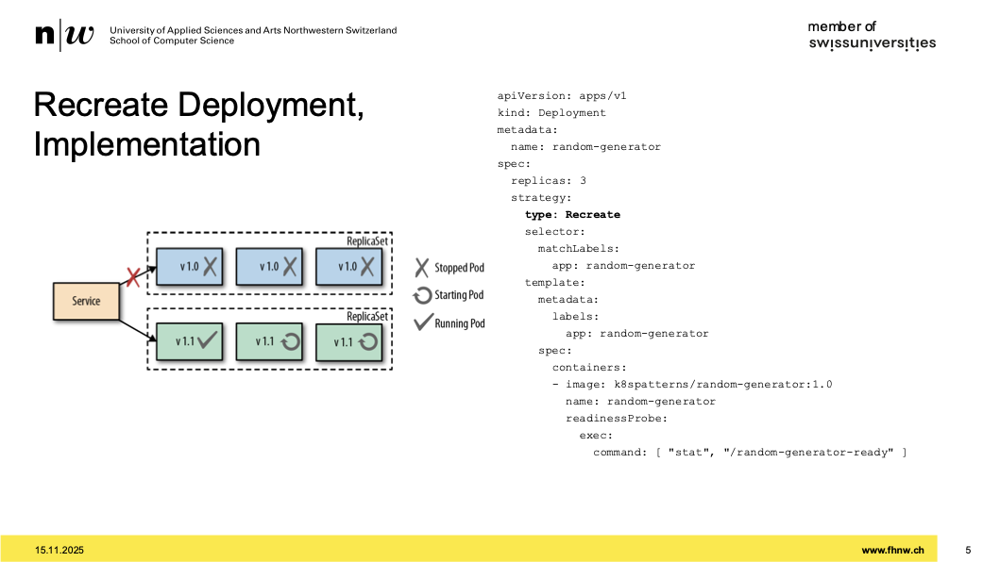
- er stoppt die blauen, startet die grünen
- in Deployment.yaml ein element strategy

## Recreate Deployment'

- vorteil: einfach zu implementiere, sehr robust
- nur eine version erreichbar
- der ganze state wird gehandlete
- nachteil:
  - downtime

## Rolling Deployment

- 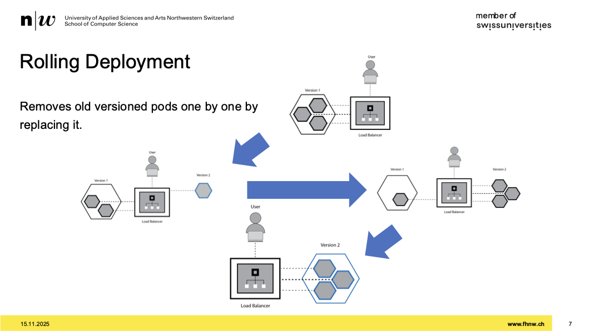
- downtime ist der killer
- pod wird nacheinander ersetzt

## Rolling Deployment, Implementation

- 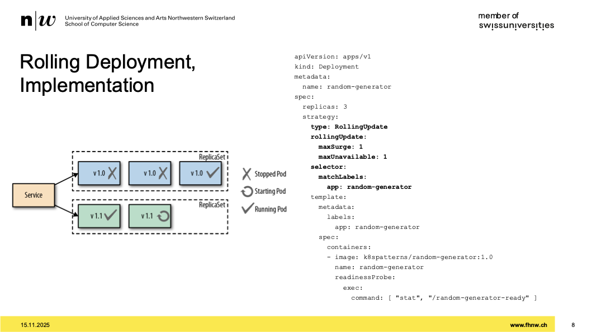
- man sagt auf welche pods gematcht werden soll
- sagen, wie viel minimum laufen soll
- impact der falschen parameter -> pods kommen mit anfrage nicht nach
- bei falschen parameter, kann es teuer kommen
- tradeoff zwischen kosten, ressourcen, verfügbarkeit

## Rolling Deployment'

- 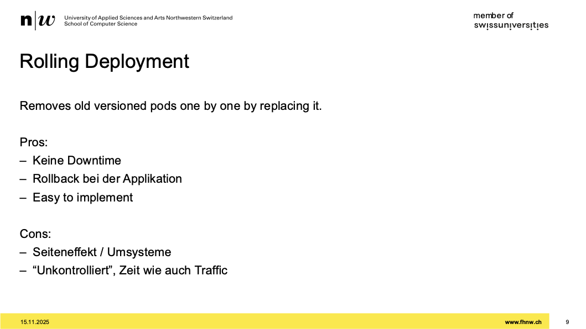
- mit dieser architektur kann man upgrades fahren ohne downtime
- 7 lines of code, mit deployment ohne downtime
- man kann rollbacken, problemlos eine alte version ausrollen
- nachteil:
  - wenn man umsysteme hat, sehr mühsam
  - also wenn man breaking changes hat in einem service, können anderen pods behindern
  - wann er welchen abräumt, kann man nicht steuern -> unkontrolliert

## Blue/Green Deployment

- 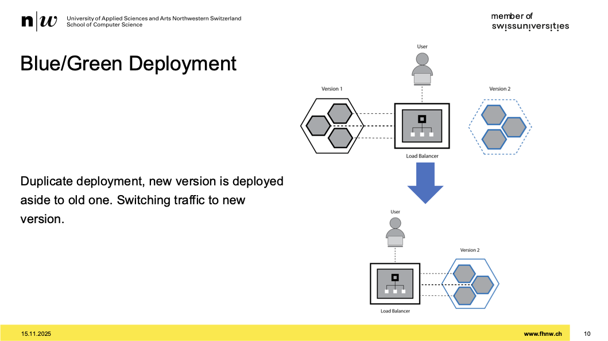
- traffic geht von jetzt auf nachher direkt rüber
- zwei versionen befinden sich auf plattform
- 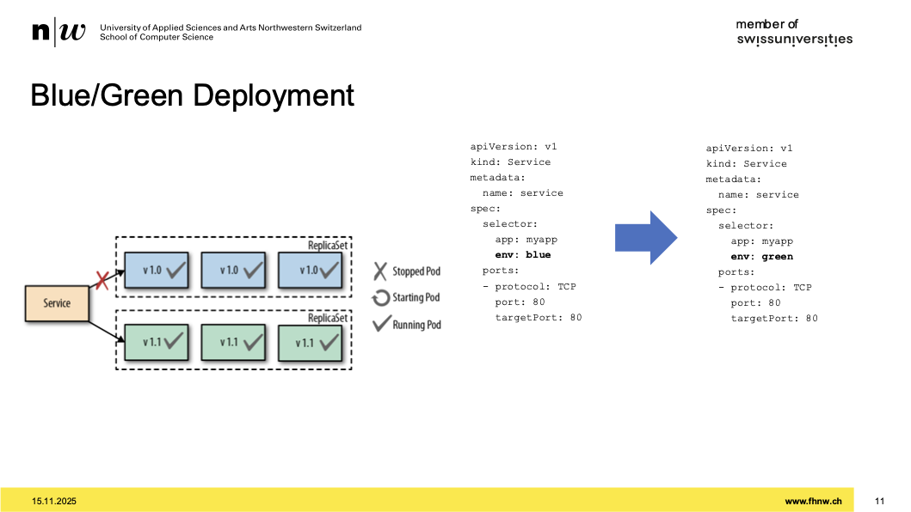
- mit labels blue und green steuer bar
- 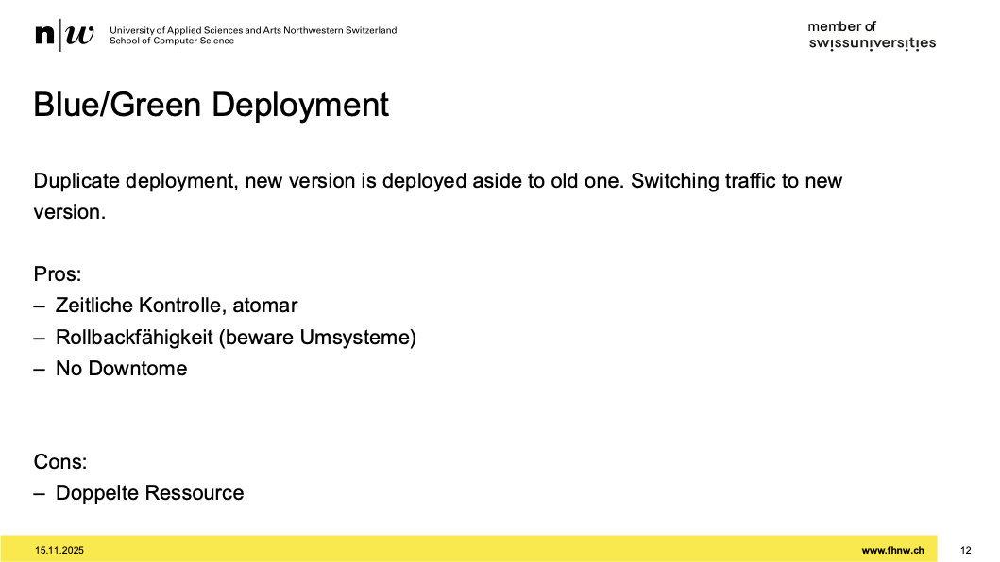
- vorteil:
- gut kontrollierbar
- gute rollback fähigkeit
- eigentlich keine downtime
- nachteile:
- ist teuer, doppelte ressourcen zumindest temporär
- ich brauch einen mechanismus zum traffic um zu switchen
- logging oder sonstiges als mechanismus

## Canary Deployment

- 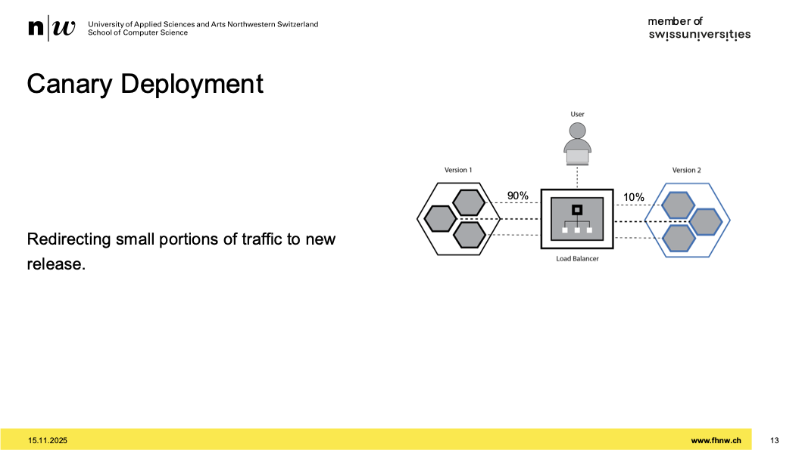
- man gibt einen teil der neuen version einen bestimmten teil des traffics
- bsp. der neuen version nur 10% geben und schauen wie es sich verhält
- versuchen, kunden mit testen zu lassen

## Canary Deployment, Implementation

- 
- services mesh verwenden, der intelligent traffic umsteuert

## Canary Deployment'

- 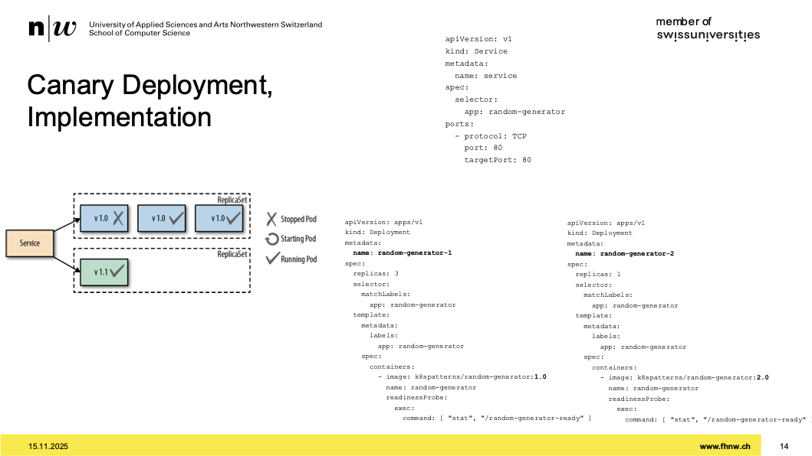
- vorteil:
- gut kontrollierbar
- kostet nicht all zu viel
- nachteil:
- siehe folien

## Comparison, Deployment Patterns

- 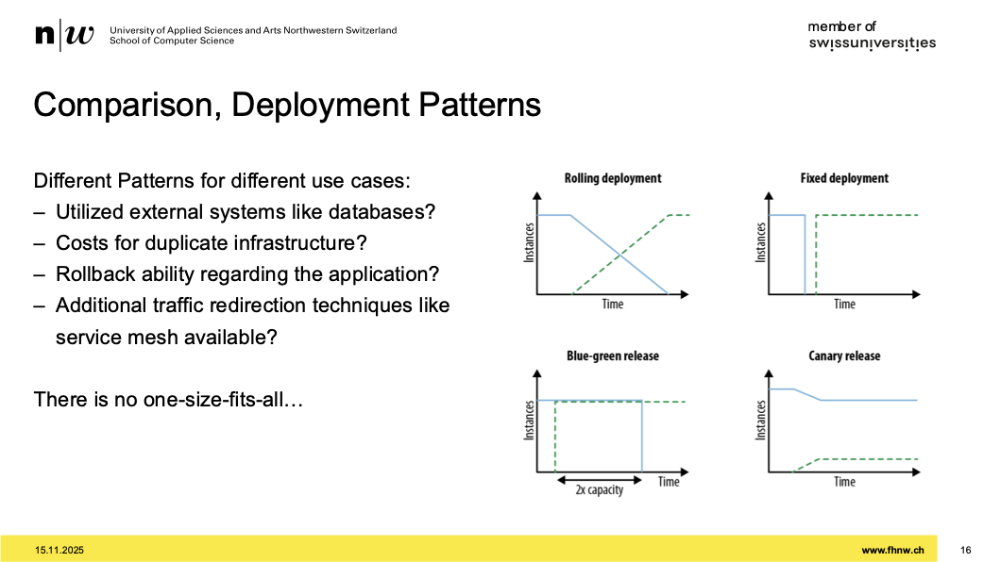
- eins davon nutzen bei uns

## Additional Deployment Strategies, A/B Testing

- 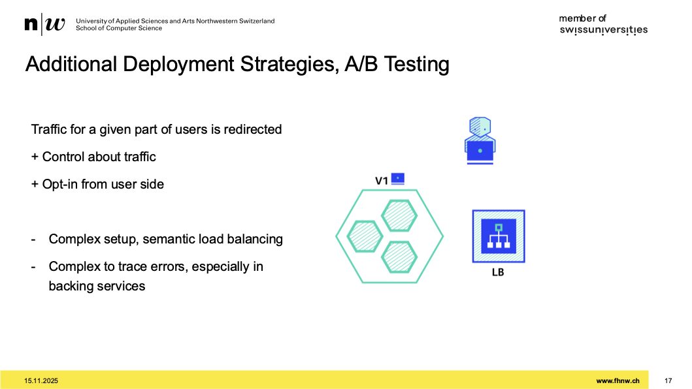
- nicht mit kubernetes boardmitteln implementierbar

## Deployment Strategies, Shadowing

- 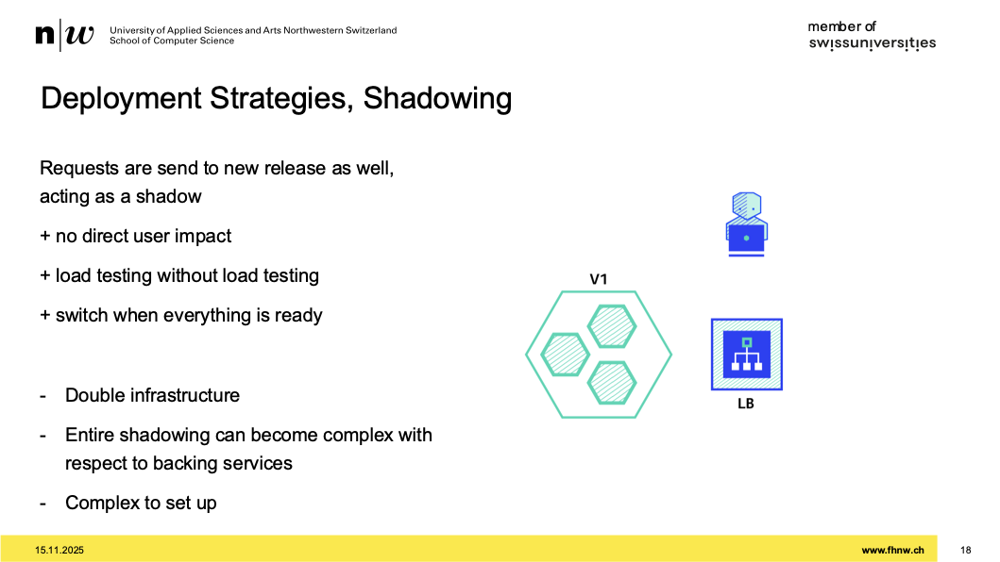
- google verwendet das
- sehr komplex, alles muss man shadowen

## Deployment Strategies, Summary

- 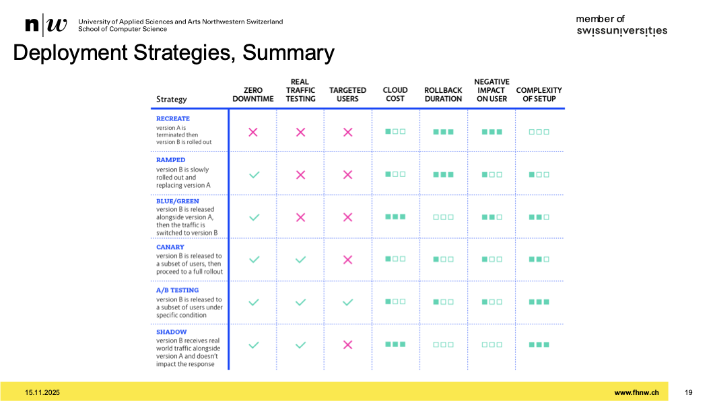

## next assignement -> 10

- request: was cluster garantiert
- limit: harte obergrenze
- gedanken machen welche quality of service-klasse (QoS) nutzen
- burstable, garanteed, und noch eins
- überlegen, welcher services braucht welche qos-klasse
- kubectl top pod -n "namespace" zum schauen wie viel effektiv gebraucht wird
- verschiedene tools zum schauen -> empfehlung
- part2:
- pull token von gitlab braucht es fix
- secret managment verwenden
- sealed-secrets von bitnami verwenden
- public key im cluster, diesen verwenden um das sealed secret verschlüseln und cluster kann es entschlüsseln
- andere möglichkeit: mozilla sops
- part3:
- argo installieren
- arog ist ein mechanismus, der auf ein repo hört, wo k8 ressourcen sind
- dieser pullt regelmässig und deployt
- argo pullt von git repo mit helm ressources und wendet es an
- initale pw ist im secret
- isntallation passiert mittels helm
- auf gruppen einen accesstoken generieren
- zwei argo projekte bei 2 stages und so weiter
- argo macht dann install, kein helm install mehr
- schauen, ob helm lokal läuft
- helm template, helm install, dann argoCD anbinden
