+++
title = "Week 08"
date = 2025-11-06
[taxonomies]
authors = ["fatlum"]
tags = ["netsi"]
+++

# K4 WAN Edge

## Was ist ein WAN?

- Standorte, Datacenter, Clouds zu verbinden
- Telekommunikationsnetzwerk
- über grosse geographische lage verbinden

## Warum Unternehmen WANs benötigen

- Remote Access
- Disaster Recovery
- Datacenter rendundant halten, wegen geographische gefahren
- Partner verbinden

## Zentrale Merkmale eines WANs

- Geographische abdeckung
- bandbreite
- kostenstruktur
- Welche verbindungstypen? Banken brauchen extrem latenz arme zugriffe

## WAN vs LAN

- LAN für innerhlab eines gebäudes
- niedrigere LAtenzen haben LAN
- im WAN sind bandbreite limitiert, je nach preis
- WAN protokolle wie MPLS

## Netzwerk Topologien

- 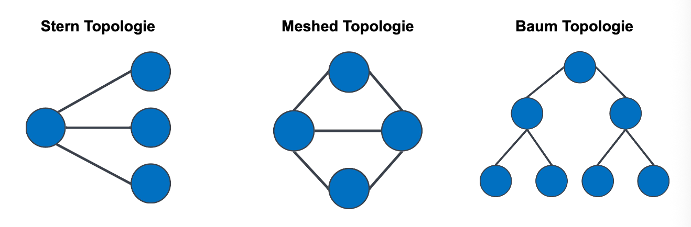
- SD-WAN gehen auf architektur Meshed
- Baum: mehrere Sterne ineinander verschachtelt

## Vergleich von Netzwerk Topologien

- 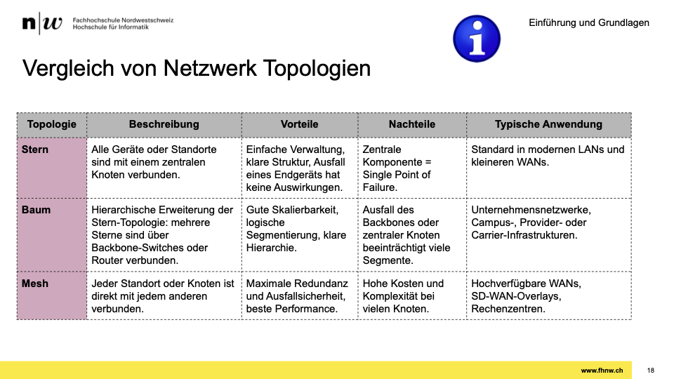

## Das Hub-and-Spoke Modell

- alle standorte zu einem verbunden
- gesamter verkehr über hub geroutet
- einzelne vlans innerhalb eines datacenter verbindet man über einen hub

## WAN im OSI Model - Layer 1 - Physical Layer

- kupfer, funk, glasfaser
- schiffe gehen auf funk, starlink und 5G

## WAN in the OSI Model - Layer 2 - Data Link Layer

- 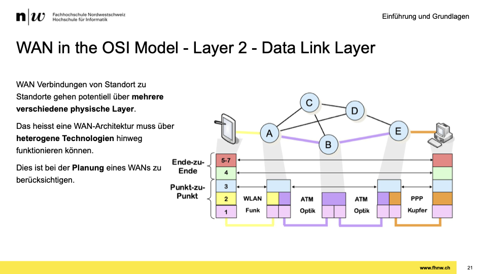
- nicht vorhersehbar bei layer 2
- im besten fall alles transparent

## Layer-2 Encapsulation Protokolle

- 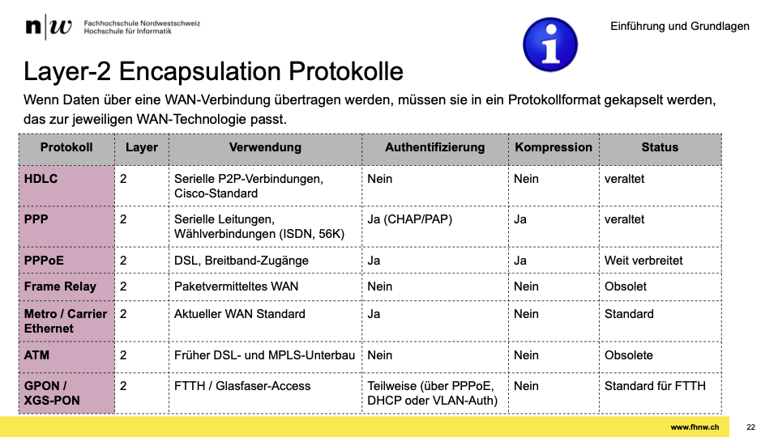
- viele unternehemen gehe auf FTTH
- carrier etherent am meisten eingesetzt für standorte verbinden
- fiber to home (FTTH)
- carrier: explizite glasfaser leitung für dich

## Carrier Ethernet

- 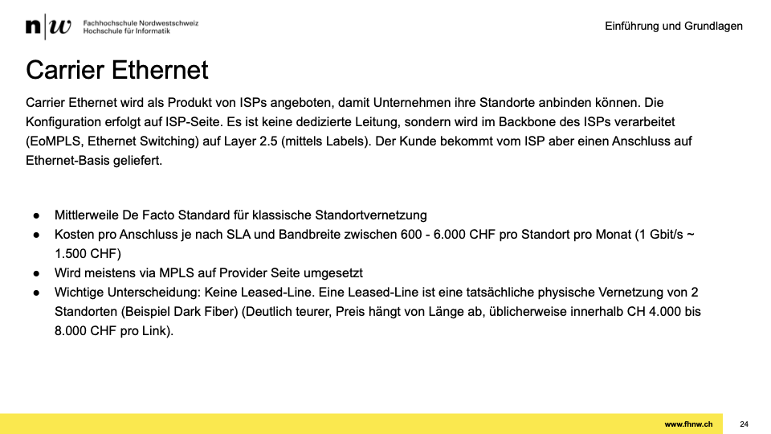

## Anbindung von Carrier Ethernet

- option 1: standort ohne rendundanz
  - 1 carrier ethernet, ein gateway
- option 2
  - standort mit clsuter und einem CE
- option 3
  - zwei wan switches, 2 wans und zwei gateways
  - verbindung über kreuz
  - wenn eines ausfällt, greift der andere

## Einschub: VRRP - Virtual Router Redundancy Protocol

- high availabality funktioniert für carrier

## Wie genau funktioniert VRRP?

- 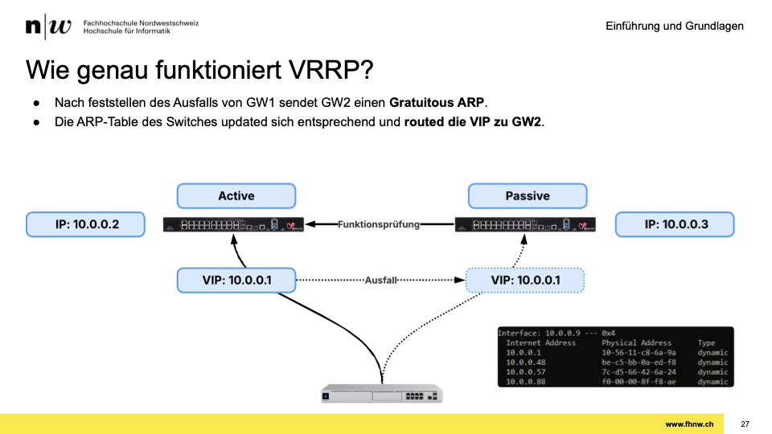
- default ansatz für active passiv cluster

## WAN im OSI Model - Layer 3 - Network Layer

- 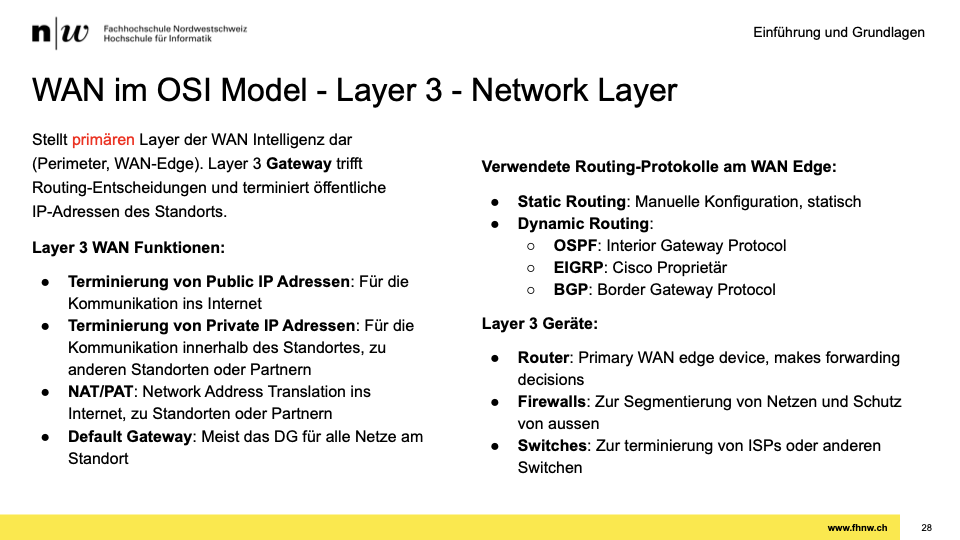
- eine ip die an mehrere standorte liegt, weiss dann wie man diese ip erreicht
- klassiche layer 3 devices sind FW, router oder layer switches

## Für was braucht man überhaupt public IPs?

- für internen mailserver, dns etc.
- encryption domain für VPN

## Routing Protokolle im WAN

## Verstehen des Perimeter Ansatzes

- grenze zwischen intern, extern nennt man perimeter
- aws azure anbinden auch perimeter
- externes anbinde, ist permiter ansatz
- OT = operating systems (industrieanlagen)
- perimeter ist einfach eine grenze zwischen netzen

## Beispiel für einen Perimeter

- 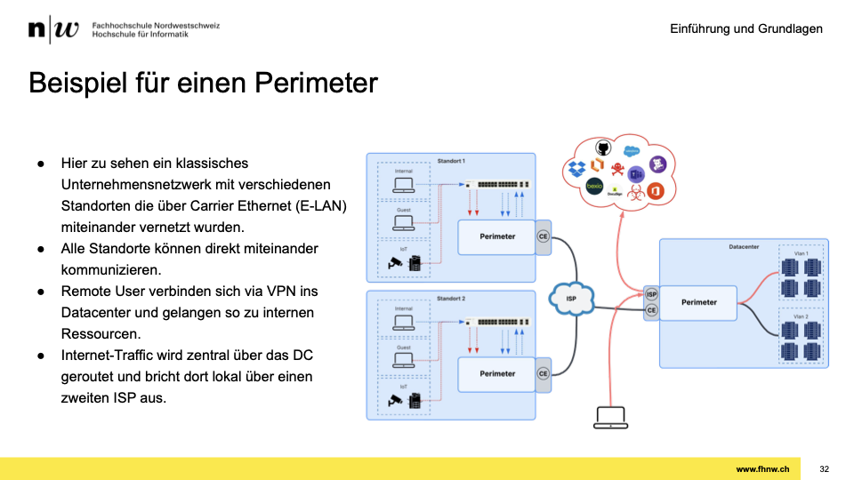

## Weitere Funktionen im Perimeter-Umfeld

- 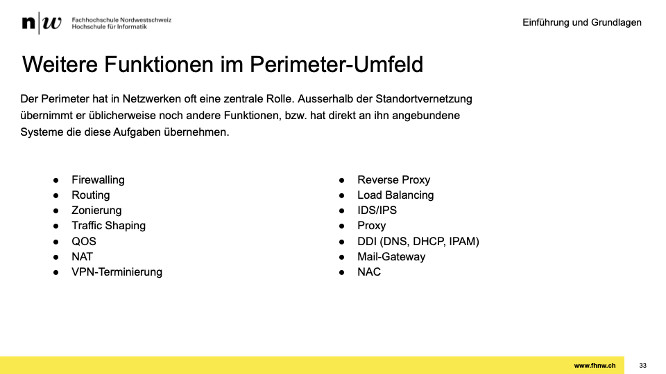
- IPAM zentr. interface wo alle ip adressen gesehen werden

## Perimeter - Firewalling

- kann steuern wer auf perimeter darf
- ziele sollen auf perimeter terminieren

## Perimeter - Routing

- zentrale aufgabe

## Perimeter - Zonierung

- 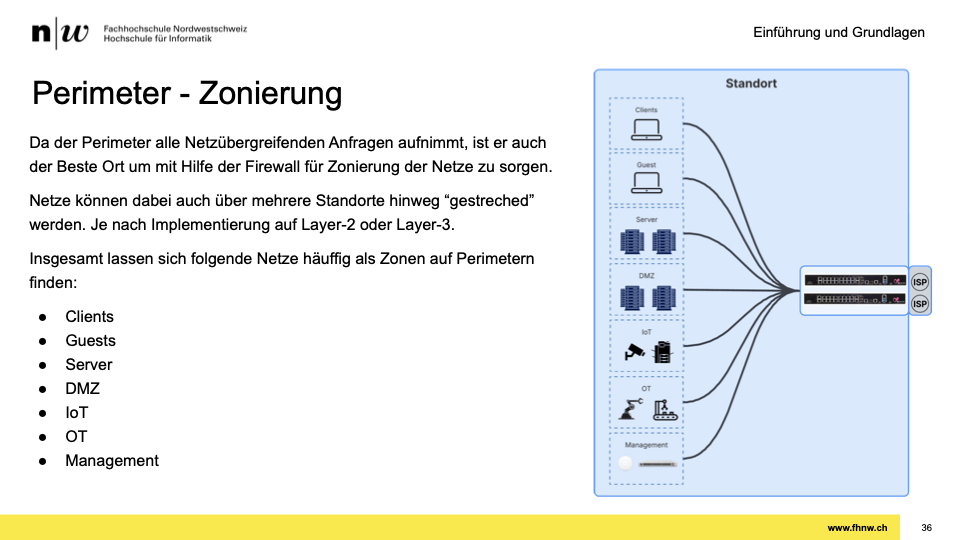
- innerhalb dieses netzwerk, können sich alles sehen
- werden nie über perimeter geroutet

## Welche Infrastruktur Komponenten im Netzwerk kennt ihr?

- Firewall, Endpint, Radius, Switch, loadbalancer

## Zeichnung einer Beispiel Infrastruktur für ein Unternehmen

- 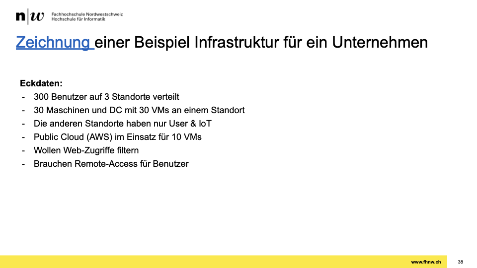
- ohne SSL geht nichts
- Standort 1:
  - OT-Farm mit eigenem Switch auf FW
  - Client eignes VLAN und IoT eigenes Vlan aber auf gleichem Swtich und dann zu FW
  - DNS hängt an FW und hostet Domain Muster.org
  - AD hängt auch an FW
  - Datacenter hängt an eigenen switch und dann an FW
- Standort 2:
  - OT-FARM, Client und IoT gleich wie Standort 1
- Verbindung dann der zwei standorte über die FW's

# Traditionelle WAN Architekturen

- Anwendungen gehen in die Cloud
- kein lokales rechenzentrum mehr
- Mehr bandbreite braucht man dadurch
- sicherheit wird immer mehr, mehr konzpete um das gesamt konstrukt zu schützen
- mikro-segmetierung wird schwirieg
- Schlusfolgerung:
  - SD-WAN

## Herausforderungen traditioneller WAN-Architekturen

# 3. SD-WAN

## Was ist SD-WAN?

- 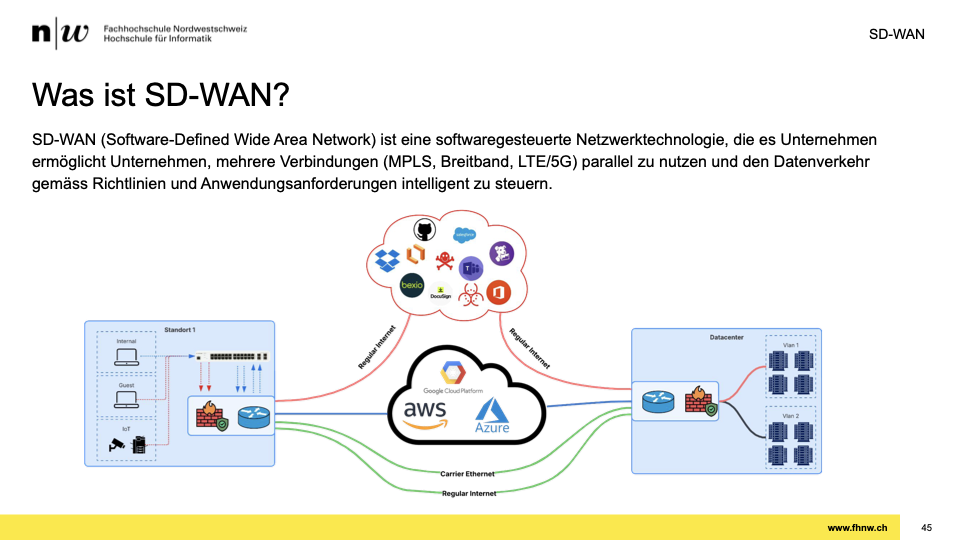
- kaufe mir billige anschlüsse und es läuft -> günstig
- wenn ich will, carrier internet
- baut dynamisch wege zum ziel
- der günstige weg
- komme so auf cloud

## Kernfunktionen von SD-WAN

- orchestierung
- dynamische pfadwahl, GW versteht von selbst welchen pfad etc. es braucht
- multilink aggregierung: overlay netzwerk wird eingeführt
- verschiedene interfaces, auf ein logisches interface mappen
- sd-wan checkt dann selber welcher bessere weg
- zentrales dashboard dadurch
- aggregierte telemetrie daten

## Zentrale Orchestrierung und Verwaltung

- ein wlan dann auf alle standorte ausrollen
- saas managment: IaC möglich
- es gibt resilienz dadurch

## Dynamische Pfadwahl

- über welchen pfad ins datacenter
- 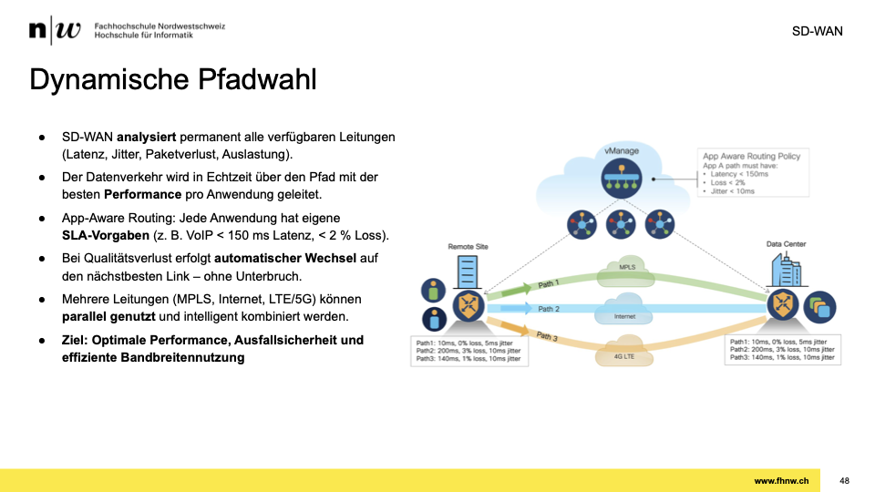
- du sagst einfach was er machen soll
- schnelleres rollout
- verschiedene layer 2 clustern

## Policy Based Routing

- hintrgrund hinter vpn: client weiss er geht über vpn
- transparenter proxy, der client weiss garnid dass er über vpn geht

## Traffic Priorisierung

- quality of service
- kann sagen welcher prozess zum beispiel, wie viel bandweite er bekommen soll
- früher wichtiger, heute nicht mehr so
- bandbreite heute werden immer grosszügiger

## Sicherheitsintegration

- 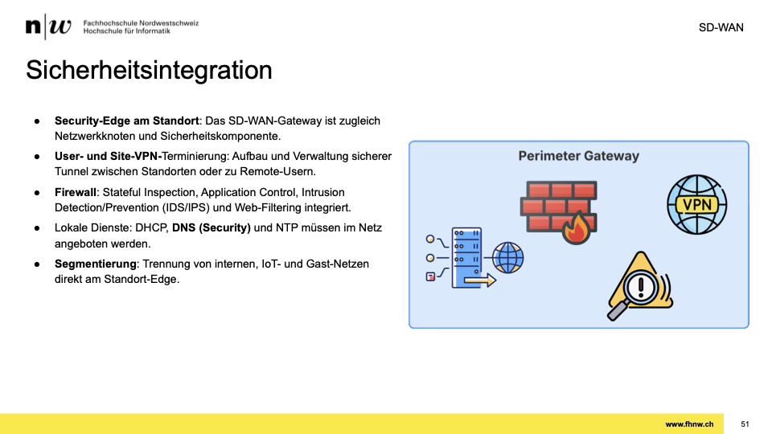
- SD-Wan übernimmt alle sicherheits relevanten arbeiten

## Multi-Link-Unterstützung

- underlay definiere, mit verschiedenen netzen
- alle anschlüsse auf overlay definieren

## Cloud Optimierung

- logische anbingug wie standorz zum andere kommt alles auf overlay definieren

## Visibilität und Analytics

- ein zentrales dashboard wo alles zeigt
- was habe ich erfasst und kategorisiert

## Wie SD-WAN funktioniert

## SD-WAN vs. Traditionelle WANs

- 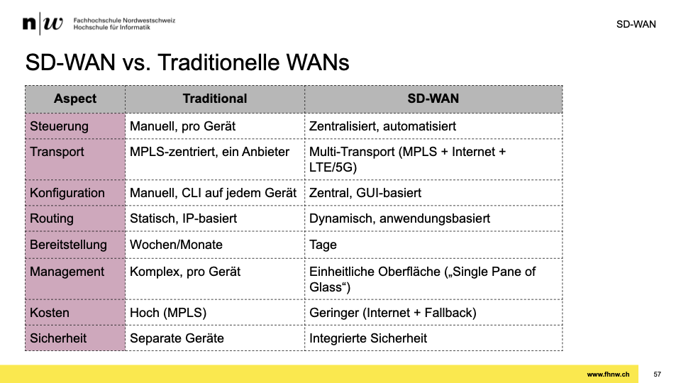
- 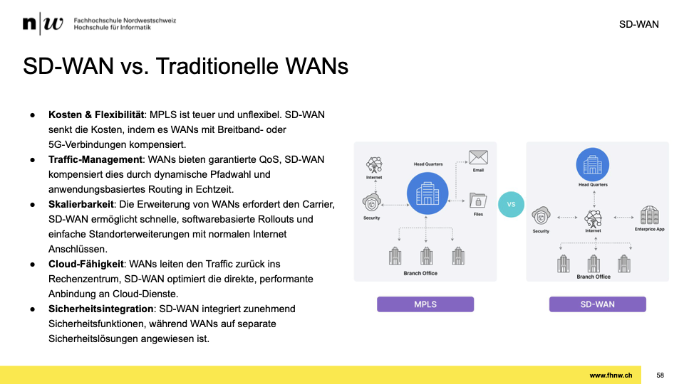

# Security Service Edge (SSE)

## Klassische Remote Access Lösungen: VPN

- SASE setzt sich aus secuirty und netzwerk zusammen
- SSE möglichst breiter security teil
  - mehr auf user zugriff
- klassisches vpn hat back halling problem
- gerät wird auf permiter verfiziert
- malware, wartet bis sich user einloggt
- client per default an GW anbinden ist dumm
- mailgateway, proxy und websecurity (endgerät)
- SSE deckt den ganzen scope
- filtern den gesamten traffic
- SSE weiss alles was du machst
- 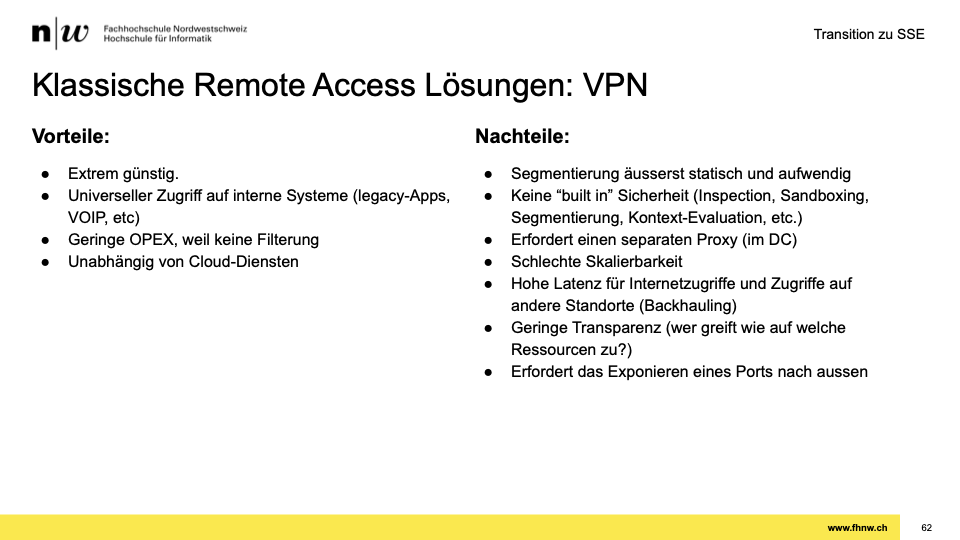

## Klassische Remote Access Lösungen: VDI

- 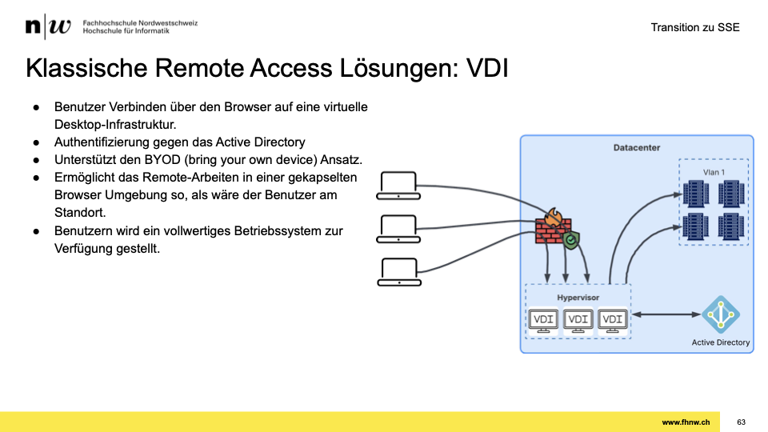
- sehr viel aufwand
- vorteil von überall aus machbar
- unterstützt diverse ansätze
- sec von gerät kann mir egal sein, keine daten rein oder raus
- DLP, data leak prevention
- hidden champions, kleine unternehmen die weltmachführer sind
- maximal kompatibel, und keine cloud abhängigkeit
- citrix ist so etwas
- VDI ist verdammt teuer

## Klassische Remote Access Lösungen: Remote Desktop

- 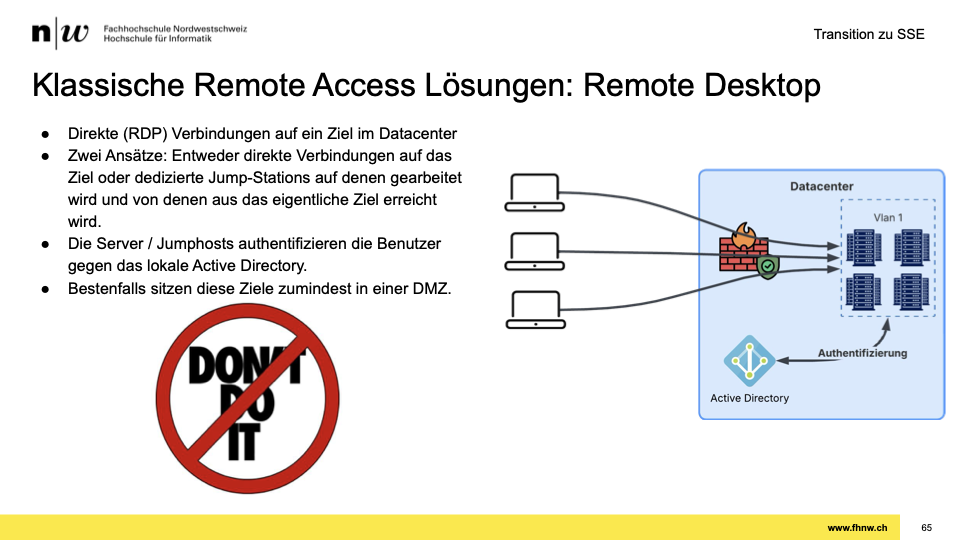

## Warum SSE entstanden ist

- weil alles in die cloud wandert
- wenn man in cloud geht, dann containerisieren
- sase
- wegen remote work -> coronazeit
- weil die bedrohungslage höher ist als früher, immer mehr digitalisierung

## Was ist SSE?

- SSE ist erster schritt einer SASE-Migration
- sicherheitsfunktion aus dem SASE teil herauslösen
- benutzer egal wo sie sind, zu unterschützen und die daten des unternehmens vor dem benutzer
- ist eine cloud lösung
- hat ein overlay funktioniert
- user zum agent server da hinten gehen, passiertr das über CGN
- über cloud zu server
- vorteil direkt in die cloud, ohne back halling

## SSE im Kontext von SASE

- 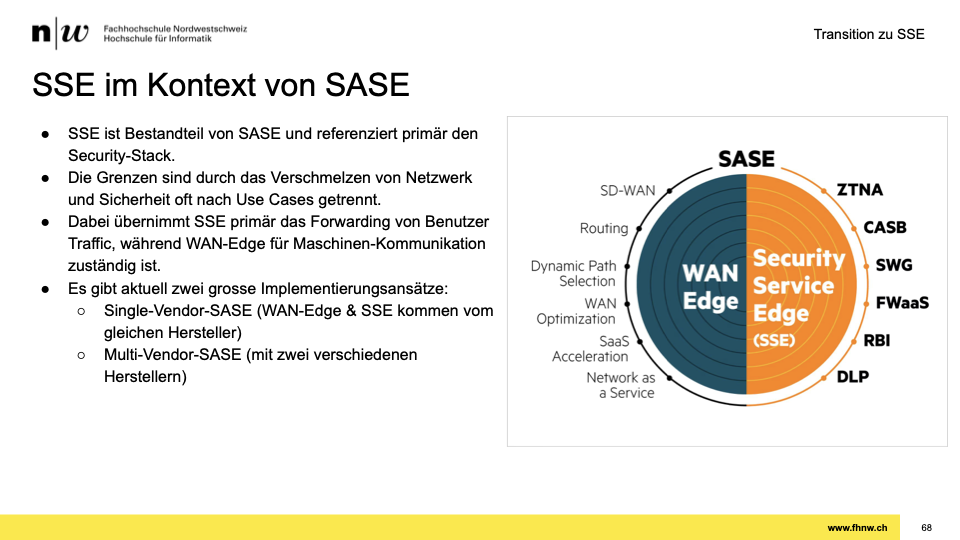

## SSE Überblick

- zero trust network access (ZTNA)
- komlette security auswertung in der cloud

# SSE Architektur

## SSE im Überblick

- für SSD forwarding installiert man einen agent
- danach tunnel zum ziel nur zum agent verbinden
- andere seite, über tunnel gebaut

## SSE Dienste, Komponenten & Features

- 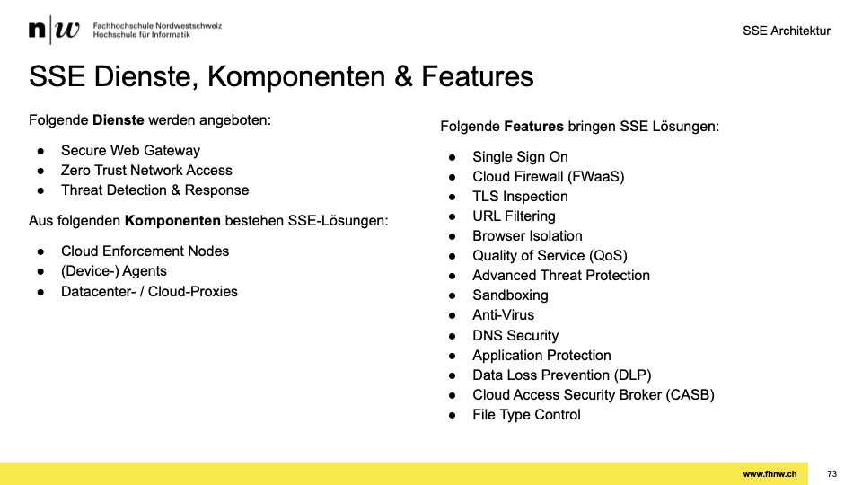

## SSE Architektur

- 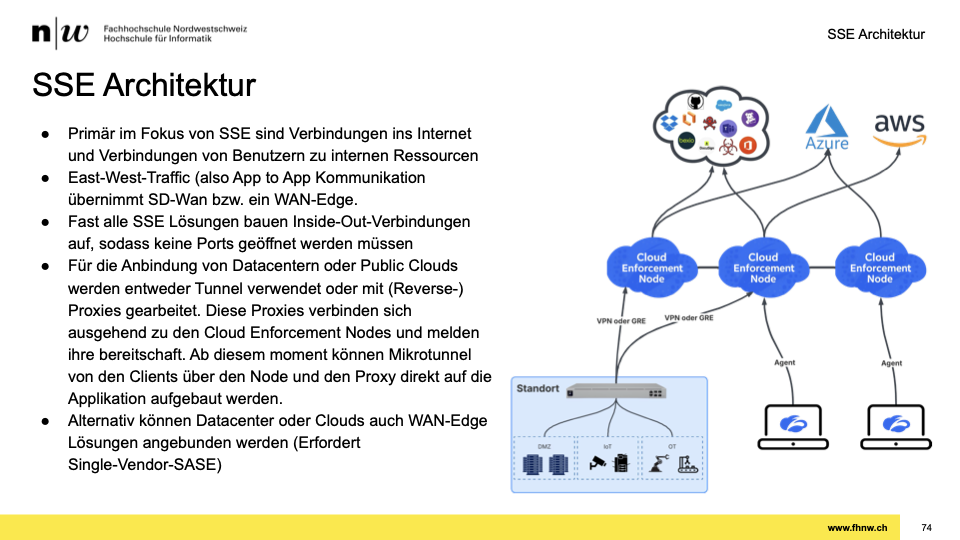

## Proxy Basierter Ansatz

- 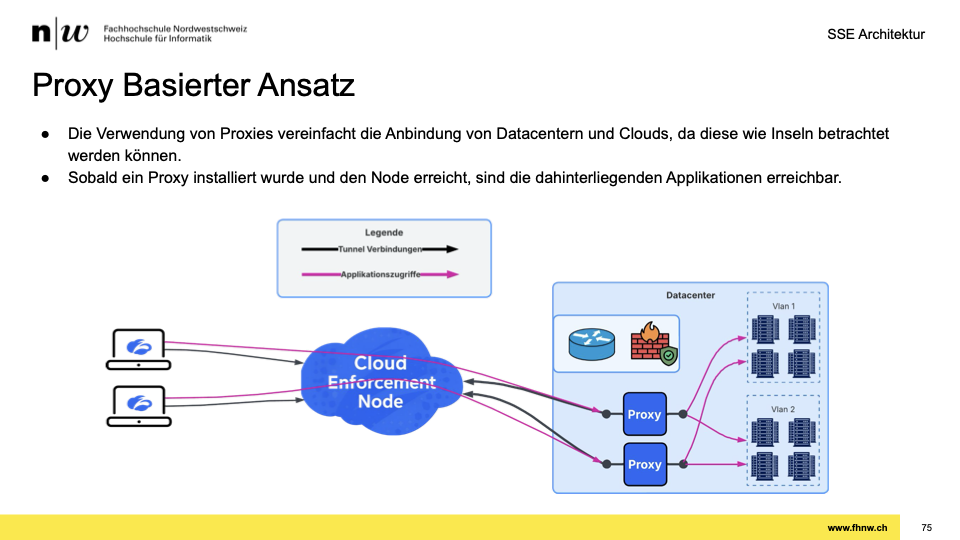
- dafür deploye ich keine vm's
- diese bauen tunnel zu ziel

## SSE Dienste: Secure Web Gateway

- 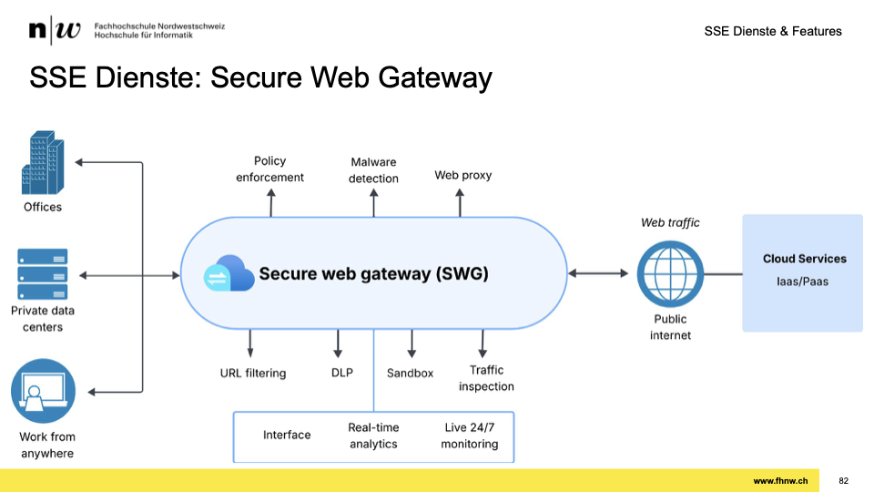

## SSE Dienste: Zero Trust Network Access

- grundsätzlich allem misstrauen
- 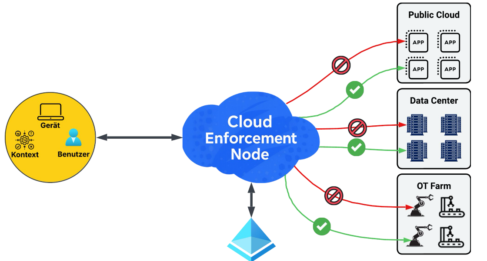

## SSE Dienste: Threat Detection & Response

- shadow it finden dadurch
- ich kann sie visualiesieren, kontrollieren und verbinden
- auf die art lateral movement verhindern

## SSE Features: CASB

- applikationen im sas umfeld die hetero sind
- beispiel sharing darf machen, oder nur herunterladen und nicht hochladen

## SSE Features: Browser Isolation

- 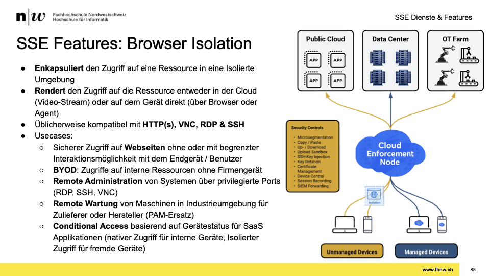

## SSE Features: Kontext

## SSE Features: DLP

## SSE Features: File Type Control

## Source IP Anchoring (SIPA)

# Secure Access Service Edge (SASE)

## Was ist SASE?

## SASE - Aktueller Stand

- WAN-Edge
- VPN und proxy los werden
- mikrosegmentierunf an den standort einführen
- multi vendor SASE, kombinitaion von SSE-komponente

## Ansatz mit Multi-Vendor-SASE

- 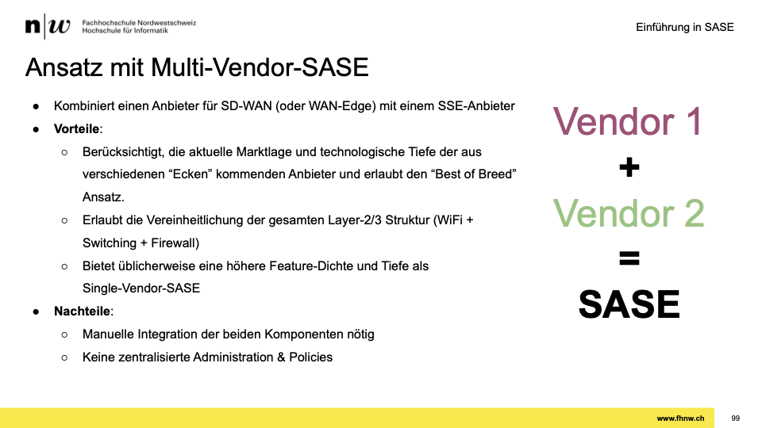

# Aktuelle Probleme von SASE Lösungen

## Lokales Enforcement

- cloud traffic können sie nicht
- 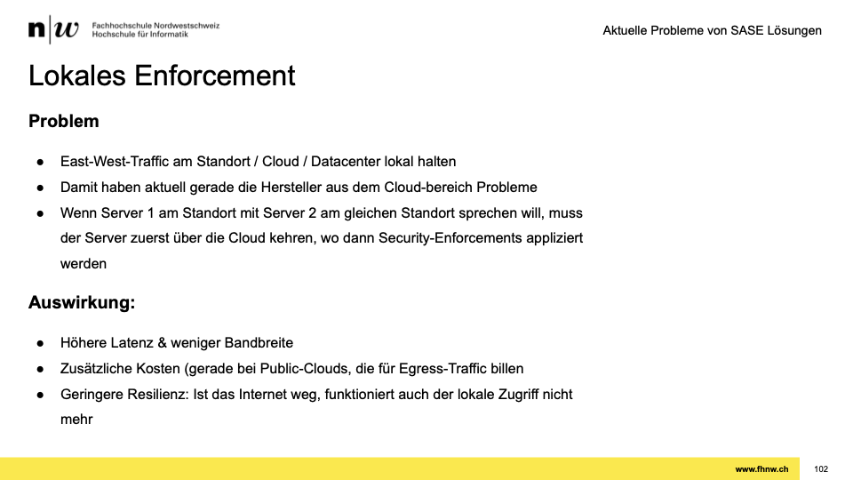

## Verwaltung des lokalen Netzes

## Business Continuity

- cloud fällt aus, was dann?
- 2 deploment optionen

## Mikrosegmentierung an Standorten

- riesen pain
- wenn ich vlans habe, wie segmentier ich?
- overlay und routing logik erlaufen keine sever 2 client verbindung

## Server to Client Verbindungen

# Aktuelle SASE Architekturen

## Edge‑anchored SASE (Gateway‑first)

- 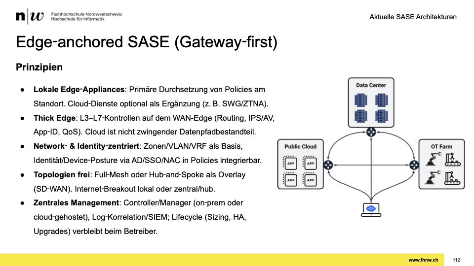
- du kannst fallback zur cloud haben

## Ausflug MCP (Model Context Protocol)

- 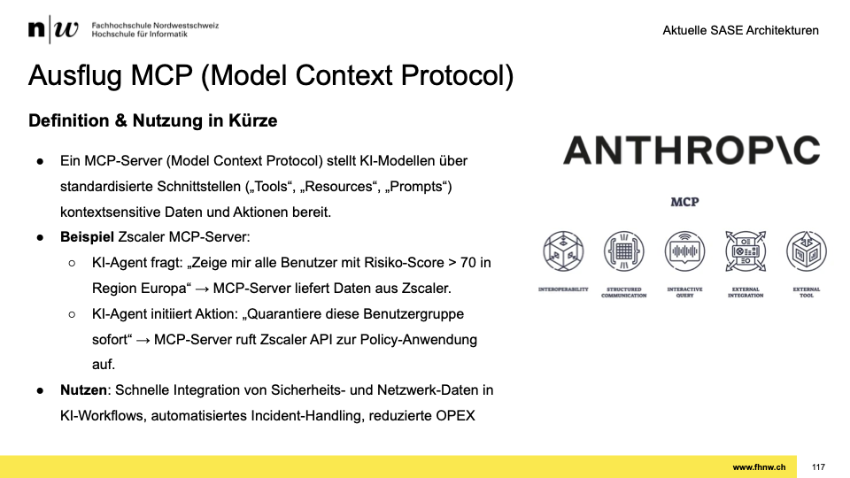
- ermöglicht AI zu AI zu reden
- oder auch mit anderen Apps
- SaaS secuirty as a service

## Mikrosegmentierung von Standorten

- 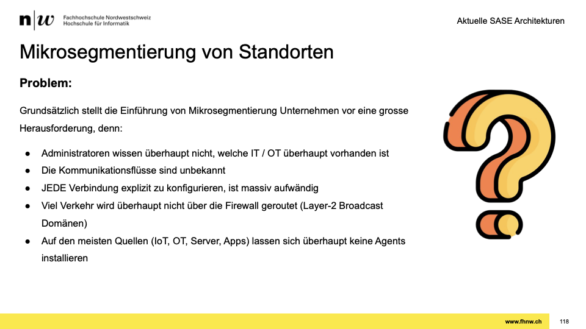
- ungelöstes problem
- funktioniert auf switch ebene
- 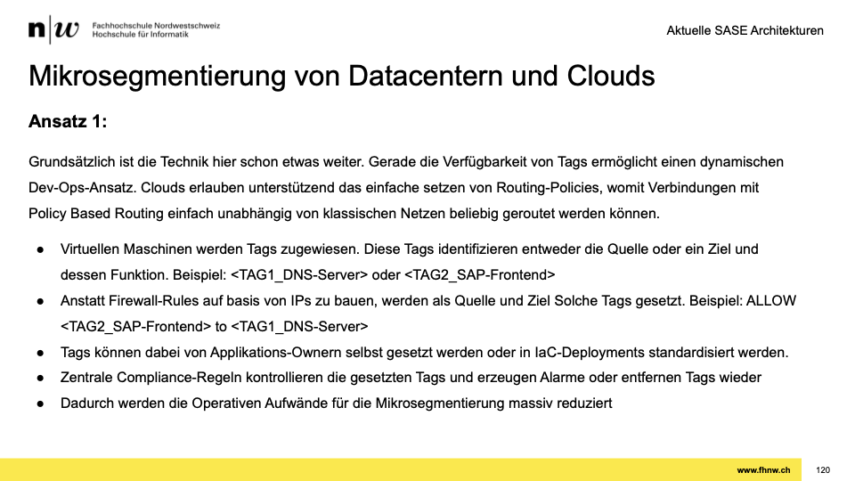
- 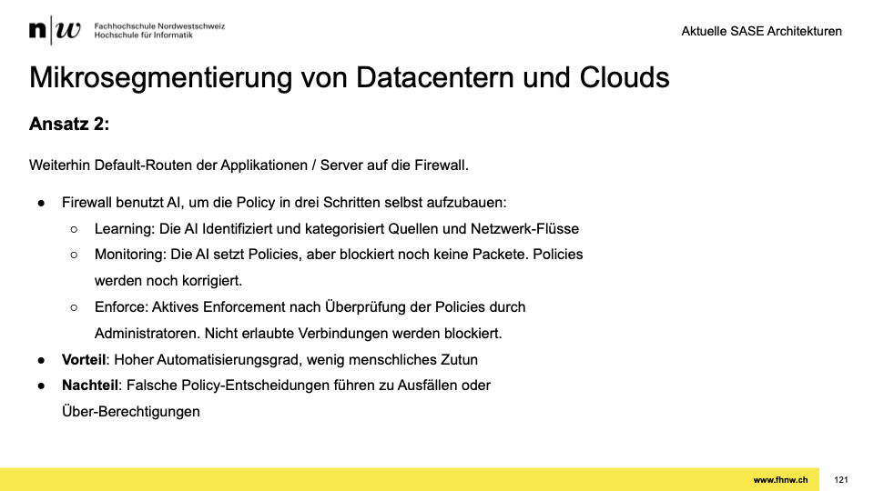

## Klassische Funktionsweise von OT-Netzen

- 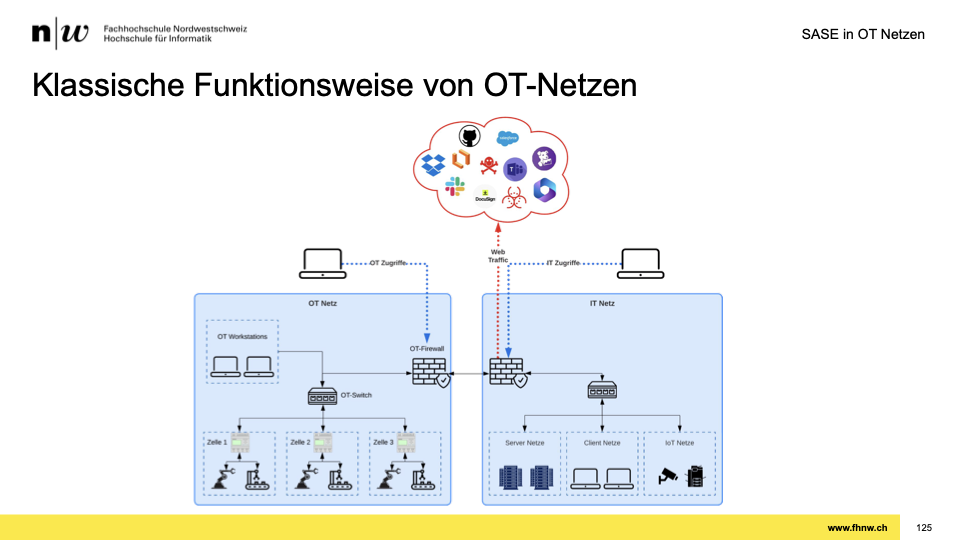

## Moderne Lösungsansätze für OT-Netze: SINEC

- 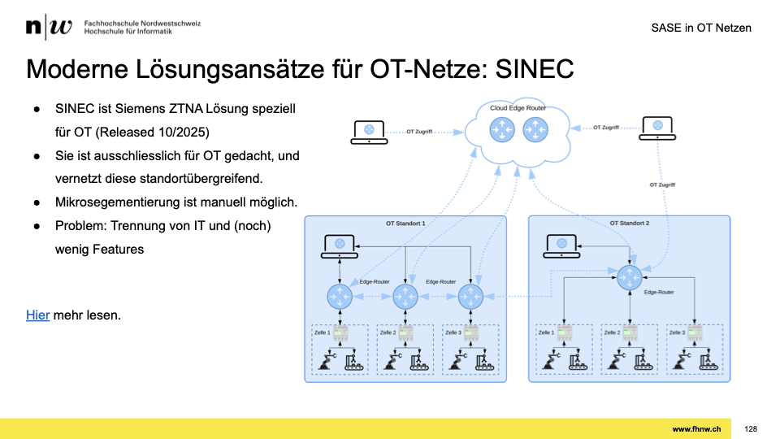

## Tipps

- ab seite 129 bis zum schluss, wenn man sd-wan aufsetzt und mit SASE und SSE konfrontiert wird
