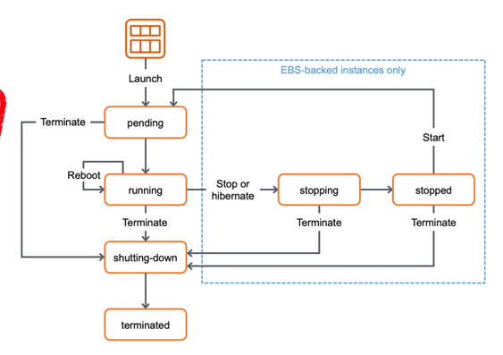

+++
title = "Week 02"
date = 2025-09-23
[taxonomies]
authors = ["fatlum"]
tags = ["pcls"]
+++

***Drehbuch: [Modulübersicht PCLS – Drehbuch](https://sgi.pages.fhnw.ch/moduluebersicht/pcls/drehbuch.html)***  
***Gitrepo: [spd/module/pcls (GitLab)](https://gitlab.fhnw.ch/spd/module/pcls/)***  
***Assessments / Assignments: [Public Cloud Services – HS25](https://spd.pages.fhnw.ch/module/pcls/tutorials/assignments/public-cloud-services/hs25/index.html)***  
***Report: [Assessments Pages (Ordneransicht)](https://gitlab.fhnw.ch/spd/module/pcls/tutorials/assignments/-/tree/main/modules/assessments/pages/)***  
***Switch Engines: [engines.switch.ch](https://engines.switch.ch/)***  
***AWS: [FHNW AWS-SSO Portal](https://fhnw.awsapps.com/start/#/?tab=accounts)***  
***Azure: [Azure Portal](https://portal.azure.com)***  
***O’Reilly: [O’Reilly-Literatur (Playlist)](https://learning.oreilly.com/playlists/a27d30d7-f139-4476-9c3a-e0abeb0f89da/)***

---

# Frontal Unterricht

## legal acpects
*** Legal aspects to secure the service/data***
- zahlt man, ist man kunde
- zahlt man nichts, ist man produkt
- wenn man zahl:
  - es betrifft die IT-Sicherheit
- CIA Triad:
  - confidentiality:
    - wer liest meine daten, wer geht auf meinem service?
  - availability:
    - sind meine daten, services verfügbar? Service level agrements (SLA's)
  - integrity:
    - ist mein service kompromitiert, oder verändert?
    - cloud anbieter darf daten nicht verändern, ausser zum schutz wenn zb ein rechner des kunden gehackt wird
- different levels:
  - regulations/verträge zwischen firmen
    - cyber resilience act:
      - alle produkte welche in EU verkauft werden, die digitale elemente beinhalten müssen folgende anforderungen erfüllen:
        - cybersecurity beweisen, also zeigen dass meine app sicher ist
        - sie müssen die requiretmetns nachvollziehbar aufarbeiten und auflisten
        - jede verwundbarkeit die sie haben (in der App) an EU melden
        - ich muss support über die gesamte lebensdauer liefern für meine App
    - data protection:
      - datenschutz garantieren
  - regulatorien gegen staatliche institutionen
    - CLOUD Act:
      - sagt, dass CSP ihre daten speichern und für die strafbehörden der USA nach gesuch ausgeben 
      - sind transparent gegenüber:
        - eine seite, die zeigt wie oft sie einblick gegeben habe, an andere staaten
        - AWS und Azure zeigen das 100% transparent
- private cloud even better?
  - gängige on-prem hardware kommt von usa oder china
    - diese haben zugang zu infrastruktur aufgrund von support und service aufträgen
- Summary:
  - legal ascpect schwer zu determine
  - verschiedene levels zum abdecken: storage vs serive, location, private vs public cloud
  - private cloud keine technische garantie für unbefugten access

## IaaS
***Product Class***
- virtual computing, virtuale umgebung
- basiert auf AMI amazon machine image, azure machine image
- CPU/RAM fixe instanz typen mit definierten setups
- disks: extra produkt, flexibel erweitbar
- netzwerk: interface, externes managen
- möglichkeit zum scalen
- tags, tags, tags:
  - wie in cloud welt, eins der hauptfeatures meta infos an die maschine, das sind labels eigentlich 
- erreichbar nur via SSH Public/Private Key
- ip-range wird nach unerfahreren usern gescannt
***templates***
- template für virtuelle maschinen, Grundidee:
  - baue ein template, gehe dort hin und starte es
  - wie ein image
  - wie bei Docker
- ***AMI:***
  - source EC2 instance, drücke knopf und der macht mir ein image
  - ich baue eine golden image und starte diese
  - in cloud will man horizontale skalierung erreichen 
  - Packer:
    - ich habe ein rezept, da drin spezifizier ich, wie ein image aussieht
    - tool um golden images zu erstellen
  - cloud-init:
    - beim booten werden settings hinterlegt
    - settings wie: network, meta, vendor, user configs/data
    - user anlegen automatisch mit ssh etc. ist typisches cloud-init task
- ***differenz zu switch engines was templating angeht:***
  - nur über CLI bei Switch bei download
  - externe Images bei AWS (Marktplatz)
- ***ähnlichkeiten***
  - cloud init geht
  - SSH am ersten start
- ***instance lifecycle***
- nach launch:
  - pending:
  - running:
  - shutting-down
  - terminated
- from running kann man zu:
  - stopping:
  - stopped:
- 
***Instance Classes***
- bei aws mit EC2 instances:
  - es gibt konventionen

***Unterschied start und stopp lifecycles, blockstorage, instanztypen... zu SwitchEngines***
- Differenzen:
  - Mehr Blockstorage bei AWS
  - verschiedene CPU/RAM/Typen-Konstellationen
  - Stop bei AWS = shelve bei Switch
- Gleich:
  - Lifecycle, provisionierung, imaging, deletion -> selfService
  - Unabhängig zu Storage und Netzwerk

***Optimizing Costs, IaaS***
- wieso IaaS am teuersten?
  - können am meisten
  - kein vendor lock
  - sie müssen bereitstellen, was sie versprechen
- kosten optimieren:
  - free tier nutzt man am meisten
  - dann geht es richtung on-demand: start/stopp eine instanz
  - ich weiss habe einen statischen workload, läuft bsp. die nächsten 3 Jahre -> reserved instance und preis geht um 40-50% runter
  - spot instance: spezielle instanzen die sie versteigern
    - sie haben weniger als kapazität, den rest versteigern sie
    - wenn aber instanz gebraucht wird, nehmen sie es dir weg
    - es gibt workload, da bringt es 
    - wenn gut konfiguriert, mit images etc. dann kein problem
  - saving plans: genauer anschauen
  - microsoft spezifisch: azure hybrid benefit, mit windows etc. -> vertragliche vendor lock-in
- architecture for optimizing costs: pdf 02-2 seite 19 und 20
***was fehlt um das in swtich zu implementieren?***
- orchestrator auf event hört
- monitoring, das events warhnimmt
- (User)
- Ein software gestützer Loadbalancer

***Summary***
- hauptgrund wieso in die cloud: IaaS

---
## optional tutorials
• EC2:
https://awsacademy.instructure.com/courses/137586/modules → Modul 6

• Azure:
https://learn.microsoft.com/de-de/training/modules/describe-azure-compute-
networking-services/
---

***Vorbereitung***
- IaC über das provisionieren
- Packer und cloud init lernen 