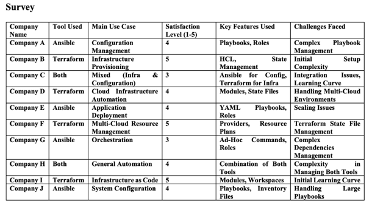
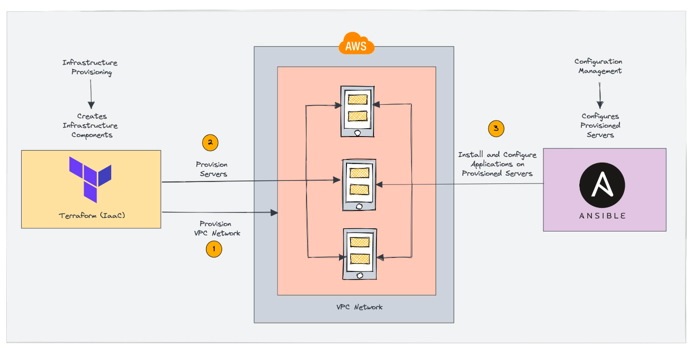
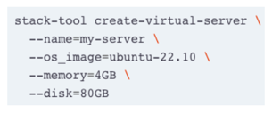
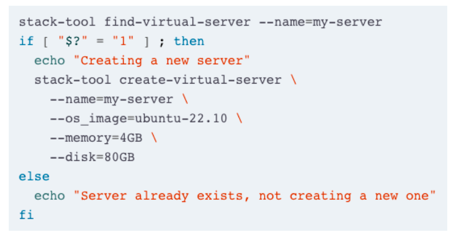
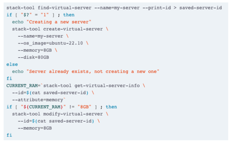
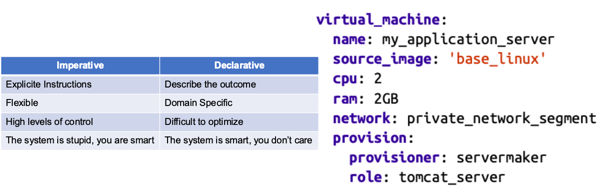
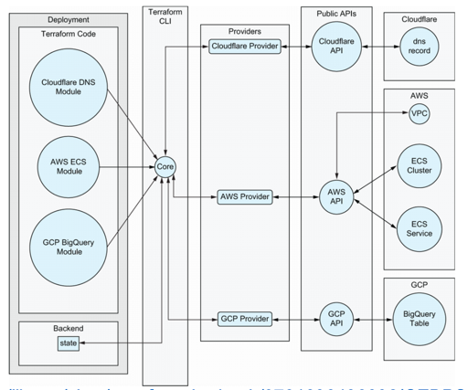
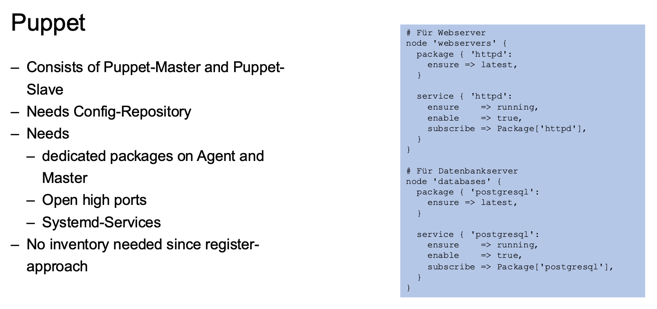
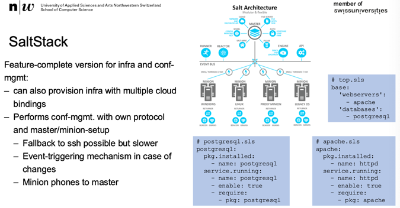

+++
title = "Week 03"
date = 2025-09-30
[taxonomies]
authors = ["fatlum"]
tags = ["pcls"]
+++

***Drehbuch: [Modulübersicht PCLS – Drehbuch](https://sgi.pages.fhnw.ch/moduluebersicht/pcls/drehbuch.html)***  
***Gitrepo: [spd/module/pcls (GitLab)](https://gitlab.fhnw.ch/spd/module/pcls/)***  
***Assessments / Assignments: [Public Cloud Services – HS25](https://spd.pages.fhnw.ch/module/pcls/tutorials/assignments/public-cloud-services/hs25/index.html)***  
***Report: [Assessments Pages (Ordneransicht)](https://gitlab.fhnw.ch/spd/module/pcls/tutorials/assignments/-/tree/main/modules/assessments/pages/)***  
***Switch Engines: [engines.switch.ch](https://engines.switch.ch/)***  
***AWS: [FHNW AWS-SSO Portal](https://fhnw.awsapps.com/start/#/?tab=accounts)***  
***Azure: [Azure Portal](https://portal.azure.com)***  
***O’Reilly: [O’Reilly-Literatur (Playlist)](https://learning.oreilly.com/playlists/a27d30d7-f139-4476-9c3a-e0abeb0f89da/)***

---

# Frontalunterricht

***reflketierung assignemenet***
- docker compose: 
  - ist standard für mehrere services zu deployen
  - ein yml file
  - ein build kann ich starten
  - ein order mehrere ports definieren
  - :ro -> ready only, damit dockercontainer dort nicht schreiben kann
    - wenn man root volume darin mountet, hättte der container zugriff auf root-verzeichnis 
  - container sehen sich unterienander mit container name
  - container name wird direkt unter services im compose file gelegt

- bootstrap mascchine
  - cloud init hinterleg bar in switch engines

---

## IaC - Infrastructure as Code

- entweder nur mit clicki bunti oder nur mit IaC
- wieso IaC:
  - on-prem wachsen nicht mehr
  - mehr virtualisierung, dinge die man als software wahr nimmt
  - wir schlagen uns mit software
- problem ist, die software die für hosts da ist, die ist sehr weit hinten

***Iron Age VS Cloud Age***
- deutlichen switch passiert
- wenn man hardware bestellt, geht das wochen 
- innerhalb von minuten einen neuen server provisionieren 
- ein change ging früher bis zu 10 tage
- interne dns-einträge ging früher 5 tage
  - extra domain gezogen die auf die alte zeigt 
- chaos engineering -> chaos monkey
  - damit während development darauf geschaut wird, dass es robust ist
- früher hatte man monolithen
  - heute container basierte workloads

***5 Principles of Infrastructure in the Cloud Age***
- man kann davon aussgehen das system nicht zuverlässig ist 
  - 3-7 technologien in einem system, in den ganzen layern 
    - kann davon aussgehen, dass es irgendwo einen fehler gibt
  - änderungen an kapazität, grösser kleiner machen die maschine, brauchen einen reboot
    - wen man system mit IaC, baut alles direkt neu
  - IaC fuktioniert schlecht auf blech -> braucht virtualisernug
- IaC reproduzierbar machen
  - System das gut ist, soll reproduizierbar sein
  - wenn es reproduzierbar ist, können wir stages machen 
- systeme disposable kreiieren 
  - cloud infrastructure ist software, es wird wie sw gelöscht
  - infrastructure ist nicht statisch sondern elastisch
- variation minimieren 
  - jede variation generiert manuelle arbeit 
  - 1000 gleiche services ist einfacher zu hosten als 50 verschiedene services 
  - setup, OS, architektur, deployment gleich oder ähnlich behalten 
- prozess um dinge zu bauen und deploysen wollte von jedem gemacht weren können 
  - bus-faktor > 1
    - anzahl menschen die überfahren werde können vom bus, bis 
  - immer mehr als 1 person sein, die weiss was sie macht und die weiss wie es geht
  - IaC ist eine sichere sache, transaparent im gitrepo und nachvollziehbar

***pet vs cattle***
- infrastruktur als vieh sehen 
- pet ist infrastruktur die man manuell hostet 
  - man schaut das es dem gut geht, dass alles läuft, überprüft etc. 
- cattle ist cloud friendly
  - keinen namen, 
  - skripte die alles machen
  - es soll seine arbeit machen, keine grosse wartungsaufwand
- infrastruktur ist CAPEX bei pet:
- infrastruktur ist OPEX bei cattle:

***IaC***
- infrastructure provisioning:
  - redet man mit API
  - elemente sind atomar, nimme einzelne bausteine die ich damit provisionier
  - häufig passe ich bestehnde services nicht an sondern lösche sie und baue sie neu
  - bestehende daten können gelöscht werden
  - muss state handeln 
  - werkzeuge: terraform, crossplay...
    - merken sich die states
  - häufig machen sie keine anpassung sondern löschen und machen neu
    - daten und workload können verloren gehen 
- configuration management:
  - ein framework dass mit server redet oder mit localhost
  - dient dazu, auf IaC eben zu orchestrieren 
  - ich möchte einen user auf allen servern ausrollen 
    - statt 15x einloggen, nur einmal ausrollen
  - passt an, modifiziert bestehende instanzen 
  - geht auf server, macht evaluation was er machen und fängt dann an dagege zu arbeiten 

***survey***
- ansible: conf management
- terraform: infrastrucure provisioning 
- 
- Packer bootstrapt etwas
  - nutztz man um golden image zu bauen 
- ansible patcht laufende applikation 
- use case anbhängig
  - bei monoloith lieber mit ansible patchen, statt alles neu aufbauen

***Infrastructure Provisioning ♡ Configuration Management***

***IaC is source code***
- iac ist source code, nicht ohne git machen 
- linting
  - syntaxchecks
- tesing
  - semanticcheck
- auditing
  - merge request
- versioning
  - reverting

***Pitfalls: Fear the Fear Spiral***
- nicht lokal zu fixen
- Principles of Software Delivery from Jez Humble and David Farley:
  1. Create a Repeatable, Reliable Process for Releasing Software
  2. Automate Almost Everything
  3. Keep Everything in Version Control
  4. If It Hurts, Do It More Frequently, and Bring the Pain Forward
  5. Build Quality In
  6. Done Means Released
  7. Everybody Is Responsible for the Delivery Process
  8. Continuous Improvement

***Pitfalls: Mind the Blast Radius***
- wir sind ganz unten im stack
  - wenn wir da was kapput machen, geht es ganz oben kapput
- so bauen, dass ich nur die sachen wegreiss, die auch mir gehören
- wenn ich testen muss gegen IaC, dann nicht gegen prod stage
- dedizierten account für testing etc. 
- nutzt konventionen, labels, tags 

***Pitfalls: How should infrastructure be defined in Sourcecode?***
- 
  - probleme damit:
      - keine lightchecks gegenüber status quo
      - könnte 100 "my server" erstellen
- 
  - problem:
    - kein configuration drift adressieren 
- 
  - das imperative funiktoniert bei IaC nicht gut

***Pitfalls: How should infrastructure be defined in Sourcecode?***
- deklarativ coden
- ich beschreib meine maschine wie ich will
- den rest soll mein framework abechekn ob es vorhanden ist
- 
- sehr spezifische gegen die jeweilige anbieter
- IaC debuggen ist sehr mühsam

***Summary***
- deklarative sprache ermöglich die komplexität ein system hat nicht zu beachten
- verschiedene werkzeug für verschiedene use cases 
- Infrastructure Provisioning vs Configuration Management
  - keine ein tool lösung
  - kombinieren vom besten der besten welt 
  - nicht selbes tool für gleichen purpose

***What is Terraform / Opentofu***
- 
- [Bücher](https://learning.oreilly.com/library/view/terraform-in-depth/9781633438002/OEBPS/Text/01.html#heading_id_8)
- möglich zum server/maschinen aufsetzen
- open library, einfach zu installieren
- in terraform verschiedene files
- in den files gibt es verschiedene module, nicht mehr als blöcke
- diese blöcke werden von cli gelesen
- über die provider werden die module transoforiert in http-request
- diese werden gegen API geschossen
- cloud-anbieter unabhängig rein von der sprache her 
- wichit zu wissen:
  - die module sind nicht cloud-provider unabhängig, also beim implementieren schauen 
- state:
  - ds was terraform, nach durchlauf, persisitiert ins backend in json 
- (03-2-iac-infra.pdf) auf seite 3 sind beispiele
- da provisionieren wir security-group
- wenn man das ausührt, mit referent auf folgende variable:
  - 
- diesen namen gibt man dann beim cloud-provider an

***Terraform workflow***
- .tf -> terraform
- wenn man changes machen will, dann macht man das, danach
- init:
  - download modules, providers
  - initialisiert backend 
- plan:
  - refresh gegen echten state of infrastructure
  - gegenprüfen gegen code
  - generiert DAG mit actions to aligh infrastructure 
- apply:
- wichtig:
  - einen terraform run nicht unterbrechen!

***Terraform State***
- state wird gepseichert in einem riesen grossen json
- unter operate/terra form state:
  - es loggt alle states 

***IaC configuration Mgmt***
- task:
  - install nginx
  - generate nginx-config
  - restart nging
- ainsible:
  - idempotenc
  - no extra agent, just ssh
  - no extra state

***inventory***
- alles server zum orchestrieren beschreiben
- kann dynmaic sein
- 

***Puppet***
- 

***SaltStack***
- 

## Aissgnement 03
- IaC for IaaS
- für 6er, ein cloud-init und einen eval user mit ssh-key etc
- ein repo wo die infrastrktur drin liegt 
  - mit ssh
  - regelmässige update, package, 
- wenn neues docker image kommt, wird es ausgerollt
- bonus task:
  - continously

- compute/instances/ID
- 

