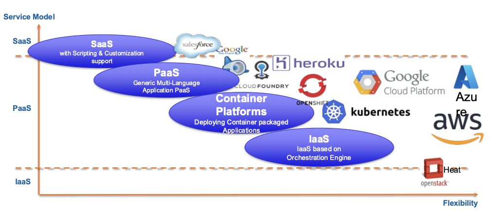
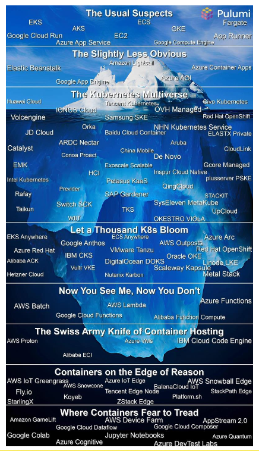
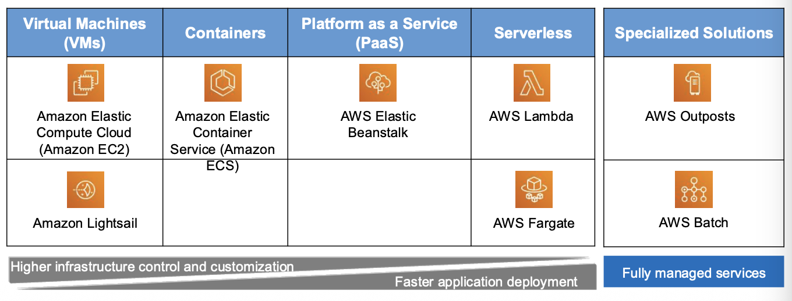
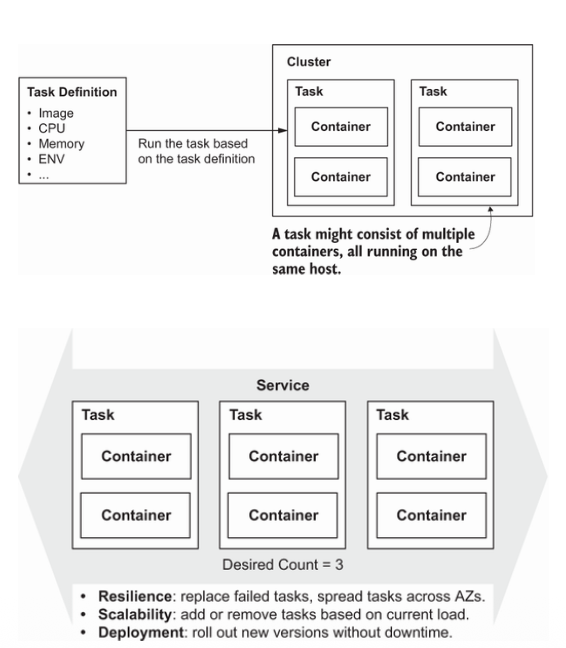
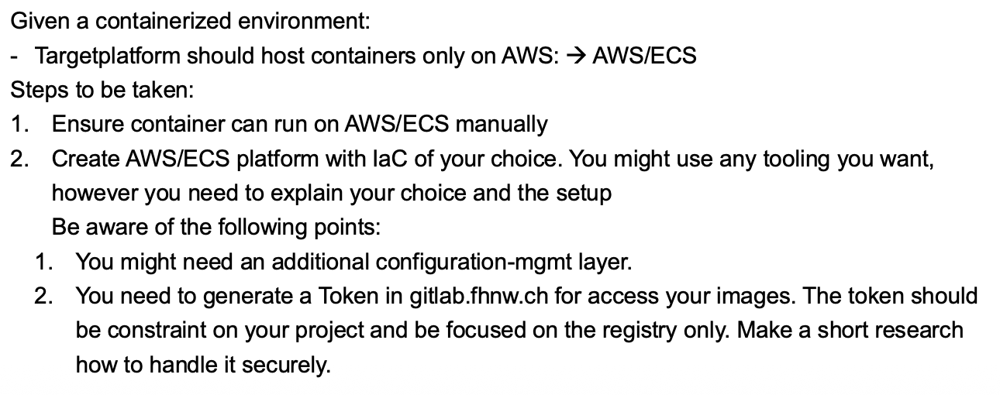
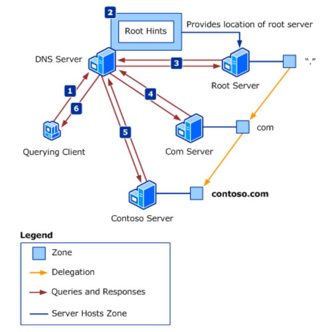
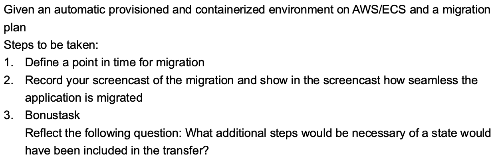

+++
title = "Week 04"
date = 2025-10-07
[taxonomies]
authors = ["fatlum"]
tags = ["pcls"]
+++

***Drehbuch: [Modulübersicht PCLS – Drehbuch](https://sgi.pages.fhnw.ch/moduluebersicht/pcls/drehbuch.html)***  
***Gitrepo: [spd/module/pcls (GitLab)](https://gitlab.fhnw.ch/spd/module/pcls/)***  
***Assessments / Assignments: [Public Cloud Services – HS25](https://spd.pages.fhnw.ch/module/pcls/tutorials/assignments/public-cloud-services/hs25/index.html)***  
***Report: [Assessments Pages (Ordneransicht)](https://gitlab.fhnw.ch/spd/module/pcls/tutorials/assignments/-/tree/main/modules/assessments/pages/)***  
***Switch Engines: [engines.switch.ch](https://engines.switch.ch/)***  
***AWS: [FHNW AWS-SSO Portal](https://fhnw.awsapps.com/start/#/?tab=accounts)***  
***Azure: [Azure Portal](https://portal.azure.com)***  
***O’Reilly: [O’Reilly-Literatur (Playlist)](https://learning.oreilly.com/playlists/a27d30d7-f139-4476-9c3a-e0abeb0f89da/)***

---

## Reflektion Assignment

***part 1:***

- auf dem service soll app laufen
- für infrastruktur provisionierung soll IaC verwendet werden
- kein password für root setzen, nur mit SSH!!
- opentofu.openstack.provider
- public IP, von aussen gebumpt
  - float IP wird gemappt auf mac

***part 2:***

- ansible ist da um eine ssh connection zu einer instanz zu machen
- ansible.cfg

***Input für zukunft***

- semesterwoche 42 -> BSS
- semesterwoche 43 -> assessment
  - 10 minuten fragen zum source code
  - allfällige fragen zum screencast
  - live migration

---

## Frontalunterricht

***For the start…***

- wir schieben immmer weiter links aber ende des tages wollen wir einfach programmieren

---

***PaaS – Platform as a Service***

- 
- ziel wenn man applikation programmiert
- wir builden eine plattform die ein normalo dort deployen kann -> PaaS

---

***What functionalities do you expect from a PaaS?***

- gute dokumentation
  - wie man es provisioniert
  - wie man es deployd
- schnittstellen zu den schen die man verwendet
- image bauen und hochladen
  - sogar dockerfile pushen -> wird deployd
- schnelle zyklen
- monitoring
- transparenz der kosten
- kein interesse an skalierung / HA / load balancing

---

***NIST Definition of PaaS***

- chat gpt ausfüllen

---

***What are components of a PaaS?***

- 
- runtime: definieren mit chatGPT
- mit chatGPT ausfüllen

---

***Blured lines…***

- 
- kubernetes PaaS oder nicht?:
- azure kann man registry haben
- autopilot mittlerweile
- openshift: registry, api management, free scaling, komplettes paket wo man dort app installieren kann

---

***Container Platform VS PaaS***

- Container orchestration:
  - container gehört mir, sage der plattform wie es zu betreiben geht
- application: (PaaS, Application Platform)
  - nur für app code verantwortlich
  - wie es gerunt wird, interessiert mich nicht

---

***Serverless Compute***

- wenn ich container habe, interessiert es mich nicht auf welches os es läuft bei gross skalierten
- oder es ist egal:
  - hier mein container, laufe ihn nur

---

***Price of serverless***

- 
- serverless lohnt sich, wenn die app nonstop läuft
- wenn serverless, braucht man kein system engineer
- wenn man einen pod haben, die nonstop läuft, dann lohnt sich eine IaaS struktur
- [blogPost](https://aws.amazon.com/blogs/containers/theoretical-cost-optimization-by-amazon-ecs-launch-type-fargate-vs-ec2/)

---

***Besides Compute…***

- load balancing muss die infrastruktur kennen
- wenn man einen scale out macht, muss sie warm werden, aufstarten etc.
- loadbalancer muss eine awarness haben der infrastruktur/instanz

---

***AWS Beanstalk***

- 
- [beanstalk](https://docs.aws.amazon.com/elasticbeanstalk/lat)
est/dg/Welcome.html
- ist ein services
- nicht mehr als ein aggregator
-

---

***Feedback regarding Complexity in Setup / Operating***

- PaaS-Produkt von AWS
- machbare komplexität
- gui-gesteurt ist positiv
- kostentransparenz fehlt

---

***AWS ECS***

- grundidee ist einen service der dann einen container laufen lässt

---

***Updates / Upgrades of PaaS/SaaS-Products***

- wenn man nicht nonstop upgraden will, und man fällt runter
- mit chatgpt ergänzen

---

***Lifecycle of PaaS/SaaS-Products***

- durchschnittliche lebensdauer von google app ist 4 jahre
- wenn man IaaS hat, kann man zügeln
- wenn nutzungszahl niedrig ist, gehen sie out of support
- bei PaaS weiss man nicht ob sie noch da sind
- atlassian kunden müssen weg migrieren

---

## Container Services

- 
- überall da können container laufen

***Compute, Product Classes in AWS***

- 
- wir schauen ecs an

---

***Compute, Product Classes in Azure***

- PDF 04-2 seite 4 für die grafik anschauen

---

***Compute, Product Classes in Google Cloud***

- PDF 04-2 seite 5 für die grafik anschauen

---

***Managed Kubernetes***

- PDF 04-2 seite 6 für die grafik anschauen
- wenn man kubernetes will, dann von den hyper scalern nutzen

---

***Running Container Natively***

- 
- kleinstes zum container laufen lassen:
  - OCI-Runtime, container-d zum beispiel
  - OS-Layer mässig hat alles, nur noch runtime

---

***Compute Engines, e.g. ECS***

- OCI image, kpümmere dich darum
- IaaS muss man nicht mehr managen
- mit einer klaren architektur
- serverless instanzen kann man alloziieren

---

***Definition of an ECS instance***

- 
- cluster fässt alles zusammen

---

***Overview about orchestration***

- alle task in einem clsuter laufen, können hochverfügbar laufen
- folie 04-2 seite 10 schauen

---

***Serverless VS IaaS***

- kapazität richtig managen
- für chatbot eigentlich nicht mehr wie 1GB
- T-Instanz reicht aus
- netzwerkinterface zu container
- ecr manuell bauen, danach in source code
- task bei aws/ecs von chatgpt ergänzen lassen

## Migration

***High Level Strategy:The 5 R’s Gartner and the 7 R’s of AWS***

- 5 R's von gartner:
  - rehost
  - refactor
  - rearchitect
  - rebuild
  - replace

---

***Technical Basics of Cloud Migration***

- von hand machen
- einen plan machen
- wir gehen in migration:
  - manuell starten

---

***1. Target Platform***

- target platform soll contaienr hosten -> aws/ecs
- token mit read registry nutzen, vielleicht aws token
- schauen wie man es hinterlegt
- 

***2. Migration Plan***

- DNS wird migrationsherausfordernd sein
- schauene das man einen endpunkt hat, dns drauf zeigen
- macht einen ablauf plan
  - stichworte wann wir was machen
- 

***DNS-Basics***

- 
- [text](https://learn.microsoft.com/en-us/windows-server/identity/ad-ds/plan/reviewing-dns-concepts)
- wir bekommen eine dns server
- gruppe.01 zeigt auf gruppe von switch
- lebenszeit in cache wird fest gelegt durch TTL
- als aller aller erstes, dns-einträge zu erstellen, TTL herunter stellen auf 10 sekunden oder so
- TTL herunterstellen dann bei root53 einträge machen

***3. Performing the migration***

- bonustask: was wäre wenn es ein state gibt
- 

---

***assessment 4***

- tofu nehmen zum provisioniere
- unter iac-aws speichern
- wenn man es nicht vollautomatisch provisioniert, dann ein readme.md
- generell ein readme.md machen, wo man aufschreibt, wie man etwas baut
- bonustask:
  - überlegen wie man secrets handhabt
  - moziila subs, ansible vault
- switch engines stehen lassen
- ein repo names reports erstellen
  - aufschreiben, wie man die migration durchgeführt habt
