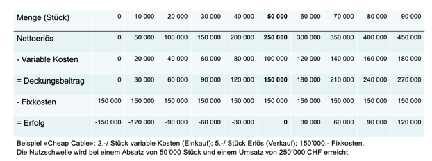

# Lean Startup – Week 03

***Feasability: Key Partners***
- käufer-lieferanten verhältnis
- strategische allianz
- joint ventures
- coopetition
- franchising
  - wieso macht das mcdonalds:
    - man drückt einen gewissenprozent des ertrags ab
  - bei ikea:
    - die kunden sind partner
- partner können kunden sein, gegner etc. 
- partner nur brauchen wenn es dem eigenen laden hilft

***Cost Structure «Viability»***
- Wirtschaftlichkeit
- fixe und variable kosten?
  - fix: eine lagerhalle 
  - variable: je mehr teslas ich produziere, umso mehr chips braucht man, umso höhere kosten
  - neue geschäftsmodelle die man analysiert 
- Kostenauflösung:
  - fixe und variable kosten

***Kostenstruktur: Deckungsbeitrag***
- nettoerlös = umsatz
- deckungsbeitrag: wie viel muss ich verkaufen, bis ich die fixkosten decken kann
- mit deckungsbeitrag kann ich die break-even analyse machen
- am kurztext könne das kommen:
- 
- break-even muss man am kurz text können 

## Auftrag:
- 