# Week 01 - Lektion 1: Unit Tests und Sicherheitseigenschaften

[Moodle](https://moodle.fhnw.ch/course/view.php?id=70909)

- Fuzzing: Ist entstanden in 80er jahren
  - über datenkabel entstanden
  - froscher ist aufgefallen, das app abgestüzt ist wenn es gewitter gab
  - inputdaten über telefonkabel sind nicht gut, wenn es wittert
  - in amerika waren leitungen über erde
  - weil app nicht mit unbekannten daten umgehen konnten stürzten sie ab
  - fuzzing test/kampanien sind dann mit gezielten test dagegen zu gehen
  - harness auswählen
    - harness ist funktion wo daten gekippt werden, wenn nicht ok
    - meistens api funktionen
    - im harness setup machen
    - open-cve

## Tests entwerfen und ihre Aussage begrenzen

- bei API-Verträge sind super für grenzfälle
- grenzfälle finden ist nicht mehr so eifnach zu finden
- der einfache test, wie finde ich heraus was funktioniert
- schwierige fall ist finden wie etwas korrekt abstürtzt
- pdf programm macht kapputes pdf auf, ich will das programm sagt pdf kapput nicht einfach etwas passiert
- CWE common weakness enumeration
- beschreibt wie schwächen aussehen

## Ohne Autorisierung kein Security Test

- nur prüfen was mir gehört
- gesetzlich an dem punkt wo ein portscan schon kritisch ist
- portscan passiert nichts weil
- mit portscan weg kommen weil zu viele attacken

## Kurzfrage K0: Auftrag oder Scope-Erweiterung?

- darf ich word untersuchen auf meinem pc?
  - im CH-gesetz steht nichts darüber

## Unit Test bezeichnet die Ebene, nicht das Schutzziel

- 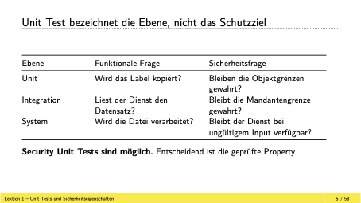
- problematische fälle bei C:
  - 0 byte bei Strings in C ist problematisch
- mit unitstest kann man solche fälle testen
- bei integrationstest fragen, wenn ein system eine datensatz liest
  - sicherheitsfrage: liest er es korrekt nach benutzerrechten
  - funktionsfrage: liest er es korrekt
- bei KI geht das momentan schief die systemgrenzen
- zugriffsgrenzen bei KI spannend implementiert
- LLM braucht viel speicher, request zusammen poolen
- ich gib nutzer zugriff auf AI und AI hat zugriff auf systemen
  - führt dazu, dass KI alles weiss unabhängig von nutzerrechten
- ein problem das KI daten nicht an andere mitarbeiter weiter gibt, ist ein problem, falls KI zugriff auf alles hat

## Ein Test verbindet Zustand, Aktion und Oracle

- 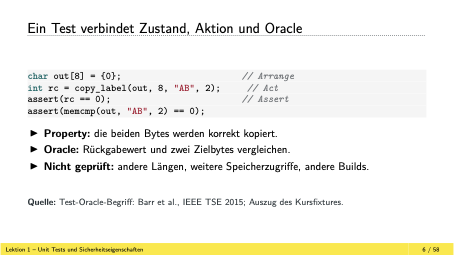
- was sagt uns der test:
  - copy label funktion funktiniert sagt uns
  - alles andere sagt uns nicht was die funktion sonst macht
- oracle ist erwarteter rückgabewert
- oracle definiert der tester, als was erwartet er

## Das Testprogramm besteht trotz Grenzverletzung

- 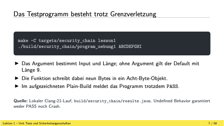
- bei dieser funktion kriegt man immer ein pass
- bei 8 odr mehr zeichen failt es
- eins von vielen einfachen fehelr die man triggern können
- bei c++ sind das gravierende fehelr
- log4j wurde mit fuzzing gefunden
- alles ist mit c und c++ geschrieben, so gut wie alles
- alles physiche infra und lowpower ist mit c und c++ geschrieben
- hardware interrupt auch bei rust nicht umgehbar

## Die neunte Schreiboperation liegt ausserhalb des Objekts

- 

## PASS schliesst den Out-of-bounds Write nicht aus

- 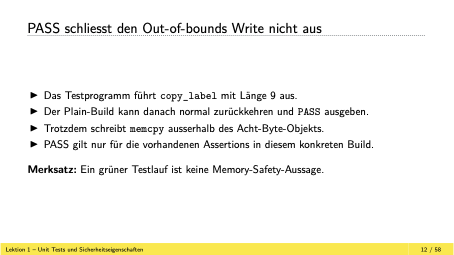
- grüner hacken sagt das genau dieser test funktioniert
- sagt nicht aus, dass etws anderes nicht funktioniert
- test sagen nie was wenn etwas im speicher schief geht
- dieses nicht i.o im speicher ist problematisch, weil für einen API aufruf es nicht funktioniert

## Der Fix schützt die Grenze vor dem Zugriff

- 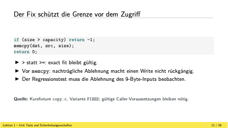

## Ein korrekter Status kann einen falschen Fix verdecken

- 
- requirement auf code abbilden ist extrem schiewirg

## Was testen wir eigentlich bei einem Security Test?

- was ist ein sicheres programm?
- welche grenzen und schutzziel muss gelten?
- welcher zustand kann intern verletzt werden?
- 9 bytes im 8 bytes programm geschrieben und es stürzt nicht ab
- wichtiger scope: der build prozess

## CWE erklärt einen Mechanismus, CVE bezeichnet einen Fall

- 
- enisa.eu
- cwe.mitro.org

## Speichergrenzen: Lesen, Schreiben und Kopieren

- 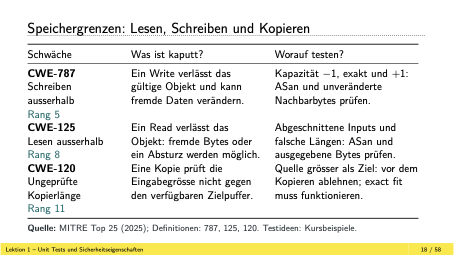

## Speicher: Ort und Lebensdauer unterscheiden

- 
- user after free: nach new muss man free machen

## Injection: Daten werden Browser-, SQL- oder Shell-Syntax

- 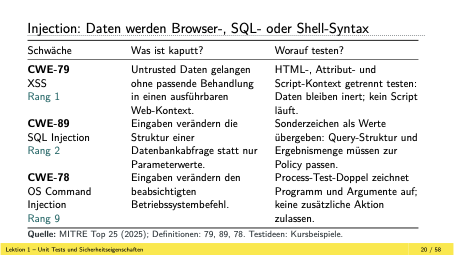

## Interpreter und Deserialisierung: Kontrolle über Verhalten

- 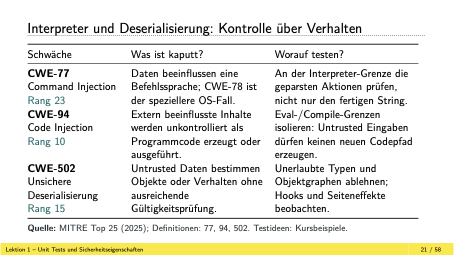
- ungwollte code injection
- illigitme plugin
- durch solche fehler wird programm instabil, besten fall
- schlimmster fall, ein user kann code odr plugins einfügen

## Autorisierung: fehlende und falsche Entscheidung

- 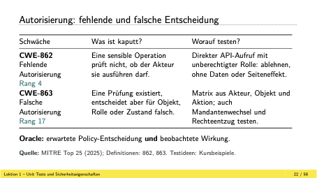
- was darf ein nutzer, ist er korrekt überprüft worden?
- admin einloggen obwohl er nicht darf

## Speicherzugriffe brauchen Raum und gültige Lebensdauer

- 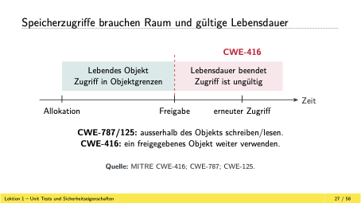
- wie einfach odr schwierig ist es use after free zu testen?:
  - schwer, weil viele pointers zu teste
  - unit-test eine funktion, einen kleinen block testen
  - keine grossartigen verzweigungen odr zusammenhängen testen
- ein compiler weiss auch nicht konkrekt was los ist
- einzige weg zu testen alle pfade abgehen des programms
- dann für jede pfad rechnen ob das möglich ist
- symbolic execution
  - problem: jede abzweigung erhöt exponentiell die mögliche pfade
- testen nahe dort wo userinput ist
- ohne userinput passiert ja nichts
- mit jeder if verzweigung odr loop steigt die komplexität exponentiell und es ist unwahrscheinlich das der user input fehlerfrei und unbeschädigt beim bug ganz tief gelangt, deshalb knoten nahe am userinput testen weil da kann es relativ schnell ankommen

## Arithmetik kann die spätere Objektgrenze falsch bestimmen

- 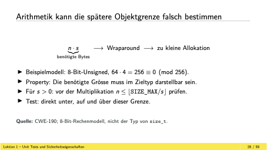
- bei 8 bit integer maximal (2^7) - 1 rein schreiben also 255
- wieso ist das beispiel schwer für unittest:
  - wenn ich 8 bit unssigned zum länge ausrechnen
  - beim alloc rechnen und bei orcale auch ausrechnen
  - bei orcale gleichen datentyp, macht gleichen fehler wie test
  - angreifen muss einfach einen riesen grosse rechnung machen und es läuft über

## Injection verletzt die Trennung von Daten und Befehlen

- 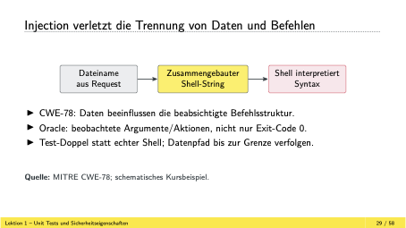
- trennung zwischen daten und befehlen oft genutzt

## Berechtigung braucht ein fachliches Oracle

- 
- bei solchen sachen haben wir keinen crash
- testen sehr aufwendig

## Ein Finding ist eine nachvollziehbare Evidenzkette

- 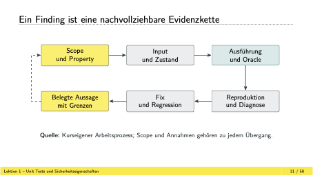
- gegen oracle überprüfen ob es korrekt ist
- rot solange test failt

## Korrekte Crypto-Ergebnisse beantworten nicht jede Frage

- 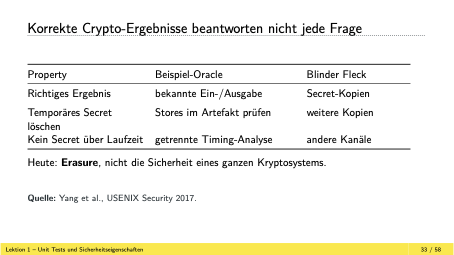
- schlimmste software zum entwickeln
- die mathematik ist mies, mit grossen zahlen arbeiten
- wenn ich was lesen muss, muss ich im speicher einen key hinterlege, einen kurzlebigen, der muss dancah gelöscht werden

## Das letzte memset hat keinen späteren normalen Leser

- 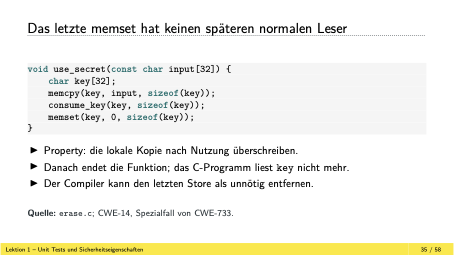
- letzt memset funktion ist weg

## Kein Symbolname ist kein Beweis für fehlende Stores

- wenn memset fehlt ist es oft ein problem

## Eine Erasure-Primitive sichert genau ihren Vertrag ab

- primtive die so einen API vertrag haben
- es gibt solche primtive wo der compiler sicherstellt das es korrekt ist

## Auch ein scheinbarer Overflow-Check kann verschwinden

- compiler kann so etwas optimieren
- clang gibt es das damit optimiert werden kann
- check um arraygrenzen auszurechnen kann offiziell heraus optimiert werden vom compiler
- c und c++ compiler optimieren unendlich
- bei jederm neuen ausführen des programms kommt anderer binär code raus

## Der Release-Code enthält den Fehlerzweig nicht mehr

- es gibt methoden um zu testen ob es solche fälle gibt
- sanitazing von memory

## Vor der problematischen Operation prüfen

- 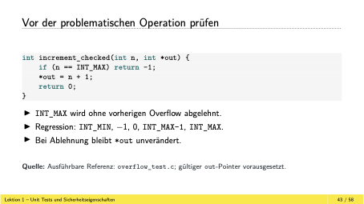

## Nicht jede überraschende Binary ist ein Compilerfehler

- 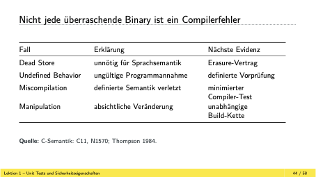
- sprachen wie c++ ist die hölle was parameter angeht

## Ein Compiler entsteht ebenfalls durch Übersetzung

- 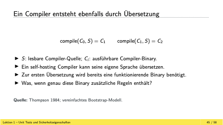
- erster compiler ist ein hänne ei problem, wahrscienlich in esambly von hand geschrieben
- vorherigen compiler immer nutzen für nächsten compiler
- sie hängen immer zusammen

## Trusting Trust benötigt zwei Einfügepfade

- 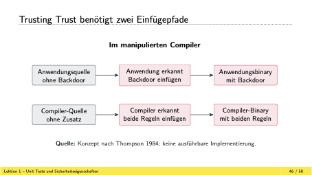
- perfekter code, jedoch führt compiler backdoor in binary ein
- mit backdor in compiler ist perfekter ansatz die welt zu infezieren
- 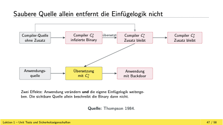

## Reproduzierbar ist nicht gleich unabhängig geprüft

- 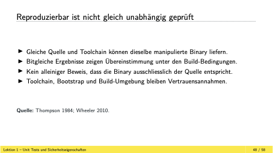

## DDC ergänzt eine diverse Übersetzungskette

- 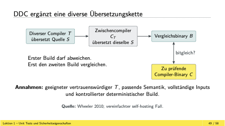
- kommt gleicher code raus mit zwei compiler
- mit zusätzen erweitern, mit geeignetem zwischen compiler

## XZ/liblzma: Release-Artefakt und Repository wichen ab

- 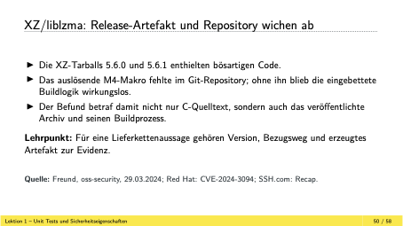
- xz als unbezhaltes hobby betrieben
- xz ist ein komprimiertes tool
- jia tan hat geholfen und vertrauen verdient

## Take Home: Eine grüne Suite braucht einen präzisen Satz

- 
- schwerpunkt auf fuzzing
- die methode um in real world die eingesetzt wird
- schauen in AI rein
- AI kann auch backdoor einbauen
