# Week 02 - Static Analysis und CI/CD

[Moodle](https://moodle.fhnw.ch/course/view.php?id=70909)

## Ein verdächtiger Pfad wird zu einem wiederholbaren Check

- 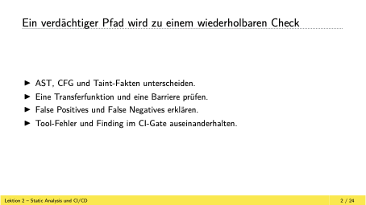
- statische analyse z.b compiler
- c compiler testen wenig
- java kontrolliert zum beispiel dead code
- syntac, controllfluss, erwartbarkeit von verwenden sind typische checks
- SAST static application securtiy testin ist die übliche methode um eigene static analysis erstellt

## SAST-Regeln stellen unterschiedliche Fragen

- string copy ist unsichere funktion
- die unsicherste: gets() ein linux command
- erster einfacher test den man machen kann ist zu suchen ob gets() verwendet wird
- strcpy kopiert von src zu dest -> gefährlich, weil nicht überprüft wird ob dest genug platz hat
  - ein check ob src kürzer gleich dest ist

## 1. Eine Aufrufmuster-Regel findet eine Stelle

- 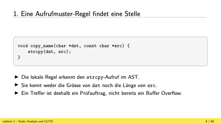
  - hello world

## 4. Taint-Analyse ist eine Methode innerhalb von SAST

- 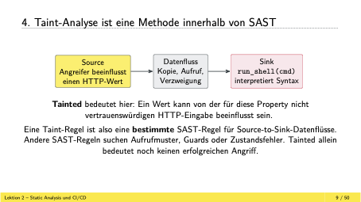
- hilfreich für folgende überprüfungen:
  - wenn sql im code, dann überprüfen dass das command das an die db geht eine ganz bestimmte form hat
  - sql queries zu einem syntaxcheck machen
  - wenn querie nicht i. o ist, dann könnte es ein mayor problem geht
- escape funktionen sind sehr schlecht

## Zwei Ausführungen liefern zwei verschiedene Werte

- 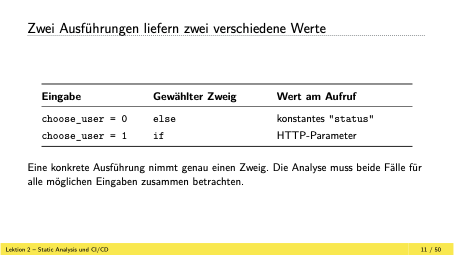

## Der AST zeichnet Syntax auf, nicht Laufzeitreihenfolge

- 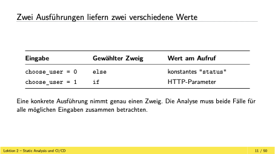
- die baumdarstellung ist wichtig für SAST analyse
- weil scope variablen
- eine andere funktion könne die selbe variablen haben
- mit baum jedoch, gut ersichtlich wo das cmd vorkommt

## Der CFG macht Verzweigung und Merge explizit

- 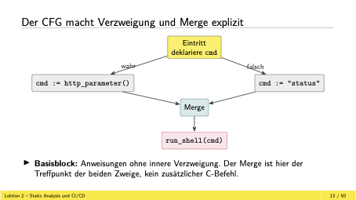
- CFG beduetet controll flow gram
- bei SAST macht man mehr an diesem merge als man sieht
- basis block ist abfolge von cmd
- was innerhalb von block ohne verzweifung odr sonst steht nennet man basisblock
- wieso kombiniert das man und nicht einzeln betrachten:
  - mit anzahl if-else die nicht verschaltet sind, steigt die mögichkeiten exponenziell
- durch merge weiss man nicht mehr welcher pfad unsicher odr sicher ist

## Warum die Analyse an dieser Stelle zusammenfasst

- 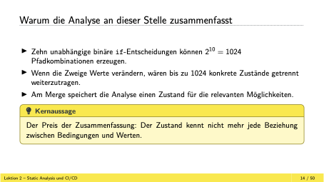

## Wir verfolgen den HTTP-Einfluss bis zum Shell-Aufruf

- 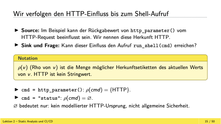

## May und Must stellen verschiedene Fragen am Merge

- 
- may für unsichere pfade
- merge führt dazu, dass ich nicht weiss woher ein fehler kommt
- mit merge ist gemeint wie am schluss alles zusammengeführt wird, jedes if-else und am schluss dann der output raus kommt
- senken: eine funktion ein ort wo daten rein gehen
  - z.b wenn sql(cmd) aufgerufen wird

## Eine Taint-Regel hat vier unterschiedliche Rollen

- 

## Ein Guard muss den unsicheren Wert tatsächlich ausschliessen

- 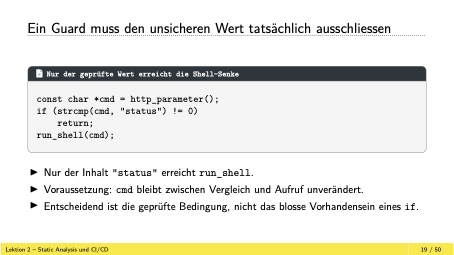

## Transferfunktionen beantworten: Was ändert eine Anweisung?

- 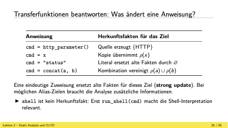

## Ein Aufruf überträgt Fakten nur mit passendem Modell

- wir modellieren bestimmte funktionen des controll daten fluss
- externen code brauchen wir den source code der funktion odr sonst modellieren, was macht der code

## Ein späteres Literal kann einen alten Einfluss entfernen

- 
- killerbeispiel für statische analyse:
  - klasse Transport
  - abzweigung Auto, Zug, Velo
  - dann eine liste"Transport" add(velo)
  - add(zug)
  - get(0)
  - problem hier ist, dass die struktur und die reihenfolge gegeben sein müssen für eine statische analyse

## Eine Barriere schützt nur den passenden Kontext

- 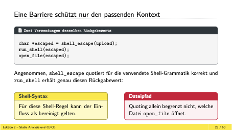
- werte mit barriere schützen wollen wir
- bei einer escape funktion gefährliche zeichen überprüfen
- bei einem shell cmd abchecken ob dort ein & | odr sonstige zeichen vorhanden sind, also zeichen mit denen man cmd chainen kann

## Ein Finding beschreibt eine Möglichkeit im Modell

- 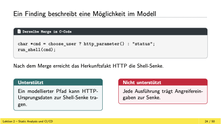

## Nach dem Merge wird der run_shell-Block neu geprüft

- basic block durch basic block gehen, was ist der input?
- haben wir input von http odr leerer menge?
- ist es überschrieben und es gibt nichts mehr

## Eine Schleife führt den Zustand erneut zum Merge

- 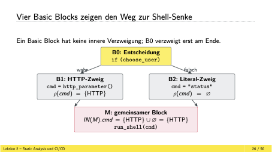
- bei schleifen schauen wurde zustand nach jeder iteration wert geändert

## Befund und tatsächliches Verhalten können auseinanderfallen

- 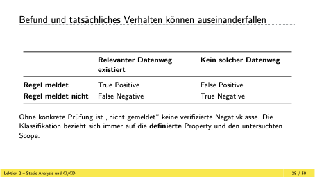
- false negativ ist das schlimmste was man haben kann

## Ein modellierter Pfad kann unmöglich sein

- 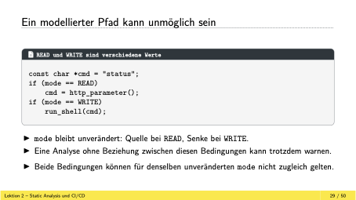

## Ein indirekter Aufruf kann eine Regelgrenze verdecken

- 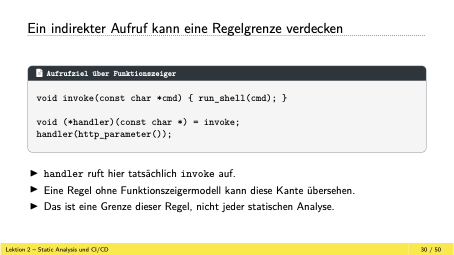

## Triage trennt drei Arten von Evidenz

- 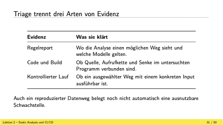
- am schluss haben wir regelreport, wo es einen möglichen weg für einen security breach gibt

## Frühe Funde vermeiden spätere Koordinationsarbeit

- 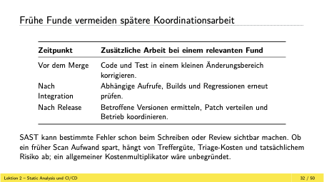

## SAST lohnt sich besonders bei wiederkehrenden Codefragen

- schauen ob es gaurds gibt
- wenn api wechsel, schauen ob es noch alte api aufrufe gibt

## Die Regel beginnt mit erlaubtem Verhalten

- 
- wenn alyse gemacht, dann haben wir erlaube aufrufe
- z.b diese drei aufrufe darf ich aufrufne
- alle anderen sind verboten
- solche sachen kann ich darstellen

## pattern-not nimmt exakt erlaubte Shell-Aufrufe aus

- 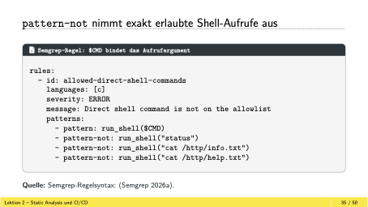
- da drauf kann man regeln definieren
- semgrep mit diesem tool kann man solche tests schreiben

## Für Muster mit Regex gibt es pattern-not-regex

- 
- damit man nicht für jedes file solche regeln schreiben müssen, können wir einen regex defnieren
- dort dann eisntellen was für cmd formen erlaubt sind

## metavariable-comparison prüft bekannte Zahlenwerte

- 
- N ist nicht die variable in code
- die variable in code wir auf N gemappt

## Ein statisch erkennbarer Buffer Overflow

- 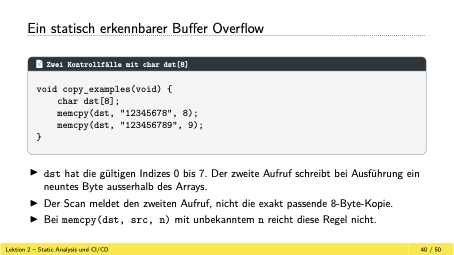

## Semgrep meldet die zu grosse konstante Kopierlänge

- 

## CI/CD wiederholt einen definierten Scan

- 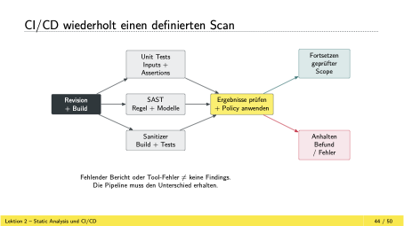
- mit CD/CD kann man autoamtisierte SAST-tests durchführen
- diese kann man fein einstellen, um dann bei befunden zu failen
