# Week 03 - Dynamisches Security Testing

[Moodle](https://moodle.fhnw.ch/course/view.php?id=70909)

---

## Use-after-free: die Adresse bleibt, das Objekt lebt nicht mehr

- parser sind der schlimmste code den es gibt
- parser muss code überführen, wenn code von aussen kommt
- parser schaut nur struktur an
- im parser viel dynamischen parser
- schwer ist, einen parser korrekt zu schreiben, der korrekt failt
- jeden möglichen ausgabepfad schwer nach zu bilden
- statt use-after-free kann man einen malloc machen
- was ist malloc?
- bei c nicht drauf verlassen, dass nach malloc daten drin stehen die man wollte
- fehlerwerte können sich propagieren
- heap ist prinzip eine verlinkte liste von heap-chunks
- wenn free auf heap-chunk, dann gibt man das chunk frei, danach ist dort wieder speicher frei
- danach sind dort vielliecht 16 bytes rein
- wenn ich dann neu schreibe bsp. 8 bytes schau er nach, wo sind die 8 frei
- nach malloc sollte man explizit rein schreiben, was man drin haben will, bsp. nur nullen

## Gültige Adresse bedeutet nicht initialisierter Inhalt

## Car und Motorcycle erben von Vehicle

- 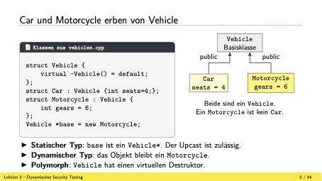
- *base ist castbar zu einem Car
- erster check, einen upcast ist erlaubt
- weil compiler nicht weiss, was ich zur laufzeit unter base hinterlege ist das ein problem

## Ein falscher Downcast kann innerhalb gültiger Speicherbytes bleiben

- 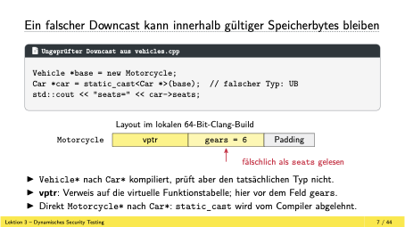
- static_cast macht nur checks zur compilezeit
- im print von seats wird gears ausgegeben, also 6
- weil in der logik ist gears an der gleichenstelle wie seats
- der static cast ist unsicher

## RTTI verbindet das Objekt mit seinem dynamischen Typ

- 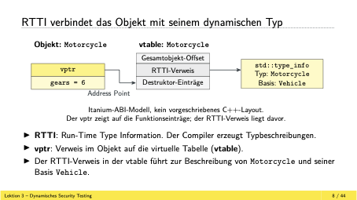
- richtig macht man das mit einem dynamic cast
- vpointer zeigt auf vtable
- wichtig für dynmamische funktionen, bei polymorphis, vererbung, alles über vtable gemacht
- vtable enthält rtti

## typeid unterscheidet Pointertyp und Objekttyp

```c
Vehicle *base = new Motorcycle;
typeid(base) == typeid(Vehicle *); // true
typeid(*base) == typeid(Motorcycle); // true
typeid(*base) == typeid(Car); // false
```

## dynamic_cast prüft die Beziehung zum tatsächlichen Objekt

- 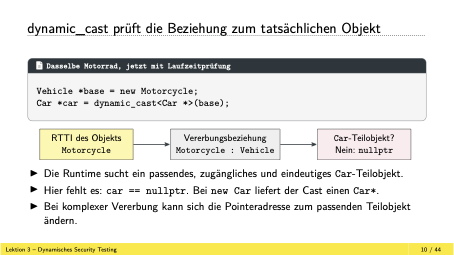
- dynmaic ist die lösung weil es prüft beziehungen
- echtzeitanwendung in der industrie, gameindustrie ist es wichtig, dass keine zeit verloren geht
- bei dynamic cast braucht es etwas zeit, bei static nicht

## Ein beschädigter vptr ist nicht dasselbe wie überschriebene RTTI

- cast problem und vptr sind problem
- vptr liegt am anfang des objekts
- wenn ich einen overflow habe, kann ich vptr nicht überschreiben
- vptr auf ein andres objekt, andere daten zu zeigen ist ein angriff
- wenn das vorherige objektarray mehr daten schreibt, kann man den vptr ändern, der liegt immer an anfang des objekts

## Eine Data Race verletzt die Ordnung geteilter Zugriffe

- data race ist vielleicht habe ich zwei threads
- liesen den snapshot und erhöhen snapshot
- die eine addition geht verloren aufgrund von gate.wait()
- data race ist eine race condition
- bei use-afer-free passiert das mal schnell

## UBSan: Signed-Overflow bei einer Multiplikation

```c
int32_t quantity = 50000;
int32_t unit_price = 50000;
int32_t total = quantity * unit_price;
```

- bei ohnen zahlen addieren passiert schnell ein overflow
- undefinedbehavior ist bei c wenn signed_int addiert werden

## Welcher Check passt zu welchem Fehlerbild?

- 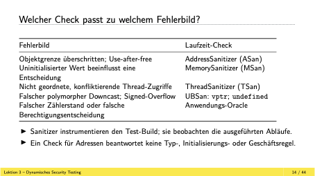
- einige sehr spezifisch zu sprachen wie c
- ada und rust verhindern race conditions
- diese sachen zu finden ist schwer, deshalb gibt es viele sanitizer für das
- c hat eine riesige abhängigkeit, alles ist irgendwie c/c++
- neue embedded projekte mit rust machen, tipp des dozenten
- anwendungstests machen

## ASan: Compiler-Checks und Runtime-Metadaten

- wenn ich einen sanitaizer checken will mache ich das mit clang
- shadowmemory ist drin um sachen zu überprüfen

## Die ASan-Runtime markiert die Objektgrenze

- 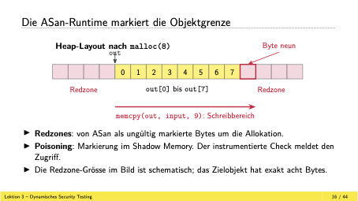
- Asan führt redzones ein
- wenn heapobjekt angelegt wird, werden redzones definiert
- gute und böse speicherbereiche werden markiert
- wenn redzone erreicht wird, wird getriggert von shadowmemory

## Die Adresse bestimmt das zugehörige Shadow-Byte

- 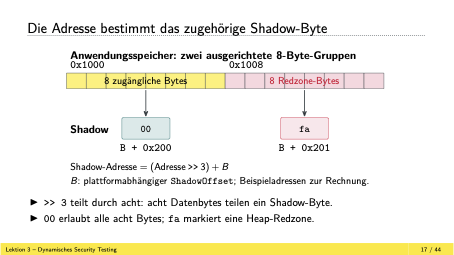
- durch shiften um 3 (teilen durch 8) plus shadowoffet dazurechnen, dann schreine ich dort fa wenn redzone

## Ein teilweise gültiger Bereich erhält die Anzahl gültiger Bytes

- 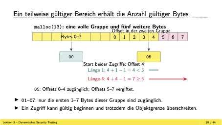
- shadowmem speichert im ersten 8er blok eine 0
- im zweiten 8er block speichert er eine 5 ab
- wenn länge grösser 5 wird, wird fehler getriggert
- bei malloc wurde 13 angegeben

## Der Shadow-Check prüft auch die Länge des Zugriffs

- 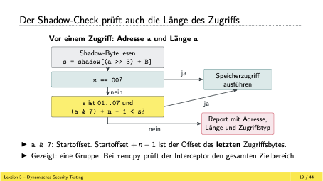

## Der ASan-Report verbindet Zugriff und Allokation

## Die Reparatur reserviert Platz für das NUL-Byte

## Die Runtime aktualisiert den Shadow-Zustand bei free

## ASan-Grenze: Overflow zwischen zwei Membern

- 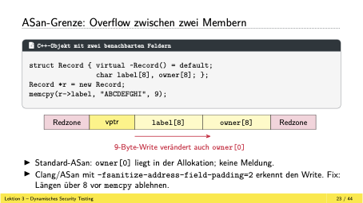
- mit zwei adresssanitazier initalisieren ist schlecht
- java überprüft ganz genau seine array grenzen

## ASan und der vptr-Check beantworten unterschiedliche Fragen

- asan zeigt typ probleme nicth an, wenn etwas korrekt alloziert ist
- wenn static cast verwendet wird, ist das unsichere funktion

## dynamic_cast: nullptr oder std::bad_cast bei Misserfolg

- am besten einen dynamic cast verwenden

## Die Cast-Art bestimmt, welche Vorbedingung geprüft wird

- schlimmste cast in c ist cstylecast zu verwenden
- man kann so gut wie alles casten
- constcast entfernt const
- static schaut nur sich basis und downcast aber aber nur zur compilezeit nicht laufzeit
- dynamic schaut zur laufzeit an
- reinterpretcast ist was tolles
  - nimmt beliebiges objekt und castet es in andres beliebeiges objekt
  - es konvertiert einfach die bytes in andere um
  - verwendet wenn man inputs von einem network hat und in einem objekt einpflegen muss
  - es scheitert, wenn daten nicht so strukturiert sind wie gewollt

## MSan meldet die Verwendung uninitialisierter Werte

- 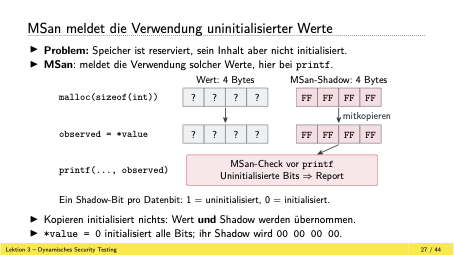
- MSan = memorysanitizer
- msan triggert den fehler, wenn die daten verwendet werden
- in c calloc verwenden statt malloc

## Die Barriere ordnet die nachfolgenden Writes nicht untereinander

## TSan prüft Zugriffe und die erkannte Thread-Ordnung

## Ein gemeinsamer Mutex schützt das vollständige Zähler-Update

## Unlock und nächster Lock ordnen die beiden Updates

- 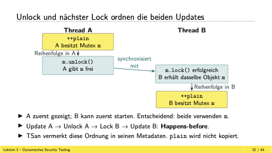

## Zwei atomare Stores schreiben denselben Zählerstand

- 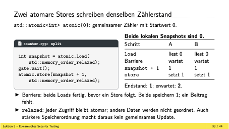
- atomic load und atomic store
- wenn store unabhänig von load gemacht wird, sind es unabhängig

## fetch_add führt die gesamte Erhöhung atomar aus

- was man machen kann ist, ein standard atomic type und gibt dem ein integer
- egal was ich dann mit diesem atomic mach, addiere ich dem int einen zu
- dann ist es thread sicher

## Die Sanitizer brauchen getrennte Test-Builds

- 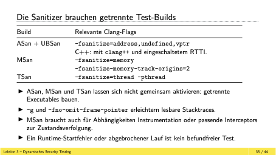

## Random Tests brauchen ein Oracle für jeden Fall

## Der Label-Decoder muss Platz für das NUL-Byte lassen

## Ein falsches Erfolgs-Oracle verdeckt den NUL-Overflow

## Random Tests müssen die relevanten Eingaben erzeugen

## Der gespeicherte Input macht den Fehler zum Regressionstest

## Der Optionsparser vergisst den Default für audit

## Kurzschlussauswertung kann den MSan-Befund verhindern

## Buchungen brauchen ein Zustands-Oracle neben TSan

## Take Home
