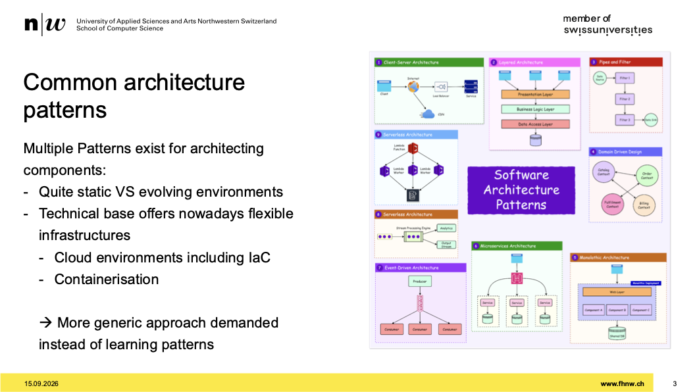
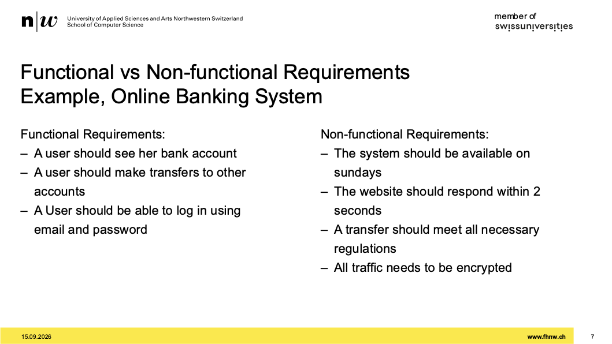
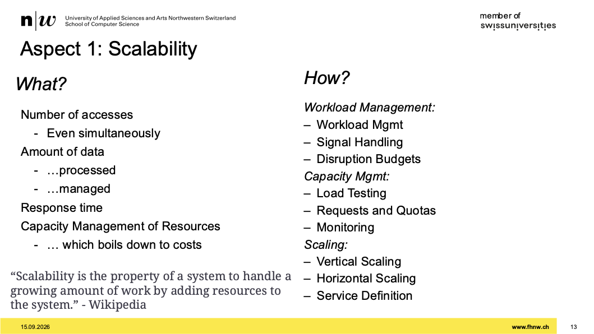
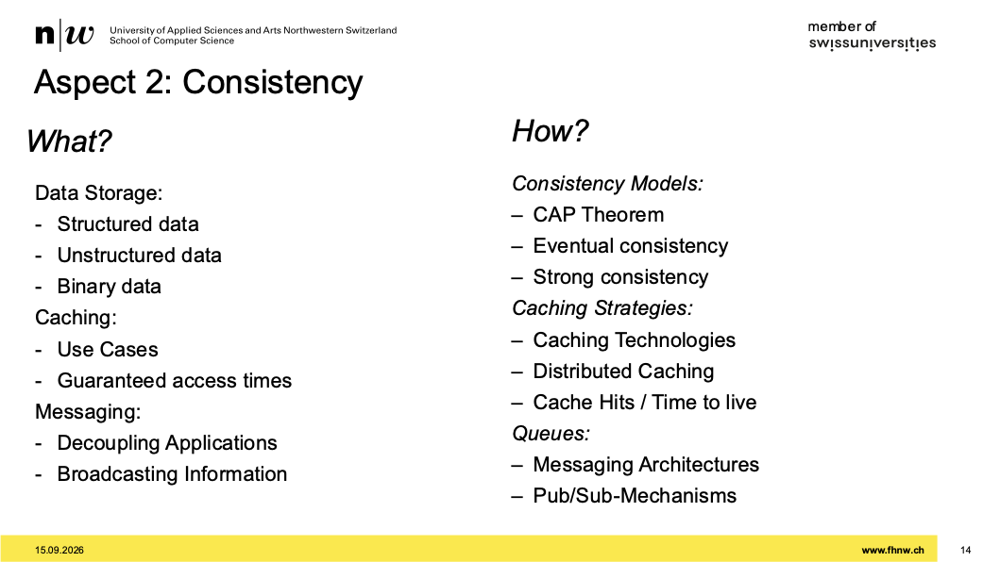

# Week 01 - System Architecture Motivation

[Drehbuch](https://sgi.pages.fhnw.ch/moduluebersicht/2026hs/sysd/drehbuch.html)
[Aufgaben](https://spd.pages.fhnw.ch/module/sysd/assignments/system-design/index.html)

## Learning Target

- viele patterns auf die infra verlagert
- wir wollen dass wir lernen die konzepte an zu wenden
- verschiedene viele unabhänige layer und zu implementieren
- kubernetes machen wir
- dnet1,2, cloud computing, system engineering notwendig

## Wie sieht Kurs aus

- scalability
- consistency
- availability
- zu jedem block gibt es aufgaben
- zu jeder aufgabe eine mündliche prüfung
- dritter slot ist individuelle prüfung
- paradigmen anwenden am schluss
- erster zwei zählen 25%, letzt prüfung 50%
- wir müssen sie überzeugen wieso wir welches konzept gewählt haben
- letzt aufgabe:
  - 20 min, closed book, wir bekommen ein szenario und müssen architektonische lösungen nutzen, finden
- auch auf o'reilly listen schauen
- build, container brauchen wir

## Motivation

- gehen nicht in die einzlnen komponenten tief
- schauen wie die komponenten zusammenspielen
- schauen wie sie hochverfügbar werden die komponenten

## Common architecture patterns

- nicht viel am code ändern
- eher wie baut man ein gesamtsystem gut, flexibel und erweiterbar
- 

## Functional vs Non-functional Requirements

- es geht eher um quality standards und quality restrictiion
- reliabel, maintainable, scalable konzentrieren wir uns
- wenn messbar, dann KPI sollte es geben

## Functional vs Non-functional Requirements Example, Online Banking System

- User muss sich einloggen können -> funktional
- system muss 24/7 verfügbar sein -> non-funktional
- 

## All systems are distributed systems

- entkoppelte systeme sind wichtig
- jede komponente bei uns ist ein disdriputed system
- ein monolith ist auch ein system das umsysteme braucht

## Aspect 1: Scalability

- capacity management
- anzahl requests
- auf seite von unser modul wie workshop management
- applikation etwas anpassen
- wie workload so skalieren, dass keine fehler entstehen
- 
- wie testet man last? wie gibt man app grenzen?

## Aspect 2: Consistency

- wie persisitiert man daten
- wie caching daten
- wie garantiert man accesstime für den user
- messaging anschauen
- 

## Aspect 3: Availability

- wie erreichen wir hochverfügbarkeit
- architekuransätze anschauen für das
- service mesh ausserhalb der applikation nutzen
- Chaos Testing machen wir
- im Networking arbeiten wir mit DNS und load balacing

## Application & infrastructure setup

- in der registry immer minimale rechte geben am token
- immer auf repo höhe
- z.b. für images pullen, pushen dann nur read write registry
- konfig der apps zeigen und code
- applikation muss laufen beim assessment
