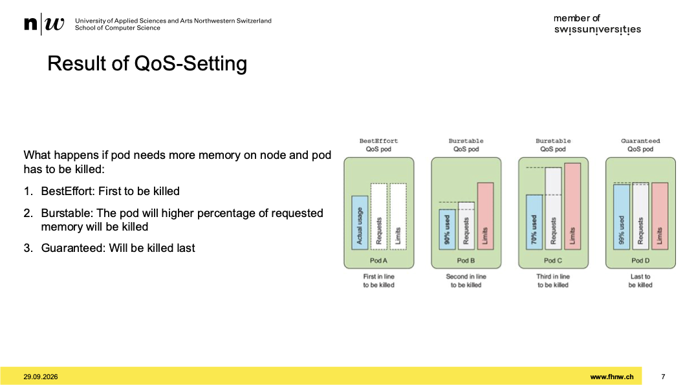
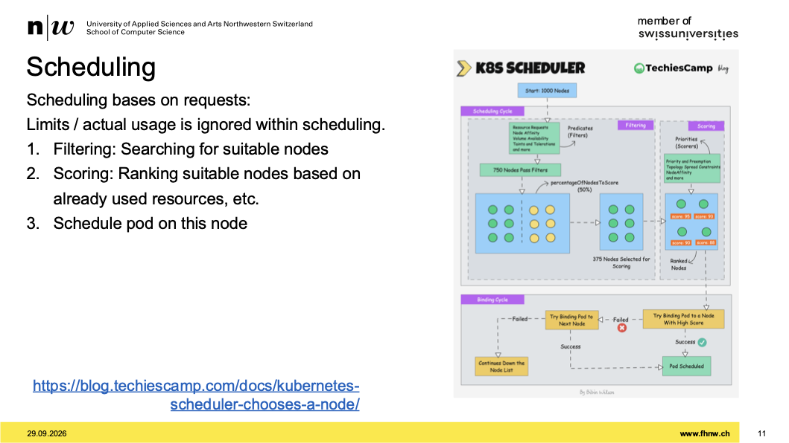
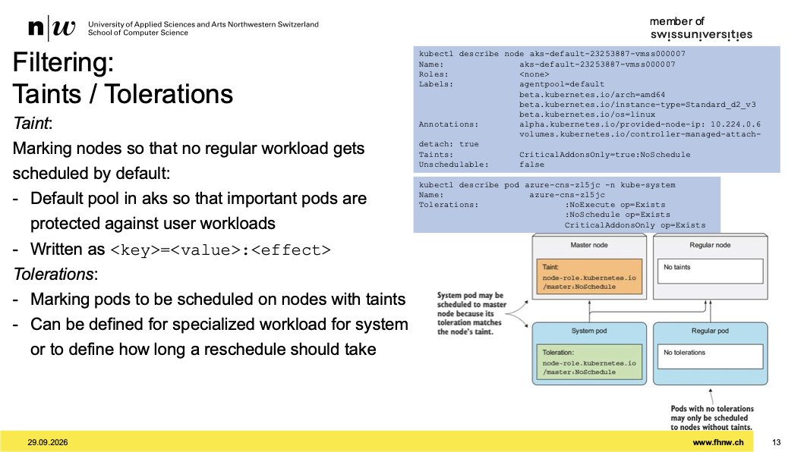
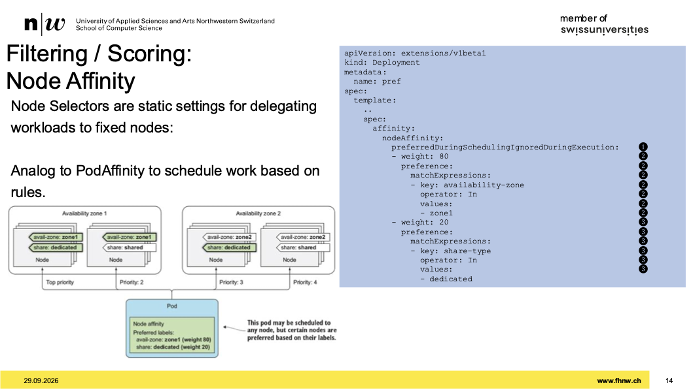
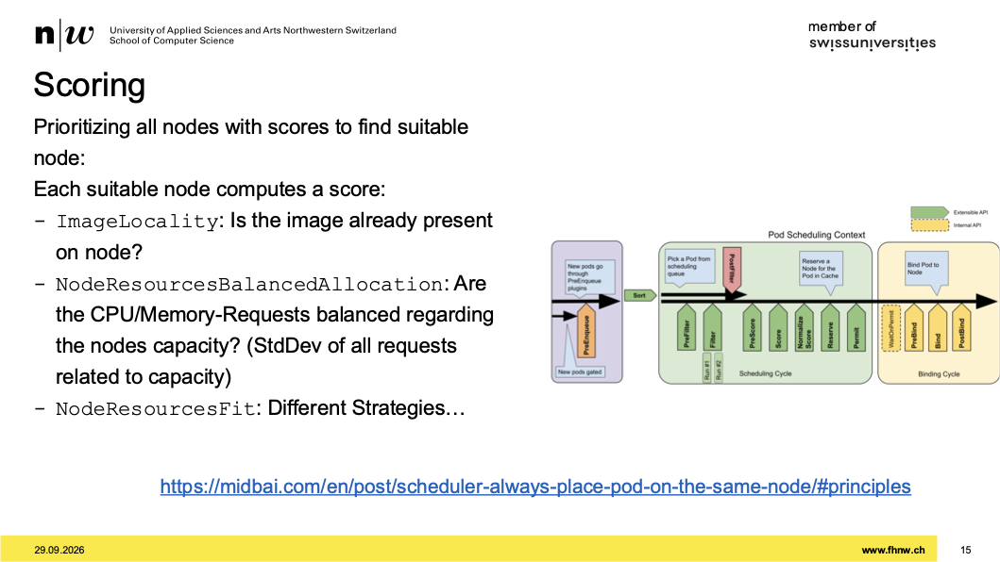
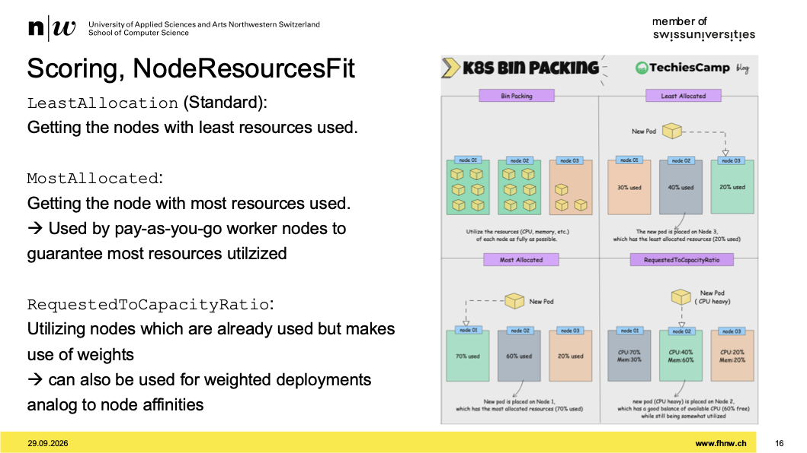
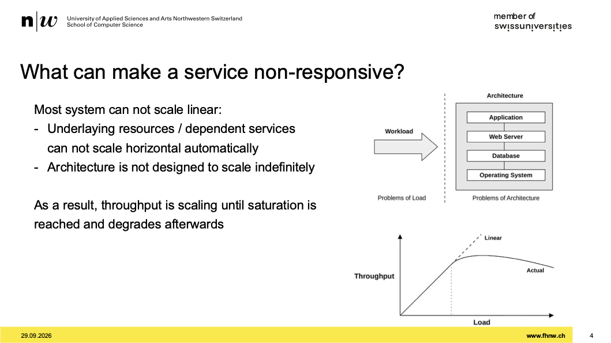
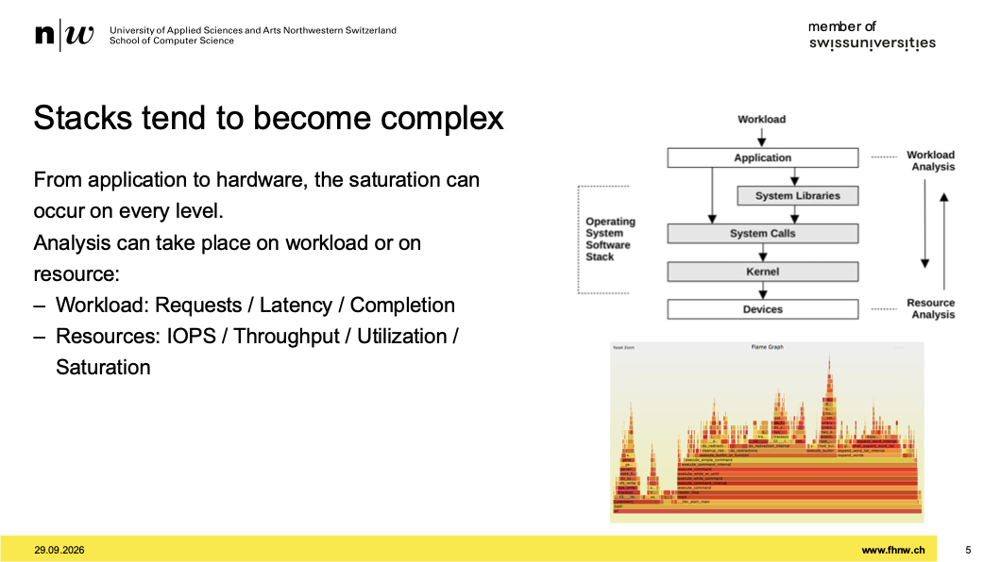
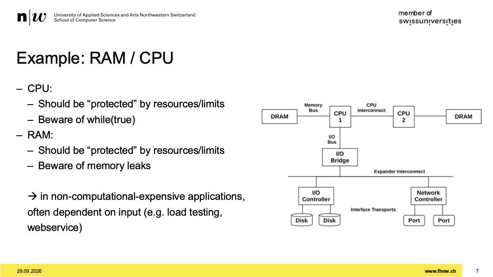
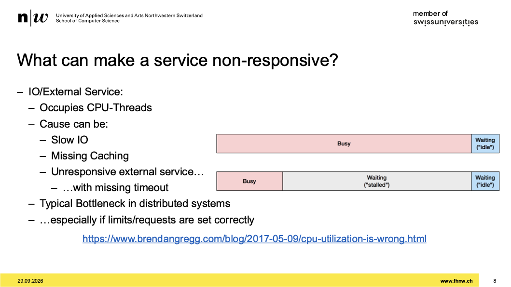

# Week 03 - Workload Management

[Drehbuch](https://sgi.pages.fhnw.ch/moduluebersicht/2026hs/sysd/drehbuch.html)
[Aufgaben](https://spd.pages.fhnw.ch/module/sysd/assignments/system-design/index.html)

---

## Erstes mündliches Assessment

- wir schauen uns an, wie verständnis und analyse der arbeitsblätter ist
- wir könne AI verwenden, jedoch muss man den output erklären
- bloomische taxonomiestufen:
  - K1: auswendig lernen
  - K2: verstehen
  - K3: anwenden
  - K4: alaysieren
  - K5: evaluieren
  - durch AI fehlt analyse
  - mögliche frage: warum verhält es sich so wie es sich verhält?
  - generieren lassen, ja, aber selber anwenden, selber abtippen

## Assignement 02

- Headlamp für k8s GUI
- was sie interessiert ist wie hängen services zusammen pods und so
- imagepullsecret für image registry secret zum pullen
- hf token geht über umgebungsvariable
- ein deployment hat deinen einen replicaset untersich
- annotieren nur möglich mit einem angegebenen namespace
- unter strategy rolling deployment: nacheinander runterfahren und neuen hochfahren
- connectingworlds nur einmal haben, mit singelton pattern zum beispiel
- nur einen, weil nur einen broker haben
- in nächste sessions ein messaging und caching einbauen
- singelton anwenden durch kind: statefulset
- durch singleton pattern wird ein pod zum singel-point-of-failure
- quorom spielt eine rolle bei der controlplane
- cluster auto scaler -> möglichkeit basierend auf workload voren hintendran maschinen provisionieren
- userpool, ist ein pool mit 3-5 nodes drinnen
- kubectl drain zum räumen von einem node
- dieser mechanisum ist wertvoll für plattform teams
- so könne die teams ihre infra laufend updaten
- ohne orch. layer müsste man die pods irgendwo anderst starten, dns umbiegen und so mit ein-zeiler möglich
- svc ist nicht mehr wie ein dns entry
- im src-code auf sigterm höhren und dann etwas machen in unserem fall ein "good bye"
- in java mit Runtime.getRuntime
- in quarks vlt eine annotation vorhanden

---

# Scalability: Scheduling and Resource-Management

## Recap: Resources implemented

- cgroups definieren limiten
- killing prozess wenn memory gehittet wird
- bei hitting CPU, dann prozess langsam
- wenn in linux zwei prozesse RAM hitten, dann killt es beide
- cgroup kann viele sachen limitieren
- cpu langsamer ist gemeiner wegen fehlersuche: umsysteme, ram, sonst was?
- prozess hat einfach ram, man kann am prozess den ram nicht wegnehmen
- unter linux unter sys/fs/cgroup einsehen

## Resources in Kubernetes

- cpu und ram auf pod setzen
- unter kind: Pod unte spec, resources limit und requests setzen
- limit ist obergrenze und request unter grenze
- request zum schedulen verwendet
- limits zum einschränken wie viel nutzen
- mit kubectl top pods -n einsehen wie viel gebraucht wird

## Different Quality of Services

- mit limits und request gibt es verschiedene QoS
- wenn man limits und req nicht setze ist klasse besteffort
- wenn req weniger als limits ist burstable klasse
- req und limit sind gleich ist guaranteed
- besteffort ist dümmste
- in prod eher die adneren zwei anschauen

## Result of QoS-Setting

- 
- nodes labeln zum steuern
- immer über knotenklassen arbeiten
- nicht sagen, dieser pod nur auf diesem node

## What information do you need to schedule work?

- Pod limits/requests
- Node eigenheiten
- Sind es gescheduled jobs?
- was ist der bestehende workload auf den nodes?

## What is challenging when you think of scheduling container?

- Eigentliche Last / eigentliche verbrauch ist unbekannt
- eigentliche request
- anzahl senken/kapazität
- wie erreiche ich eine optimale verteilung
- start/stop = dauer
- hetero umgebung, umsysteme etc.

## Scheduling

- 
- das ist ein konzept
- mehrere schritte: filter, scoring, binding cycle
- knoten filter
- danach ein setv on nodes die geeignet sind
- wenn man gescort hat, nimmt man den knoten

## Filtering

- erste frage: kriegt der knoten den pod drauf?
  - im sinn von hat er genug kapazität
- zweite frage: darf er den pool überhaupt annhemen?
- dritte frage: habe ich einen node port, irhendwelche constraints auf infrastruktur ebene
- vierte frage: gibt es ein bestimmtes volumen?

## Filtering: Taints / Tolerations

- 
- wenn ein taint vorhanden ist, muss man in pod spezifikation tolerations einbauen, zum sagen, hey du darf auf diese taint reagieren

## Filtering / Scoring: Node Affinity

- 
- über pod affinity kann man nodes heranziehen
- vorallem wenn es um AZ (availability zones) geht
- pods so konfiguerieren dass sie sich abstossen

## Scoring

- 
- erster schritt, ist image bereits lokal auf nodes?
- danach: balanzierung von cpu und ram bezüglich nodes kapazität

## Scoring, NodeResourcesFit

- 
- verschiedene strategien, je nachdem was man will

## Scheduling-Simulator

- im assignement03 schauen dort ist der link zu diesme simulator

---

# Scalability: Load

## How to find out that an application has too less resources?

## On plain systems: Average Load

## What can make a service non-responsive?

- 
- ich kann nicht immer mehr machen

## Stacks tend to become complex

- 
- sehr komplex gestackte app
- je komplexer es ist umso schwerer zu debugen
- durch einen call werden im hintergrund noch zick tausende call gemacht

## USE-Method

- ich möchte herausfinden, wie viel ressourcen vom stack verwendet wird
- hohe verwendung? bin ich gesättigt
- USE methode erlaubt strukturiert welche ressourcen verwendet werden

## Example: RAM / CPU

- 
- mit req und limits CPU steuern
- mit while-true auf input warten ist sehr problematisch
- wenn man feedback hat, mit pattern abdecken
  - while true bei eingaben
  - rückgaben auf zweiten thread, ein semaphore
- normalen betrieb findet man so etwas nicht raus
- nicht funktionale anforderung: endpoint muss 99% erreichbar sein

## What can make a service non-responsive?'

- 
- failover nie kleiner machen als primären
- cascadierender fehler

## Server: Monitoring Resources

- Grafana

## Client: Generate Load

- werkzeuge für lasttests

---

# Assignement03

- überlegen wieso cw anderes setup braucht
- ressourcen und implementierung wird angekuckt
- mit simulator herumspielen
- lastgenerator nehmen und einfach gegen endpoint des chatbots schiessen
