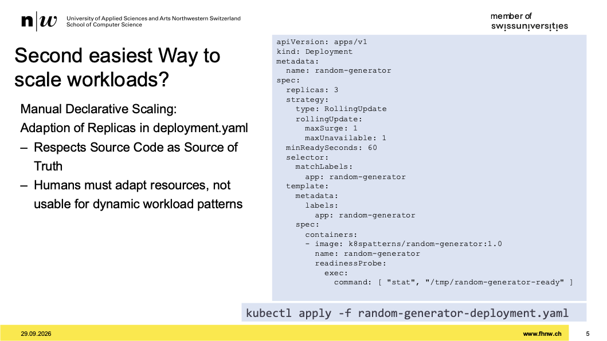
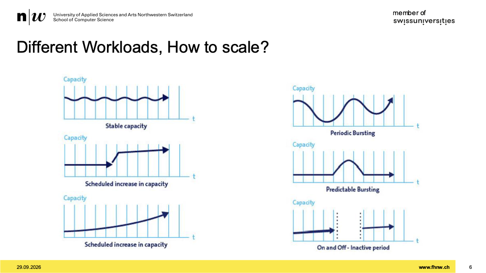
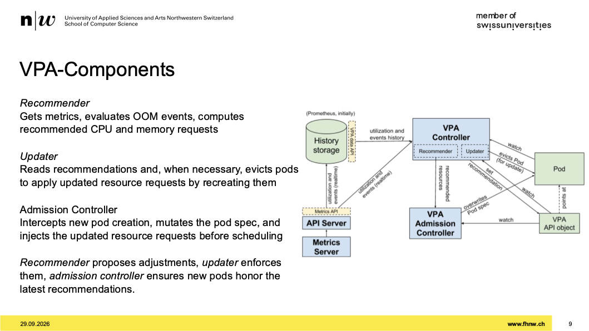
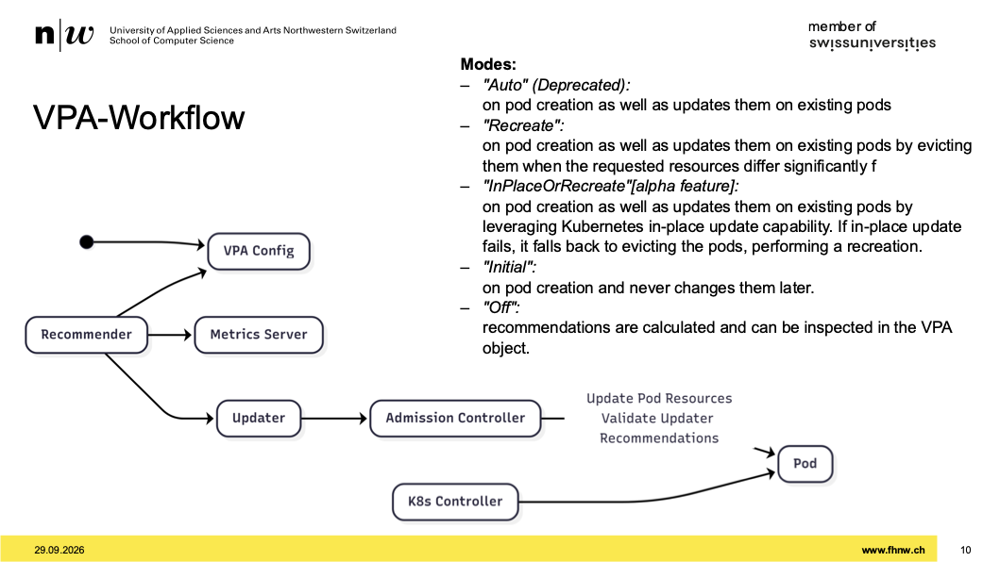
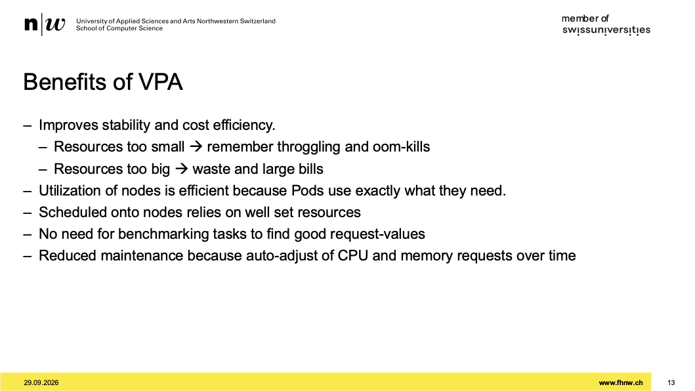
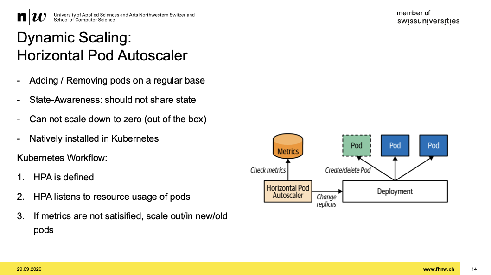
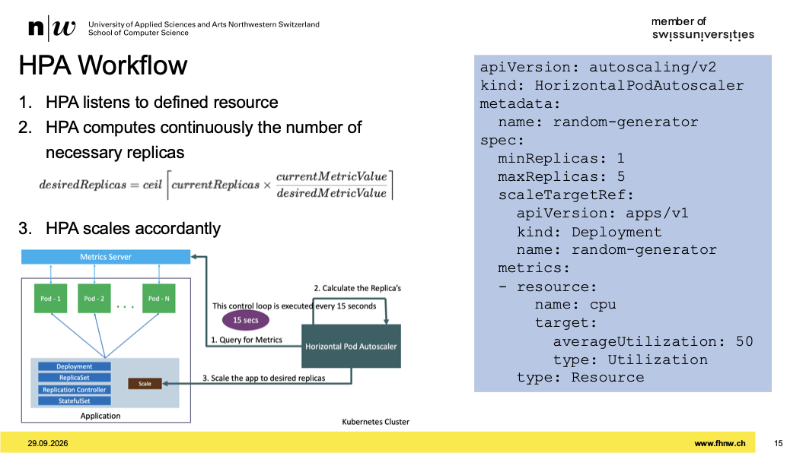
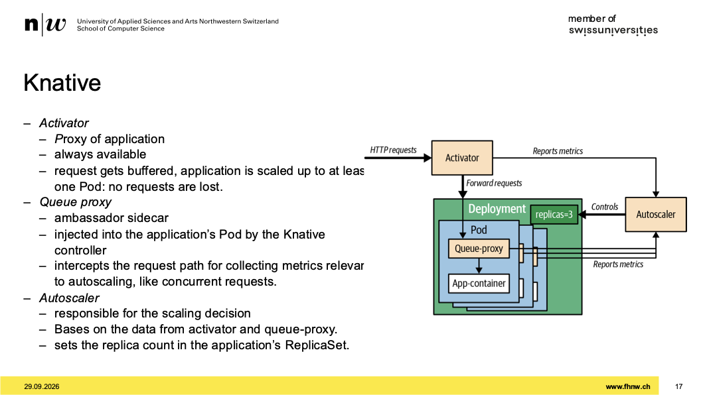
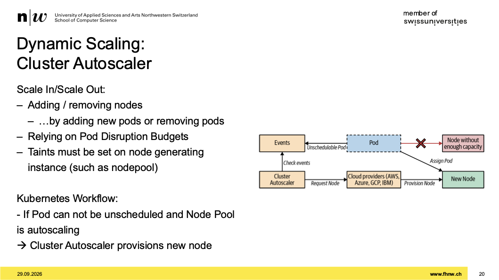

# Week 04 - Scalability: Scaling Workloads

[Drehbuch](https://sgi.pages.fhnw.ch/moduluebersicht/2026hs/sysd/drehbuch.html)
[Aufgaben](https://spd.pages.fhnw.ch/module/sysd/assignments/system-design/index.html)

---

## Recap

---

## Nächste Woche Assessment

- es werden random assignements raus gepickt und fragen gestellt
- bei übungen, die man zeigen kann, wird frage gestellt wie und wieso wir es so gemacht haben
- kleine demos die wir zeigen können
- bis und mit assignement 04
- cluster vorher starten
- kurz und präzis halten
- wir müssen uns verkaufen
- je präziser wir antworten, umso bessere bewertung

---

## Assignement 03

- tools für automatisiert QoS setzen
- den scheduler installieren und laufen lassen
- nodes tunen, zb. pods durch least oder most allocated steuern auf welche nodes sie laufen lassen
- es braucht tolerations zum schauen wie nodes augelastet sind
- den scheduler unbedingt nutzen zum spielen

---

## Scale is important

- was will man skalieren?
- was darf man skalierne?

## When to scale?

- häufig manuell skalieren
- in k8s verschiedene varianten
- vorher testen oder man hat incident

## Easiest Way to scale workloads?

- skalieren über replicaset
- über deployment über cli
- app stoppen über replica=0, gängiges pattern

## Second easiest Way to scale workloads?

- 
- über die config ändern im deployment-file
- im beispiel sind keine limits und requests gesetzt, also QoS=best-effort -> nicht gut
- lim/req immer setzen, dran gewöhnen

## Different Workloads, How to scale?

- 
- unterschiedliche skalierungs-patterns
- wunschszenario: stabile kapazität
- mit replica die verfügbarkeit steuern
- mit limits/requests die kapazität
- banken haben ende monat eher peaks
- on-off (unten rechts) typisch bei devops entwickler, wegen CI/CD etc.
  - in dieser zeit last weg nehmen
- selten hat man das pattern oben links

## Common Workload Patterns

- oben war last über zeit
- es gibt verschiedene klassifizierung von workloads
- devops workload zum beispiel CI/CD workloads
- stateless kann man gut an die grenzen skalieren und in die breite mit anzahl vm's oder anzahl pods
- in reallief verschiedene workloads antreffen
- gewisse workloads pattern voneinander unterscheiden
- (CPU)requests werden in der regel 5-6 mal mehr eingestellt, als gebraucht wird
- memory sieht es anders us, weil die app es einfach nimmt, wenn es memory bekommt

## Dynamic Scaling: Vertical Pod Autoscaler

- VPA in die höhe skalieren
- man gibt den pods die man hat mehr CPU oder RAM oder nimmt weg
- wichtig zu wissen, der VPA verwendet den metrics server von kubernetes
- bei AKS ist der normal dabei, hat nichts mit promtheus metrics server zu tun
- VPA ist ein zusatz zu kubernetes, nicht native in k8s implementiert
- der HPA schon
- VPA muss zusätzlich installiert werden
- eigene ressourcen unter kind:CustomRessourceDefinition

## VPA-Components

- 
- der recommender misst und macht recommendations
- updater liest recommnds und schau ob es pods gibt, die angepasst werden müssen
- die alte variante war so, dass pods die änderungen nötig hatten, evicted wurde und somit runtergefahren um dann neu zu deployen
- admission ändern dann resourcen, bei recreaten, anders als im deployment spezifiziert, weil er schaut wie viel lim/req gebraucht wird
- falls updater ressourcen erhöhen will, aber nicht möglich, dann evicted ihn, dann kommt replicaset und sieht, pod weg, will einen starten, es wird aber ein node gesucht, wo genug gross ist

## VPA-Workflow

- 
- es gibt verschiedene modes für VPA
- im bild das zusammenspiel anschauen
- initial nur bei pod kreierung wird vergrössert
- kind VPA
  - targetref: Deployment, heisst er zielt auf deployments ab
  - dann bei updatePolicy: "Off"
  - dann dort sieht man auch die recommendations

## In-Place Pod Resize Graduated to Beta in k8s v1.33

- on the fly ressourcen änderungen möglich
- nicht möglich, falls die node garnicht so viel ressourcen hat
- wenn os nicht erlaubt, pods zu skalieren, die er garnicht skalieren darf

## Additional Tooling, Goldilocks

- wenn man fairwinds installiert, werden einem ressourcen recommended
- wenn man das installiere, kommt ein VPA automatisch dazu
- im dashboard sieht man dann hübsch, was ich ändern soll um für eine bestimmte QoS klasse
- nicht gedacht für dynamische skalierung
- VPA ist gedacht um permanent die richtigen ressourcen einzu stellen
- für peak patterns eher HPA verwenden
- in der praxis im recommender modus einstellen

## Benefits of VPA

- 
- gut auch um zu benchmarken, einfach mal schauen wie viel ressourcen in etwa gebraucht wird

## Dynamic Scaling: Horizontal Pod Autoscaler

- HPA nativ in k8s
- 
- ressource die man konfigurieren muss
- HPA schaut auch auf metrics server
- beim deployment stellt der replicacount hoch oder runter

## HPA Workflow

- 
- gewisse metricen wie cpu oder ram verwenden
- zb. ab wann er scalen soll

## Pitfalls for HPA

- HPA pitfall ist, dass scale in oder out zeit braucht
- er hat eine gewissen latenz
- controller hat ein bisschen latenz
- scheduler hat auch latenz
- alles zusammen addiert sich das, bis skaliert wurde
- wichtig bei downscalen:
  - durch das ständige up and downscalen kann es spikes geben
  - dass will man vermeiden
  - bei downscalen soll man trägheit einbauen, dass er nicht sofort down scalet
  - unter behavior.scaleDown.policies einstellbar
  - über anzahl pods oder % einstellbar
  - über ein zeitfenster scalen, also einstellen wie lange geschaut werden soll (bsp. 300 sek) damit ein flopping (diese spikes) vermieden wird
  - toleranz werte bei up/down scale auch einstellbar

## Knative

- 
- beispiel von frameworks die uns helfen zu skalieren
- knative ist so eins
- nicht 1:1 vergleichbar mit dem was wir gemacht haben
- eher serverless framework
- ich skaliere auf 0 und wenn http-reqs rein kommen skaliere ich wieder hoch
- das ist komplexer, die app muss das verstehen

## KEDA

- ein weiteres framework
- kann man auf queues verwenden
- also über triggers
- keda operator kann man installieren
- als zusätzliche ressource nicht nur für cpu und ram sondern auch queue
- mit frameworks kann man auch andere metriken anschauen, nicht nur cpu und ram
- gängige praxis so zeugs zu verwenden

## HPA and the CAP-Theorem

## Dynamic Scaling: Cluster Autoscaler

- 

## Dynamic Scaling: Cluster Autoscaler in Azure

## Karpenter

- kommt aus aws welt
- autoskalierung des clusters mit diesem tool anpassbar
- geht viel weiter als azure autoscaler
- in azure sagt man welcher userpool (nodepool) eine bestimmte anzahl vm's hat
- in karpenter kann man sagen welcher workload welche nodes bekommen soll

## Autoscaling Summary

---

# Assignement 04

- config auf verhalten unserer app skalieren
- part1:
  - workload verteilen
  - cw auf anderen nodes skalieren als die chatbots
  - skalierung nutzen um spotinstanzen von azure zu nutzen
  - az aks nodepool add -> um node zu adden
  - für die übung einen neuen nodepool machen für spot instanze
  - die chatbots dann nur auf diesen spot instanzen laufen lassen
  - spot in AZ wo ressource verfügbar sind, dass macht azure
  - es gibt commandos: list-skus zum schauen wo es vms hat
  - für spot eignet sich Standard_D2as in zone 2 verfügbar
  - für diese übung nötig: Taints
  - wenn ich einen nodepool anlegen, sage ich dem pool du hast einen taint
  - workload toleriert taint, und darf somit auf diesen node mit dem taint laufen
  - gegenstück von taint ist toleration
  - damit dann dieser pod auf diesem node lauft, müssen für node selectoren setzen, oder node affinity
  - taint auf pool von nodes setzen
- part2:
  - VPA
- part3:
  - HPA
- part4:
  - enable cluster autoscaling
